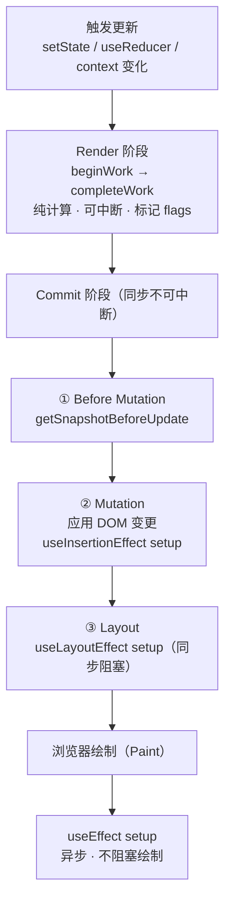
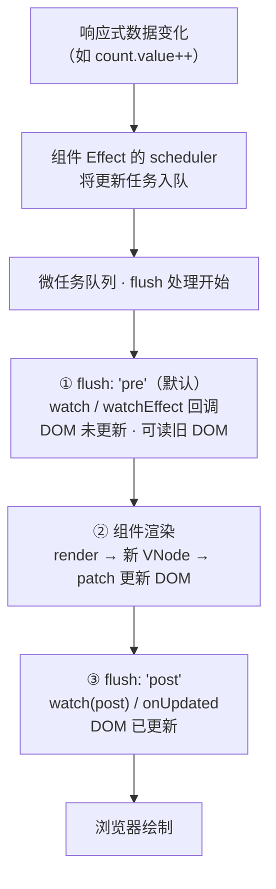

# 副作用时序与清理机制

副作用（Side Effects）是前端框架连接“**状态驱动 UI**”与“**外部世界**”的桥梁——无论是操作 DOM、发起网络请求、订阅外部数据源，还是操作计时器。然而，副作用在组件生命周期中的**执行时机**直接决定了应用的性能、一致性和用户体验。React 和 Vue 3 分别基于各自的渲染机制，设计了不同的副作用调度模型。

## 1. React 的副作用时序模型

React 将渲染过程严格划分为**Render 阶段（可中断、可重试）** 和 **Commit 阶段（不可中断、同步执行）**。副作用（Effect）的执行完全锚定在 Commit 阶段的不同子阶段，从而提供了精确的控制。

### 1.1 渲染流水线概览

React 的副作用执行严格锚定在 Commit 阶段的三个子阶段，`useEffect` 则被推迟到绘制之后：



### 1.2 Effect解析

| Effect 类型          | 执行时机                                  | 典型用途                                                    | 注意事项                                                                  |
| -------------------- | ----------------------------------------- | ----------------------------------------------------------- | ------------------------------------------------------------------------- |
| `useInsertionEffect` | Mutation 阶段完成、Layout 之前            | CSS-in-JS 动态插入样式（如 `styled-components`、`emotion`） | 极少数场景使用，通常应使用 `useLayoutEffect` 或 `useEffect`               |
| `useLayoutEffect`    | Layout 子阶段，**同步阻塞**在浏览器绘制前 | 测量 DOM 尺寸、同步修改 DOM（如滚动到某位置）、避免闪烁     | 会阻塞页面绘制，避免执行耗时操作；服务端渲染需跳过（用 `useEffect` 替代） |
| `useEffect`          | 浏览器绘制**完成之后异步执行**            | 数据获取、订阅外部事件、操作非 DOM 的第三方库               | 默认在每轮渲染后异步执行，依赖数组控制执行频率                            |

### 1.3 清理机制

React 的 `useEffect`、`useLayoutEffect`、`useInsertionEffect` 都通过 **Effect 回调返回一个 cleanup 函数** 来注册清理：

- **首次挂载**：只执行 setup，不执行 cleanup。
- **更新时**：先执行上一次的 cleanup，再执行新的 setup。
- **卸载时**：只执行 cleanup，不再执行 setup。
- **执行窗口与 Effect 类型一致**：`useEffect` 的 cleanup 在浏览器绘制后异步执行；`useLayoutEffect` 的 cleanup 在 DOM 变更后、绘制前同步执行。

```jsx
useEffect(() => {
  const timer = setInterval(() => console.log('tick'), 1000)
  return () => clearInterval(timer) // 下一次 setup 前 / 卸载时执行
}, [])
```

## 2. Vue 3 的副作用时序模型

Vue 3 的响应式系统基于 `ReactiveEffect` 和调度器（Scheduler）。组件自身的渲染也是一个 Effect，而 `watch`/`watchEffect` 则是独立于渲染流程的副作用，其执行时机通过 `flush` 选项控制。

### 2.1 组件更新流水线

Vue 3 的副作用在同一个微任务内按 `flush` 阶段依次执行，组件渲染夹在 `pre` 与 `post` 之间：



### 2.2 `flush` 选项详解

| `flush` 值      | 执行时机                                                   | 典型用途                                                 | 注意事项                                            |
| --------------- | ---------------------------------------------------------- | -------------------------------------------------------- | --------------------------------------------------- |
| `'pre'`（默认） | 组件更新**之前**，即 DOM 更新前                            | 在数据变化后、DOM 更新前执行逻辑（如取消请求、记录旧值） | 在此回调中修改数据可能触发无限循环（需小心）        |
| `'post'`        | 组件更新**之后**，DOM 已更新，但在浏览器绘制前（同微任务） | 访问/操作已更新的 DOM（类似 `onUpdated`）                | 与 `onUpdated` 相比，`watch` 可更精确地监听特定数据 |
| `'sync'`        | 数据变化后**立即同步**执行（在当前宏任务中）               | 需要立即响应数据变化，不等待批处理或渲染                 | 性能开销大，可能导致频繁执行，仅用于极少数场景      |

Vue 3 没有直接等价于 `useLayoutEffect` 的 API，因为渲染流程是同步的（数据变化 → 组件 Effect 重新执行 → patch DOM），且 DOM 更新发生在当前微任务完成之前。若需要在 DOM 更新后、浏览器绘制前**同步读取布局**，通常使用：

- `onUpdated` 钩子
- `watch` 配合 `flush: 'post'` + `nextTick`（确保 DOM 已应用）

```vue
<script setup>
import { ref, watch, onUpdated, nextTick } from 'vue'

const count = ref(0)
const el = ref(null)

watch(
  count,
  newVal => {
    // flush: 'pre'（默认） → DOM 尚未更新，el.value 仍为旧 DOM
    console.log('pre flush:', el.value.textContent)
  },
  { flush: 'pre' },
)

watch(
  count,
  async newVal => {
    // flush: 'post' → DOM 已更新，但尚未绘制
    await nextTick() // 确保所有 DOM 更新已应用
    console.log('post flush:', el.value.textContent)
  },
  { flush: 'post' },
)

onUpdated(() => {
  // DOM 更新后执行，等价于 flush: 'post'
  console.log('onUpdated:', el.value.textContent)
})
</script>

<template>
  <div ref="el">{{ count }}</div>
  <button @click="count++">Increment</button>
</template>
```

### 2.3 清理机制

Vue 的 `watch` 和 `watchEffect` 也支持清理回调：

- **`watch`**：通过回调函数的第三个参数 `onCleanup` 注册清理。
- **`watchEffect`**：通过 `onCleanup` 注册，在下次 effect 执行前或组件卸载时调用。

```javascript
// watchEffect：onCleanup 作为回调的第一个参数
watchEffect(onCleanup => {
  const timer = setInterval(() => console.log('tick'), 1000)
  onCleanup(() => clearInterval(timer)) // 下次执行前 / 卸载时调用
})

// watch：onCleanup 作为回调的第三个参数，常用于竞态处理
watch(keyword, async (newVal, oldVal, onCleanup) => {
  const controller = new AbortController()
  onCleanup(() => controller.abort()) // 取消上一次未完成的请求
  await fetch(`/api?q=${newVal}`, { signal: controller.signal })
})
```

清理时机与 React 对照：二者都遵循「**先清理、再执行**」的次序——React 的 cleanup 在下次 setup 前 / 卸载时执行，Vue 的 `onCleanup` 在下次回调前 / watch 停止时执行。

## 3. 核心差异对比

| 维度                   | React                                                          | Vue 3                                                                             |
| ---------------------- | -------------------------------------------------------------- | --------------------------------------------------------------------------------- |
| **副作用载体**         | `useEffect`、`useLayoutEffect`、`useInsertionEffect`           | `watch`、`watchEffect`、`onUpdated` 等生命周期钩子                                |
| **执行时机的控制方式** | 通过选择不同的 Effect 类型（`useEffect` vs `useLayoutEffect`） | 通过 `flush` 选项（`'pre'` / `'post'` / `'sync'`）                                |
| **清理函数**           | Effect 返回 cleanup 函数                                       | 通过 `onCleanup` 注册（watch/watchEffect）                                        |
| **阻塞绘制**           | `useLayoutEffect` 同步阻塞                                     | 无直接等价，但 `flush: 'sync'` 会阻塞当前宏任务（但那是同步执行，不涉及绘制时机） |
| **依赖管理**           | 显式传入依赖数组（或依赖变化检测）                             | 自动追踪响应式依赖（watchEffect）或显式指定源（watch）                            |
| **严格模式**           | 开发环境额外执行 setup+cleanup 循环                            | 无类似机制，但存在提示（如 `watch` 重复执行）                                     |

**关键差异要点：**

- **控制模型不同**：React 靠「Effect 类型 + Commit 子阶段」区分执行时机（`useLayoutEffect` 同步阻塞、`useEffect` 异步）；Vue 靠「`flush` 选项 + 微任务队列」区分（`pre` / `post` / `sync`）。
- **副作用与渲染的关系不同**：React 的 Render 是纯函数，Effect 是渲染之外的独立机制（Commit 后执行）；Vue 的组件渲染本身就是 Effect，`watch` 是并行挂在响应式依赖图上的另一个 Effect。
- **清理注册方式不同**：React 通过返回 cleanup 函数注册；Vue 通过 `onCleanup` 回调注册（`watchEffect` 第一参数 / `watch` 第三参数）。
- **依赖管理不同**：React 需显式声明依赖数组；Vue 自动追踪（`watchEffect`）或显式指定源（`watch`）。
