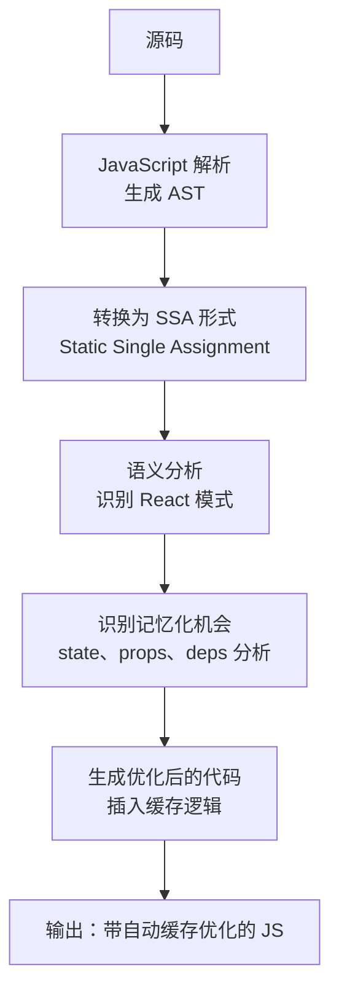

# React 编译器：编译时优化与自动记忆化的深层原理

## 1. 从“纯运行时”到“编译时增强”

React 的核心哲学一直是 **`UI = f(state)`**。在这个范式下，状态的任何细微变化，理论上都会导致函数 `f` 的重新执行以计算出全新的 UI。在 React 发展的早期，这种极其依赖运行时的设计虽然赋予了开发者极高的动态表达能力，但也带来了显著的性能瓶颈：**过度渲染（Over-rendering）**。

### 1.1 三大框架的编译策略分水岭

同样是解决“**状态变化如何高效地映射到 UI**”，主流框架在“**编译时**”与“**运行时**”之间做出了截然不同的取舍：

| 框架   | 优化策略                    | 编译期做什么                                          | 代价与约束                                     |
| ------ | --------------------------- | ----------------------------------------------------- | ---------------------------------------------- |
| Svelte | **编译期主导**              | 直接把组件编译成命令式 DOM 操作代码，运行时几乎无框架 | 模板语法受编译约束，丧失 JS 原生表达力         |
| Vue 3  | **编译时 + 运行时响应式**   | 模板静态分析（静态提升、PatchFlags、Block 树）        | 依赖 `<template>` 模板约束，动态逻辑仍靠运行时 |
| React  | **运行时为主 + 编译时增强** | JSX 编译 + React Compiler 语义级记忆化                | 保持 JS 原生表达力，静态分析难度与成本极高     |

React 没有选择像 Svelte 那样“**驯服模板**”，也没有像 Vue 那样引入模板编译器重构响应式系统，而是选择了一条最艰难的道路——**在保持 JavaScript 原生表达力的前提下，用编译期静态分析去填补运行时的性能鸿沟**。这正是 React 编译体系的价值与难度所在。

### 1.2 React 的两层编译体系

为了解决这个问题，React 演进出了两套编译体系：

- **语法层编译（JSX Compiler）**：在构建时，将 JSX 语法糖“**翻译**”成浏览器或 JavaScript 引擎能直接运行的 `React.createElement` 或 `jsx` 函数调用。

```js
// 开发者写的代码
const element = <h1 className="greeting">Hello, world!</h1>

// 编译后的代码
const element = React.createElement(
  'h1',
  { className: 'greeting' },
  'Hello, world!',
)
```

- **语义层编译（React Compiler / 前身 React Forget）**：解决 `UI = f(state)` 范式下的重复计算问题，将人类心智从手动维护依赖数组（`useMemo`/`useCallback`）的拓扑图中解放出来。

:::code-group

```js [React Compiler优化前]
// ❌ 开发者被迫成为“依赖追踪机器”
function TodoList({ todos, filter }) {
  const filteredTodos = useMemo(
    () => todos.filter(t => t.text.includes(filter)),
    [todos, filter],
  )

  const handleToggle = useCallback(id => {
    setTodos(prev => prev.map(t => (t.id === id ? { ...t, done: !t.done } : t)))
  }, []) // 稍微漏掉一个依赖，就会引发陈旧闭包 (Stale Closure) 灾难

  return <TodoList items={filteredTodos} onToggle={handleToggle} />
}
```

```js [React Compiler优化后]
// ✅ 只需写干净的代码
function TodoList({ todos, filter }) {
  const filteredTodos = todos.filter(t => t.text.includes(filter))

  const handleToggle = id => {
    setTodos(prev => prev.map(t => (t.id === id ? { ...t, done: !t.done } : t)))
  }

  return (
    <ul>
      {filteredTodos.map(todo => (
        <TodoItem key={todo.id} todo={todo} onToggle={handleToggle} />
      ))}
    </ul>
  )
}
```

:::

## 2. JSX 编译：从语法糖到高性能函数调用

JSX 本质上是 `React.createElement` 的语法糖，但随着 React 17 引入了全新的 Automatic Runtime，JSX 的编译流程发生了根本性的改变，其核心目的不仅是简化导入，更是为了**配合底层 Fiber 架构的性能榨取**。

### 2.1 编译产物的代差

```jsx
// 原始 JSX 代码
function Greeting({ name }) {
  return <h1 className="title">Hello, {name}!</h1>
}
```

**Classic Runtime (React 16 及之前)：**

```javascript
// 依赖全局作用域中的 React，且每次调用都要动态处理 children 参数
import React from 'react'

function Greeting({ name }) {
  return React.createElement('h1', { className: 'title' }, 'Hello, ', name, '!')
}
```

**Automatic Runtime (React 17+)：**

```javascript
// 编译器自动按需引入，且严格区分静态子节点与动态子节点
import { jsxs as _jsxs } from 'react/jsx-runtime'

function Greeting({ name }) {
  // 注意：这里使用的是 jsxs 而不是 jsx
  return _jsxs('h1', {
    className: 'title',
    children: ['Hello, ', name, '!'],
  })
}

// _jsx 的返回值就是一个 React Element：
// { $$typeof: Symbol(react.element), type: 'h1', props: { className: 'title', children: [...] }, ... }
```

### 2.2 为什么引入 `jsx` 和 `jsxs`？

Automatic Runtime 带来的不仅仅是“**无需手动引入 React**”，更包含着深度的运行时优化：

- **静态与动态的区分 (`jsx` vs `jsxs`)**：当编译器发现一个元素的 `children` 是静态已知的数组时（如上例），它会调用 `jsxs`。这使得 React 引擎在运行时无需再去遍历和规范化（Normalize）`arguments` 对象来构建 children 数组，直接节约了 CPU 周期。
- **Key 提取的后置**：在 `createElement` 时代，`key` 是混在 `props` 中的，React 必须在运行时去拦截和剔除它；而在新的 `jsx()` 函数签名中，`key` 被单独提取为第三个参数（`jsx(type, props, key)`），避免了对 `props` 对象的运行时期修改和解构。

### 2.3 运行时 API 的三种形态

Automatic Runtime 实际上暴露了三个入口函数，分别对应不同的编译场景：

| API                                                        | 使用场景            | 说明                                                             |
| ---------------------------------------------------------- | ------------------- | ---------------------------------------------------------------- |
| `jsx(type, props, key)`                                    | 单个或动态 children | 无需规范化 `arguments`，直接构造 Element                         |
| `jsxs(type, props, key)`                                   | 多个静态子元素      | 编译期已确定 children 为数组，跳过运行时 children 规范化         |
| `jsxDEV(type, props, key, isStaticChildren, source, self)` | Development 模式    | 额外注入 `__source`、`__self` 调试信息，供 DevTools 定位源码位置 |

关键认知：**`key` 被从 `props` 中剥离**是 Automatic Runtime 最重要的签名变更之一。它把“**识别 key**”这件原本必须在运行时反复做的拦截工作，一次性下沉到了编译期，运行时拿到手的 `props` 已经是“**纯净**”的（不含 `key`），避免了对 props 对象的删除/解构开销。

### 2.4 AST 阶段的静态优化策略

现代 JSX 编译器（SWC / Babel）在转换阶段会执行多项隐式优化：

| 优化                 | 说明                                                            |
| -------------------- | --------------------------------------------------------------- |
| **静态子元素扁平化** | `<div>a{b}c</div>` → `_jsx('div', { children: ['a', b, 'c'] })` |
| **布尔属性简写**     | `<input disabled />` → `_jsx('input', { disabled: true })`      |
| **空 children 省略** | `<div></div>` → `_jsx('div', {})`                               |
| **Development 模式** | 注入 `__source`、`__self` 等调试信息                            |
| **jsxs 优化**        | 有静态 key 的子元素使用 `jsxs()`，避免运行时 `children` 规范化  |

## 3. React Compiler：革命性的自动记忆化

如果说 JSX 编译只是“**翻译**”，那么 React Compiler 则是真正的“**智能重构**”。它的核心目标是：**将组件级别的粗粒度渲染，转化为精确到表达式级别的细粒度更新，且完全对开发者透明。**

### 3.1 心智压力

在没有 Compiler 的时代，为了防止重渲染，开发者必须手动构建依赖图：

```jsx
// ❌ 开发者被迫成为“依赖追踪机器”
function TodoList({ todos, filter }) {
  const filteredTodos = useMemo(
    () => todos.filter(t => t.text.includes(filter)),
    [todos, filter],
  )

  const handleToggle = useCallback(id => {
    setTodos(prev => prev.map(t => (t.id === id ? { ...t, done: !t.done } : t)))
  }, []) // 稍微漏掉一个依赖，就会引发陈旧闭包 (Stale Closure) 灾难

  return <TodoList items={filteredTodos} onToggle={handleToggle} />
}
```

### 3.2 工作方式

React Compiler 在编译时分析组件的 JavaScript 语义，自动判断：

- 哪些值在依赖变化时才需要重新计算。
- 哪些函数引用需要缓存。
- 哪些组件可以从 React.memo 中受益。

```jsx
// ✅ 只需写干净的代码
function TodoList({ todos, filter }) {
  const filteredTodos = todos.filter(t => t.text.includes(filter))

  const handleToggle = id => {
    setTodos(prev => prev.map(t => (t.id === id ? { ...t, done: !t.done } : t)))
  }

  return (
    <ul>
      {filteredTodos.map(todo => (
        <TodoItem key={todo.id} todo={todo} onToggle={handleToggle} />
      ))}
    </ul>
  )
}
```

**核心结论**：当 props 未发生本质变化时，由于提取出的 `filteredTodos` 和 `handleToggle` 引用（Reference）与上次渲染完全一致（`===`），当它们被传递给子组件时，React 底层的 Reconciler 会直接判断为无需更新（Bailout），从而达到了与 `React.memo` 完全相同的效果，但没有任何手动包裹的成本。

### 3.3 核心原理：SSA 与依赖追踪

React Compiler 的静态分析能力，根基在于把源码转换成 **SSA（Static Single Assignment，静态单赋值）** 形式。

**SSA 的核心思想**：每个变量只被赋值一次，每次赋值都产生一个“**新版本**”。这使编译器能为**每一个值**精确定位它的“**定义点**”与“**使用点**”，从而构建出精确的依赖图：

```javascript
// 原始代码：同一个 x 被反复赋值
let x = 1
x = x + 1
x = x * 2

// SSA 形式：每个值拥有唯一的变量名，依赖关系一目了然
let x1 = 1
let x2 = x1 + 1 // x2 只依赖 x1
let x3 = x2 * 2 // x3 只依赖 x2
```

编译器据此可以回答关键问题：“**这个表达式的最终结果，到底依赖哪些输入？**” 一旦 `filteredTodos` 被证明只依赖 `todos` 和 `filter`，编译器就能自动生成“依赖未变则复用旧值”的缓存逻辑。



### 3.4 生成产物：Memo Cache 机制

React Compiler 会在编译产物中插入一套 **Memo Cache（记忆化缓存）**。每个被优化的组件渲染时，都会通过 `react/compiler-runtime` 的 `_c(N)` 分配一个固定大小的缓存数组，数组的每个槽位存储“**依赖值**”或“**计算结果**”：

```javascript
// React Compiler 的产物（基于 babel-plugin-react-compiler，结构简化）
import { c as _c } from 'react/compiler-runtime'

function TodoList(t0) {
  const $ = _c(7) // 分配 7 个槽位的记忆化缓存

  const { todos, filter } = t0
  let t1

  // ① 记忆化 filteredTodos：依赖 todos / filter
  if ($[0] !== todos || $[1] !== filter) {
    t1 = todos.filter(t => t.text.includes(filter))
    $[0] = todos // 记录依赖
    $[1] = filter
    $[2] = t1 // 记录结果
  } else {
    t1 = $[2] // 依赖未变，直接读缓存，引用与上次完全一致
  }
  const filteredTodos = t1

  let t2
  // ② 记忆化 handleToggle：无依赖，用 sentinel 判断是否首次写入
  if ($[3] === Symbol.for('react.memo_cache_sentinel')) {
    t2 = id => {
      setTodos(prev =>
        prev.map(t => (t.id === id ? { ...t, done: !t.done } : t)),
      )
    }
    $[3] = t2
  } else {
    t2 = $[3]
  }
  const handleToggle = t2

  let t3
  // ③ 记忆化 JSX 元素本身：依赖 filteredTodos / handleToggle
  if ($[4] !== filteredTodos || $[5] !== handleToggle) {
    t3 = (
      <ul>
        {filteredTodos.map(todo => (
          <TodoItem key={todo.id} todo={todo} onToggle={handleToggle} />
        ))}
      </ul>
    )
    $[4] = filteredTodos
    $[5] = handleToggle
    $[6] = t3
  } else {
    t3 = $[6]
  }
  return t3
}
```

从产物中可以看出三个关键机制：

- **依赖比对 (`!==`)**：每次渲染用严格相等（`!==`）比对缓存的依赖值与当前值，只有真正变化才重算。这与 `useMemo` 内部用 `Object.is` 比对 deps 是同一思想。
- **哨兵值 (Sentinel)**：对 `handleToggle` 这类“**依赖为空、永远稳定**”的函数，用 `Symbol.for('react.memo_cache_sentinel')` 判断槽位是否首次写入，等价于一个永不变更的 `useCallback(..., [])`。
- **JSX 元素也参与缓存**：返回的整棵 JSX 元素被当作一个可记忆化的值（槽位 `$[6]`）。当它的依赖（`filteredTodos`、`handleToggle`）都没变时，`t3` 引用不变，父组件对它的协调直接命中 Bailout。

### 3.5 记忆化粒度：从组件级到表达式级

传统优化工具（`React.memo` / `useMemo`）的记忆化粒度是“**组件级**”或“**手动指定的某个值**”，而 React Compiler 把粒度下沉到了“**表达式级**”：

:::code-group

```jsx [手动记忆化：粗粒度]
// 开发者必须逐个决定“哪些值要缓存”，漏一个就前功尽弃
const a = useMemo(() => heavy(todos), [todos])
const b = useMemo(() => heavy2(filter), [filter])
const c = a.map(x => <Row x={x} />) // ❌ 忘了缓存 c
```

```jsx [编译器记忆化：细粒度]
// 编译器自动识别 heavy(todos)、heavy2(filter) 乃至整段 JSX 的可记忆性
function List({ todos, filter }) {
  const a = heavy(todos)
  const b = heavy2(filter)
  const c = a.map(x => <Row x={x} />)
  return <div>{c}</div>
}
```

:::

这种“**精确到表达式**”的细粒度，正是 React Compiler 相比 `React.memo` 的根本优势：`React.memo` 只能对整个组件做一次性的 props 浅比较，而 Compiler 能在组件内部**逐个表达式**建立独立的缓存单元。某个子表达式依赖没变，就单独复用它的结果，而不必等整个组件的 props 都“**浅比较通过**”。

### 3.6 规则：Rules of React

React Compiler 能否成功优化，完全取决于代码是否遵守 **Rules of React**。这些规则并非 Compiler 的新增约束，而是 React 运行期一直以来的隐含假设，Compiler 只是把“**假设**”升级成了“**静态可验证的契约**”：

| 规则                                       | 违反的后果                                   | Compiler 的处理                          |
| ------------------------------------------ | -------------------------------------------- | ---------------------------------------- |
| **组件与 Hook 必须是纯函数**（幂等）       | 相同输入无法保证相同输出，缓存失效           | 跳过该组件的优化                         |
| **组件内部直接修改外部变量 (Mutation)**    | 破坏了纯函数假定，SSA 无法正确建立数据追踪图 | 无法判断何时更新相关 UI，可能跳过优化    |
| **副作用只能在事件处理器或 Effect 中触发** | 渲染期间产生不可控副作用                     | 跳过优化，交由 eslint 插件告警           |
| **Props 与 State 不可变**                  | 引用未变但内容被改，缓存判断失效             | 标记相关值为“**可变**”，放弃该处的记忆化 |
| **条件语句调用 Hooks**                     | 破坏了 Hooks 的链表顺序执行假定              | 严格报错，拒绝编译                       |
| **手动调用组件函数 / Hook**                | 绕过 React 调度，状态追踪断裂                | 无法分析，跳过优化                       |
| **返回非幂等结果 (如 `Math.random()`)**    | 相同的输入在不同缓存周期内会得到不同输出     | 缓存逻辑会导致随机数冻结，UI 状态异常    |

关键认知：Compiler 把“**正确性**”永远置于“**性能**”之上。它不会为了榨取性能而去冒险缓存一个它无法证明安全的值——当证据不足时，它宁可退化为“**不优化**”，也绝不产出错误的结果。

### 3.7 校验与放弃优化（Bailout）

除了编译，React Compiler 还承担着**校验（Validation**职责，它会在分析阶段识别违反规则的代码，并采取两种策略：

- **拒绝编译**：如“**条件调用 Hooks**”这类破坏 Hooks 顺序假定的硬错误，直接报错终止。
- **放弃优化（Bailout）**：如“**读取/修改模块级可变变量**”这类无法静态证明安全的场景，跳过该组件或该表达式的记忆化，但保留代码的原始行为。

其中最关键的概念是 **Mutable Range（可变区间）**：编译器会追踪一个值从定义到使用的整个生命周期中，是否存在“**可能被修改**”的窗口。只有当依赖值在整个缓存区间内**绝对不可变**时，记忆化才是安全的。

```jsx
// ❌ 编译器无法证明安全，会 Bailout
let globalCount = 0 // 模块级可变变量

function Counter() {
  // globalCount 每次调用都会变化，缓存会使计数冻结
  return <div>{globalCount++}</div>
}
```

```jsx
// ❌ useRef 的 current 是可变的，跨其读取的值不会被记忆化
function Timer() {
  const elapsed = useRef(0)
  const label = elapsed.current * 1000 // 编译器标记为不可记忆化
  return <div>{label}</div>
}
```

配合官方的 **`eslint-plugin-react-compiler`**，开发者可以在编码阶段就发现这些违规，而不是等到运行时才暴露问题。

### 3.8 现状与接入方式

React Compiler（前身 React Forget）自 2021 年 React Conf 首次亮相以来，历经多年研发，于 2024 年开源，目前 `babel-plugin-react-compiler` 已发布 **1.x 稳定版本**。

| 组件                           | 作用                                               |
| ------------------------------ | -------------------------------------------------- |
| `babel-plugin-react-compiler`  | 编译期核心：在 Babel 管线中执行 SSA 分析与代码重写 |
| `eslint-plugin-react-compiler` | 静态校验 Rules of React，提前暴露违规代码          |
| `react/compiler-runtime`       | 提供 `_c`（`useMemoCache`）等运行时缓存原语        |

- **依赖**：需要 React 19+，因为编译产物依赖新的运行时与 Hook 语义。
- **接入方式**：通过 Babel 插件，或在框架层一键开启（Next.js、Vite 的 `@vitejs/plugin-react` 等）。

```javascript
// babel.config.js
module.exports = {
  plugins: [['babel-plugin-react-compiler', { target: '19' }]],
}
```

- **局部逃生舱**：在文件顶部声明 `"use no memo"`，可让编译器跳过该文件的优化，用于处理少数编译器无法正确分析的特殊代码。

## 4. 编译器与 Fiber 运行时的无缝协作

React Compiler 的伟大之处在于**它不需要改变任何现有的 React 运行时心智**，两者构成了完美的上下游关系：

| 阶段      | 编译器做什么                      | 运行时做什么                            |
| --------- | --------------------------------- | --------------------------------------- |
| JSX 转换  | JSX → `jsx()` / `createElement()` | 执行函数，返回 React Element            |
| 记忆化    | 分析依赖，插入缓存逻辑            | 比较依赖，决定是否重新计算              |
| 组件优化  | 插入等价于 `React.memo` 的比较    | 比较 props，决定是否需要重新渲染        |
| Dead Code | 树摇掉未使用的导出                | 无（代码已被移除）                      |
| 开发调试  | 注入 `__source` 和 DevTools 信息  | DevTools 读取信息，显示组件树和源码位置 |

关键认知：编译器只负责“**产出更聪明的代码**”，真正的执行仍然 100% 由 Fiber 运行时完成。记忆化槽位的 `!==` 比对结果，最终都通过“**引用是否变化**”这个单一信号，回落到 Reconciler 既有的 Bailout 判断上。这也是 React Compiler 能做到“**对开发者透明、对运行时零侵入**”的根本原因——它没有发明任何新的运行时概念，只是把本来要人肉手写的优化，交给了机器。

## 5. 总结

- **JSX 编译**早已超越了纯粹的语法糖阶段，`jsx-runtime` 的自动注入与 `jsxs` 的静态区分，以及 `key` 从 props 中的剥离，为 React 底层引擎减负提供了第一道保障。
- **React Compiler (Forget)** 是一次史无前例的工程挑战，它试图在高度动态的 JavaScript 语言中寻找确定性。通过 **SSA 转化和依赖追踪**，在编译时识别记忆化机会并自动插入缓存逻辑，让开发者不再需要手动写 `useMemo`、`useCallback` 和 `React.memo`。
- **细粒度是核心突破**：Compiler 把记忆化从“**组件级**”下沉到“**表达式级**”，配合 **Memo Cache 槽位 + 依赖比对 + 哨兵值**，实现了比 `React.memo` 更精准、更透明的更新跳过。
- **正确性优先于性能**：Compiler 严格遵循 **Rules of React**，通过校验与 Bailout 机制保证“**宁可不多优化，绝不错误优化**”。
- **编译与运行的边界**：React 没有选择像 Svelte 或 Vue 那样通过重构底层响应式系统或引入强模板约束来提升性能，而是选择了一条最难的道路——**保持 JS 原生表达力的纯粹性，用极其复杂的编译期静态分析来填补运行时性能的鸿沟**。
