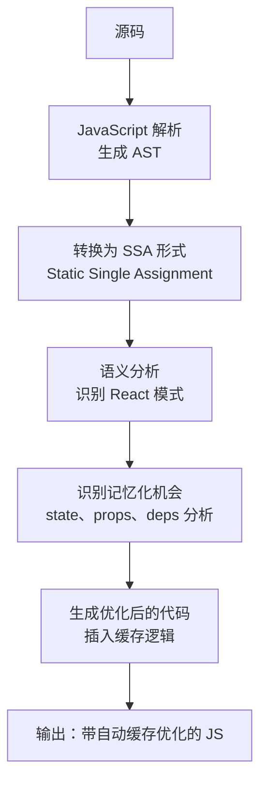

# React 编译器：编译时优化与自动记忆化的深层原理

## 1. 从“纯运行时”到“编译时增强”

React 的核心哲学一直是 **`UI = f(state)`**。在这个范式下，状态的任何细微变化，理论上都会导致函数 `f` 的重新执行以计算出全新的 UI。在 React 发展的早期，这种极其依赖运行时的设计虽然赋予了开发者极高的动态表达能力，但也带来了显著的性能瓶颈：**过度渲染（Over-rendering）**。

为了解决这个问题，React 演进出了两套编译体系：

- **语法层编译（JSX Compiler）**：解决 DSL（领域特定语言）到 JavaScript 的转换问题，抹平浏览器兼容性。
- **语义层编译（React Compiler / 暂定名 React Forget）**：解决 `UI = f(state)` 范式下的重复计算问题，将人类心智从手动维护依赖数组（`useMemo`/`useCallback`）的拓扑图中解放出来。

## 2. JSX 编译：从语法糖到高性能函数调用

JSX 本质上是 `React.createElement` 的语法糖，但随着 React 17 引入了全新的 Automatic Runtime，JSX 的编译流程发生了根本性的改变，其核心目的不仅是简化导入，更是为了**配合底层 Fiber 架构的性能榨取**。

### 2.1 编译产物的代差

```jsx
// 原始 JSX 代码
function Greeting({ name }) {
  return <h1 className="title">Hello, {name}!</h1>
}
```

**Classic Runtime (React 16 及之前)：**

```javascript
// 依赖全局作用域中的 React，且每次调用都要动态处理 children 参数
import React from 'react'

function Greeting({ name }) {
  return React.createElement('h1', { className: 'title' }, 'Hello, ', name, '!')
}
```

**Automatic Runtime (React 17+)：**

```javascript
// 编译器自动按需引入，且严格区分静态子节点与动态子节点
import { jsxs as _jsxs } from 'react/jsx-runtime'

function Greeting({ name }) {
  // 注意：这里使用的是 jsxs 而不是 jsx
  return _jsxs('h1', {
    className: 'title',
    children: ['Hello, ', name, '!'],
  })
}

// _jsx 的返回值就是一个 React Element：
// { $$typeof: Symbol(react.element), type: 'h1', props: { className: 'title', children: [...] }, ... }
```

### 2.2 为什么引入 `jsx` 和 `jsxs`？

Automatic Runtime 带来的不仅仅是“**无需手动引入 React**”，更包含着深度的运行时优化：

- **静态与动态的区分 (`jsx` vs `jsxs`)**：当编译器发现一个元素的 `children` 是静态已知的数组时（如上例），它会调用 `jsxs`。这使得 React 引擎在运行时无需再去遍历和规范化（Normalize）`arguments` 对象来构建 children 数组，直接节约了 CPU 周期。
- **Key 提取的后置**：在 `createElement` 时代，`key` 是混在 `props` 中的，React 必须在运行时去拦截和剔除它；而在新的 `jsx()` 函数签名中，`key` 被单独提取为第三个参数（`jsx(type, props, key)`），避免了对 `props` 对象的运行时期修改和解构。

### 2.3 AST 阶段的静态优化策略

现代 JSX 编译器（SWC / Babel）在转换阶段会执行多项隐式优化：

| 优化                 | 说明                                                            |
| -------------------- | --------------------------------------------------------------- |
| **静态子元素扁平化** | `<div>a{b}c</div>` → `_jsx('div', { children: ['a', b, 'c'] })` |
| **布尔属性简写**     | `<input disabled />` → `_jsx('input', { disabled: true })`      |
| **空 children 省略** | `<div></div>` → `_jsx('div', {})`                               |
| **Development 模式** | 注入 `__source`、`__self` 等调试信息                            |
| **jsxs 优化**        | 有静态 key 的子元素使用 `jsxs()`，避免运行时 `children` 规范化  |

## 3. React Compiler：革命性的自动记忆化

如果说 JSX 编译只是“**翻译**”，那么 React Compiler 则是真正的“**智能重构**”。它的核心目标是：**将组件级别的粗粒度渲染，转化为精确到表达式级别的细粒度更新，且完全对开发者透明。**

### 3.1 心智压力

在没有 Compiler 的时代，为了防止重渲染，开发者必须手动构建依赖图：

```jsx
// ❌ 开发者被迫成为“依赖追踪机器”
function TodoList({ todos, filter }) {
  const filteredTodos = useMemo(
    () => todos.filter(t => t.text.includes(filter)),
    [todos, filter],
  )

  const handleToggle = useCallback(id => {
    setTodos(prev => prev.map(t => (t.id === id ? { ...t, done: !t.done } : t)))
  }, []) // 稍微漏掉一个依赖，就会引发陈旧闭包 (Stale Closure) 灾难

  return <TodoList items={filteredTodos} onToggle={handleToggle} />
}
```

### 3.2 工作方式

React Compiler 在编译时分析组件的 JavaScript 语义，自动判断：

- 哪些值在依赖变化时才需要重新计算。
- 哪些函数引用需要缓存。
- 哪些组件可以从 React.memo 中受益。

```jsx
// ✅ 只需写干净的代码
function TodoList({ todos, filter }) {
  const filteredTodos = todos.filter(t => t.text.includes(filter))

  const handleToggle = id => {
    setTodos(prev => prev.map(t => (t.id === id ? { ...t, done: !t.done } : t)))
  }

  return (
    <ul>
      {filteredTodos.map(todo => (
        <TodoItem key={todo.id} todo={todo} onToggle={handleToggle} />
      ))}
    </ul>
  )
}
```

**核心结论**：当 props 未发生本质变化时，由于提取出的 `filteredTodos` 和 `handleToggle` 引用（Reference）与上次渲染完全一致（`===`），当它们被传递给子组件时，React 底层的 Reconciler 会直接判断为无需更新（Bailout），从而达到了与 `React.memo` 完全相同的效果，但没有任何手动包裹的成本。

### 3.3 核心原理



### 3.4 规则

React Compiler 能否成功优化，完全取决于代码是否遵守 **Rules of React**。一旦打破规则，编译器为了保证代码的安全执行，会选择**放弃优化（Bailout）**。

| 致命反模式                              | Compiler 的视角                                | 后果                                                          |
| --------------------------------------- | ---------------------------------------------- | ------------------------------------------------------------- |
| **组件内部直接修改外部变量 (Mutation)** | 破坏了纯函数假定，SSA 无法正确建立数据追踪图。 | 编译器无法判断何时更新该变量相关的 UI，可能跳过该组件的优化。 |
| **条件语句调用 Hooks**                  | 破坏了 Hooks 的链表顺序执行假定。              | 严格报错，拒绝编译。                                          |
| **返回非幂等结果 (如 `Math.random()`)** | 相同的输入在不同缓存周期内会得到不同输出。     | 缓存逻辑会导致随机数冻结，UI 状态异常。                       |

## 4. 编译器与 Fiber 运行时的无缝协作

React Compiler 的伟大之处在于**它不需要改变任何现有的 React 运行时心智**，两者构成了完美的上下游关系：

| 阶段      | 编译器做什么                      | 运行时做什么                            |
| --------- | --------------------------------- | --------------------------------------- |
| JSX 转换  | JSX → `jsx()` / `createElement()` | 执行函数，返回 React Element            |
| 记忆化    | 分析依赖，插入缓存逻辑            | 比较依赖，决定是否重新计算              |
| 组件优化  | 插入等价于 `React.memo` 的比较    | 比较 props，决定是否需要重新渲染        |
| Dead Code | 树摇掉未使用的导出                | 无（代码已被移除）                      |
| 开发调试  | 注入 `__source` 和 DevTools 信息  | DevTools 读取信息，显示组件树和源码位置 |

## 5. 总结

- **JSX 编译**早已超越了纯粹的语法糖阶段，`jsx-runtime` 的自动注入与 `jsxs` 的静态区分，为 React 底层引擎减负提供了第一道保障。
- **React Compiler (Forget)** 是一次史无前例的工程挑战，它试图在高度动态的 JavaScript 语言中寻找确定性。通过 **SSA 转化和依赖追踪**，在编译时识别记忆化机会并自动插入缓存逻辑，让开发者不再需要手动写 `useMemo`、`useCallback` 和 `React.memo`。
- **编译与运行的边界**：React 没有选择像 Svelte 或 Vue 那样通过重构底层响应式系统或引入强模板约束来提升性能，而是选择了一条最难的道路——**保持 JS 原生表达力的纯粹性，用极其复杂的编译期静态分析来填补运行时性能的鸿沟**。
