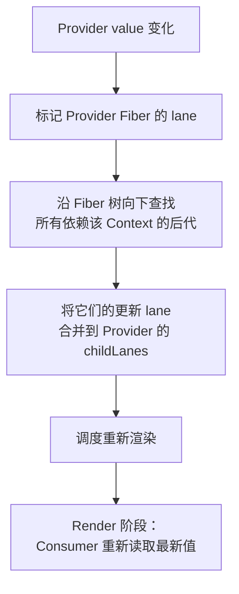

# Context 传播机制

## 1. 什么是 Context？

Context 是 React 提供的**依赖注入机制**，让祖先组件向整个子树提供数据，而不必通过 props 逐层手动传递。它由 `createContext` 创建，Provider 在渲染树中建立值边界，Consumer（或 `useContext`）在子树中读取。

```jsx
// 创建 Context
const ThemeContext = createContext('light')

// 提供值
function App() {
  return (
    <ThemeContext.Provider value="dark">
      <Toolbar />
    </ThemeContext.Provider>
  )
}

// 消费值 —— 中间组件无需感知
function Toolbar() {
  return <Button />
}

function Button() {
  const theme = useContext(ThemeContext)
  return <button className={theme}>Click</button>
}
```

## 2. Context 的核心 API

| API                              | 用途                                                           |
| -------------------------------- | -------------------------------------------------------------- |
| `createContext(defaultValue)`    | 创建 Context 对象，`defaultValue` 在没有匹配的 Provider 时生效 |
| `<Context.Provider value={...}>` | 在组件树中提供值，所有后代 Consumer 都可以读取                 |
| `useContext(Context)`            | 在函数组件中读取当前 Context 值                                |
| `<Context.Consumer>`             | Class 组件 / 渲染函数模式中消费 Context（现代代码已少用）      |
| `Context.displayName`            | 为 DevTools 设置可读名称                                       |

## 3. Context 在 Fiber 中的传播机制

### 3.1 渲染时的读取与订阅

Consumer（包括 `useContext`）在 **Render 阶段**读取 Context：

```javascript
// 简化版 useContext 的内部逻辑
function readContext(context) {
  const value = context._currentValue

  // 将当前 Fiber 记录为该 Context 的依赖者
  const fiber = currentlyRenderingFiber
  fiber.dependencies = {
    context,
    next: fiber.dependencies,
  }

  return value
}
```

### 3.2 Provider 值变化时的传播

当 Provider 的 `value` 变化时，React 执行以下步骤：



关键点：

- 只有**显式读取了该 Context** 的组件才会被标记为需要更新。
- 不消费该 Context 的中间组件可以**安全地 bailout**（跳过渲染）。
- 这种"精确订阅"避免了不必要的渲染扩散。

### 3.3 跳过未被影响的子树

```jsx
function App() {
  const [theme, setTheme] = useState('light')
  const [user, setUser] = useState(null)

  return (
    <ThemeContext.Provider value={theme}>
      {/* theme 变化时，Header 需要更新 */}
      <Header />
      {/* theme 变化时，Main 的 props 没变 → 可能 bailout */}
      <Main user={user} />
    </ThemeContext.Provider>
  )
}
```

如果 `Main` 组件（及其子树）不读取 `ThemeContext`，则 `theme` 变化时它们可以被完全跳过。

## 4. Context 的性能考量

### 4.1 避免将频繁变化的值放入同一个 Context

```jsx
// ❌ 将所有状态放入单个 Context
const AppContext = createContext()

function App() {
  const [theme, setTheme] = useState('light') // 低频变化
  const [scrollY, setScrollY] = useState(0) // 高频变化

  return (
    <AppContext.Provider value={{ theme, scrollY, setTheme, setScrollY }}>
      <Children />
    </AppContext.Provider>
  )
}
// scrollY 的每次变化都会触发所有消费 AppContext 的组件重新渲染
```

```jsx
// ✅ 按变化频率拆分 Context
const ThemeContext = createContext()
const ScrollContext = createContext()

function App() {
  const [theme, setTheme] = useState('light')
  const [scrollY, setScrollY] = useState(0)

  return (
    <ThemeContext.Provider value={{ theme, setTheme }}>
      <ScrollContext.Provider value={{ scrollY }}>
        <Children />
      </ScrollContext.Provider>
    </ThemeContext.Provider>
  )
}
// scrollY 变化只影响 ScrollContext 的消费者，不影响 ThemeContext 的消费者
```

### 4.2 保持 value 引用稳定

```jsx
// ❌ 每次渲染都创建新对象 → 即使内容相同也会触发所有 Consumer 更新
<ThemeContext.Provider value={{ theme: 'dark', toggle: () => {} }}>

// ✅ 使用 useMemo 保持引用稳定
const value = useMemo(() => ({ theme: 'dark', toggle }), [theme, toggle])
<ThemeContext.Provider value={value}>
```

### 4.3 拆分 "读" 与 "写"

```jsx
// 将状态和 dispatch 分离到不同 Context
const TodosStateContext = createContext()
const TodosDispatchContext = createContext()

// 只 dispatch 的组件不会因为 todos 变化而重渲染
function AddTodoButton() {
  const dispatch = useContext(TodosDispatchContext)
  return <button onClick={() => dispatch({ type: 'ADD' })}>+</button>
}
```

## 5. Context 与状态管理的关系

Context **不是状态管理器**，它是**依赖传播机制**。完整的"状态管理"通常还需要：

| 能力                             | Context 是否提供                  |
| -------------------------------- | --------------------------------- |
| 跨层级传递值                     | ✅ 是                             |
| 响应式更新（值变化时自动重渲染） | ✅ 是（通过 Provider + Consumer） |
| 选择性子树更新（只订阅部分字段） | ⚠️ 需要手动拆分 Context           |
| 中间件 / 日志 / 持久化           | ❌ 需要自行实现                   |
| 派生状态 / 计算属性              | ❌ 需要 useMemo                   |
| DevTools 调试支持                | ❌ 需要第三方库                   |

因此，Redux、Zustand、Jotai 等库在 Context 之上构建了完整的状态管理层。但这些库的内部实现**底层仍然依赖 Context** 来将 store 注入到组件树。

## 6. Context 的常见使用场景

| 场景               | 说明                                                |
| ------------------ | --------------------------------------------------- |
| **主题（Theme）**  | 全局浅色/深色模式                                   |
| **国际化（i18n）** | 当前语言、翻译函数                                  |
| **认证信息**       | 当前用户、登录状态                                  |
| **路由信息**       | 当前路径、路由参数（React Router 内部使用 Context） |
| **依赖注入**       | 注入服务实例（如 API 客户端）                       |
| **组件配置**       | 表单的 disabled/layout 等配置                       |

## 7. 与 Vue 的 provide/inject 对比

| 维度         | React Context                              | Vue provide/inject                                 |
| ------------ | ------------------------------------------ | -------------------------------------------------- |
| **创建方式** | `createContext()`                          | `provide(key, value)` / `inject(key)`              |
| **响应性**   | Provider value 变化 → 所有 Consumer 重渲染 | 默认非响应式，需传入 `ref`/`reactive` 才能自动追踪 |
| **更新粒度** | Consumer 组件级别重渲染                    | 依赖追踪到模板中使用的具体字段                     |
| **默认值**   | `createContext(defaultValue)`              | `inject(key, defaultValue)`                        |
| **类型安全** | TypeScript 泛型，类型推导良好              | 需要手动类型声明或使用 InjectionKey                |
| **实现基础** | Fiber 树 + 依赖链表 + Lane 标记            | 组件实例树 + 响应式依赖收集                        |
| **性能策略** | 拆分 Context / 稳定 value 引用             | 响应式系统自动细粒度更新                           |

React Context 依赖 Fiber 树上的**显式消费记录**，通过 Lane 模型触发子树更新。Vue 的 `provide/inject` 通过组件实例的响应式依赖连接，更新粒度天然更细。两者都解决跨层传值问题，但更新触发模型有本质差异。

## 8. 总结

- **Context 是依赖注入机制，不是状态管理器**：解决 props 逐层传递的痛点。
- **Consumer 在 Render 时读取并订阅 Context**：依赖信息记录在当前 Fiber 上。
- **Provider 值变化 → 查找依赖该 Context 的后代 Fiber → 合并更新 Lane → 调度渲染**。
- **不消费该 Context 的分支可以安全跳过**，这是 Context 区别于"全局变量"的关键。
- **拆分 Context 按变化频率分组**、**保持 value 引用稳定**是核心性能策略。
- **Redux/Zustand 等状态管理库底层仍依赖 Context** 将 store 注入组件树。
