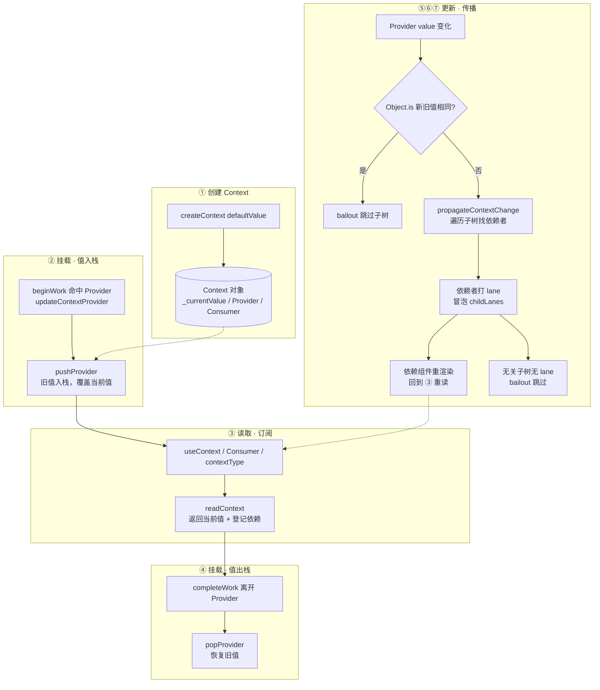

# Context 机制

## 1. Context 的依赖注入模型

React 要求数据通过 props 自上而下逐层传递，但当某个"**全局性**"数据（主题、语言、登录态）要被很深的后代组件使用时，中间每一层都不得不透传一份与己无关的 props，这就是 **props 逐层透传（Props Drilling）**。

Context 是 React 提供的**依赖注入机制**：在组件树上开一条"旁路通道"，让祖先组件发布数据、任意深度的后代组件直接订阅，中间的组件无需感知。一个完整的使用只有三件事——**创建、提供、消费**：

```jsx
// ① 创建
const ThemeContext = createContext('light')

// ② 提供
function App() {
  return (
    <ThemeContext.Provider value="dark">
      <Toolbar />
    </ThemeContext.Provider>
  )
}

// 方式一：useContext，函数组件首选
function Button() {
  const theme = useContext(ThemeContext)

  return <button className={theme}>Click</button>
}

// 方式二：Consumer，render prop
function ButtonByConsumer() {
  return (
    <ThemeContext.Consumer>
      {theme => <button className={theme}>Click</button>}
    </ThemeContext.Consumer>
  )
}

// 方式三：contextType，Class 组件
class ButtonByContextType extends React.Component {
  static contextType = ThemeContext

  render() {
    return <button className={this.context}>Click</button>
  }
}
```

三个消费 API 的取舍一句话概括：**函数组件用 `useContext`，Class 组件单 Context 用 `contextType`，`Consumer`（render prop）主要留给旧代码**。`Provider` 的 `value` 变化用 `Object.is` 判定（引用相等，非深比较），嵌套 Provider 就近读取。

## 2. 全景图：Context 从挂载到更新的全流程



- **挂载靠"值栈"限定作用域**——进入 Provider `pushProvider` 入栈覆盖值、离开 `popProvider` 出栈恢复值，LIFO 严格对称，嵌套 Provider 天然正确。
- **读取即订阅**——`useContext` / `Consumer` / `contextType` 三种写法最终都调 `readContext`，返回值的同时把当前 Fiber 登记进 `fiber.dependencies` 依赖链表。
- **更新靠"遍历依赖 + 合并 Lane"精确唤醒**——Provider 值变后 `propagateContextChange` 沿子树深度优先找依赖者，只给订阅者打 lane，其余子树凭 `childLanes` 判定直接 bailout。
- **Context 不凭空调度渲染**——它一定是跟随某次已发生的渲染（如上层 `setTheme`）一起，把这次重渲染**精确放大**到所有订阅者。

## 3. Context 的数据载体：Context 对象与依赖链表

### 3.1 Context 对象：`createContext` 的产物

`createContext(defaultValue)` 返回的其实是一个被 `$$typeof` 标记的普通对象，`Provider` 与 `Consumer` 都挂在它身上。`defaultValue` 只作为 `_currentValue` 的初始值，**只有上方没有匹配 Provider 时才会被读到**：

:::code-group

```typescript [react/src/ReactContext.js]
// createContext：构造 Context 对象，并把 Provider / Consumer 挂上去
export function createContext<T>(defaultValue: T): ReactContext<T> {
  const context: ReactContext<T> = {
    $$typeof: REACT_CONTEXT_TYPE,   // 标识：这是一个 Context 对象
    _currentValue: defaultValue,    // 当前值（primary renderer 读这里）
    _currentValue2: defaultValue,   // 当前值（secondary renderer 读这里）
    _threadCount: 0,                // 并发渲染器计数
    Provider: (null: any),          // 由下方赋值
    Consumer: (null: any),
    _defaultValue: (null: any),
    _globalName: (null: any),
  };

  context.Provider = {
    $$typeof: REACT_PROVIDER_TYPE,  // 标识：这是一个 Provider 元素
    _context: context,              // 反指回所属的 Context
  };

  context.Consumer = context;       // Consumer 就是 Context 本身

  return context;
}
```

```javascript [react/src/ReactContext.js]
// React 内部用 $$typeof 区分元素类型（节选）
export const REACT_CONTEXT_TYPE = Symbol.for('react.context')
export const REACT_PROVIDER_TYPE = Symbol.for('react.provider')
```

:::

> [!NOTE]
> 这里藏着"**识别**"的第一把钥匙：`createContext` 之后，`context`、`context.Provider`、`context.Consumer` 三个对象各自带不同的 `$$typeof`。React 在 `beginWork` 里就是靠 `fiber.type.$$typeof` 认出"这是 Context / Provider / Consumer"，从而分派到不同的处理函数。

### 3.2 依赖链表：`fiber.dependencies`

每个组件读了几个 Context，它对应的 Fiber 上就挂几个依赖节点，串成一条**单向链表**：

```javascript
fiber.dependencies = {
  lanes: NoLanes, // 因 Context 变化被标记的 lane
  firstContext: {
    context: ThemeContext,   // 依赖哪个 Context
    memoizedValue: 'dark',   // 读到了什么值
    next: {                  // 下一个依赖（若还读了别的 Context）
      context: OtherContext,
      memoizedValue: ...,
      next: null,
    },
  },
}
```

## 4. 值的识别与读取：三种消费方式汇入 `readContext`

### 4.1 `readContext`：`useContext` 的实现

函数组件里调用 `useContext(ThemeContext)`，Hooks 分发器最终把它派发到 `readContext`。它做了两件事：**返回当前值**，同时**把当前 Fiber 登记进依赖链表**：

:::code-group

```javascript [react-reconciler/src/ReactFiberNewContext.js]
// readContext：读值 + 订阅（极简）
export function readContext<T>(context: ReactContext<T>): T {
  const value = isPrimaryRenderer
    ? context._currentValue    // 就近 Provider 的值，或 defaultValue
    : context._currentValue2;

  const contextItem = {
    context,
    memoizedValue: value,      // 记下这次读到的值，供后续比较
    next: null,
  };

  if (lastContextDependency === null) {
    // 本组件读的第一个 Context：新建依赖链表
    lastContextDependency = contextItem;
    currentlyRenderingFiber.dependencies = {
      lanes: NoLanes,
      firstContext: contextItem,
    };
  } else {
    // 追加到链表尾部
    lastContextDependency = lastContextDependency.next = contextItem;
  }

  return value;
}
```

```javascript [react-reconciler/src/ReactFiberHooks.js]
// Hooks 分发：useContext 不区分挂载/更新，直接指向 readContext
const HooksDispatcherOnMount = {
  // ...
  useContext: readContext,
}
const HooksDispatcherOnUpdate = {
  // ...
  useContext: readContext,
}
```

:::

### 4.2 `Consumer` 与 `contextType` 的识别

另外两种写法殊途同归，也都汇入 `readContext`，区别只在"**怎么被识别出来**"：

- **`<Context.Consumer>`**：因为 `context.Consumer === context`，所以 Consumer 元素的 `$$typeof` 就是 `REACT_CONTEXT_TYPE`。`beginWork` 据此分派到 `updateContextConsumer`，读值后调用其**函数子组件（render prop）**：

```javascript [react-reconciler/src/ReactFiberBeginWork.js]
function updateContextConsumer(current, workInProgress, renderLanes) {
  const context = workInProgress.type // Consumer 就是 Context 本身
  const render = workInProgress.pendingProps.children // render prop 函数

  prepareToReadContext(workInProgress, renderLanes)
  const newValue = readContext(context) // 读值 + 订阅

  const newChildren = render(newValue) // 把当前值交给 render prop

  reconcileChildren(current, workInProgress, newChildren, renderLanes)
  return workInProgress.child
}
```

- **`Class.contextType`**：不是元素而是类上的**静态属性**。Class 组件实例化 / 更新时，React 检测到 `contextType` 后直接 `readContext` 并把结果赋给 `this.context`：

```javascript [react-reconciler/src/ReactFiberClassComponent.js]
// 在 Class 组件构造 / 更新过程中（极简）
if (typeof contextType === 'object' && contextType !== null) {
  this.context = readContext(contextType) // 与 useContext 同一条读取路径
}
```

> [!NOTE]
> 三种消费方式的**底层同源**就在这里：`useContext` 是 Hook 分发、`Consumer` 是元素 `$$typeof` 分派、`contextType` 是静态属性检测，但最终都调用同一个 `readContext`，都返回当前值并完成订阅。它们的差异只在语法糖与订阅数量（`contextType` 一次只能绑一个 Context）。

## 5. 值栈限定作用域：`pushProvider` / `popProvider`

### 5.1 `beginWork` 识别 Provider：`updateContextProvider`

Provider 元素靠 `$$typeof === REACT_PROVIDER_TYPE` 被识别，分派到 `updateContextProvider`。这里同时完成了**入栈**、**值变判定**、**触发传播**三件事：

:::code-group

```javascript [react-reconciler/src/ReactFiberBeginWork.js]
function updateContextProvider(current, workInProgress, renderLanes) {
  const context = workInProgress.type._context // 从 Provider 元素反解出 Context
  const newProps = workInProgress.pendingProps
  const oldProps = workInProgress.memoizedProps
  const newValue = newProps.value

  pushProvider(workInProgress, context, newValue) // ② 值入栈

  if (oldProps !== null) {
    const oldValue = oldProps.value
    if (is(oldValue, newValue)) {
      // ⑤ 值没变 → 直接 bailout，跳过整个子树（一次组件函数都不执行）
      if (
        oldProps.children === newProps.children &&
        !hasLegacyContextChanged()
      ) {
        return bailoutOnAlreadyFinishedWork(
          current,
          workInProgress,
          renderLanes,
        )
      }
    } else {
      // ⑤ 值变了 → ⑥ 遍历子树精确唤醒订阅者
      propagateContextChange(workInProgress, context, renderLanes)
    }
  }

  return workInProgress.child // 继续向下 reconcile 子树
}
```

```javascript [shared/objectIs.js]
// Object.is 的 polyfill：跨环境一致地处理 +0/-0 与 NaN
function is(x, y) {
  return (
    (x === y && (x !== 0 || 1 / x === 1 / y)) || // 区分 +0 与 -0
    (x !== x && y !== y) // 两者都是 NaN
  )
}
```

:::

> [!NOTE]
> 这里的 `is(oldValue, newValue)` 就是"**`value` 是否变化**"的判定标准——`Object.is`，**不是深比较**。所以每次渲染都给 `value` 传一个新对象字面量，即使内容相同也会被判为"**变了**"并触发全量传播，这是 Context 性能问题的最常见来源。

### 5.2 `pushProvider` / `popProvider`：值栈的入栈与出栈

Provider 的值**只在它的子树遍历期间临时生效**。React 用一个模块级的**值栈**（`valueCursor`）保存被覆盖的旧值：

:::code-group

```javascript [react-reconciler/src/ReactFiberNewContext.js]
// 值栈 valueCursor：模块级游标，所有 Provider 复用同一个栈
const valueCursor: StackCursor<mixed> = createCursor(null)
// isPrimaryRenderer：区分 primary / secondary 渲染器，
// 决定读 _currentValue（主）还是 _currentValue2（次）
let isPrimaryRenderer = false

// 进入 Provider：旧值入栈，覆盖为新值
export function pushProvider<T>(providerFiber, context, nextValue) {
  if (isPrimaryRenderer) {
    push(valueCursor, context._currentValue, providerFiber); // 旧值压栈
    context._currentValue = nextValue;                       // 覆盖
  } else {
    push(valueCursor, context._currentValue2, providerFiber);
    context._currentValue2 = nextValue;
  }
}

// 离开 Provider：出栈，恢复旧值
export function popProvider<T>(providerFiber, context) {
  const currentValue = valueCursor.current;
  pop(valueCursor, providerFiber);                            // 出栈
  if (isPrimaryRenderer) {
    context._currentValue = currentValue;                     // 恢复
  } else {
    context._currentValue2 = currentValue;
  }
}
```

```javascript [react-reconciler/src/ReactFiberStack.js]
// StackCursor 与通用栈：React 的"游标栈"实现（createCursor / push / pop 都在此）
type StackCursor<T> = { current: T }

const valueStack: Array<any> = []   // 真正的后备数组
let index = -1                      // 栈顶游标

function createCursor<T>(defaultValue: T): StackCursor<T> {
  return { current: defaultValue }
}

function push<T>(cursor: StackCursor<T>, value: T, fiber: Fiber): void {
  index++
  valueStack[index] = cursor.current // 旧值暂存到后备数组
  cursor.current = value             // 更新游标为当前值
}

function pop<T>(cursor: StackCursor<T>, fiber: Fiber): void {
  if (index < 0) return
  cursor.current = valueStack[index] // 恢复旧值
  valueStack[index] = null
  index--
}
```

:::

## 6. 更新：`propagateContextChange` 精确唤醒

Provider 值变化时，`propagateContextChange` 做一次**深度优先遍历**：检查沿途每个 Fiber 的依赖链表，命中者打上更新 lane，并沿 `return` 链向上冒泡 `childLanes`：

```javascript [react-reconciler/src/ReactFiberNewContext.js]
function propagateContextChange_eager(workInProgress, context, renderLanes) {
  let fiber = workInProgress.child
  while (fiber !== null) {
    let nextFiber

    const list = fiber.dependencies
    if (list !== null) {
      nextFiber = fiber.child

      // 遍历这个组件读过的所有 Context，找匹配项
      let dependency = list.firstContext
      while (dependency !== null) {
        if (dependency.context === context) {
          // 命中：该组件订阅了本 Context
          fiber.lanes = mergeLanes(fiber.lanes, renderLanes) // 打 lane
          const alternate = fiber.alternate
          if (alternate !== null) {
            alternate.lanes = mergeLanes(alternate.lanes, renderLanes)
          }
          // 沿父链冒泡 childLanes，让调度能一路定位到这个子树
          scheduleContextWorkOnParentPath(
            fiber.return,
            renderLanes,
            workInProgress,
          )
          list.lanes = mergeLanes(list.lanes, renderLanes)
          break
        }
        dependency = dependency.next
      }
    } else if (fiber.tag === ContextProvider) {
      // 遇到同类型的嵌套 Provider → 停止深入，值边界由它自己处理，不越界
      nextFiber = fiber.type === workInProgress.type ? null : fiber.child
    } else {
      nextFiber = fiber.child
    }

    // 深度优先：先子，再兄，最后回溯（此处极简，略去回溯细节）
    fiber = nextFiber
  }
}
```

关键点：

- 只有**显式读取了该 Context** 的组件才会被标记；不消费该 Context 的中间组件不会被打 lane，可在后续 `beginWork` 中**安全 bailout**。
- 遍历遇到**同类型的嵌套 Provider** 就停止深入，不会越界到别人的值作用域。
- `propagateContextChange` 本身**不执行任何组件、不产生 DOM**，只是"**点亮一条依赖路径**"；真正的重渲染发生在下一轮 `beginWork`，被点亮的组件重新 `readContext` 读到新值。

> [!NOTE]
> Provider 值变化**不会凭空触发一次渲染**——它一定跟随某次已发生的渲染一起进行。Context 传播负责的是把这次重渲染**精确放大**到所有订阅者，而非另起炉灶再调度一次。

## 7. 性能考量

上述机制可归结为一句话：**任何性能问题都等价于"变化的 lane 是否只落在最小必要的订阅者集合上"**。据此得出两条实践：

```jsx
// ❌ 每次渲染都新建对象字面量 → 引用变 → 所有消费者被唤醒
<ThemeContext.Provider value={{ theme, toggle }}>

// ✅ 用 useMemo 稳定引用，或把高频/低频数据拆进不同 Context
const value = useMemo(() => ({ theme, toggle }), [theme, toggle])
<ThemeContext.Provider value={value}>
```

- **稳定 `value` 引用**：让 `is(oldValue, newValue)` 判为相等，命中 Provider 的 bailout，整棵子树都不进入传播。
- **按变化频率拆分 Context**：让高频变化只打醒它的订阅者，无关子树的 `childLanes` 为空，直接 bailout。
- 注意 **`React.memo` 挡不住 Context 更新**——Context 走独立的依赖通道，不经过 props。

## 8. 总结

- **Context 是依赖注入机制，不是状态管理器**：在 Fiber 树上建立独立于 props 的"**依赖通道**"，解决逐层透传。
- **创建靠 `createContext`**：返回带 `$$typeof` 的 Context 对象，`Provider` / `Consumer` 都挂在其上，`defaultValue` 仅作无 Provider 时的兜底。
- **三种消费写法底层同源**：`useContext`（Hook 分发）、`Consumer`（`$$typeof` 分派）、`contextType`（静态属性检测）最终都调 `readContext`。
- **读取即订阅**：`readContext` 返回值的同时，把当前 Fiber 登记进 `fiber.dependencies` 依赖链表。
- **挂载靠值栈限定作用域**：`pushProvider` 入栈覆盖、`popProvider` 出栈恢复，LIFO 对称，嵌套 Provider 天然正确。
- **更新靠 `propagateContextChange` 精确唤醒**：Provider 值变 → 沿子树找依赖者 → 打 lane + 冒泡 childLanes；无关子树无 lane，整树 bailout。
- **值变判定是 `Object.is`**（引用相等，非深比较）：稳定 `value` 引用、拆分 Context 是核心性能策略。
