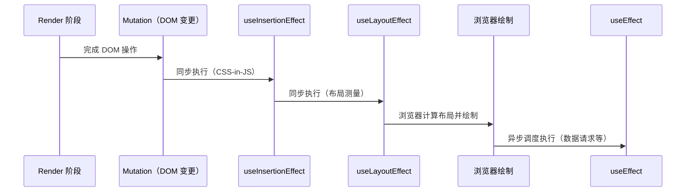

# Effects 副作用处理机制

## 1. React 的副作用模型

React 要求 **Render 阶段保持纯净**：组件函数不应产生任何外部可观察的副作用（DOM 变更、网络请求、订阅等）。所有副作用在 **Commit 阶段**或其之后执行。

这样设计的原因：

- Render 阶段可以被中断、重试或丢弃（并发模式下）。
- 如果副作用在 Render 中执行，可能被重复触发或产生不一致的外部状态。
- 将副作用与渲染分离，保证了 UI 状态的可预测性。

```
Render（纯计算，可中断） → Commit（副作用执行） → 浏览器绘制
```

## 2. Effect 的三种时序

React 提供了三种不同执行时机的 Effect Hook，覆盖不同的副作用场景：

### 2.1 useLayoutEffect：同步执行，阻塞绘制

```jsx
useLayoutEffect(() => {
  // DOM Mutation 完成后立即同步执行
  // 浏览器绘制之前运行
  const rect = ref.current.getBoundingClientRect()
  ref.current.style.left = `${rect.width}px`

  return () => {
    // 清理上一次的布局调整
  }
}, [deps])
```

**执行时机**：DOM Commit 后、浏览器绘制前，**同步阻塞**。

**适用场景**：

- 读取/计算 DOM 布局（`getBoundingClientRect`、`scrollTop` 等）。
- 基于测量结果同步调整 DOM 样式，**避免用户看到闪烁**。
- 初始化需要精确位置计算的第三方 DOM 库。

**注意**：因为阻塞绘制，应保持逻辑尽量轻量。

### 2.2 useEffect：异步执行，不阻塞绘制

```jsx
useEffect(() => {
  // Commit 后异步调度执行
  // 浏览器绘制之后运行
  const subscription = api.subscribe(data)
  fetchAnalytics('/page-view')

  return () => {
    // 清理订阅
    subscription.unsubscribe()
  }
}, [deps])
```

**执行时机**：Commit 后异步调度，**浏览器绘制之后**。

**适用场景**：

- 数据请求和 API 调用。
- 订阅/取消订阅事件或外部数据源。
- 日志上报、分析统计。
- 操作非 React 管理的 DOM（如第三方图表库初始化）。

### 2.3 useInsertionEffect：CSS-in-JS 专用

```jsx
useInsertionEffect(() => {
  // 在 DOM Mutation 之前执行
  // 主要为 CSS-in-JS 库设计
  const style = document.createElement('style')
  style.textContent = cssRules
  document.head.appendChild(style)

  return () => {
    document.head.removeChild(style)
  }
}, [])
```

**执行时机**：DOM Commit 前，是三者中最早执行的。

这是极少使用的 Hook，**主要为 styled-components、Emotion 等 CSS-in-JS 库设计**，让它们在 DOM 变更前注入样式规则，确保浏览器布局计算时样式已经就绪。

### 2.4 三种 Effect 的完整时序



| Hook                 | 执行时机              | 阻塞绘制 | 主要场景                   |
| -------------------- | --------------------- | -------- | -------------------------- |
| `useInsertionEffect` | DOM Commit 前         | 是       | CSS-in-JS 库注入样式       |
| `useLayoutEffect`    | DOM Commit 后、绘制前 | 是       | DOM 测量、同步布局调整     |
| `useEffect`          | 浏览器绘制后          | 否       | 数据请求、订阅、日志、分析 |

## 3. Effect 的清理机制

每次 Effect 重新执行前（或组件卸载时），React 会运行上一次 Effect 返回的**清理函数**：

```jsx
useEffect(() => {
  // setup：副作用主体
  const connection = createConnection(chatRoom)
  connection.on('message', handleMessage)

  return () => {
    // cleanup：清理上一次的连接
    connection.off('message', handleMessage)
    connection.close()
  }
}, [chatRoom])
// chatRoom 从 'general' 变为 'random'：
// 1. 执行旧 Effect 的 cleanup（关闭 'general' 的连接）
// 2. 执行新 Effect 的 setup（创建 'random' 的连接）
```

**清理函数执行的时机**：

- 依赖数组变化 → 执行旧 Effect 的 cleanup → 执行新 Effect。
- 组件卸载 → 执行 cleanup。

## 4. Commit 阶段的三个子阶段

Commit 阶段是**同步且不可中断的**，分为三个子阶段：

### 4.1 Before Mutation 阶段

在 DOM 实际变更**之前**执行：

- 调用 Class 组件的 `getSnapshotBeforeUpdate` 生命周期。
- 此时 DOM 仍是旧状态，可以读取变更前信息（如滚动位置）。

### 4.2 Mutation 阶段

执行实际的 DOM 变更：

- **Placement**：插入新 DOM 节点。
- **Update**：更新 DOM 属性和内容。
- **Deletion**：移除 DOM 节点，并同步执行对应 Effect 的清理函数。

### 4.3 Layout 阶段

DOM 变更完成后的**同步**阶段：

- 将 Fiber 树的 `current` 指针切换到 work-in-progress 树。
- 执行 `useLayoutEffect` 和 `useInsertionEffect` 的 setup。
- 更新 `ref` 引用。
- 执行 Class 组件的 `componentDidMount` / `componentDidUpdate`。

### 4.4 Passive 阶段（异步）

在 Layout 阶段之后，通过 Scheduler 异步调度：

- 执行 `useEffect` 的清理和 setup。
- 不阻塞浏览器绘制。

## 5. 依赖数组的语义

```jsx
useEffect(() => {
  // 声明：需要同步的外部系统
}, [dep1, dep2])
// dep1 或 dep2 变化 → 重新执行 Effect
```

依赖数组**不是**"Effect 运行的触发条件"，而是"本次 Effect 使用了哪些 React 状态的声明"。React 在每次渲染后比较依赖数组中的值，如果有变化则重新执行 Effect。

| 依赖数组                         | 行为                            |
| -------------------------------- | ------------------------------- |
| `useEffect(fn)` — 不传           | 每次渲染后都执行                |
| `useEffect(fn, [])` — 空数组     | 仅在首次渲染后执行一次（mount） |
| `useEffect(fn, [a, b])` — 有依赖 | a 或 b 变化时执行               |

常见误区：将 Effect 当作"watch"使用（"当 a 变化时执行 B"），而实际上应该理解为"声明了 a 和 b 的同步逻辑"。

## 6. Strict Mode 与 Effect

React 的 Strict Mode 在**开发环境**会对 Effect 进行"双重调用"验证：

```jsx
// 开发环境下的执行顺序：
// Mount:   setup → cleanup → setup（验证 cleanup 正确重置了副作用）
// Update:  cleanup → setup
// Unmount: cleanup
```

这用于**发现不对称的副作用**。如果你的 Effect 在开发环境下表现异常，说明 cleanup 函数没有正确还原 Effect 产生的副作用。

```jsx
// ❌ cleanup 没有正确还原
useEffect(() => {
  server.connect()
  return () => server.disconnect()
}, [])
// Mount: connect → disconnect → connect（双重连接后只有一个 disconnect → 可能泄漏）

// ✅ cleanup 正确还原
useEffect(() => {
  let cancelled = false
  fetch(url).then(data => {
    if (!cancelled) setData(data)
  })
  return () => {
    cancelled = true
  }
}, [url])
```

## 7. Effect 不应用于特定场景

| 场景                    | 不要用 Effect        | 应该用                        |
| ----------------------- | -------------------- | ----------------------------- |
| 基于 props/state 的计算 | ❌ Effect + setState | ✅ 直接在渲染中计算 / useMemo |
| 用户事件响应            | ❌ Effect + 标志位   | ✅ 事件处理函数               |
| 组件间通信              | ❌ Effect 链式触发   | ✅ 提升状态 / Context         |
| 初始化第三方库          | ❌ 放入渲染函数      | ✅ useRef + useEffect         |

```jsx
// ❌ 用 Effect 计算派生值
const [fullName, setFullName] = useState('')
useEffect(() => {
  setFullName(`${firstName} ${lastName}`)
}, [firstName, lastName])

// ✅ 直接在渲染中计算
const fullName = `${firstName} ${lastName}`
```

## 8. 总结

- **Render 阶段保持纯净**，副作用统一在 Commit 阶段及其后执行。
- **三种 Effect Hook 各有其时序**：`useInsertionEffect` → `useLayoutEffect` → 浏览器绘制 → `useEffect`。
- **清理函数保证副作用可逆**：下次 Effect 前或组件卸载时执行。
- **依赖数组是声明而非触发器**：声明"这个 Effect 依赖这些值"。
- **Commit 阶段同步不可中断**：Before Mutation → Mutation → Layout →（异步）Passive。
- **Strict Mode 双重调用是验证工具**：帮助发现不对称的副作用。
