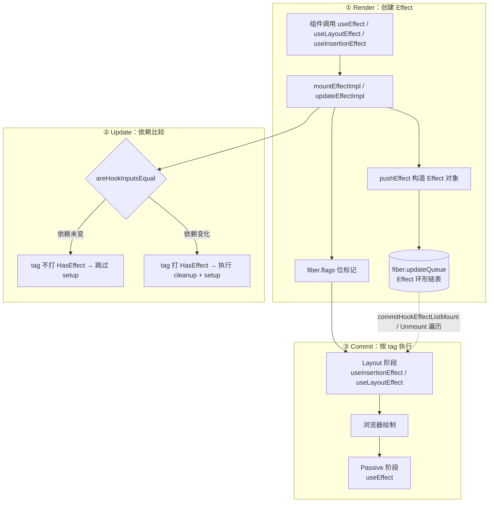
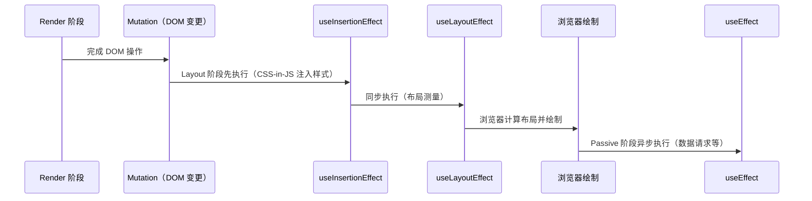

# Effects 副作用处理机制

## 1. React 的副作用模型

React 要求 **Render 阶段保持纯净**：组件函数不应产生任何外部可观察的副作用（DOM 变更、网络请求、订阅等）。所有副作用都在 **Commit 阶段**及其之后执行。

这样设计的原因：

- Render 阶段可以被中断、重试或丢弃（并发模式下）。
- 如果副作用在 Render 中执行，可能被重复触发或产生不一致的外部状态。
- 将副作用与渲染分离，保证了 UI 状态的可预测性。

```markdown
Render（纯计算，可中断） → Commit（副作用执行，同步不可中断） → 浏览器绘制
```

## 2. 全景图：Effect 的完整生命周期



- **Effect 是数据，不是调用**——Render 阶段只把副作用"**声明**"成 Effect 对象挂到链表上，真正的执行在 Commit。
- **`tag` 位标记决定执行时机与是否需要执行**——类型靠 `Passive/Layout/Insertion` 区分，依赖变化靠 `HasEffect` 标记。
- **环形链表是执行时遍历的载体**——Commit 阶段通过 `fiber.updateQueue.lastEffect` 拿到链表，逐个执行。

## 3. Effect 的数据载体：Effect 对象与环形链表

### 3.1 Effect 对象的结构

每次调用 Effect Hook，React 都会实例化一个 **Effect 对象**，挂到当前 Fiber 的 `updateQueue` 上（注意：不是 `memoizedState` 链表上的节点，而是 `hook.memoizedState` 指向这个 Effect 对象）：

:::code-group

```typescript [react-reconciler/src/ReactFiberHooks.js]
// Effect 对象（useEffect / useLayoutEffect / useInsertionEffect 共用）
type Effect = {
  tag: HookFlags // 位标记：HasEffect | Passive/Layout/Insertion
  create: () => (() => void) | void // setup：副作用主体，可返回 cleanup
  destroy: (() => void) | void // cleanup：上一次 setup 的返回值
  deps: Array<mixed> | null // 依赖数组
  next: Effect // 环形链表下一节点
}
```

```javascript [react-reconciler/src/ReactHookEffectTags.js]
// Effect.tag 的位标记（源码原始命名）
export const NoFlags = 0b0000
export const HasEffect = 0b0001 // 本 Effect 需要执行（依赖变化 / 首次挂载）
export const Insertion = 0b0010 // useInsertionEffect
export const Layout = 0b0100 // useLayoutEffect
export const Passive = 0b1000 // useEffect

// ReactFiberHooks.js 以别名导入，对应本文代码中的写法：
//   HasEffect as HookHasEffect、Insertion as HookInsertion
//   Layout as HookLayout、Passive as HookPassive
```

:::

> [!NOTE]
> `tag` 同时承载**两类信息**：低 4 位（`HasEffect`）表示"**是否需要执行**"，其余位（`Passive/Layout/Insertion`）表示"**是什么类型**"。Commit 阶段用位运算 `effect.tag & flags` 一次性判断，无需拆字段。

### 3.2 Effect 环形链表

一个函数组件可能调用多个 Effect，它们通过 `next` 串成**环形单向链表**，`fiber.updateQueue.lastEffect` 指向链表的**尾节点**（尾节点的 `next` 又指回头节点）：

```javascript
// 组件调用 3 个 Effect 后，fiber.updateQueue.lastEffect 的结构（示意）
fiber.updateQueue = {
  lastEffect: /* Effect#3 */ {
    tag: HookPassive | HookHasEffect, // useEffect，需要执行
    create, destroy, deps,
    next: /* Effect#1 */ {
      tag: HookPassive | HookHasEffect,
      create, destroy, deps,
      next: /* Effect#2 */ {
        tag: HookLayout | HookHasEffect, // useLayoutEffect
        create, destroy, deps,
        next: /* 回到 Effect#3，形成环 */,
      },
    },
  },
}
```

环形结构的好处：**执行时从 `lastEffect.next` 出发，遍历一圈就能访问到所有 Effect**，无需额外的"**头指针**"或数组。

## 4. Effect 的创建与依赖比较

### 4.1 挂载：mountEffectImpl

三个 Effect Hook 的挂载逻辑高度统一，都走 `mountEffectImpl`，区别只在于传入的 `fiberFlags` 与 `hookFlags`：

:::code-group

```javascript [react-reconciler/src/ReactFiberHooks.js]
// 三个 Effect 的挂载入口（极简）
function mountEffect(create, deps) {
  return mountEffectImpl(
    PassiveEffect | PassiveStaticEffect,
    HookPassive,
    create,
    deps,
  )
}
function mountLayoutEffect(create, deps) {
  return mountEffectImpl(UpdateEffect, HookLayout, create, deps)
}
function mountInsertionEffect(create, deps) {
  return mountEffectImpl(InsertionEffect, HookInsertion, create, deps)
}

function mountEffectImpl(fiberFlags, hookFlags, create, deps) {
  const hook = mountWorkInProgressHook() // 在 Hook 链表上创建节点
  const nextDeps = deps === undefined ? null : deps

  // 1. 在 Fiber 上标记"本 Fiber 有这类副作用"
  currentlyRenderingFiber.flags |= fiberFlags

  // 2. 构造 Effect 对象（打上 HasEffect，挂载时必然执行），写入 hook.memoizedState
  hook.memoizedState = pushEffect(
    HookHasEffect | hookFlags,
    create,
    undefined,
    nextDeps,
  )
}
```

```javascript [react-reconciler/src/ReactFiberFlags.js]
// fiber.flags 位标记（节选）：声明"本 Fiber 有哪类副作用"，位值是实现细节
export const UpdateEffect = /* ... */ // useLayoutEffect：同步副作用（Layout 阶段）
export const PassiveEffect = /* ... */ // useEffect：异步副作用（Passive 阶段）
export const InsertionEffect = /* ... */ // useInsertionEffect：DOM 变更后、useLayoutEffect 前
export const PassiveStaticEffect = /* ... */ // 静态被动副作用（依赖在编译期确定，永不变化）
```

:::

`pushEffect` 负责构造 Effect 对象，并把它插入 `fiber.updateQueue` 的环形链表尾部：

:::code-group

```javascript [react-reconciler/src/ReactFiberHooks.js]
// pushEffect：把 Effect 挂到 fiber.updateQueue 的环形链表尾部（极简）
function pushEffect(tag, create, destroy, deps) {
  const effect = { tag, create, destroy, deps, next: null }
  let componentUpdateQueue = currentlyRenderingFiber.updateQueue
  if (componentUpdateQueue === null) {
    // 第一个 Effect：自环
    componentUpdateQueue = createFunctionComponentUpdateQueue()
    currentlyRenderingFiber.updateQueue = componentUpdateQueue
    componentUpdateQueue.lastEffect = effect.next = effect
  } else {
    // 追加到尾部：尾插法，插入后 newEffect 成为新的尾节点
    const lastEffect = componentUpdateQueue.lastEffect
    const firstEffect = lastEffect.next
    lastEffect.next = effect
    effect.next = firstEffect
    componentUpdateQueue.lastEffect = effect
  }
  return effect
}
```

```javascript [react-reconciler/src/ReactFiberHooks.js]
// 初始化函数组件的更新队列（Effect 的环形链表载体）
function createFunctionComponentUpdateQueue() {
  return {
    lastEffect: null, // Effect 环形链表的尾节点
  }
}
```

:::

### 4.2 更新：updateEffectImpl 与依赖比较

更新阶段的核心是**依赖比较**——`updateEffectImpl` 用 `areHookInputsEqual` 对比新旧 deps，只有依赖变化时才给 Effect 打上 `HasEffect` 标记，否则复用旧 Effect（不重新执行 setup）：

:::code-group

```javascript [react-reconciler/src/ReactFiberHooks.js]
// 更新 Effect（极简）
function updateEffect(create, deps) {
  return updateEffectImpl(PassiveEffect, HookPassive, create, deps)
}
// useLayoutEffect / useInsertionEffect 同理，只是 fiberFlags / hookFlags 不同

function updateEffectImpl(fiberFlags, hookFlags, create, deps) {
  const hook = updateWorkInProgressHook() // 按序复用 Hook
  const nextDeps = deps === undefined ? null : deps
  let destroy = undefined

  if (currentHook !== null) {
    const prevEffect = currentHook.memoizedState
    destroy = prevEffect.destroy // 保留上一次的 cleanup，待需要时执行
    if (nextDeps !== null) {
      const prevDeps = prevEffect.deps
      if (areHookInputsEqual(nextDeps, prevDeps)) {
        // 依赖没变 → 不打 HasEffect，Commit 阶段跳过 setup
        hook.memoizedState = pushEffect(hookFlags, create, destroy, nextDeps)
        return
      }
    }
  }
  // 依赖变化 → 打上 HasEffect，Commit 阶段会执行 cleanup + setup
  currentlyRenderingFiber.flags |= fiberFlags
  hook.memoizedState = pushEffect(
    HookHasEffect | hookFlags,
    create,
    destroy,
    nextDeps,
  )
}

// 依赖比较：用 Object.is 逐项对比
function areHookInputsEqual(nextDeps, prevDeps) {
  if (prevDeps === null) return false
  for (let i = 0; i < prevDeps.length && i < nextDeps.length; i++) {
    if (is(nextDeps[i], prevDeps[i])) continue
    return false
  }
  return true
}
```

```javascript [shared/objectIs.js]
// Object.is 的 polyfill：跨环境一致地处理 +0/-0 与 NaN
function is(x, y) {
  return (
    (x === y && (x !== 0 || 1 / x === 1 / y)) || // 区分 +0 与 -0
    (x !== x && y !== y) // 两者都是 NaN
  )
}
```

:::

注意一个关键差异：**更新时即使依赖没变，也会重新 `pushEffect` 构造一个新 Effect 对象**，只是不打 `HasEffect`。这样下次依赖变化时，cleanup 仍能拿到上一次的 `destroy`。

## 5. Commit 阶段的执行

Render 阶段只负责"**声明**"，真正的执行在 **Commit 阶段**（同步、不可中断）。完整的四个子阶段及遍历机制见 [Render 与 Commit 阶段](./renderCommit.md)，这里只聚焦 Effect 如何被执行。

### 5.1 子阶段与 Effect 的归属

| 子阶段          | 入口函数                                       | Effect 相关动作                                                                 |
| --------------- | ---------------------------------------------- | ------------------------------------------------------------------------------- |
| Before Mutation | `commitBeforeMutationEffects`                  | 无（DOM 变更前的快照，如 `getSnapshotBeforeUpdate`）                            |
| Mutation        | `commitMutationEffects`                        | DOM 变更；**删除节点时同步执行其 layout 类 cleanup**                            |
| Layout          | `commitLayoutEffects`                          | 执行 `useInsertionEffect`、`useLayoutEffect` 的 setup（及依赖变化时的 cleanup） |
| Passive（异步） | `flushPassiveEffects` → `commitPassiveEffects` | 执行 `useEffect` 的 cleanup 与 setup，不阻塞绘制                                |

### 5.2 遍历执行：commitHookEffectListMount / Unmount

无论哪种 Effect，最终都由两个函数遍历环形链表执行——它们通过 `effect.tag & flags` 判断该 Effect 是否属于当前要执行的那一类：

:::code-group

```javascript [react-reconciler/src/ReactFiberCommitWork.js]
// 执行 setup（极简）
function commitHookEffectListMount(flags, finishedWork) {
  const updateQueue = finishedWork.updateQueue
  const lastEffect = updateQueue !== null ? updateQueue.lastEffect : null
  if (lastEffect !== null) {
    const firstEffect = lastEffect.next
    let effect = firstEffect
    do {
      if ((effect.tag & flags) === flags) {
        const create = effect.create
        effect.destroy = create() // 执行 setup，把返回值保存为 cleanup
      }
      effect = effect.next
    } while (effect !== firstEffect) // 环形：遍历一圈即止
  }
}
```

```javascript [react-reconciler/src/ReactFiberCommitWork.js]
// 执行 cleanup（极简）
function commitHookEffectListUnmount(
  flags,
  finishedWork,
  nearestMountedAncestor,
) {
  const updateQueue = finishedWork.updateQueue
  const lastEffect = updateQueue !== null ? updateQueue.lastEffect : null
  if (lastEffect !== null) {
    const firstEffect = lastEffect.next
    let effect = firstEffect
    do {
      if ((effect.tag & flags) === flags) {
        const destroy = effect.destroy
        effect.destroy = undefined
        if (destroy !== undefined) destroy() // 执行 cleanup
      }
      effect = effect.next
    } while (effect !== firstEffect)
  }
}
```

:::

调用时传入的 `flags` 揭示了执行的语义：

| 动作        | Layout 阶段传入的 flags                                         | Passive 阶段传入的 flags          |
| ----------- | --------------------------------------------------------------- | --------------------------------- |
| **setup**   | `HookInsertion \| HookHasEffect`、`HookLayout \| HookHasEffect` | `HookPassive \| HookHasEffect`    |
| **cleanup** | `HookInsertion`、`HookLayout`（不带 `HasEffect`）               | `HookPassive`（不带 `HasEffect`） |

> [!NOTE]
> 这个差异是理解清理机制的关键：**cleanup 判断时不要求 `HasEffect`**——即使依赖没变，只要组件被卸载（或该 fiber 被删除），旧 Effect 的 cleanup 也必须执行；而 **setup 判断时要求 `HasEffect`**，只有依赖变化（或首次挂载）的 Effect 才会重新执行 setup。

## 6. Effect 的时序差异

三种 Effect 的**底层机制完全相同**，唯一区别是 `fiberFlags`/`hookFlags` 不同，导致它们在 Commit 阶段落入不同子阶段：

### 6.1 useInsertionEffect：CSS-in-JS 专用

```jsx
useInsertionEffect(() => {
  // 在 Layout 阶段最先执行（早于 useLayoutEffect）
  // DOM 已变更、浏览器尚未绘制
  const style = document.createElement('style')
  style.textContent = cssRules
  document.head.appendChild(style)

  return () => {
    document.head.removeChild(style)
  }
}, [])
```

**执行时机**：Layout 阶段内、`useLayoutEffect` 之前，同步执行。

**适用场景**：极少使用，主要为 styled-components、Emotion 等 CSS-in-JS 库设计，让它们在 `useLayoutEffect` 读取布局前注入样式规则，避免布局计算时样式未就绪。

### 6.2 useLayoutEffect：同步执行，阻塞绘制

```jsx
useLayoutEffect(() => {
  // DOM 变更完成后同步执行，浏览器绘制之前运行
  const rect = ref.current.getBoundingClientRect()
  ref.current.style.left = `${rect.width}px`

  return () => {
    // 清理上一次的布局调整
  }
}, [deps])
```

**执行时机**：Layout 阶段，`useInsertionEffect` 之后、浏览器绘制前，**同步阻塞**。

**适用场景**：读取/计算 DOM 布局（`getBoundingClientRect`、`scrollTop` 等），基于测量结果同步调整 DOM 样式，**避免用户看到闪烁**。

### 6.3 useEffect：异步执行，不阻塞绘制

```jsx
useEffect(() => {
  // Passive 阶段异步调度执行，浏览器绘制之后运行
  const subscription = api.subscribe(data)
  fetchAnalytics('/page-view')

  return () => {
    subscription.unsubscribe()
  }
}, [deps])
```

**执行时机**：Passive 阶段，浏览器绘制之后，**异步不阻塞**。

**适用场景**：数据请求、订阅/取消订阅、日志上报、分析统计、操作非 React 管理的 DOM（第三方图表库初始化）等。

### 6.4 完整时序对比



| Hook                 | 执行时机                              | 阻塞绘制 | 主要场景                   |
| -------------------- | ------------------------------------- | -------- | -------------------------- |
| `useInsertionEffect` | Layout 阶段最先（useLayoutEffect 前） | 是       | CSS-in-JS 库注入样式       |
| `useLayoutEffect`    | Layout 阶段、浏览器绘制前             | 是       | DOM 测量、同步布局调整     |
| `useEffect`          | Passive 阶段、浏览器绘制后            | 否       | 数据请求、订阅、日志、分析 |

## 7. Effect 的清理机制

每次 Effect 重新执行前（或组件卸载时），React 会运行上一次 Effect 返回的**清理函数**：

```jsx
useEffect(() => {
  // setup：副作用主体
  const connection = createConnection(chatRoom)
  connection.on('message', handleMessage)

  return () => {
    // cleanup：清理上一次的连接
    connection.off('message', handleMessage)
    connection.close()
  }
}, [chatRoom])
// chatRoom 从 'general' 变为 'random'：
// 1. 执行旧 Effect 的 cleanup（关闭 'general' 的连接）
// 2. 执行新 Effect 的 setup（创建 'random' 的连接）
```

## 8. 依赖数组的语义

```jsx
useEffect(() => {
  // 声明：需要同步的外部系统
}, [dep1, dep2])
// dep1 或 dep2 变化 → 重新执行 Effect
```

依赖数组不是"**Effect 运行的触发条件**"，而是"**本次 Effect 使用了哪些 React 状态的声明**"。React 在每次渲染后比较依赖数组中的值，如果有变化则重新执行 Effect。

| 依赖数组                         | 行为                            |
| -------------------------------- | ------------------------------- |
| `useEffect(fn)` — 不传           | 每次渲染后都执行                |
| `useEffect(fn, [])` — 空数组     | 仅在首次渲染后执行一次（mount） |
| `useEffect(fn, [a, b])` — 有依赖 | a 或 b 变化时执行               |

常见误区：将 Effect 当作"**watch**"使用（"当 a 变化时执行 B"），而实际上应该理解为"**声明了 a 和 b 的同步逻辑**"。

## 9. Strict Mode 与 Effect

React 的 Strict Mode 在**开发环境**会对 Effect 进行"双重调用"验证：

```markdown
// 开发环境下的执行顺序：
// Mount: setup → cleanup → setup（验证 cleanup 正确重置了副作用）
// Update: cleanup → setup
// Unmount: cleanup
```

这用于**发现不对称的副作用**。如果你的 Effect 在开发环境下表现异常，说明 cleanup 函数没有正确还原 Effect 产生的副作用。

```jsx
// ❌ cleanup 没有正确还原
useEffect(() => {
  server.connect()
  return () => server.disconnect()
}, [])
// Mount: connect → disconnect → connect（双重连接后只有一个 disconnect → 可能泄漏）

// ✅ cleanup 正确还原
useEffect(() => {
  let cancelled = false
  fetch(url).then(data => {
    if (!cancelled) setData(data)
  })
  return () => {
    cancelled = true
  }
}, [url])
```

## 10. Effect 不应用于特定场景

| 场景                    | 不要用 Effect        | 应该用                        |
| ----------------------- | -------------------- | ----------------------------- |
| 基于 props/state 的计算 | ❌ Effect + setState | ✅ 直接在渲染中计算 / useMemo |
| 用户事件响应            | ❌ Effect + 标志位   | ✅ 事件处理函数               |
| 组件间通信              | ❌ Effect 链式触发   | ✅ 提升状态 / Context         |
| 初始化第三方库          | ❌ 放入渲染函数      | ✅ useRef + useEffect         |

```jsx
// ❌ 用 Effect 计算派生值
const [fullName, setFullName] = useState('')
useEffect(() => {
  setFullName(`${firstName} ${lastName}`)
}, [firstName, lastName])

// ✅ 直接在渲染中计算
const fullName = `${firstName} ${lastName}`
```

## 11. 总结

- **Render 声明、Commit 执行**：Effect 在 Render 阶段只被构造成对象挂进环形链表，真正的执行在 Commit（Layout 同步、Passive 异步）。
- **`tag` 位标记一石二鸟**：类型位决定执行阶段，`HasEffect` 决定是否执行；cleanup 不要求 `HasEffect`，卸载时必然执行。
- **依赖比较靠 `Object.is`**：`areHookInputsEqual` 逐项对比 deps，变化才打 `HasEffect`。
- **依赖数组是声明而非触发器**：`areHookInputsEqual` 用 `Object.is` 逐项对比 deps，变化才打 `HasEffect`。
- **三种时序**：`useInsertionEffect` → `useLayoutEffect` → 浏览器绘制 → `useEffect`。
- **Strict Mode 双重调用是验证工具**：帮助发现不对称的副作用。
