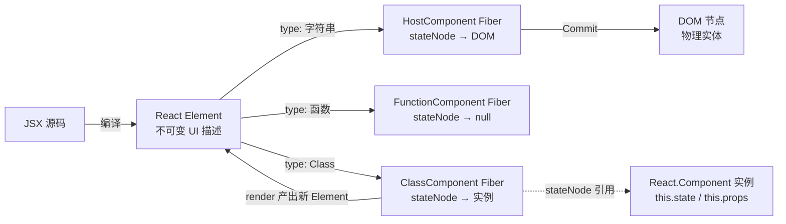
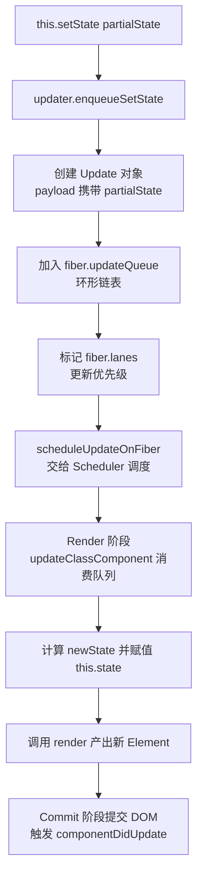
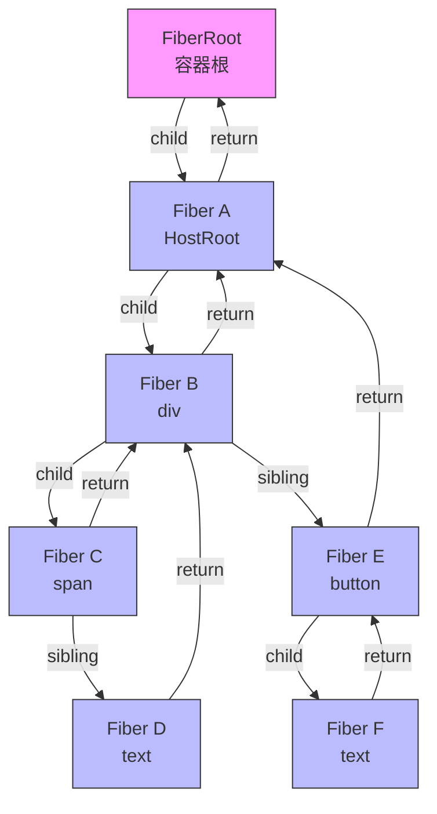
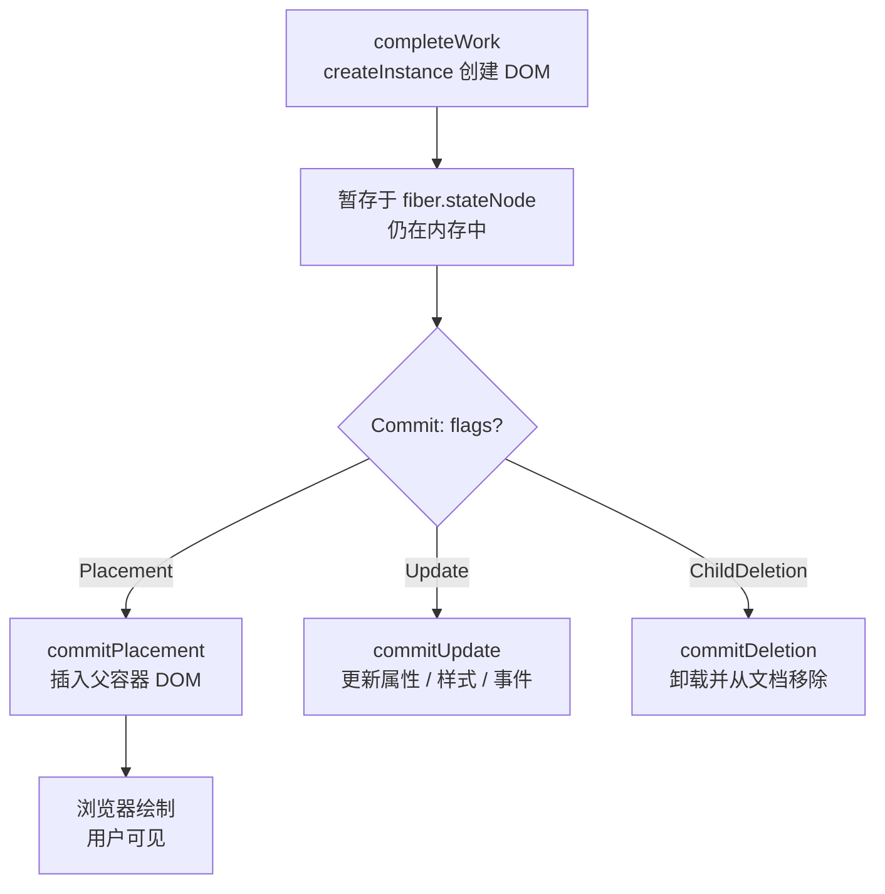

# React Element、Fiber、React.Component 与 DOM 节点

## 1. 从 JSX 到 DOM

React 应用中存在四个容易混淆的核心概念：**React Element**、**React.Component 实例**、**Fiber 节点**和 **DOM 节点**。理解它们的区别和关系是深入 React 内部机制（尤其是并发模式）的基石。

```markdown
JSX 源码 → React Element（不可变 UI 描述）→ [Class 组件: React.Component 实例] → Fiber 树（工作节点）→ 渲染器 → DOM 节点
```

其中前三者是 React 内部的核心实体，`React.Component` 实例只在 **Class 组件**中存在（函数组件无实例）：



| 维度         | React Element (元素)               | Fiber Node (节点)                   | DOM Node (宿主节点)          |
| ------------ | ---------------------------------- | ----------------------------------- | ---------------------------- |
| **存在形态** | 纯粹的轻量级 JavaScript 对象       | 复杂的运行状态机（包含指针与状态）  | 沉重的浏览器原生对象         |
| **创建时机** | 每次 Render 阶段（组件函数执行时） | 首次渲染时创建，后续更新时复用/克隆 | Commit 阶段按需增删改        |
| **可变性**   | **绝对不可变 (Immutable)**         | **高度可变 (Mutable)**              | **可变 (Mutable)**           |
| **生命周期** | 极短，单次渲染周期结束即被 GC 回收 | 跨渲染周期持久存在（伴随组件一生）  | 挂载到文档后持久存在         |
| **核心职责** | 描述当前时刻 "**UI 应该长什么样**" | 调度工作、存储 Hook 状态、计算 Diff | 响应交互、触发浏览器重绘重排 |

## 2. React Element

### 2.1 内部结构与安全屏障

React Element 是一个**轻量、不可变的纯对象**，它是对 UI 的声明式描述：

```javascript
// 一个 React Element 的标准结构
{
  $$typeof: Symbol.for('react.element'), // 安全标记：防御 JSON 注入型 XSS 攻击
  type: 'h1',                            // 节点类型：字符串(DOM) / 函数引用(FC) / Class引用
  key: null,                             // 列表 Diff 的唯一标识，用于同层复用
  ref: null,                             // 获取底层 DOM 或类实例的引用
  props: {                               // 属性集合（包含 children）
    className: 'title',
    children: 'Hello World'
  },
  _owner: null                           // 记录负责创建此 Element 的 Fiber（开发模式）
}

```

> [!NOTE]
> `$$typeof` 的设计极为巧妙：由于 JSON 无法序列化 `Symbol`，如果攻击者试图通过服务器返回一个伪造的 React Element 对象注入脚本，React 会因为找不到合法的 `Symbol.for('react.element')` 而拒绝渲染，从根源上阻断了 XSS。

### 2.2 极致的不可变性 (Immutability)

React Element 的每个字段都是被冻结的。这种不可变性是 React 能够安全地在并发模式下**丢弃、暂停和重试渲染**的基础。

```jsx
const element = <h1>Hello</h1>
// ❌ 绝对禁止：这会破坏 React 的假设，导致不可预期的渲染错误
element.props.className = 'changed'

// ✅ 正确做法：状态驱动产生全新的 Element
const newElement = <h1 className="changed">Hello</h1>
```

### 2.3 编译转化 (JSX Transform)

JSX 只是语法糖，在编译期（Babel / SWC / Vite）会被抹平为函数调用：

```jsx
// 源码
function Greeting({ name }) {
  return <h1 className="title">Hello, {name}!</h1>
}

// React 17+ 引入的 Automatic Runtime 编译后：
import { jsx as _jsx, jsxs as _jsxs } from 'react/jsx-runtime'

function Greeting({ name }) {
  return _jsxs('h1', {
    className: 'title',
    children: ['Hello, ', name, '!'],
  })
}

// _jsx 的返回值就是一个 React Element：
// { $$typeof: Symbol(react.element), type: 'h1', props: { className: 'title', children: [...] }, ... }
```

### 2.4 Element 的类型判断

```javascript
// 宿主元素（原生 HTML 标签）
<div />          // type: 'div'（字符串）

// 函数组件
<MyComponent />  // type: MyComponent（函数引用）

// Class 组件
<MyClass />      // type: MyClass（Class 引用）

// Fragment
<>text</>        // type: Symbol(react.fragment)

// Portal
createPortal()   // type: Symbol(react.portal)
```

### 2.5 type 字段决定的实例化路线

`type` 的取值是 Reconciler 在 `beginWork` 阶段决定“**如何把这个 Element 落地成 Fiber**”的唯一依据：

| `type` 取值              | 对应的 `fiber.tag`     | 落地方式                             | `stateNode` 指向     |
| ------------------------ | ---------------------- | ------------------------------------ | -------------------- |
| 字符串 `'div'`           | `HostComponent` (5)    | `createInstance` 创建真实 DOM        | DOM 节点             |
| 函数引用                 | `FunctionComponent`(0) | 直接调用函数，返回子 Element         | `null`（无实例）     |
| Class 引用               | `ClassComponent` (1)   | `new type(props)` 创建组件实例       | React.Component 实例 |
| `Symbol(react.fragment)` | `Fragment` (7)         | 透传 children，不生成 DOM            | `null`               |
| `Symbol(react.portal)`   | `HostPortal` (4)       | 渲染到指定容器（如 `document.body`） | 目标容器 DOM         |

关键认知：Element 只是“**指令**”，它本身不做任何事。真正决定“**字符串该怎么渲染、函数该怎么调用、Class 该怎么实例化**”的，是 Reconciler 拿到 `type` 之后的派发逻辑。这也是 Element 能保持“**极轻、极不可变**”的原因——它把所有复杂的运行时行为都推迟给了 Fiber。

## 3. React.Component

### 3.1 定位：Class 组件的运行时实体

当 Element 的 `type` 是一个 Class 引用时，React 会用 `new type(props)` 创建该类的实例，并把实例挂到对应 Fiber 的 `stateNode` 上。**这个实例就是 `React.Component`（或其子类）的对象**，它是 Class 组件“**状态与行为**”的真正载体。

```jsx
class Counter extends React.Component {
  state = { count: 0 } // 状态挂在实例上

  handleClick = () => {
    this.setState({ count: this.state.count + 1 })
  }

  render() {
    // 实例方法：产出 Element
    return <button onClick={this.handleClick}>{this.state.count}</button>
  }
}
```

函数组件每次渲染都是“**一次普通的函数调用**”，不存在跨渲染的实例；而 Class 组件的实例**贯穿组件的整个生命周期**，因此 `this` 始终指向同一个对象，`this.state` 可以在多次渲染间保持。

### 3.2 内部结构：updater 是隐藏的关键

`React.Component` 基类的结构极简，最关键的字段不是 `state`，而是 `updater`：

```javascript
// React.Component 基类的简化实现
class Component {
  constructor(props, context, updater) {
    this.props = props
    this.context = context
    this.refs = {}
    // 关键！updater 由 React 内部注入，是实例连接 Fiber 树的唯一通道
    this.updater = updater
    this.state = null
  }

  setState(partialState, callback) {
    // 并不直接修改 this.state，而是交给 updater 入队
    this.updater.enqueueSetState(this, partialState, callback, 'setState')
  }

  forceUpdate(callback) {
    this.updater.enqueueForceUpdate(this, callback, 'forceUpdate')
  }

  render() {
    // 子类必须实现，否则 React 报错
  }
}
```

关键认知：`this.setState()` 里并没有任何“**改 state**”的逻辑。它只是把一个“**更新意图**”转交给 `updater`。`updater`（即 `classComponentUpdater`）才是真正操作 Fiber 的幕后之手——它负责把更新写入 Fiber 的 `updateQueue`，并触发整个调度流程。

### 3.3 setState 的原理链路

从“**调用 `setState`**”到“**DOM 更新**”，中间要经过一条跨越“**实例 → Fiber → Scheduler → DOM**”的完整链路：

```javascript
// classComponentUpdater 的核心（简化）
const classComponentUpdater = {
  enqueueSetState(instance, partialState, callback) {
    const fiber = getInstance(instance) // 通过实例反查到它所属的 Fiber
    const update = {
      payload: partialState, // 更新载荷（对象或函数）
      callback,
      next: null,
    }
    enqueueUpdate(fiber, update) // 加入 fiber.updateQueue 环形链表
    const root = markUpdateLaneFromFiberToRoot(fiber) // 标记优先级
    scheduleUpdateOnFiber(root, fiber) // 触发调度
  },
}
```



### 3.4 生命周期总览

Class 组件的生命周期围绕“**挂载 → 更新 → 卸载**”三个阶段展开，每个阶段都由若干实例方法构成：

**挂载阶段（Mounting）**

| 顺序 | 方法                                            | 说明                                   |
| ---- | ----------------------------------------------- | -------------------------------------- |
| 1    | `constructor(props)`                            | 初始化 `state`、绑定方法               |
| 2    | `static getDerivedStateFromProps(props, state)` | 由 props 派生 state（极少使用）        |
| 3    | `render()`                                      | 返回 React Element                     |
| 4    | `componentDidMount()`                           | DOM 已挂载，可发请求 / 订阅 / 操作 DOM |

**更新阶段（Updating）**

| 顺序 | 方法                                                 | 说明                              |
| ---- | ---------------------------------------------------- | --------------------------------- |
| 1    | `static getDerivedStateFromProps(props, state)`      | 由 props 派生 state               |
| 2    | `shouldComponentUpdate(nextProps, nextState)`        | 返回 false 可跳过渲染（性能优化） |
| 3    | `render()`                                           | 返回新 Element                    |
| 4    | `getSnapshotBeforeUpdate(prevProps, prevState)`      | DOM 变更前读取快照（如滚动位置）  |
| 5    | `componentDidUpdate(prevProps, prevState, snapshot)` | DOM 已更新                        |

**卸载与错误处理**

| 方法                                     | 触发时机               | 说明                       |
| ---------------------------------------- | ---------------------- | -------------------------- |
| `componentWillUnmount()`                 | 组件卸载前             | 清理订阅、定时器、解绑事件 |
| `static getDerivedStateFromError(error)` | 渲染期间子组件抛出错误 | 更新 state 以渲染降级 UI   |
| `componentDidCatch(error, info)`         | 捕获到错误后           | 记录错误日志、上报         |

## 4. Fiber 节点

### 4.1 为什么需要 Fiber？

在 React 15 时代，Element 树的 Diff 是通过**原生调用栈递归**完成的。一旦树变大，递归无法中断，会导致主线程阻塞（掉帧）。
Fiber 架构的核心使命是：**将不可中断的深层递归，扁平化为基于堆内存的、可中断的单链表循环**。Fiber 就是这个调度过程中的**工作单元**。

### 4.2 核心字段域解剖

一个 Fiber 节点（`FiberNode`）是一个极其庞大的对象，按职责可划分为四大场域：

```javascript
type Fiber = {
  // === 1. 实例与身份域 (Identity) ===
  tag: WorkTag,          // 节点标识（如 0: FC, 1: Class, 3: HostRoot, 5: HostComponent）
  type: any,             // 对应 Element.type
  key: null | string,    // 对应 Element.key

  // === 2. 拓扑结构域 (Tree Structure) - 单链表树 ===
  return: Fiber | null,  // 指向父节点（工作完成后的返回地）
  child: Fiber | null,   // 指向第一个子节点
  sibling: Fiber | null, // 指向右侧第一个兄弟节点
  index: number,         // 在父节点的 children 中的索引

  // === 3. 状态与数据域 (State & Data) ===
  pendingProps: any,     // 新进入的 props，等待本次 Render 消费
  memoizedProps: any,    // 上一次 Render 成功后的 props
  memoizedState: any,    // 核心！FC 这里挂载 Hooks 单向链表；Class 挂载 state
  updateQueue: mixed,    // 状态更新队列（如 setState 产生的 Update 对象）

  // === 4. 副作用与调度域 (Effects & Scheduling) ===
  flags: Flags,          // 自身发生的副作用（如 Placement 插入、Update 更新）
  subtreeFlags: Flags,   // 子树累积的副作用（用于 Commit 阶段快速跳过干净的子树）
  deletions: Array<Fiber> | null, // 待移除的子节点数组
  lanes: Lanes,          // 当前节点拥有的更新优先级（31位二进制位运算）
  childLanes: Lanes,     // 子树中拥有的更新优先级

  // === 5. 架构指针与输出 (Architecture & Output) ===
  alternate: Fiber | null, // 指向另一棵树（current <-> workInProgress）中的对应节点
  stateNode: any,        // 物理映射：对应真实的 DOM 节点 或 Class 实例
}

```

### 4.3 stateNode 的三种指向

`stateNode` 是 Fiber 与“**物理世界**”的接缝，它究竟指向什么，完全由 `fiber.tag` 决定：

| `fiber.tag`         | `stateNode` 指向     | 说明                                      |
| ------------------- | -------------------- | ----------------------------------------- |
| `HostComponent`     | 真实 DOM 节点        | 原生元素，`stateNode` 就是那个 `<div>` 等 |
| `ClassComponent`    | React.Component 实例 | Class 组件的 `this` 即此对象              |
| `FunctionComponent` | `null`               | 函数组件无实例，`stateNode` 恒为 `null`   |
| `HostRoot`          | FiberRootNode        | 应用根，`stateNode` 指回全局容器根        |
| `HostText`          | 文本 DOM 节点        | 纯文本节点                                |

### 4.4 拓扑优势：从树到链表

Fiber 放弃了 `children: []` 数组结构，改用 **Child-Sibling-Return** 链表：



## 5. DOM 节点

### 5.1 物理实体的生命周期

DOM 节点是宿主环境（浏览器）的**原生对象**，它“**沉重**”且创建销毁成本高，因此 React 从不直接操纵它，而是通过 Element（计算蓝图）和 Fiber（工作状态）层层代理，最后在 Commit 阶段做一次**靶向手术**。

一个 DOM 节点的完整生命周期：



### 5.2 flags 到 DOM 操作的映射

Render 阶段计算出的 `flags` 是 Commit 阶段执行 DOM 操作的**唯一指令**，二者一一对应：

| `flags`         | Commit 阶段的处理      | DOM 操作                            |
| --------------- | ---------------------- | ----------------------------------- |
| `Placement`     | `commitPlacement`      | 将节点插入父容器                    |
| `Update`        | `commitUpdate`         | 更新 `className` / `style` / 事件等 |
| `ChildDeletion` | `commitDeletion`       | 从文档移除节点并清理副作用          |
| `Snapshot`      | `commitSnapshotEffect` | 变更前读取快照（滚动位置等）        |

关键认知：DOM 是“**结果**”**而非**“过程”。Render 阶段完全不碰 DOM，所有计算都发生在 Element 与 Fiber 这两个廉价对象上；只有到了 Commit 阶段，React 才把已经算好的差异一次性作用到昂贵的 DOM 上。这种“**先算后改**”的隔离，正是并发模式能安全中断、丢弃、重试渲染的物理前提。

## 6. 总结

- **React Element (蓝图)** 是每次渲染产生的一次性指令快照，告诉 React "**界面应该是怎样的**"。它极轻、极不可变，通过 `type` 字段把复杂的落地行为推迟给 Fiber。
- **React.Component 实例 (Class 组件的状态容器)** 只在 Class 组件中存在，持有 `this.state` / `this.props`，并通过 `updater` 把 `setState` 的“**更新意图**”桥接到 Fiber 的 `updateQueue` 上。
- **Fiber (引擎/工作台)** 是跨越渲染周期长存的状态机。它接住了 Element 的蓝图，通过比对计算出差异（Flags），并维护了所有的 Hooks 状态、Class 实例引用、调度优先级和链表拓扑。
- **DOM (产物)** 是底层宿主环境的物理实体。Fiber 的 `stateNode` 引用了它，并在最终的 Commit 阶段对其进行极简的靶向手术。
- **整体架构**：不可变的数据流（Element）驱动了可变的状态机（Fiber），Class 组件则以实例（React.Component）作为中间载体，最终通过双缓冲安全、高效地投射为物理像素（DOM）。
- **Fiber ≠ "虚拟 DOM 的另一种叫法"**——它是一个更广的概念，涵盖调度、优先级、副作用标记和工作循环。
