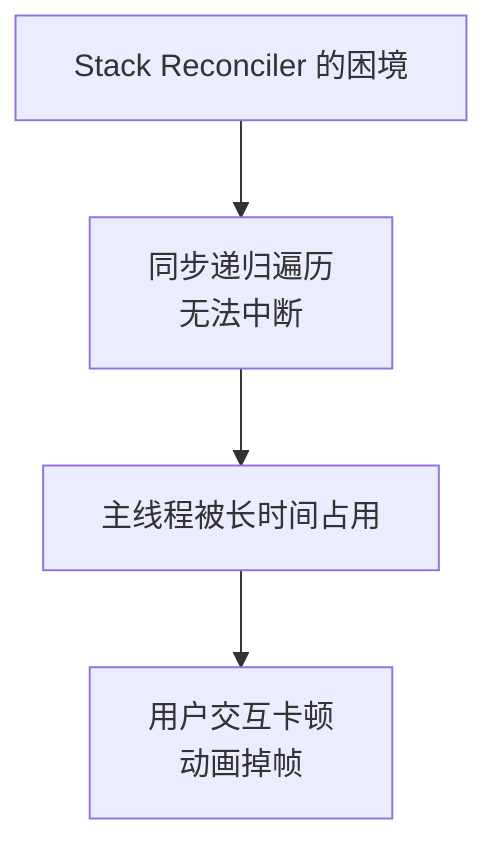
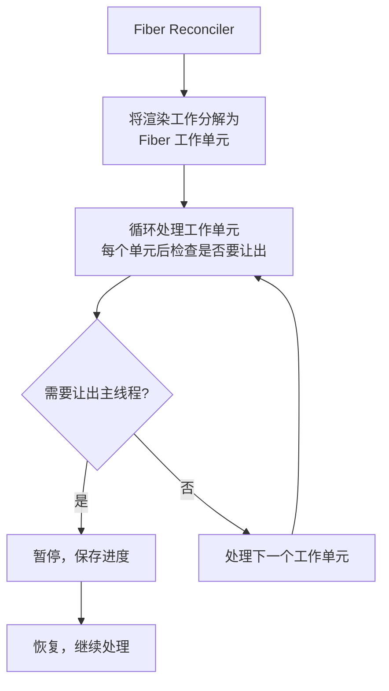
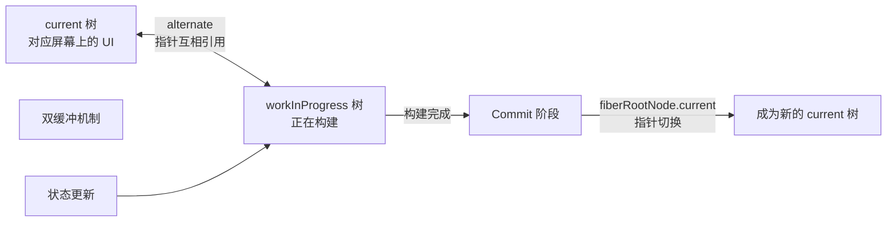
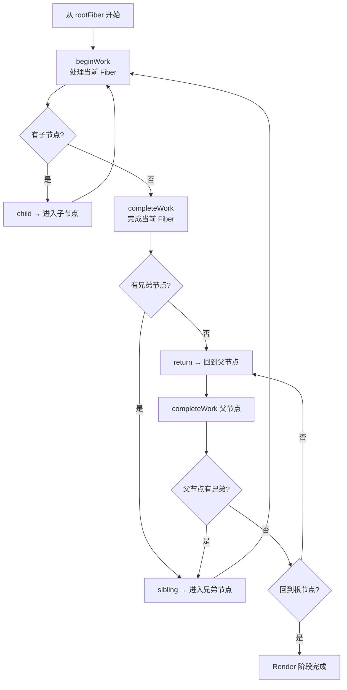

# Fiber 架构：可中断的协调引擎

## 1. 什么是 Fiber？

Fiber 是 React 16 引入的全新协调引擎，是 React 核心架构的基石。它不是一个新概念或 API，而是**对 React 运行时的一次彻底重写**。

Fiber 的核心目标是：

- **可中断的渲染**：将渲染工作分解为小单元，可以暂停和恢复。
- **优先级调度**：为不同类型的更新分配优先级，高优先级更新可以打断低优先级更新。
- **并发渲染**：让 React 能够在后台准备 UI 而不阻塞主线程。

## 2. 为什么需要 Fiber？

### 2.1 React 15 的 Stack Reconciler 问题

在 React 15 及之前，协调器使用**递归**遍历虚拟 DOM 树，称为 Stack Reconciler：

```
问题：
- 递归调用无法中断，一旦开始就必须同步执行完整个树的协调
- 当组件树很深时，JS 引擎会长时间占用主线程
- 浏览器无法在此期间处理用户输入、动画帧、布局计算
- 表现为：页面卡顿、动画掉帧、输入延迟
```



### 2.2 Fiber 的解决方案

Fiber 将被动的递归调用转变为**主动的循环遍历**：



## 3. Fiber 节点的数据结构

每个 React Element 在 Fiber 架构中都有一个对应的 Fiber 节点：

```javascript
// Fiber 节点的核心结构（简化版）
type Fiber = {
  // === 节点标识 ===
  tag: WorkTag,          // 节点类型：FunctionComponent(0)、ClassComponent(1)、
                          // HostComponent(5 原生DOM)、HostText(6 文本) 等
  type: any,             // 函数组件本身 / 原生元素的标签字符串 'div'
  key: null | string,    // 列表 diff 的 key

  // === 树结构（链表） ===
  return: Fiber | null,  // 父 Fiber（处理完当前节点后返回的位置）
  child: Fiber | null,   // 第一个子 Fiber
  sibling: Fiber | null, // 下一个兄弟 Fiber

  // === 工作信息 ===
  pendingProps: any,     // 新的 props（待处理的输入）
  memoizedProps: any,    // 已生效的 props（上次渲染的输出）
  memoizedState: any,    // Hooks 链表头部 / Class 组件的 state

  // === 副作用 ===
  flags: Flags,          // 副作用标记（Placement、Update、Deletion 等）
  subtreeFlags: Flags,   // 子树中的副作用标记（用于快速跳过干净子树）
  deletions: Array<Fiber> | null, // 待删除的子节点

  // === 调度 ===
  lanes: Lanes,          // 自身更新的优先级
  childLanes: Lanes,     // 子树中存在的更新优先级

  // === 双缓冲 ===
  alternate: Fiber | null, // 指向另一棵树中对应的 Fiber

  // === 渲染输出 ===
  stateNode: any,        // 对应的真实 DOM 节点（HostComponent）或组件实例
}
```

### 3.1 链表树结构

Fiber 放弃了传统的"children 数组"树结构，改用 **"第一个子节点 + 兄弟节点"链表**：

```javascript
// 传统的树
//   A
//  / \
// B   C

// Fiber 的链表结构：
// A.child → B
// B.sibling → C
// B.return → A
// C.return → A
```

这种结构使得 `while` 循环可以深度优先遍历整棵树，且**随时可以中断**。

## 4. 双缓冲（Double Buffering）

React 维护两棵 Fiber 树：

| 树                 | 角色                     | 说明                         |
| ------------------ | ------------------------ | ---------------------------- |
| **current**        | 当前屏幕上显示的 UI 对应 | 稳定状态，不可修改           |
| **workInProgress** | 正在构建的新 UI          | 构建过程中可修改，完成后切换 |



工作流程：

1. 状态更新触发，创建 `workInProgress` 树。
2. 在 `workInProgress` 树上进行协调（diffing）。
3. 每个 `workInProgress` Fiber 通过 `alternate` 引用 `current` 树中对应的旧 Fiber。
4. Commit 阶段完成后，`root.current` 指针切换到 `workInProgress`，它成为新的 `current` 树。
5. 旧的 `current` 树变成下一次更新的 `workInProgress` 树。

**双缓冲的优势**：

- 构建过程中不影响当前屏幕上的 UI。
- 回收 Fiber 节点（不销毁重建），减少 GC 压力。
- 支持更新的中断和恢复。

## 5. 渲染的两个阶段

### 5.1 Render 阶段（可中断）

Render 阶段的目标是**构建 Fiber 树并标记副作用**：

```
beginWork(fiber):
  1. 根据 fiber.tag 进入不同的处理逻辑
  2. 对比新旧 props/state，判断是否可以 bailout
  3. 不可 bailout 时，执行组件函数 / render，获取新的子元素
  4. 调用 reconcileChildren 对比新旧子元素
  5. 将副作用标记设置到 fiber.flags 上
```

```
completeWork(fiber):
  1. 创建或更新对应的 DOM 节点
  2. 将子节点的副作用向上冒泡到 fiber.subtreeFlags
  3. 在 Fiber 上累积 `flags` 与 `subtreeFlags`
```

Render 阶段的工作是**纯计算**，不产生任何用户可见的 DOM 变更，因此可以被中断。

### 5.2 Commit 阶段（不可中断）

Commit 阶段将 Render 阶段计算出的变更应用到 DOM：

```
commitRoot(root):
  commitBeforeMutationEffects()  // 执行 getSnapshotBeforeUpdate
  commitMutationEffects()        // 执行 DOM 变更（增删改）
  commitLayoutEffects()          // 执行 useLayoutEffect
  requestPaint()                 // 浏览器绘制
  commitPassiveEffects()         // 执行 useEffect（异步，不阻塞绘制）
```

Commit 阶段是**同步不可中断的**，保证 UI 状态的一致性。

## 6. Scheduler：任务调度器

Scheduler 是 Fiber 架构的重要组成部分，负责按优先级调度工作：

### 6.1 优先级类型

```
ImmediatePriority  (1)   // 立即执行（如点击事件同步更新）
UserBlockingPriority (2)  // 用户交互（如输入、拖拽）
NormalPriority (3)        // 默认优先级（如数据请求后的更新）
LowPriority (4)           // 低优先级（如分析上报）
IdlePriority (5)          // 空闲时执行（如离线计算）
```

### 6.2 时间切片（Time Slicing）

Scheduler 将每个优先级对应一个时间切片长度（如 5ms）。当一个时间切片用尽时，React 会暂停当前工作并让出主线程：

```javascript
// Scheduler 的核心循环（简化）
function workLoop(deadline) {
  let shouldYield = false

  while (nextUnitOfWork && !shouldYield) {
    nextUnitOfWork = performUnitOfWork(nextUnitOfWork)
    shouldYield = deadline.timeRemaining() < 1 // 时间不足 1ms 时暂停
  }

  if (!nextUnitOfWork) {
    // 所有工作完成
    commitRoot()
  } else {
    // 还有工作未完成，请求下一次调度
    requestIdleCallback(workLoop) // 或用 MessageChannel 模拟
  }
}
```

### 6.3 Lane 模型

React 18 使用 Lane（车道）模型表示更新优先级：

```javascript
// 使用二进制位表示不同的更新优先级
const TotalLanes = 31
const NoLanes = 0b0000000000000000000000000000000
const SyncLane = 0b0000000000000000000000000000001
const InputLane = 0b0000000000000000000000000000100
const DefaultLane = 0b0000000000000000000000000100000
```

- 一个 Fiber 可能同时有多个不同优先级的更新。
- 高优先级的 lane 会打断低优先级的 lane。
- 被打断的低优先级更新会在高优先级完成后恢复。

## 7. Fiber 的遍历过程



## 8. Fiber 架构带来的能力

| 能力            | 说明                                                     |
| --------------- | -------------------------------------------------------- |
| **可中断渲染**  | 渲染过程可暂停让出主线程，保证 UI 持续响应               |
| **优先级调度**  | 用户交互高于数据更新，避免输入卡顿                       |
| **并发渲染**    | 后台准备多版本的 UI，按需提交                            |
| **Suspense**    | 组件可以在数据未就绪时"挂起"，等数据到达后再继续渲染     |
| **Transitions** | 将更新标记为非紧急，在后台处理，保持当前 UI 可交互       |
| **Offscreen**   | 隐藏的 UI 可以在后台以低优先级准备，不阻塞可见区域的渲染 |

## 9. 总结

- **Fiber 不是新 API，而是 React 运行时架构的一次根本性升级**。
- **核心目标是可中断的异步渲染**：将同步递归遍历变为可暂停的循环。
- **链表树结构**（child/sibling/return）是实现可中断遍历的数据基础。
- **双缓冲机制**（current/alternate）保证了 UI 一致性和内存复用。
- **两阶段渲染**：Render（可中断，纯计算）+ Commit（不可中断，应用 DOM 变更）。
- **优先级调度**：通过 Scheduler + Lane 模型实现更新的优先级管理。
- **Fiber 是并发渲染、Suspense 和可中断 Render 等高级特性的基础**。
