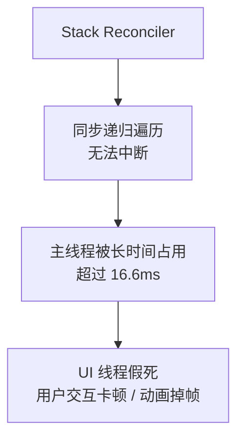
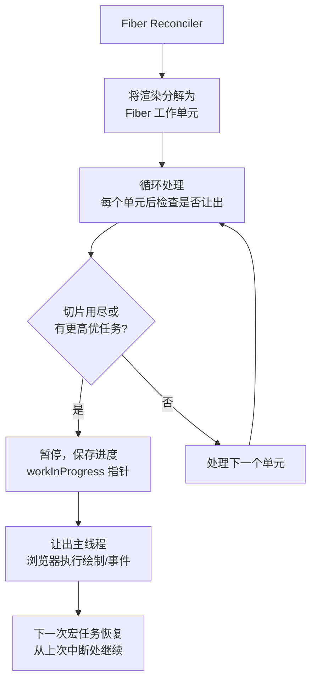
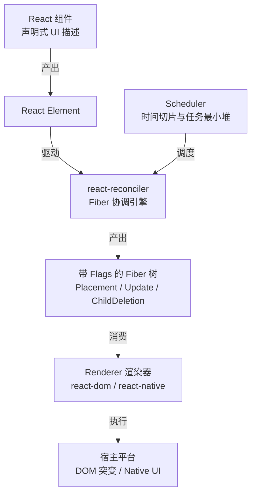
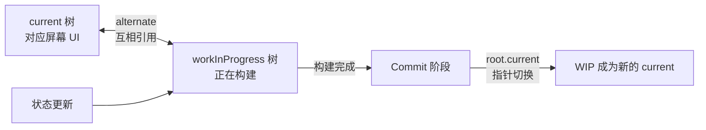
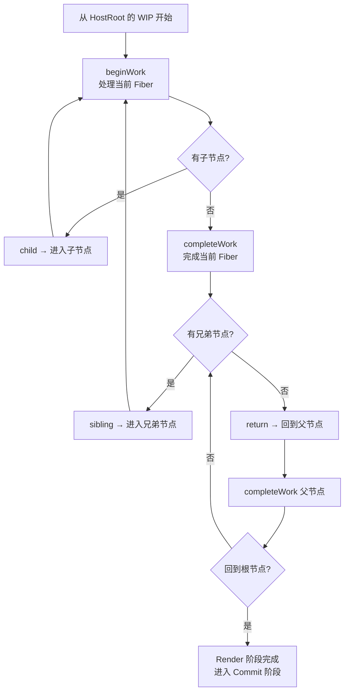

# Fiber 架构：可中断的协调引擎

## 1. 什么是 Fiber？

Fiber 是 React 16 引入的全新协调引擎，是 **对 React 运行时的一次彻底重写**。它不是一个面向开发者的 API，而是 React 内部的架构基石。在宏观架构对比上，如果说 Vue 3 采用的是“**响应式收集 + 细粒度更新**”的推模型（Push），那么 React Fiber 则是极致的“**顶层 Diff + 时间切片**”的拉模型（Pull）。

### 1.1 核心目标

- **可中断的渲染**：将渲染工作分解为小单元，可以随时暂停和恢复，将控制权交还给浏览器。
- **优先级调度**：为不同类型的更新分配优先级，高优先级更新（如用户输入）可以打断低优先级更新（如数据请求回调）。
- **并发渲染**：让 React 能够在内存中后台准备多套 UI 而不阻塞主线程。

### 1.2 含义

| 含义           | 说明                                                                                 |
| -------------- | ------------------------------------------------------------------------------------ |
| **Fiber 节点** | 构成 Fiber 树的基本数据单元（`FiberNode` 类的实例），每个 React Element 对应一个节点 |
| **Fiber 树**   | 由 Fiber 节点通过单向链表指针连接构成的运行时多叉树结构                              |
| **Fiber 架构** | 以可中断工作循环为核心的整套运行时设计                                               |

## 2. 为什么需要 Fiber？

### 2.1 Stack Reconciler 困境

在 React 15 及之前，协调器使用**原生调用栈递归**遍历虚拟 DOM 树，称为 Stack Reconciler：

- 递归调用依赖于 JS 引擎的原生调用栈，**一旦开始就无法中断**。
- 浏览器的渲染帧通常为 16.6ms（60FPS）。当组件树很深时，深层递归会长时间霸占主线程。
- 浏览器无法在此期间处理用户输入、动画帧（`requestAnimationFrame`）、布局计算和样式重绘。
- **表现为**：页面卡顿、动画掉帧、输入框输入延迟（Jank）。



### 2.2 Fiber 的解决思路

Fiber 的核心理念是：**在用户态重新实现一套调用栈**——用可挂起、可恢复的链表循环，取代不可中断的原生递归。

- 将庞大的渲染工作分解为**工作单元（Unit of Work）**，每个 Fiber 节点就是一个工作单元。
- 使用 `while` 循环处理工作单元，每个单元完成后**检查剩余时间**。
- 时间不足时**暂停并保存进度**（保留 `workInProgress` 游标指针），利用宏任务让出主线程，让浏览器有机会渲染。
- 有更高优先级任务插队时，**安全地丢弃当前进度**，重新基于稳定的 `current` 树处理。



### 2.3 与 Stack Reconciler 的本质区别

| 维度           | Stack Reconciler（React 15）                 | Fiber Reconciler（React 16+）                |
| -------------- | -------------------------------------------- | -------------------------------------------- |
| **遍历方式**   | 递归调用（引擎原生调用栈）                   | `while` 循环 + 链表指针模拟栈                |
| **可中断性**   | 不可中断                                     | 可随时在任意工作单元边界中断和恢复           |
| **上下文存储** | 封闭在原生栈帧中（不可序列化、无法强行丢弃） | Fiber 堆对象（可随时读取、序列化、丢弃重来） |
| **优先级感知** | 无（众生平等，先到先得）                     | 引入 31 位 Lane 位运算模型，支持多优先级抢占 |
| **并发模式**   | 不支持                                       | 支持（Concurrent React 的基础）              |

## 3. Fiber 在 React 架构中的位置

Fiber 是 React 三大核心模块（调度器、协调器、渲染器）的交汇点：



- **向上**：接收组件的 Element 产物，将其作为构建或更新 Fiber 树的不可变蓝图。
- **向左**：受 Scheduler 独立包的调度控制，按时间切片和优先级执行工作循环。
- **向右**：将计算出的副作用（Flags）交给平台无关的 Renderer，实现跨平台渲染。

## 4. Fiber 节点的设计

### 4.1 概述

每个 React Element 在协调过程中都有一个对应的 Fiber 节点。Fiber 节点同时承担了**虚拟 DOM**、**工作单元**和**状态机**三重角色。

### 4.2 链表树结构

Fiber 放弃了传统的 `children: []` 数组，改用 **"第一个子节点 + 兄弟节点 + 父节点"三指针链表**：

:::code-group

```markdown [Fiber节点]
// Fiber 的三个核心拓扑指针
child → 第一个子 Fiber（向下深入）
sibling → 下一个兄弟 Fiber（向右平级遍历）
return → 父 Fiber（向上回溯）
```

```markdown [Fiber树结构]
// 组件树
// A
// / \
// B C
// / \
// D E

// 对应的 Fiber 链表关系
A.child → B
B.return → A B.sibling → C
C.return → A
B.child → D
D.return → B D.sibling → E
E.return → B
```

:::

这种结构是 Fiber 架构**最重要的设计决策之一**：

- `while` 循环可以按深度优先遍历整棵树，且在任何节点都可以安全中断。
- 不需要调用栈来保存遍历位置——`return` 指针本身就是"**回溯路径**"。
- 相比原生递归，节点处理完成后 GC 不再依赖栈帧弹出。

### 4.3 节点 + 状态机

Fiber 节点不仅仅代表一个 UI 节点，它同时是一个**持久化的状态机**：

```markdown
Fiber.memoizedState → Hooks 链表头部（FunctionComponent）
→ 组件 state（ClassComponent）

Fiber.memoizedProps → 上一次渲染生效的 props
Fiber.pendingProps → 本次渲染待处理的 props
Fiber.updateQueue → 待处理的更新队列（环形链表）

Fiber.lanes → 当前节点上的更新优先级
Fiber.childLanes → 子树中的更新优先级（用于快速判定子树是否有工作）
```

关键认知：**Fiber 的生命周期跨越多次渲染**。每次渲染不会销毁重建 Fiber，而是复用并更新其字段。这使得：

- Hooks 状态在多次渲染之间保持。
- `alternate` 双缓冲成为可能（复用 Fiber 对象，减少 GC 压力）。
- 被打断的渲染可以安全丢弃——`current` 树上的 Fiber 保持完整。

## 5. 双缓冲（Double Buffering）

### 5.1 两棵树的角色

React 借鉴了图形渲染领域的“**双缓冲**”技术，在内存中同时维护两棵 Fiber 树，它们通过 Fiber 节点上的 `alternate`（替身）指针互相关联：

| 树                 | 角色                  | 特点                                     |
| ------------------ | --------------------- | ---------------------------------------- |
| **current**        | 屏幕上当前 UI 的映射  | 稳定状态，绝对不可修改。                 |
| **workInProgress** | 正在内存中构建的新 UI | 草稿状态，随时可修改、丢弃，完成后登基。 |



### 5.2 极致的内存复用策略

React 极力避免在每次更新时创建成千上万个新的 Fiber 对象（这会导致严重的 GC 抖动）。当状态更新触发时：

- 状态更新触发，React 基于 `current` 树创建 `workInProgress` 树。
- 它会检查 `current.alternate` 是否存在。
- **如果不存在**（首次更新）：创建一个全新的 Fiber 节点，并将两者的 `alternate` 互相指向对方。
- **如果存在**（后续更新）：**直接复用**这个 alternate 对象，仅重置其身上的 `flags`、`pendingProps` 等属性，作为本次的 WIP 节点,在 workInProgress 树上执行协调（`diffing`），计算变更
- Commit 阶段完成后，全局对象 `FiberRootNode` 的 `current` 指针切换到`workInProgress`树，`workInProgress` 树瞬间成为新的 `current` 树，旧树则沦为下一次更新的复用池。

### 5.3 FiberRootNode 与 HostRootFiber

理解双缓冲，必须厘清“**应用大管家**”与“**组件树顶点**”的区别：

:::code-group

```javascript [根节点结构]
// 应用的根节点结构
type FiberRootNode = {
  current: Fiber,         // 指向 current 树的根 Fiber（HostRoot）
  containerInfo: Element, // 真实的 DOM 容器（如 #root）
  // ... 调度状态
}

// Fiber 树的根节点（tag = HostRoot = 3）
// rootFiber.stateNode → FiberRootNode
// FiberRootNode.current → rootFiber
```

```markdown [根节点信息]
FiberRootNode（全局唯一）
├── current ──→ current 树的根 Fiber（HostRoot）
│ ├── child → App
│ ├── stateNode → FiberRootNode（指回）
│ └── alternate → workInProgress 树的根 Fiber
│
└── 调度信息（pendingLanes、expirationTimes 等）
```

:::

`FiberRootNode` 是**全局唯一的容器根**（由 `createRoot(container)` 创建），它的 `current` 指针指向当前生效的 Fiber 树。而 Fiber 树的根节点 `HostRoot` 的 `stateNode` 则指回 `FiberRootNode`。

## 6. 工作循环

### 6.1 遍历过程与方向

Fiber 的遍历采用的是深度优先搜索（DFS），分为"**递**"（`beginWork`）和"**归**"（`completeWork`）两个严格的阶段：



| 阶段             | 方向       | 核心工作                                                                                                                                         |
| ---------------- | ---------- | ------------------------------------------------------------------------------------------------------------------------------------------------ |
| **beginWork**    | 向下（递） | 执行组件函数获取子 Element；通过 Diff 算法决定复用还是新建子 Fiber；打上 `Placement` / `Update` 标记；**判断是否可以 Bailout（直接跳过子树）**。 |
| **completeWork** | 向上（归） | 在内存中创建/更新对应宿主的真实 DOM 节点；将子树的 `flags` 向上冒泡到父节点的 `subtreeFlags` 中。                                                |

### 6.2 可中断性的底层机制

React 的并发循环核心由一个简单的 `while` 循环控制：

```javascript
// React 源码中的并发工作循环
function workLoopConcurrent() {
  // 当还有任务，且调度器没有要求让出主线程时
  while (workInProgress !== null && !shouldYieldToRenderer()) {
    workInProgress = performUnitOfWork(workInProgress)
  }
}
```

- **`workInProgress` 指针**：一个全局变量，永远指向当前正在处理的 Fiber。
- **`shouldYieldToRenderer`**：基于时间切片。调度器通常给每个宏任务分配 **5ms** 的时间（基于 `performance.now()` 计算）。时间耗尽则返回 `true`，打破循环。
- **中断恢复**：循环被打破后，`workInProgress` 依然保留着当前的节点引用。当下一个宏任务（通过 `MessageChannel` 发起）被浏览器调度时，直接从这个指针继续 `performUnitOfWork`，实现了无缝恢复。

## 7. 副作用标记与子树跳过

在 Fiber 架构中，UI 的变更不再是边算边改，而是先通过 Diff 计算出副作用（Flags），将其附加到 Fiber 节点上，最后在不可中断的 Commit 阶段统一执行。

### 7.1 flags 与 subtreeFlags 的配合

```javascript
fiber.flags // 当前节点自身的突变要求（如：插入DOM、更新属性）
fiber.subtreeFlags // 极其重要：当前节点所有后代节点的副作用合集（按位或运算合并）
```

这两个字段配合的核心价值在于：**在 Commit 阶段，快速跨越没有任何更新的层级**。

```markdown
          rootFiber (subtreeFlags = Placement)
          /
    ChildA (flags = 0, subtreeFlags = 0)  <-- 完全干净的子树
    /      \

ChildB ChildC
(flags=0) (flags=0)
```

由于 `ChildA.subtreeFlags === 0`，Commit 阶段的遍历会直接**整树跳过** `ChildA`，不作任何深层递归，极大地提升了更新性能。

### 7.2 副作用冒泡

在 `completeWork` 阶段，子节点的 `flags` 和 `subtreeFlags` 向上冒泡合并：

```javascript
// bubbleProperties 的核心逻辑
function bubbleProperties(completedWork) {
  let subtreeFlags = NoFlags
  let child = completedWork.child
  while (child !== null) {
    subtreeFlags |= child.flags // 合并子节点自身副作用
    subtreeFlags |= child.subtreeFlags // 合并子节点的子树副作用
    child = child.sibling
  }
  completedWork.subtreeFlags = subtreeFlags
}
```

这样 Commit 阶段只需从根节点开始，检查 `subtreeFlags` 即可决定是否深入子树。

## 8. 调度与优先级集成

Fiber 架构不是孤立存在的，它必须依赖 `scheduler` 提供的时间切片和任务调度能力。

- **Lane 模型**：React 将不同场景产生的更新（用户点击、网络请求回调、Transitions）映射为 31 位的二进制 Lane（如 `SyncLane` 优先级最高）。通过**按位与/或**（`&`、`|`）运算，React 能在极低开销下判断当前 Fiber 树中是否存在需要立刻打断当前工作的更高优更新。
- **Min-Heap (最小堆)**：在 `scheduler` 内部，所有的任务被推入一个基于最小堆结构维护的队列中，堆顶始终是 `expirationTime`（过期时间）最小、最紧急的任务。
- **宏任务调度**：当 React 需要把控制权还给浏览器去渲染当前帧时，它会利用 `MessageChannel` 发送一个消息（在不支持的降级环境使用 `setTimeout`），这会在浏览器的下一个 Event Loop 中产生一个宏任务，继续执行堆顶剩余的 Fiber 工作。

## 9. Fiber 架构赋予的能力

Fiber 是一切并发特性的基石。没有 Fiber 构建的可中断底层引擎，以下所有 React 现代特性都不可能实现：

| 能力                              | 机制说明                                                                                                                                  |
| --------------------------------- | ----------------------------------------------------------------------------------------------------------------------------------------- |
| **并发渲染 (Concurrent Mode)**    | 允许同时存在多棵不同优先级的 `workInProgress` 树，在内存中并行博弈。                                                                      |
| **Transitions (`useTransition`)** | 将更新标记为低优的 `TransitionLane`，并在后台缓慢处理，保持当前页面的输入框完全无卡顿。                                                   |
| **Suspense**                      | 当遇到未准备好的数据（如通过 `throw Promise`），Fiber 可以挂起当前节点的渲染，转而渲染最近的 fallback 边界，并在 Promise resolve 后恢复。 |
| **自动批处理 (Auto Batching)**    | 在 React 18 中，由于 Lane 模型的统一，所有环境（`setTimeout`、原生事件）下的多次 `setState` 都会被自动合并为一次 Render。                 |
| **Offscreen (Activity)**          | 允许将某些 UI 隐藏但保留其 Fiber 状态（如路由切换时的组件保活），以极低的优先级在后台预渲染它们。                                         |

## 10. 总结

- **Fiber 是一次运行时引擎的重构**：它将不可控的 JS 引擎栈，降维成了用户态可完全掌控的 `while` 循环状态机。
- **三指针链表是破局关键**：`child` / `sibling` / `return` 让遍历路径本身成为了断点恢复的信息，无需额外存储调用栈。
- **双缓冲 (`current` / `workInProgress` + `alternate`)** 保证了 UI 的一致性、实现了极低开销的内存复用，并且是并发模式下打断、废弃、重试的安全保障。
- **副作用隔离与冒泡 (`flags` + `subtreeFlags`)** 将计算和突变严格分离，使得 Commit 阶段的真实 DOM 手术快如闪电。
- **Scheduler + MessageChannel + Min-Heap** 构筑了微秒级的时间切片防线，彻底告别了 16.6ms 掉帧的黑暗时代。
- **Fiber 是并发 React 的基石**：Suspense、Transitions、Offscreen、选择性水合等高级特性均为 Fiber 架构能力的延伸。
