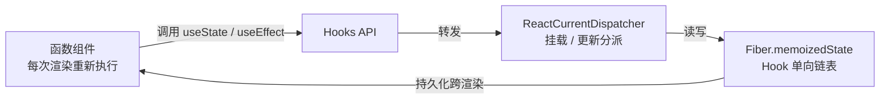
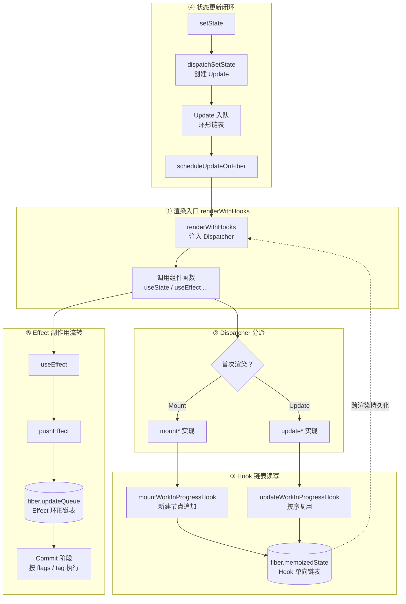

# Hooks 原理

## 1. 为什么需要 Hooks？

在 Hooks 出现之前（React < 16.8），React 用 Class 组件管理状态和副作用。随着应用复杂度增长，Class 组件暴露出一系列痛点：

### 1.1 Class 组件的痛点

| 痛点                | 说明                                                                                |
| ------------------- | ----------------------------------------------------------------------------------- |
| **逻辑复用困难**    | HOC 和 Render Props 导致"**嵌套地狱**"（wrapper hell），且类型推导困难              |
| **生命周期臃肿**    | 同一逻辑分散在 `componentDidMount`、`componentDidUpdate`、`componentWillUnmount` 中 |
| **心智负担重**      | `this` 绑定、JavaScript Class 语义、构造函数、继承                                  |
| **TypeScript 复杂** | 高阶组件的类型写起来极为复杂                                                        |

### 1.2 Hooks 的设计目标

Hooks 的设计目标是**让函数组件拥有状态和副作用能力**，同时保持函数的简洁性：

- **逻辑复用**：通过自定义 Hooks 抽取和复用状态逻辑。
- **关注点分离**：相关逻辑聚合在一起，而非分散在生命周期中。
- **简化心智模型**：去除 `this`，放弃 Class 和继承。
- **更好的类型推导**：函数 + TypeScript 天然契合。
- **并发模式友好**：每次渲染都是独立的函数调用，不存在跨渲染的状态污染。

### 1.3 架构上的本质问题

函数组件只是一个纯函数——**每次渲染它都会被重新调用，函数执行完，局部变量就销毁了**。那状态是如何跨越渲染周期存活下来的？

答案藏在 React 的架构里：函数组件本身不保存任何状态，**真正的状态被"外包"到了组件对应的 Fiber 节点上**。Hooks 只是这套"**闭包状态引擎**"的 API 入口，它把"**看起来是局部变量**"的状态，实际持久化到了 `fiber.memoizedState` 链表上：



Hooks 内部原理的核心：**Hooks 的"魔法"不是语言特性，而是把状态挂在外部 Fiber 节点上的一个约定**。

## 2. 全景图：Hooks 运行全流程



## 3. Hooks 的运行时载体：Hook 链表

### 3.1 Hook 对象的结构

每个 Hooks 调用（`useState`、`useEffect`、`useRef`……）在首次渲染时都会实例化一个 **Hook 对象**，并追加到当前 Fiber 的 `memoizedState` 单向链表上。Hook 对象是这一套机制的基本数据单元：

:::code-group

```typescript [react-reconciler/src/ReactFiberHooks.js]
// Hook 对象（最新源码，极简；React 用 Flow，此处以 TypeScript 呈现）
type Hook = {
  memoizedState: any // 当前 Hook 保存的"状态"（语义随 Hook 类型而异）
  baseState: any // 基础状态：低优先级更新被跳过前的状态快照
  baseQueue: Update<any, any> | null // 基础更新队列：沉淀被跳过的低优先级 Update
  queue: any // 更新队列（useState 的 UpdateQueue / useEffect 的 null）
  next: Hook | null // 指向下一个 Hook，构成单向链表
}
```

```typescript [react-reconciler/src/ReactFiberHooks.js]
// Hook 的 Update 对象：baseQueue 的元素，useState/useReducer 共用
type Update<S, A> = {
  lane: Lane // 本次更新的优先级 Lane（见 ReactFiberLane.js）
  action: A // 新值 或 更新函数 ((prev) => next)
  hasEagerState: boolean // 是否已提前算出新 state（eagerState 优化）
  eagerState: S | null // 提前算好的结果
  next: Update<S, A> | null // 环形链表下一节点
}
```

:::

> [!NOTE]
> `memoizedState` 的语义**因 Hook 类型而异**：`useState` 存的是当前 state 值，`useEffect` 存的是 Effect 对象（`{ tag, create, destroy, deps, next }`），`useMemo`/`useCallback` 存的是 `[value, deps]` 二元组，`useRef` 存的是 `{ current }` 对象。这是理解 Hooks 实现的关键——链表节点是统一的，但节点内部承载的内容各不相同。

### 3.2 单向链表结构

```javascript
// 一个组件调用 3 个 Hooks 后，Fiber.memoizedState 的结构
fiber.memoizedState = {
  // 第一个 useState(0)
  memoizedState: 0,
  baseState: 0,
  queue: updateQueue1,
  next: {
    // 第二个 useState('')
    memoizedState: '',
    baseState: '',
    queue: updateQueue2,
    next: {
      // useEffect
      memoizedState: { tag, create, destroy, deps, next: ... },
      next: null,
    },
  },
}
```

每个 Hook 只通过 `next` 指向后一个，构成**单向链表**。链表的头部（`fiber.memoizedState`）即组件第一次调用的 Hook。

> [!NOTE]
> Fiber 的 `memoizedState` 字段对**函数组件**和 **Class 组件**含义不同：函数组件挂的是 Hooks 链表头，Class 组件挂的是 `this.state` 对象。

### 3.3 Hook 的副作用标记

除了状态本身，`useEffect`/`useLayoutEffect`/`useInsertionEffect` 还需要被 Commit 阶段识别和执行。React 用**位标记**在两层记录：

| 层              | 标记            | 含义                               |
| --------------- | --------------- | ---------------------------------- |
| **HookFlags**   | `HasEffect`     | 本 Effect 需要执行（依赖变了）     |
|                 | `Passive`       | `useEffect`（被动，绘制后异步）    |
|                 | `Layout`        | `useLayoutEffect`（布局，绘制前）  |
|                 | `Insertion`     | `useInsertionEffect`（DOM 变更前） |
| **Fiber.flags** | `PassiveEffect` | 该 Fiber 有需要异步执行的 Effect   |
|                 | `UpdateEffect`  | 该 Fiber 有需要同步执行的 Effect   |

Commit 阶段正是通过 `fiber.flags` 和 Effect 对象上的 `tag`，把 Effect 分流到正确的子阶段执行。详见 [Effects 副作用处理机制](./effects.md)。

## 4. Dispatcher：Hooks 的分发层

### 4.1 为什么需要 Dispatcher

一个关键问题是：**同一个 `useState` 调用，在首次渲染（Mount）和后续渲染（Update）走的是完全不同的代码路径**。React 如何做到"**同样的 API、不同的实现**"？

答案是 **Dispatcher（分派器）**。`react` 包里的 `useState` 只是一个"**空壳**"，真正的实现通过全局的 `ReactCurrentDispatcher.current` 动态注入：

:::code-group

```javascript [packages/react/src/ReactHooks.js]
// useState 的"空壳"（react 包，不含真实逻辑）
export function useState(initialState) {
  const dispatcher = resolveDispatcher()
  return dispatcher.useState(initialState) // 转发给当前 dispatcher
}

function resolveDispatcher() {
  const dispatcher = ReactCurrentDispatcher.current
  // 在组件外调用 Hooks 会命中这个报错："Invalid hook call"
  if (dispatcher === null) {
    throw new Error('Invalid hook call.')
  }
  return dispatcher
}
```

```javascript [packages/react/src/ReactCurrentDispatcher.js]
// 全局 dispatcher 单例：由 reconciler 在渲染时注入具体实现
const ReactCurrentDispatcher = {
  current: null, // renderWithHooks 里被赋值为 HooksDispatcherOnMount / OnUpdate
}
```

:::

> [!NOTE]
> `react` 包只负责定义 API 和 Element 数据模型，**不包含任何渲染逻辑**。真正的 Hooks 实现在 `react-reconciler` 的 `ReactFiberHooks.js` 中，通过 `ReactCurrentDispatcher.current` 按渲染阶段动态注入。这也是为什么 Hooks 必须**在组件内部调用**——组件函数执行时 dispatcher 才被设置，脱离渲染上下文就报错。

### 4.2 Mount 与 Update 两套 Dispatcher

`ReactFiberHooks.js` 维护了多套 dispatcher，最核心的两套是：

:::code-group

```javascript [packages/react-reconciler/src/ReactFiberHooks.js]
// 挂载 / 更新两套 dispatcher（最新源码，极简）
const HooksDispatcherOnMount = {
  useState: mountState,
  useReducer: mountReducer,
  useEffect: mountEffect,
  useLayoutEffect: mountLayoutEffect,
  useInsertionEffect: mountInsertionEffect,
  useMemo: mountMemo,
  useCallback: mountCallback,
  useRef: mountRef,
  useContext: readContext,
  // ...
}

const HooksDispatcherOnUpdate = {
  useState: updateState,
  useReducer: updateReducer,
  useEffect: updateEffect,
  useLayoutEffect: updateLayoutEffect,
  useInsertionEffect: updateInsertionEffect,
  useMemo: updateMemo,
  useCallback: updateCallback,
  useRef: updateRef,
  useContext: readContext, // Context 的读取不区分挂载/更新
  // ...
}
```

:::

命名规律一目了然：**每个 Hook 都有 `mount*` 和 `update*` 两个版本**。`mount*` 负责"新建 Hook 并写入链表"，`update*` 负责"按顺序取出已有 Hook 并读取/更新状态"。

### 4.3 renderWithHooks：切换 dispatcher 的入口

真正切换 dispatcher 的是 `renderWithHooks`——它是函数组件渲染的统一入口：

:::code-group

```javascript [react-reconciler/src/ReactFiberHooks.js]
// 模块级"游标"：Hooks 链表的全局指针（renderWithHooks 执行期间有效）
let currentlyRenderingFiber = null // 当前正在渲染的函数组件 Fiber
let currentHook = null // current 树（旧）上当前取到的 Hook
let workInProgressHook = null // workInProgress 树（新）上当前链表尾 Hook
// 函数组件渲染的调度入口
export function renderWithHooks(current, workInProgress, Component, props) {
  // 1. 标记当前正在渲染的 Fiber，重置链表游标
  currentlyRenderingFiber = workInProgress
  workInProgress.memoizedState = null
  workInProgress.updateQueue = null

  // 2. 根据是首次挂载还是更新，注入对应的 dispatcher
  ReactCurrentDispatcher.current =
    current === null || current.memoizedState === null
      ? HooksDispatcherOnMount // 首次渲染：走 mount*
      : HooksDispatcherOnUpdate // 后续渲染：走 update*

  // 3. 调用组件函数，函数体内的 useState/useEffect 全部命中当前 dispatcher
  let children = Component(props)

  // 4. 渲染结束，清空上下文（防止组件外误用）
  ReactCurrentDispatcher.current = ContextOnlyDispatcher
  currentlyRenderingFiber = null
  currentHook = null
  workInProgressHook = null

  return children
}
```

```javascript [react-reconciler/src/ReactFiberHooks.js]
// 兜底 dispatcher：组件外调用 Hooks 时命中，所有方法一律抛错
const ContextOnlyDispatcher = {
  useState: throwInvalidHookError,
  useReducer: throwInvalidHookError,
  useEffect: throwInvalidHookError,
  // ... 其余 Hook 同理
}

function throwInvalidHookError() {
  throw new Error(
    'Invalid hook call. Hooks can only be called inside of the body of a function component.',
  )
}
```

:::

判断依据是 `current === null || current.memoizedState === null`：`current` 为 null 说明这是首次挂载（没有旧树），或旧树上还没有 Hooks 链表，两者都走 `mount*` 路径。

## 5. Hook 链表的构建与复用

### 5.1 mountWorkInProgressHook：挂载时建链

首次渲染时，每个 Hooks 调用都会创建一个新 Hook 并追加到链表尾部：

:::code-group

```javascript [packages/react-reconciler/src/ReactFiberHooks.js]
// 挂载阶段创建 Hook 节点（最新源码，极简）
function mountWorkInProgressHook() {
  const hook = {
    memoizedState: null,
    baseState: null,
    baseQueue: null,
    queue: null,
    next: null,
  }

  if (workInProgressHook === null) {
    // 第一个 Hook：作为链表头挂到 Fiber 上
    currentlyRenderingFiber.memoizedState = workInProgressHook = hook
  } else {
    // 后续 Hook：追加到链表尾部
    workInProgressHook = workInProgressHook.next = hook
  }

  return workInProgressHook
}
```

:::

这里用模块级变量 `workInProgressHook` 记住"**当前链表尾**"，每次 `useState`/`useEffect` 调用都往尾部追加一个节点——**这就是 Hooks 顺序敏感性的根源**。

### 5.2 updateWorkInProgressHook：更新时按序复用

后续渲染时，`update*` 版本不再创建新节点，而是**按同样的调用顺序，依次取出旧链表（current 树）上对应位置的 Hook**：

:::code-group

```javascript [packages/react-reconciler/src/ReactFiberHooks.js]
// 更新阶段按序复用 Hook（最新源码，极简）
function updateWorkInProgressHook() {
  let nextCurrentHook = null
  if (currentHook === null) {
    // 第一个 Hook：从 current 树（alternate）取链表头
    const current = currentlyRenderingFiber.alternate
    nextCurrentHook = current !== null ? current.memoizedState : null
  } else {
    // 后续 Hook：取 currentHook 的下一个
    nextCurrentHook = currentHook.next
  }

  let nextWorkInProgressHook = null
  if (workInProgressHook === null) {
    nextWorkInProgressHook = currentlyRenderingFiber.memoizedState
  } else {
    nextWorkInProgressHook = workInProgressHook.next
  }

  if (nextWorkInProgressHook !== null) {
    // 复用：本次渲染被中断过，workInProgress 链表上已有此节点
    workInProgressHook = nextWorkInProgressHook
    nextWorkInProgressHook = workInProgressHook.next
    currentHook = nextCurrentHook
  } else {
    // 新建：从 current 树拷贝当前 Hook 的状态，追加到 workInProgress 链表
    currentHook = nextCurrentHook
    const newHook = {
      memoizedState: currentHook.memoizedState,
      baseState: currentHook.baseState,
      baseQueue: currentHook.baseQueue,
      queue: currentHook.queue,
      next: null,
    }
    if (workInProgressHook === null) {
      currentlyRenderingFiber.memoizedState = workInProgressHook = newHook
    } else {
      workInProgressHook = workInProgressHook.next = newHook
    }
  }
  return workInProgressHook
}
```

:::

关键点：

- `currentHook` 和 `workInProgressHook` 是**同步前进**的游标，分别指向旧树和当前正在构建的树。
- 它**只靠调用顺序**把新旧 Hook 一一对应，没有 name、没有 key、没有索引参与。
- 复用分支处理了**渲染被中断后重入**的场景：如果 workInProgress 链表上已经有节点（上次渲染进行到一半被打断），直接复用而不再新建。

## 6. Hooks 的规则与心智模型

### 6.1 必须在函数组件顶层调用

```jsx
function MyComponent() {
  const [count, setCount] = useState(0) // ✅ 顶层
  const [name, setName] = useState('')

  if (count > 0) {
    useEffect(() => {}, [count]) // ❌ 条件调用，破坏了顺序
  }
}
```

**Hook 的"身份"只由它在链表中的位置决定**。每次渲染，`updateWorkInProgressHook` 靠"**同步前进的游标**"把新旧 Hook 一一对应。如果某次渲染跳过了某个 Hook，后续所有 Hook 都会错位——旧的 `memoizedState` 会被对到错误的 Hook 上，导致状态错乱甚至崩溃。

### 6.2 每次渲染都有自己的 Props 和 State

```jsx
function Counter() {
  const [count, setCount] = useState(0)

  function handleClick() {
    setCount(count + 1) // 点击触发一次渲染，count 前进
    setTimeout(() => {
      console.log(count) // 捕获的是本次渲染的 count 值
    }, 3000)
  }

  return <button onClick={handleClick}>Click: {count}</button>
}
// 快速点击 3 次：count=0/1/2，3s 后分别输出 0/1/2
// 每个 setTimeout 都"记住"了属于自己那一次渲染的 count
```

这是 React Hooks 最重要的心智模型：**每一次渲染都有它自己的 Props 和 State，以及属于自己的 Effect 和其他 Hooks**。它们不是响应式的（不像 Vue 的 `ref`），而是"**快照式**"的。

### 6.3 Effect 是同步声明而非生命周期

```jsx
// ❌ Class 思维：在某个生命周期做某些事
componentDidMount() { /* 挂载时做 A */ }
componentDidUpdate() { /* 更新时做 B */ }
componentWillUnmount() { /* 卸载时做 C */ }

// ✅ Hooks 思维：声明需要同步什么
useEffect(() => {
  const connection = connectToChat(chatRoom)
  return () => connection.disconnect()
}, [chatRoom])
// chatRoom 变化 → 自动清理旧连接、创建新连接
```

**核心区别**：生命周期关注"**何时**"（挂载、更新、卸载），而 Effects 关注"**同步什么**"（让外部系统与当前 props/state 保持同步）。依赖数组是"**本次 Effect 使用了哪些状态**"的声明，而非"**何时触发**"的触发器。

## 7. Hooks 与并发模式

Hooks 的设计天然与并发模式兼容：

- **每个渲染独立**：没有跨渲染的共享状态，React 可以在内存中同时维护多套渲染版本（多棵 workInProgress 树）。
- **Hook 复用支持中断重入**：`updateWorkInProgressHook` 的"**复用分支**"正是为"**渲染被打断后重入**"准备的——链表上已有节点就复用，而不是重复创建。
- **Effect 可推迟**：`useEffect` 的清理和重新执行可以在合适的时机进行（Passive 阶段异步调度），不影响 UI 一致性。
- **State 不可变**：状态更新通过替换而非修改（`basicStateReducer` 直接替换），避免并发修改的竞态问题。
- **优先级可插队**：`updateReducer` 按 Lane 消费更新，低优先级更新被打断后沉淀到 `baseState`/`baseQueue`，等待重放。详见 [更新批处理](./updateBatching.md) 与 [调度与优先级](./schedulingAndLanes.md)。

## 8. 总结

- **状态外包到 Fiber**：组件每次重跑，状态却持久化在 `fiber.memoizedState` 的 Hook 单向链表上。
- **Dispatcher 按阶段分派**：`react` 包只提供空壳，`ReactCurrentDispatcher.current` 在 Mount/Update 间切换 `mount*`/`update*`。
- **顺序即身份**：`mount*` 建链、`update*` 按序复用游标对位——因此 Hooks 必须在顶层按一致顺序调用。
- **节点统一、内容各异**：`useState` 存值、`useEffect` 存 Effect 对象、`useMemo`/`useCallback` 存 `[value, deps]`、`useRef` 存 `{ current }`。
- **Effect 靠环形链表 + 位标记流转**：`pushEffect` 挂进 `fiber.updateQueue`，依赖比较决定是否打 `HasEffect` 标记。
- **每次渲染都是独立快照**，天然契合并发：可中断复用、延迟执行。
