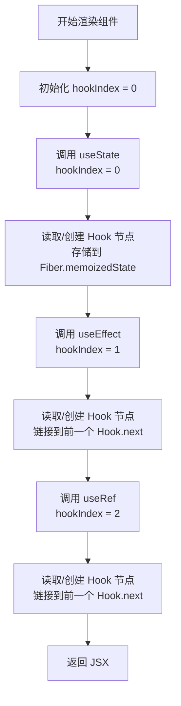

# Hooks 内部实现原理

## 1. 为什么需要 Hooks？

在 Hooks 出现之前（React < 16.8），React 使用 Class 组件管理状态和副作用。随着应用复杂度增长，Class 组件暴露出几个痛点：

### 1.1 Class 组件的痛点

| 痛点                | 说明                                                                                |
| ------------------- | ----------------------------------------------------------------------------------- |
| **逻辑复用困难**    | HOC 和 Render Props 导致"嵌套地狱"（wrapper hell），且类型推导困难                  |
| **生命周期臃肿**    | 同一逻辑分散在 `componentDidMount`、`componentDidUpdate`、`componentWillUnmount` 中 |
| **心智负担重**      | `this` 绑定、JavaScript Class 的语义、构造函数、继承                                |
| **TypeScript 复杂** | 高阶组件的类型写起来极为复杂                                                        |

### 1.2 Hooks 的设计目标

Hooks 的设计目标是**让函数组件拥有状态和副作用能力**，同时保持函数的简洁性：

- **逻辑复用**：通过自定义 Hooks 抽取和复用状态逻辑。
- **关注点分离**：相关逻辑聚合在一起，而非分散在生命周期中。
- **简化心智模型**：去除 `this`，放弃 Class 和继承。
- **更好的类型推导**：函数 + TypeScript 天然契合。
- **并发模式友好**：每次渲染都是独立的函数调用，不存在跨渲染的状态污染。

## 2. Hooks 的核心设计原则

### 2.1 Hooks 必须在函数组件顶层调用

```jsx
// ✅ 正确：顶层调用
function MyComponent() {
  const [count, setCount] = useState(0)
  const [name, setName] = useState('')

  if (count > 0) {
    // ❌ 错误：条件调用
    useEffect(() => {
      /* ... */
    }, [count])
  }

  return <div>...</div>
}
```

**原因**：React 依赖 **Hooks 的调用顺序** 来关联状态。每次渲染时，React 按顺序遍历 Fiber 上的 Hooks 链表。如果某次渲染跳过了某个 Hook，后续 Hook 的索引会全部错位。

```javascript
// Hooks 在 Fiber 中的存储结构（链表）
fiber.memoizedState = {
  // 第一个 useState
  memoizedState: 0,
  queue: updateQueue1,
  next: {
    // 第二个 useState
    memoizedState: '',
    queue: updateQueue2,
    next: {
      // useEffect
      memoizedState: { create, destroy, deps, ... },
      next: null
    }
  }
}
```

### 2.2 每次渲染都有自己的 Props 和 State

```jsx
function Counter() {
  const [count, setCount] = useState(0)

  // 每次渲染，这里的 count 都是一个常量
  // 它不是跨渲染共享的可变值
  function handleClick() {
    setTimeout(() => {
      console.log(count) // 捕获的是本次渲染的 count 值
    }, 3000)
  }

  return <button onClick={handleClick}>Click: {count}</button>
}
// 快速点击 3 次：
// count=0 → click → 3s 后输出 0
// count=1 → click → 3s 后输出 1
// count=2 → click → 3s 后输出 2
// 每个 setTimeout 都"记住"了属于自己那一次渲染的 count
```

这是 React Hooks 中最重要的心智模型：**每一次渲染都有它自己的 Props 和 State，以及属于自己的 Effect 和其他 Hooks**。它们不是响应式的（不像 Vue 的 `ref`），而是"快照式"的。

### 2.3 Effects 同步而非生命周期

```jsx
// ❌ Class 思维：在某个生命周期做某些事
componentDidMount() { /* 挂载时做A */ }
componentDidUpdate() { /* 更新时做B */ }
componentWillUnmount() { /* 卸载时做C */ }

// ✅ Hooks 思维：Effect 声明需要同步什么
useEffect(() => {
  // 声明：需要同步 chatRoom 连接
  const connection = connectToChat(chatRoom)
  return () => connection.disconnect()
}, [chatRoom])
// 当 chatRoom 变化时，React 自动清理旧连接并创建新连接
```

**核心区别**：生命周期关注"何时"（组件挂载时、更新时、卸载时），而 Effects 关注"同步什么"（让外部系统与当前 props/state 保持同步）。

## 3. 核心 Hooks 的设计原理

### 3.1 useState

```javascript
// 简化版 useState 实现原理
let currentFiber = null
let hookIndex = 0

function useState(initialState) {
  return mountState(initialState) // 首次渲染
  // 或
  return updateState() // 后续渲染
}

function mountState(initialState) {
  const hook = {
    memoizedState:
      typeof initialState === 'function' ? initialState() : initialState,
    queue: [], // 更新队列
    next: null,
  }

  // 将 hook 添加到当前 Fiber 的 Hooks 链表
  appendHook(hook, currentFiber)

  const dispatch = action => {
    hook.queue.push(action)
    scheduleUpdate(currentFiber) // 触发重新渲染
  }

  return [hook.memoizedState, dispatch]
}

function updateState() {
  const hook = getCurrentHook() // 按 hookIndex 取当前 Hook
  // 执行更新队列中的所有 action，计算最新状态
  let newState = hook.memoizedState
  for (const action of hook.queue) {
    newState = typeof action === 'function' ? action(newState) : action
  }
  hook.memoizedState = newState
  hook.queue = []

  return [hook.memoizedState, hook.dispatch]
}
```

关键设计：

- **惰性初始化**：`useState(() => expensiveComputation())` 只在首次渲染时执行。
- **函数式更新**：`setState(prev => prev + 1)` 保证基于最新状态计算。
- **批量更新**：React 18 自动批量处理同一事件或 Effect 中的多次 `setState`。

### 3.2 useEffect vs useLayoutEffect

```jsx
// useEffect：异步执行（在浏览器绘制之后）
useEffect(() => {
  // 不阻塞渲染的副作用（数据请求、订阅、日志）
  subscribe()
  return () => unsubscribe()
})

// useLayoutEffect：同步执行（在浏览器绘制之前）
useLayoutEffect(() => {
  // 需要阻塞渲染的副作用（测量 DOM 尺寸、同步调整位置）
  const rect = ref.current.getBoundingClientRect()
  ref.current.style.left = `${rect.width}px`
})
```

执行时序：

```
Render → DOM Commit → useLayoutEffect → 浏览器绘制 → useEffect
                              ↑ 同步，阻塞绘制          ↑ 异步，不阻塞绘制
```

| Hook                 | 执行时机              | 适用场景                           |
| -------------------- | --------------------- | ---------------------------------- |
| `useEffect`          | 浏览器绘制后          | 数据请求、订阅、日志、分析         |
| `useLayoutEffect`    | DOM Commit 后，绘制前 | DOM 测量、同步布局调整、动画初始化 |
| `useInsertionEffect` | DOM Commit 前         | CSS-in-JS 库注入样式（极少使用）   |

### 3.3 useRef

```jsx
function useRef(initialValue) {
  // 简化实现
  const hook = getCurrentHook()
  if (!hook.memoizedState) {
    hook.memoizedState = { current: initialValue }
  }
  return hook.memoizedState // 始终返回同一个对象引用
}
```

核心特性：

- 返回的 `{ current }` 对象在**整个组件生命周期中引用不变**。
- 修改 `ref.current` **不触发重新渲染**。
- 适合存储不需要触发渲染的可变值（DOM 引用、定时器 ID、上一次的值等）。

### 3.4 useMemo 和 useCallback

```jsx
// useMemo：缓存计算结果
const expensiveValue = useMemo(
  () => computeExpensiveValue(a, b),
  [a, b], // 仅当 a 或 b 变化时重新计算
)

// useCallback：缓存函数引用
const handleClick = useCallback(
  () => {
    doSomething(a)
  },
  [a], // 仅当 a 变化时创建新函数
)

// useCallback 是 useMemo 的特例：
// useCallback(fn, deps) ≡ useMemo(() => fn, deps)
```

设计意图：**避免不必要的重新渲染**。当这些值作为 props 传递给用 `React.memo` 包裹的子组件时，稳定的引用可以触发 bailout。

## 4. Hooks 链表的数据流



关键规则：

- Hooks 按调用顺序存储在 Fiber 的**单向链表**中。
- 每次渲染时通过 `hookIndex`（或通过 `currentlyRenderingFiber.memoizedState` 遍历）按序读取。
- 这正是"不能在条件和循环中调用 Hooks"的根本原因——**顺序不一致会导致状态错乱**。

## 5. 自定义 Hooks 的设计模式

### 5.1 封装状态逻辑

```jsx
// 自定义 Hook：封装 Toggle 逻辑
function useToggle(initialValue = false) {
  const [value, setValue] = useState(initialValue)
  const toggle = useCallback(() => setValue(v => !v), [])
  const setTrue = useCallback(() => setValue(true), [])
  const setFalse = useCallback(() => setValue(false), [])

  return { value, toggle, setTrue, setFalse }
}
```

### 5.2 封装副作用逻辑

```jsx
// 自定义 Hook：封装事件监听
function useEventListener(target, event, handler) {
  const savedHandler = useRef(handler)

  useEffect(() => {
    savedHandler.current = handler
  }, [handler])

  useEffect(() => {
    const listener = e => savedHandler.current(e)
    target.addEventListener(event, listener)
    return () => target.removeEventListener(event, listener)
  }, [target, event])
}
```

### 5.3 封装异步逻辑

```jsx
// 自定义 Hook：封装数据请求
function useData(url) {
  const [data, setData] = useState(null)
  const [loading, setLoading] = useState(true)
  const [error, setError] = useState(null)

  useEffect(() => {
    let cancelled = false
    setLoading(true)

    fetch(url)
      .then(res => res.json())
      .then(data => {
        if (!cancelled) {
          setData(data)
          setLoading(false)
        }
      })
      .catch(err => {
        if (!cancelled) {
          setError(err)
          setLoading(false)
        }
      })

    return () => {
      cancelled = true
    }
  }, [url])

  return { data, loading, error }
}
```

## 6. Hooks 与并发模式

Hooks 的设计天然与并发模式兼容：

- **每个渲染独立**：没有跨渲染的共享状态，React 可以在内存中同时维护多个渲染版本。
- **Effect 可推迟**：`useEffect` 的清理和重新执行可以在合适的时机进行，不影响 UI 一致性。
- **State 不可变**：状态更新通过替换而非修改，避免了并发修改的竞态问题。

## 7. 总结

- **Hooks 是 React 函数组件的生命力来源**，让函数组件拥有状态、副作用和逻辑复用能力。
- **调用顺序决定状态对应关系**：Hooks 通过链表和索引来追踪状态，因此必须在顶层按一致顺序调用。
- **每一次渲染都是独立的快照**：state、props、effect 都属于当次渲染，不会跨渲染共享。
- **Effect 关注同步而非生命周期**：让外部系统与状态保持同步，而非在特定时间节点执行代码。
- **自定义 Hooks 是逻辑复用的核心**：封装状态、副作用和异步逻辑，以组合方式复用。
- **Hooks 是并发模式的基础**：独立渲染和延迟执行使得可中断渲染成为可能。
