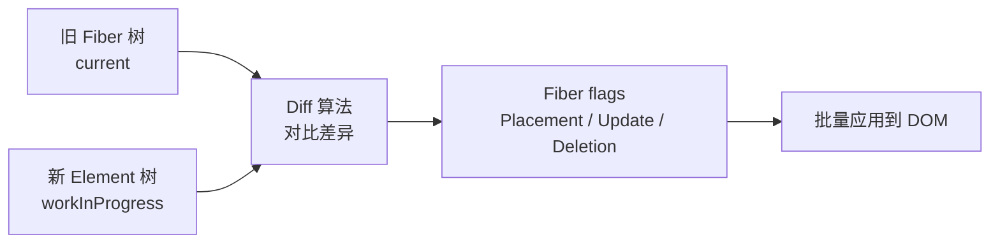
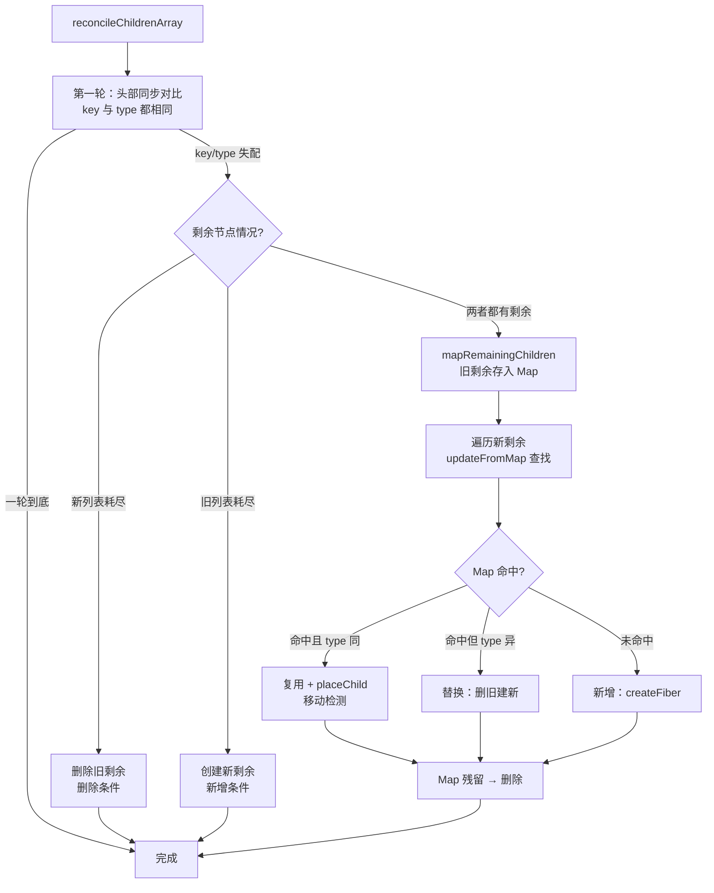
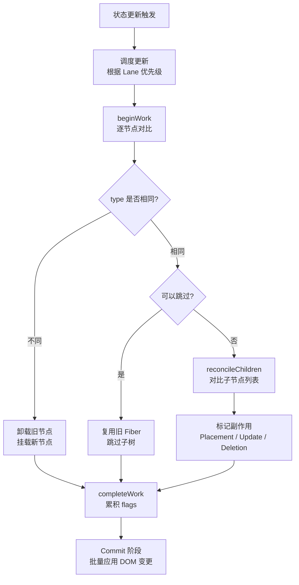

# 协调算法（Reconciliation）

## 1. 什么是协调（Reconciliation）？

协调是 React 根据新 Element 与旧 Fiber 树计算下一棵 Fiber 树的过程。它发生在 Render 阶段的 `beginWork`，只**计算差异**、绝不直接操作 DOM，使用启发式规则减少宿主变更，但不保证数学意义上的最小 DOM 操作。



## 2. 协调算法的核心假设

React 基于两个关键假设，把 O(n³) 的树 diff 降到 O(n)：

### 2.1 类型不同的元素会产生不同的树

`type` 不同（如 `<div>` → `<span>`）时，React 不尝试复用，而是**直接销毁旧树并构建新树**。

```jsx
// 旧树
<div className="old"><Counter /></div>

// 新树
<span className="new"><Counter /></span>
// div → span：整个子树被销毁重建，即使 Counter 是一样的！
```

### 2.2 通过 key 标识哪些子元素在不同渲染中保持不变

稳定的 `key` 让 React 精确判断哪些元素可以复用、移动或删除。

```jsx
// 旧列表
<ul><li key="a">A</li><li key="b">B</li></ul>

// 新列表（插入 C 到最前面）
<ul><li key="c">C</li><li key="a">A</li><li key="b">B</li></ul>
// 有 key：复用 A 和 B，只创建 C；无 key：可能全部重新创建
```

这两个假设把问题从“**任意两棵树的最小编辑距离**”（动态规划 O(n³)）压缩为“**同层、同位置、同 key 的线性对比**”（O(n)），代价是放弃跨层级移动。

## 3. 协调的三大入口：按新 child 的类型分发

总入口 `reconcileChildren` 在 `beginWork` 中被调用，先区分**挂载**与**更新**：

```javascript
export function reconcileChildren(
  current,
  workInProgress,
  nextChildren,
  renderLanes,
) {
  if (current === null) {
    // 首次挂载：旧树为空，不追踪删除
    workInProgress.child = mountChildFibers(
      workInProgress,
      null,
      nextChildren,
      renderLanes,
    )
  } else {
    // 更新：追踪删除副作用（ChildDeletion）
    workInProgress.child = reconcileChildFibers(
      workInProgress,
      current.child,
      nextChildren,
      renderLanes,
    )
  }
}
```

`mountChildFibers` 与 `reconcileChildFibers` 是同一套 `ChildReconciler` 工厂的两个产物，唯一区别是闭包变量 `shouldTrackSideEffects`：挂载为 `false`（无需追踪删除），更新为 `true`。

接着按**新 child 的运行时类型**分派到不同分支：

| 新 child 的形态                  | 分派到的函数              | 说明                       |
| -------------------------------- | ------------------------- | -------------------------- |
| `$$typeof === REACT_ELEMENT`     | `reconcileSingleElement`  | 单个元素节点               |
| `$$typeof === REACT_PORTAL`      | `reconcileSinglePortal`   | 单个 Portal                |
| `Array`（或可迭代对象）          | `reconcileChildrenArray`  | 多节点列表（最复杂的场景） |
| `string` / `number`              | `reconcileSingleTextNode` | 单个文本节点               |
| `null` / `undefined` / `boolean` | `deleteRemainingChildren` | 空内容，删除所有旧子节点   |

关键认知：“**单个还是多个**”是分岔的第一层——单节点（匹配即停）与多节点（两轮遍历 + key 映射）是完全不同的两套逻辑。

## 4. 单节点的协调（reconcileSingleElement）

新 child 是单个 Element 时，从头扫描旧子节点链表，按 `key` 和 `type` 决定复用还是重建：

```javascript
function reconcileSingleElement(
  returnFiber,
  currentFirstChild,
  element,
  lanes,
) {
  const key = element.key
  let child = currentFirstChild

  while (child !== null) {
    if (child.key === key) {
      if (child.elementType === element.type) {
        // ✅ key 同 + type 同：复用，删除其余兄弟
        deleteRemainingChildren(returnFiber, child.sibling)
        return useFiber(child, element.props)
      }
      // ❌ key 同 + type 不同：整条旧链表删除重建
      deleteRemainingChildren(returnFiber, child)
      break
    } else {
      deleteChild(returnFiber, child) // key 不同：删除，继续扫描下一个兄弟
    }
    child = child.sibling
  }

  return createFiberFromElement(element, returnFiber.mode, lanes) // 无匹配 → 新建
}
```

| 场景         | 行为                                |
| ------------ | ----------------------------------- |
| 类型相同     | 保留 DOM 节点，仅更新变化的属性     |
| 类型不同     | 销毁旧 DOM 及其子树，创建全新的 DOM |
| 组件类型相同 | 复用组件实例，更新 props            |
| 组件类型不同 | 卸载旧组件，挂载新组件              |

```jsx
// 类型相同：只更新 className
<div className="old" title="hello" />
<div className="new" title="hello" />  // → className = "new"（title 不变）

// 类型不同：整棵子树替换
<div />
<span />  // → removeChild(div) + createElement(span)
```

关键认知：**key 匹配但 type 不同时立即停止扫描**——同一个新节点不可能同时匹配两个旧节点，继续扫描毫无意义。

### 4.1 属性对比（diffProperties）

类型相同、Fiber 被复用时，React 不会立刻改 DOM，而是在 `completeWork` 里调用 `diffProperties` 计算属性最小变更集 `updatePayload`：

```javascript
// 旧属性: { className: 'old', id: 'box', style: { color: 'red' } }
// 新属性: { className: 'new', id: 'box', style: { color: 'blue' } }
//
// updatePayload: ['className', 'new', 'style', { color: 'blue' }]
// className: old → new；id 不变；style.color: red → blue
```

`updatePayload` 挂到 `fiber.updateQueue` 上，由 Commit 阶段的 `commitUpdate` 一次性应用。

## 5. 文本与空内容的协调

### 5.1 文本节点（reconcileSingleTextNode）

新 child 是 `string` / `number` 时，只尝试复用**紧邻的旧文本节点**（`tag === HostText`），否则删除旧子树并新建文本 Fiber：

```javascript
function reconcileSingleTextNode(
  returnFiber,
  currentFirstChild,
  textContent,
  lanes,
) {
  if (currentFirstChild !== null && currentFirstChild.tag === HostText) {
    deleteRemainingChildren(returnFiber, currentFirstChild.sibling)
    return useFiber(currentFirstChild, textContent) // 复用，仅更新文本
  }
  deleteRemainingChildren(returnFiber, currentFirstChild)
  return createFiberFromText(textContent, returnFiber.mode, lanes)
}
```

### 5.2 空内容（null / undefined / boolean）

三者统一视为“**渲染空**”——删除所有旧子节点，不产出新 Fiber：

```jsx
<div>{null}</div>
<div>{undefined}</div>
<div>{condition && <span />}</div> // condition 为 false 时渲染空
```

> [!NOTE]
> `0` 是例外：`typeof 0 === 'number'`，会被渲染成文本 `"0"`。这是“`为什么 0 会显示出来`”的来源。

## 6. 多节点（数组）的协调：reconcileChildrenArray

列表协调是最复杂的部分。React 根据每个节点「**key + type + 位置**」的组合，把子节点协调最终归为五种条件，每种对应不同的 Fiber 操作与标记：

| 协调条件         | 判断依据                         | 触发函数                                  | 标记                          | 结果                      |
| ---------------- | -------------------------------- | ----------------------------------------- | ----------------------------- | ------------------------- |
| **复用（更新）** | key 相同 + type 相同             | `useFiber`                                | 无（仅更新 `pendingProps`）   | 复用旧 DOM，更新属性      |
| **新增（插入）** | 新节点在旧列表中无 key 匹配      | `createFiberFromElement`                  | `Placement`                   | 新建 DOM 并插入           |
| **删除（移除）** | 旧节点在新列表中无 key 匹配      | `deleteChild` / `deleteRemainingChildren` | `ChildDeletion`               | Commit 阶段 `removeChild` |
| **移动（重排）** | key + type 相同，但旧 index 错位 | `placeChild`                              | `Placement`                   | 复用 DOM，调整位置        |
| **替换**         | key 相同 + type 不同             | `updateElement` 返回新 Fiber              | `Placement` + `ChildDeletion` | 删旧建新（state 丢失）    |

### 6.1 算法总览

整个 `reconcileChildrenArray` 是一段**单次线性扫描**，先同步对比前缀（第一轮），再按剩余情况分支处理（第二轮），移动检测穿插在每一轮的 `placeChild` 中：

```javascript
function reconcileChildrenArray(
  returnFiber,
  currentFirstChild,
  newChildren,
  lanes,
) {
  let resultingFirstChild = null // 新 Fiber 链表的头
  let previousNewFiber = null // 上一个新 Fiber，用于串起 sibling
  let oldFiber = currentFirstChild // 旧 Fiber 游标
  let lastPlacedIndex = 0 // 已放置节点的最大旧 index
  let newIdx = 0 // 新列表下标

  // ── 第一轮：新旧列表头部同步对比 ──
  for (; oldFiber !== null && newIdx < newChildren.length; newIdx++) {
    const nextOldFiber = oldFiber.index > newIdx ? oldFiber : oldFiber.sibling
    const newFiber = updateSlot(
      returnFiber,
      oldFiber,
      newChildren[newIdx],
      lanes,
    )
    if (newFiber === null) {
      if (oldFiber === null) oldFiber = nextOldFiber
      break // key 失配 → 跳出第一轮
    }
    if (oldFiber && newFiber.alternate === null) {
      deleteChild(returnFiber, oldFiber) // key 同但 type 不同 → 替换
    }
    lastPlacedIndex = placeChild(newFiber, lastPlacedIndex, newIdx)
    previousNewFiber =
      previousNewFiber === null
        ? (resultingFirstChild = newFiber)
        : (previousNewFiber.sibling = newFiber)
    oldFiber = nextOldFiber
  }

  // ── 分支 1：新列表耗尽 → 删除旧剩余 ──
  if (newIdx === newChildren.length) {
    deleteRemainingChildren(returnFiber, oldFiber)
    return resultingFirstChild
  }

  // ── 分支 2：旧列表耗尽 → 创建新剩余 ──
  if (oldFiber === null) {
    for (; newIdx < newChildren.length; newIdx++) {
      const newFiber = createChild(returnFiber, newChildren[newIdx], lanes)
      lastPlacedIndex = placeChild(newFiber, lastPlacedIndex, newIdx)
      previousNewFiber =
        previousNewFiber === null
          ? (resultingFirstChild = newFiber)
          : (previousNewFiber.sibling = newFiber)
    }
    return resultingFirstChild
  }

  // ── 分支 3：两者都有剩余 → 建 Map 查找 ──
  const existingChildren = mapRemainingChildren(returnFiber, oldFiber)
  for (; newIdx < newChildren.length; newIdx++) {
    const newFiber = updateFromMap(
      existingChildren,
      returnFiber,
      newIdx,
      newChildren[newIdx],
      lanes,
    )
    if (newFiber !== null) {
      if (newFiber.alternate !== null) {
        existingChildren.delete(newFiber.key === null ? newIdx : newFiber.key) // 认领
      }
      lastPlacedIndex = placeChild(newFiber, lastPlacedIndex, newIdx)
      previousNewFiber =
        previousNewFiber === null
          ? (resultingFirstChild = newFiber)
          : (previousNewFiber.sibling = newFiber)
    }
  }
  existingChildren.forEach(child => deleteChild(returnFiber, child)) // Map 残留 → 删除

  return resultingFirstChild
}
```



### 6.2 复用

**条件**：新节点与旧节点 `key` 相同且 `type` 相同，这是“**理想情况**”，React 直接复用旧 Fiber 与旧 DOM。

两条触发路径：

- **第一轮 `updateSlot`**：新旧位置也相同（公共前缀），无需 key 查找。
- **第二轮 `updateFromMap`**：位置不同，通过 key 从 `Map` 中定位旧节点。

两者最终都落到 `updateElement`，核心是 `useFiber`——复用旧 Fiber 对象，仅更新 `pendingProps`，`alternate` 指向旧节点：

```javascript
function updateElement(returnFiber, current, element, lanes) {
  if (current !== null && current.elementType === element.type) {
    return useFiber(current, element.props) // ✅ 复用旧 Fiber，仅更新 props
  }
  return createFiberFromElement(element, returnFiber.mode, lanes) // type 不同 → 新建
}
```

**结果**：不打 `Placement`，DOM 原地保留，属性变更交由 `completeWork` 的 `diffProperties` 计算。若 props 引用也未变，甚至可能触发 bailout 跳过后续更新。

```markdown
// 旧：A B C → 新：A B C
// 三个节点全部 key 同 + type 同 → 全部复用，无任何副作用标记 ✅
```

### 6.3 新增

**条件**：新节点在旧列表中**找不到 key 相同（且 type 相同）的节点**，需要创建全新 Fiber 并插入。

两条触发路径：

- **旧列表耗尽**（分支 2）：第一轮后 `oldFiber === null`，剩余新节点全部新建。
- **`updateFromMap` 未命中**（分支 3）：`Map` 中没有对应 key，`updateElement(null, ...)` 新建。

新建的 Fiber 其 `alternate === null`，`placeChild` 据此打上 `Placement` 标记（插入）：

```markdown
// 场景 A：末尾追加（第一轮即可完全处理）
// 旧：A B C → 新：A B C D
// 第一轮：A B C 复用；旧列表耗尽 → D 新建（Placement）✅

// 场景 B：头部插入（第一轮 key 失配后进入第二轮）
// 旧：A B C → 新：D A B C
// 第一轮：D 的 key 与 A 不同 → 立即跳出
// 第二轮：Map {a:A, b:B, c:C}，D 未命中 → 新建 D（Placement）
// A/B/C 依次命中复用，仅 1 次插入 ✅
```

新增节点的 DOM 由 `completeWork` 的 `createInstance` 创建，并在 Commit 阶段 `commitPlacement` 插入父容器。

### 6.4 删除

**条件**：旧节点在新列表中**找不到 key 相同的节点**，需要移除其 Fiber 与 DOM。

两条触发路径：

- **新列表耗尽**（分支 1）：第一轮后 `newIdx === newChildren.length`，`deleteRemainingChildren` 删除所有旧剩余。
- **Map 残留**（分支 3）：新列表遍历完后，`Map` 中未被“**认领**”的旧节点即为删除项。

```markdown
// 场景 A：末尾删除
// 旧：A B C → 新：A B
// 第一轮：A B 复用；新列表耗尽 → 删除 C（ChildDeletion）✅

// 场景 B：头部删除
// 旧：A B C → 新：B C
// 第一轮：A 的 key 与 B 不同 → 跳出
// 第二轮：Map {a:A, b:B, c:C}，B C 命中复用；遍历完 Map 残留 A → 删除 A ✅
```

关键认知：**删除是“延迟”的**。协调过程不立即删除 Fiber，而是把待删节点压入父 Fiber 的 `deletions` 数组并打 `ChildDeletion`，真正的 `removeChild` 与副作用清理（`componentWillUnmount`、effect 销毁）在 Commit 阶段统一执行：

```javascript
function deleteChild(returnFiber, childToDelete) {
  const deletions = returnFiber.deletions
  if (deletions === null) {
    returnFiber.deletions = [childToDelete]
    returnFiber.flags |= ChildDeletion
  } else {
    deletions.push(childToDelete)
  }
}
```

### 6.5 移动

**条件**：节点 `key` 与 `type` 都相同（可复用），但在新列表中的**相对顺序被打破**，需要调整 DOM 位置。

移动检测是列表协调的精髓，用整数 `lastPlacedIndex` 记录“**已放置节点的最大旧 index**”，在 O(n) 内判断每个复用节点是否需要移动：

```javascript
function placeChild(newFiber, lastPlacedIndex, newIndex) {
  newFiber.index = newIndex
  const current = newFiber.alternate
  if (current !== null) {
    const oldIndex = current.index
    if (oldIndex < lastPlacedIndex) {
      newFiber.flags |= Placement // 旧 index 更小 → 顺序错位，需移动
      return lastPlacedIndex
    }
    return oldIndex // 顺序正确，原地复用
  }
  newFiber.flags |= Placement // 全新节点 → 插入
  return lastPlacedIndex
}
```

**判定规则**：新列表从左到右遍历，若复用节点的旧 index 比已放置的最大旧 index 还小，说明它排到了本应更靠后的节点之前，相对顺序被破坏，必须移动（打 `Placement`）。

```markdown
// 旧：A B C D（旧 index：A=0 B=1 C=2 D=3） 新：B A D C
// B: index 1 >= 0 → 不动，lastPlacedIndex = 1
// A: index 0 < 1 → 移动（Placement），保持 1
// D: index 3 >= 1 → 不动，lastPlacedIndex = 3
// C: index 2 < 3 → 移动（Placement），保持 3
// 结果：A、C 移动，B、D 原地复用 —— 4 个全复用，仅 2 次移动
```

它不计算“**最小移动次数**”，而是用单调递增的 `lastPlacedIndex` 做**贪心**判断：相对顺序没被破坏就原地不动，代价极低且行为可预测。移动在 Commit 阶段由 `commitPlacement` 通过 `insertBefore` 实现——即使打的是 `Placement`，只要节点已存在，最终也只是“**挪位置**”而非“**重建**”。

### 6.6 替换

**条件**：新节点与旧节点 `key` 相同但 `type` 不同。此时旧节点**无法复用**，React 将其视为“**删旧 + 建新**”。

触发路径：

- **第一轮**：`updateSlot` 命中 key，但 `updateElement` 发现 type 不同 → 返回新建 Fiber（`alternate === null`），外层检测到后 `deleteChild(oldFiber)`。
- **第二轮**：`updateFromMap` 命中 key 但 type 不同 → 同样返回新建 Fiber，且**不删除 Map 条目**，旧节点留到末尾被 `deleteChild` 清理。

```markdown
// 旧：<div key="a"/> <span key="b"/>
// 新：<p key="a"/> <span key="b"/>
// key="a" 的 type 由 div → p：旧 div 删除（ChildDeletion）+ 新 p 创建（Placement）
// key="b" 保持不变：span 复用
```

关键认知：**替换等价于删除 + 新增，代价最高**。因为 type 变了，React 必须销毁旧 DOM 及其整棵子树，重新创建——这会导致组件实例被卸载、内部 state 丢失。这也是 [假设 1](#21-类型不同的元素会产生不同的树) 在列表场景的直接体现。

### 6.7 无 key 节点的身份陷阱

第二轮构建的 `Map` 是“**复用 / 删除**”判断的基础，它的建键规则解释了为何无 key 列表不安全：

```javascript
function mapRemainingChildren(returnFiber, currentFirstChild) {
  const existingChildren = new Map()
  let child = currentFirstChild
  while (child !== null) {
    if (child.key !== null) {
      existingChildren.set(child.key, child) // 有 key：以 key 为键
    } else {
      existingChildren.set(child.index, child) // 无 key：以 index 为键
    }
    child = child.sibling
  }
  return existingChildren
}
```

关键认知：**无 key 的节点在 Map 中以 `index` 为键**——身份完全由位置决定。一旦增删导致 index 错位，内容就会错配到错误的 Fiber 上，这正是“**不能用 index 当 key**”的底层原因（详见 [7.2](#72-为什么不能用-index-作为-key)）。

## 7. key 的重要性

### 7.1 key 的作用

`key` 是 React 在多节点协调中识别“**同一个节点**”的唯一依据。它只在 `reconcileChildrenArray` 中发挥作用，通过在新旧列表之间建立 `key` 对应关系（无 key 时退化为 `index`），判断出四种结果：

| 结果            | 判定               | 对应的协调条件          |
| --------------- | ------------------ | ----------------------- |
| **保持 / 复用** | 新旧列表都有该 key | 复用，或移动            |
| **新增**        | 只有新列表有       | 新增（`Placement`）     |
| **删除**        | 只有旧列表有       | 删除（`ChildDeletion`） |
| **移动**        | 都有但相对顺序变化 | 移动（`Placement`）     |

关键认知：key 不是“**提示**”，而是节点的“**身份标识**”。没有 key，React 只能靠位置（index）猜测节点是否相同；有了稳定 key，React 才能精确复用节点、保留其内部 state 与 DOM。

### 7.2 为什么不能用 index 作为 key？

```jsx
// ❌ 用 index 作为 key
items.map((item, index) => <TodoItem key={index} item={item} />)

// 头部插入新项时：
// 旧: key=0(A)  key=1(B)  key=2(C)
// 新: key=0(D)  key=1(A)  key=2(B)  key=3(C)
// React 认为 0/1/2 内容全变（更新），3 新增；实际只有 D 是新的
// A/B/C 本应复用，却产生了大量不必要的更新！
```

```jsx
// ✅ 用稳定的唯一 ID 作为 key
items.map(item => <TodoItem key={item.id} item={item} />)

// 头部插入 D：只创建 D，A/B/C 全部复用 ✅
```

### 7.3 什么情况下可以使用 index 作为 key？

满足以下**全部**条件才安全：列表静态（不增删重排）、列表项无内部状态、无非受控子组件。

### 7.4 key 只在兄弟节点之间唯一

`key` 的作用域是**父节点的 children 列表**，无需全局唯一。不同父节点下的元素可用相同 key：

```jsx
<div>
  <ul>
    {listA.map(item => (
      <li key={item.id}>{item.name}</li>
    ))}
  </ul>
  <ul>
    {listB.map(item => (
      <li key={item.id}>{item.name}</li>
    ))}
  </ul>
</div>
```

React 只在 `reconcileChildrenArray` 的 `Map` 里匹配同一父节点下的兄弟，跨父节点的 key 从不比较。

### 7.5 key 决定组件身份

key 是 React 判断组件“**身份**”的依据——**即使 `type` 相同，key 不同也会导致组件卸载重建，内部 state 丢失**：

```jsx
// 用 key 强制重置组件 state 的经典技巧
function Tab({ tab }) {
  return <Profile key={tab.id} /> // tab 切换时 Profile 卸载重建，state 清空
}
```

## 8. 协调的性能优化

### 8.1 Bailout 机制

当 React 能证明某个 Fiber 子树**不需要任何更新**时，它在 `beginWork` 直接复用旧 Fiber 子树，跳过整棵子树的协调（不执行组件函数、不做 diff）。触发 bailout 需**同时满足**：

- `oldProps === newProps`（props 引用未变）
- `oldState === newState`（state 引用未变）
- `hasContextChanged() === false`（相关 context 未变）
- `childLanes` 与本次 `renderLanes` 无交集（子树无挂起更新）

```jsx
const MemoizedChild = React.memo(function Child({ count }) {
  return <div>{count}</div>
})

function Parent() {
  const [other, setOther] = useState(0)
  // other 变化时，MemoizedChild 的 props 未变 → bailout，不重新渲染
  return <MemoizedChild count={42} />
}
```

### 8.2 不变引用

`React.memo` 的浅比较本质是 `Object.is`（引用相等）。渲染中内联创建的对象/函数每次都是新引用，会**破坏**浅比较，让 memo 失效：

```jsx
// ❌ 每次渲染都创建新引用，memo 永远无法命中
<Child style={{ color: 'red' }} onClick={() => {}} />

// ✅ 稳定的引用
const style = useMemo(() => ({ color: 'red' }), [])
const onClick = useCallback(() => {}, [])
<Child style={style} onClick={onClick} />
```

### 8.3 稳定的 key 提升列表复用率

key 的稳定性直接决定列表协调的质量：稳定 key 让增删只影响真正变化的节点；不稳定 key（如 index）会让大量节点被误判为“**更新**”，甚至触发 state 错乱。

### 8.4 Lane 模型

React 18+ 用 Lane 表示更新优先级，高优先级可打断低优先级的协调（避免低优更新阻塞交互）：

```markdown
SyncLane: 0b0000000000000000000000000000001 // 同步更新
InputLane: 0b0000000000000000000000000001000 // 用户输入
DefaultLane: 0b0000000000000000000000000100000 // 默认优先级
IdleLane: 0b0100000000000000000000000000000 // 空闲时执行
```

## 9. 协调的完整流程



## 10. 总结

- **两个假设**把树 diff 从 O(n³) 降到 O(n)，代价是放弃跨层级移动。
- **入口按“单个 / 多个”分岔**：`type` 决定复用，`key` 决定列表复用准确性。
- **五种协调条件**（复用/新增/删除/移动/替换）各有明确标记，`lastPlacedIndex` 用贪心在 O(n) 内识别移动。
- **删除是延迟的**：Render 只记账，Commit 统一清理。
- **性能核心是 bailout**：稳定 key + 稳定引用 + `React.memo`，跳过无用子树协调。
