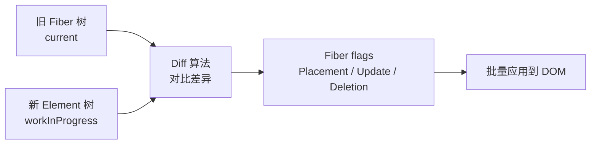
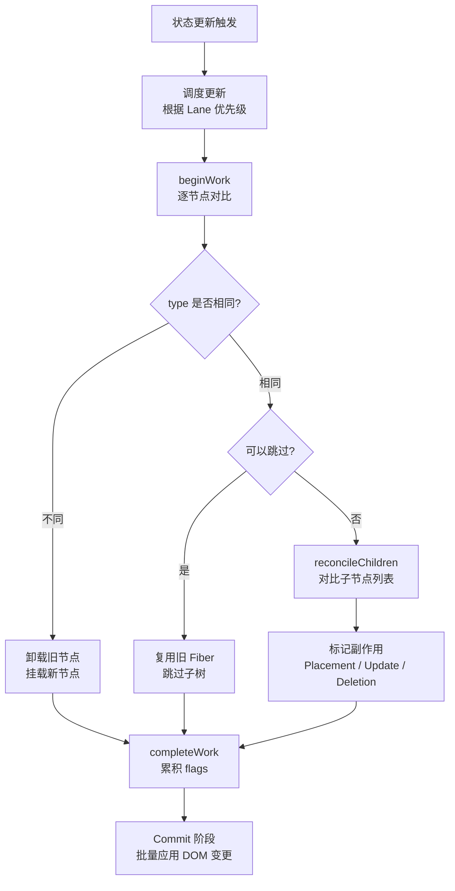

# 协调算法（Reconciliation）

## 1. 什么是协调（Reconciliation）？

协调（Reconciliation）是 React 根据新 Element 和当前 Fiber 计算下一棵 Fiber 树的过程。它使用启发式规则减少宿主变更，但不保证数学意义上的最小 DOM 操作。

当组件的 state 或 props 变化时，React 会：

1. 重新执行组件函数，生成新的 React Element 树。
2. 将新树与之前渲染的旧 Fiber 树进行**对比（diffing）**。
3. 在 Fiber 上标记需要提交的宿主变更。
4. 在 Commit 阶段批量应用这些操作。



## 2. 协调算法的核心假设

React 的协调算法基于两个关键假设，使得 O(n³) 的树 diff 问题降低到了 O(n)：

### 假设 1：类型不同的元素会产生不同的树

如果两个元素的 `type` 不同（如 `<div>` → `<span>`），React 不会尝试复用，而是**直接销毁旧树并构建新树**。

```jsx
// 旧树
<div className="old">
  <Counter />
</div>

// 新树
<span className="new">
  <Counter />
</span>
// div → span：整个子树被销毁重建，即使 Counter 是一样的！
```

### 假设 2：通过 key 属性标识哪些子元素在不同的渲染中保持不变

通过为列表元素提供稳定的 `key`，React 可以精确地判断哪些元素可以复用、需要移动或删除。

```jsx
// 旧列表
<ul>
  <li key="a">A</li>
  <li key="b">B</li>
</ul>

// 新列表（插入 C 到最前面）
<ul>
  <li key="c">C</li>
  <li key="a">A</li>
  <li key="b">B</li>
</ul>
// 有 key：复用 A 和 B，只创建 C
// 无 key：可能全部重新创建
```

## 3. Diff 算法的三步策略

### 3.1 对比根节点类型

| 场景         | 行为                                    |
| ------------ | --------------------------------------- |
| 类型相同     | 保留 DOM 节点，仅更新变化的属性         |
| 类型不同     | 销毁旧 DOM 节点及其子树，创建全新的 DOM |
| 组件类型相同 | 复用组件实例，更新 props                |
| 组件类型不同 | 卸载旧组件，挂载新组件                  |

```jsx
// 类型相同：只更新 className
<div className="old" title="hello" />
<div className="new" title="hello" />
// → updateProperties: className = "new"（title 不变）

// 类型不同：整棵子树替换
<div />
<span />
// → removeChild(div) + createElement(span)
```

### 3.2 对比属性

当类型相同时，React 只更新变化的属性：

```javascript
// 旧属性: { className: 'old', id: 'box', style: { color: 'red' } }
// 新属性: { className: 'new', id: 'box', style: { color: 'blue' } }
//
// 更新操作：
// 1. className: 'old' → 'new'
// 2. id: 不变
// 3. style.color: 'red' → 'blue'
```

### 3.3 对比子节点（列表 diff）

这是协调算法中最复杂的部分。React 对子节点列表进行 **O(n) 复杂度的 diff**：

```
算法步骤：
1. 第一轮遍历：同时从新旧列表头部开始，按顺序对比
   - key 相同且 type 相同 → 复用
   - key 不同 → 跳出第一轮

2. 第二轮遍历（处理剩余节点）：
   - 新列表还有剩余 → 新增节点
   - 旧列表还有剩余 → 删除节点
   - 两者都有剩余 → 将旧列表剩余节点存入 Map<key, Fiber>，用新列表 key 查找和移动

3. 第三轮遍历：对无法匹配的节点执行删除和创建
```

```jsx
// 场景：节点移动
// 旧：A B C D
// 新：B A D C

// React 的处理（简化）：
// 1. 建立旧节点 Map: {A: fiberA, B: fiberB, C: fiberC, D: fiberD}
// 2. 遍历新列表：
//    B: 在 Map 中找到 → 复用，标记移动
//    A: 在 Map 中找到 → 复用，标记移动
//    D: 在 Map 中找到 → 复用，标记移动
//    C: 在 Map 中找到 → 复用
// 3. 结果：4 个节点全部复用，通过 Placement 标记实现位置调整
```

## 4. key 的重要性

### 4.1 key 的作用

`key` 是 React 识别列表中每个元素的唯一标识。它帮助 React 判断：

- 哪些元素是**新增的**（新列表中有，旧 Map 中无）
- 哪些元素是**删除的**（旧列表中有，新 Map 中无）
- 哪些元素是**移动的**（新老列表中都存在，但位置变化）
- 哪些元素是**保持的**（新老列表中都存在，且位置不变）

### 4.2 为什么不能用 index 作为 key？

```jsx
// ❌ 用 index 作为 key
{
  items.map((item, index) => <TodoItem key={index} item={item} />)
}

// 当在头部插入新项时：
// 旧: key=0(A)  key=1(B)  key=2(C)
// 新: key=0(D)  key=1(A)  key=2(B)  key=3(C)
//
// React 认为：
// 0(A→D): 内容变了，更新
// 1(B→A): 内容变了，更新
// 2(C→B): 内容变了，更新
// 3(new): 新增 C
//
// 实际上只有 D 是新的，A/B/C 都应该复用！使用 index 导致大量不必要的更新。
```

```jsx
// ✅ 用稳定的唯一 ID 作为 key
{
  items.map(item => <TodoItem key={item.id} item={item} />)
}

// 在头部插入 D：
// 旧 Map: {a: A, b: B, c: C}
// 新: D(new) A(复用) B(复用) C(复用)
// 结果：只创建 D，其余三个全部复用 ✅
```

### 4.3 什么情况下可以使用 index 作为 key？

满足以下**全部**条件时，使用 index 是安全的：

1. 列表是静态的（不会增删、重排）。
2. 列表项没有内部状态（不受控组件）。
3. 列表项没有非受控的子组件。

## 5. 协调的性能优化

### 5.1 Bailout 机制

当组件的 props、state 和 context 均未变化时，React 会**跳过整个子树的协调**：

```jsx
const MemoizedChild = React.memo(function Child({ count }) {
  return <div>{count}</div>
})

function Parent() {
  const [other, setOther] = useState(0)
  // other 变化时，MemoizedChild 不会重新渲染
  return <MemoizedChild count={42} />
}
```

Bailout 的判断在 `beginWork` 阶段执行：如果检测到可以跳过，直接复用前一次的 Fiber 子树，不进入协调流程。

### 5.2 不变引用

保持 props 的引用稳定可以最大化 bailout 的效果：

```jsx
// ❌ 每次渲染都创建新的对象/函数引用
<Child style={{ color: 'red' }} onClick={() => {}} />

// ✅ 稳定的引用
const style = useMemo(() => ({ color: 'red' }), [])
const onClick = useCallback(() => {}, [])
<Child style={style} onClick={onClick} />
```

### 5.3 Lane 模型

React 18+ 使用 Lane（车道）模型来表示更新的优先级。不同优先级的更新在不同的 lane 上，高优先级的更新可以打断低优先级的协调过程：

```
Lane 模型（二进制位掩码）：
SyncLane:    0b0000000000000000000000000000001  // 同步更新
InputLane:   0b0000000000000000000000000001000  // 用户输入
DefaultLane: 0b0000000000000000000000000100000  // 默认优先级
IdleLane:    0b0100000000000000000000000000000  // 空闲时执行
```

## 6. 协调的完整流程



## 7. React 协调 vs 传统 Diff 算法

| 维度           | 传统树 Diff          | React Reconciliation    |
| -------------- | -------------------- | ----------------------- |
| **时间复杂度** | O(n³)                | O(n)                    |
| **跨层级移动** | 支持                 | 不支持（假设不跨层级）  |
| **列表处理**   | 需要完整比较所有节点 | 通过 key 匹配 O(n)      |
| **可中断性**   | 不可中断             | Fiber 支持中断恢复      |
| **优先级感知** | 无                   | Lane 模型按优先级调度   |
| **内存管理**   | 需要同时持有整棵树   | 双缓冲 + alternate 引用 |

## 8. 总结

- **协调是 React 性能的核心**：基于两个关键假设将 O(n³) 降至 O(n)。
- **type 决定复用**：类型相同则复用 DOM 并更新属性，类型不同则销毁重建。
- **key 决定列表复用的准确性**：稳定的唯一 key 是列表性能的关键。
- **Bailout 跳过不需要更新的子树**：`React.memo`、不变引用、Compiler 自动优化。
- **Fiber 架构使协调可中断**：长任务可以被高优先级更新打断，保持 UI 响应。
- **最佳实践**：提供稳定的 key，避免在渲染中创建新的对象/函数引用，合理使用 `React.memo` 和 `useMemo`。
