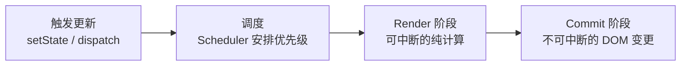
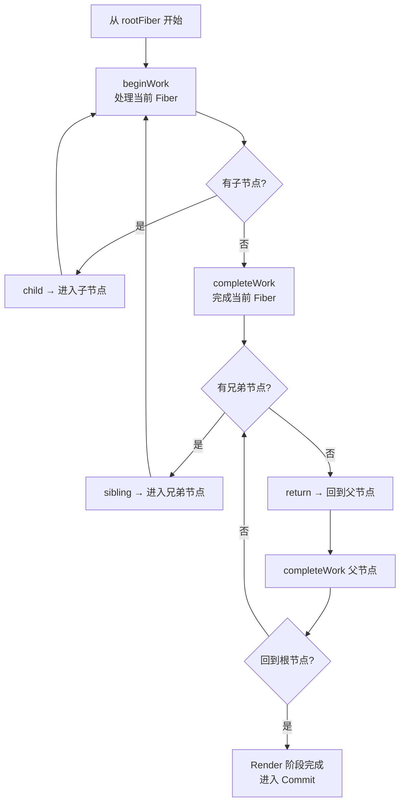
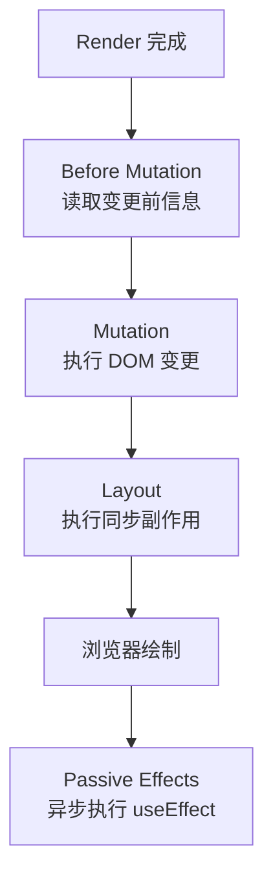
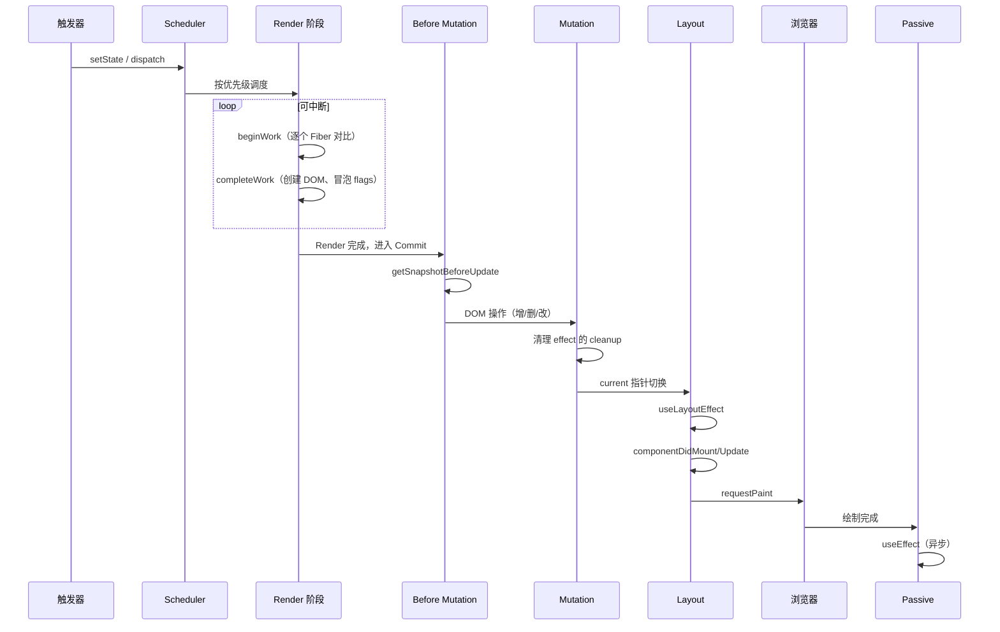

# Render 与 Commit 两阶段渲染

## 1.一次状态更新的完整流程

React 的每一次状态更新都可以概括为三个阶段：



| 阶段            | 是否可中断  | 作用                                   | 可见性               |
| --------------- | ----------- | -------------------------------------- | -------------------- |
| **触发 + 调度** | —           | 标记 Update，确定优先级，安排执行      | —                    |
| **Render**      | ✅ 可中断   | 构建 Fiber 树、diff 新旧树、标记副作用 | 不可见（内存中计算） |
| **Commit**      | ❌ 不可中断 | 将变更应用到 DOM、执行副作用           | 用户可见             |

关键认知：**"渲染"在 React 语境中指 Render 阶段（执行组件函数计算 VDOM 差异），而不是提交 DOM 更新。**

## 2. Render 阶段

### 2.1 目标

Render 阶段的目标是**构建 work-in-progress Fiber 树并标记副作用**。它是纯计算过程，不产生任何用户可见的 DOM 变更，因此可以被中断、重试或丢弃。

### 2.2 工作单元：performUnitOfWork

`performUnitOfWork` 是 Render 阶段的核心执行单元，它将每个 Fiber 节点的处理分为"**递**"（`beginWork`）和"**归**"（`completeWork`）两步：

```javascript
// React 源码中 performUnitOfWork 的核心逻辑
function performUnitOfWork(unitOfWork) {
  const current = unitOfWork.alternate

  // 第一步：递（beginWork）—— 向下进入
  let next = beginWork(current, unitOfWork, renderLanes)

  // beginWork 返回第一个子节点（child），继续向下深入
  if (next !== null) {
    return next
  }

  // 没有子节点 → 开始"归"（completeWork）—— 向上回溯
  completeUnitOfWork(unitOfWork)
  return null // 由 completeUnitOfWork 内部决定下一个工作单元
}

function completeUnitOfWork(unitOfWork) {
  let completedWork = unitOfWork
  do {
    const current = completedWork.alternate
    completeWork(current, completedWork, renderLanes)

    // 有兄弟节点 → 返回兄弟节点作为下一个工作单元
    if (completedWork.sibling !== null) {
      return completedWork.sibling
    }
    // 没有兄弟 → 回溯到父节点
    completedWork = completedWork.return
  } while (completedWork !== null)
  // 回到根节点 → Render 阶段完成
  return null
}
```

关键认知：`performUnitOfWork` 每次只处理**一个** Fiber 节点，它返回下一个待处理的节点，或 `null` 表示整棵树处理完成。工作循环实际上是一个不断调用 `performUnitOfWork` 的 `while` 循环：

```javascript
// 同步渲染入口
function workLoopSync() {
  while (workInProgress !== null) {
    workInProgress = performUnitOfWork(workInProgress)
  }
}

// 并发渲染入口
function workLoopConcurrent() {
  while (workInProgress !== null && !shouldYieldToRenderer()) {
    workInProgress = performUnitOfWork(workInProgress)
  }
}
```

### 2.3 入口：renderRootSync 与 renderRootConcurrent

在 Render 阶段开始前，React 需要先调用 `prepareFreshStack` 来建立 work-in-progress 树：

```javascript
function renderRootSync(root, lanes) {
  // 如果之前的渲染被中断，先清理
  if (workInProgressRoot !== null) {
    /* 重置 */
  }

  // 创建 WIP 树的根节点（复用或新建）
  prepareFreshStack(root, lanes)

  // 开始同步工作循环
  workLoopSync()

  // 工作循环结束后，finishedWork 指向构建完成的 WIP 树
  // 进入 Commit 阶段
}
```

`prepareFreshStack` 的核心逻辑：

```javascript
function prepareFreshStack(root, lanes) {
  // 基于 current 树的根 Fiber 创建 WIP 树根节点
  root.finishedWork = null
  workInProgressRoot = root
  const rootWorkInProgress = createWorkInProgress(root.current, null)
  workInProgress = rootWorkInProgress

  // 将本次更新的 lanes 赋值给 WIP 根节点
  workInProgressRootRenderLanes = lanes
  workInProgressRootExitStatus = RootInProgress
}
```

`createWorkInProgress` 是**双缓冲机制的关键**：如果 `current.alternate` 已存在则直接复用该 Fiber 对象（仅重置关键字段），否则创建一个全新 Fiber 并将两者的 `alternate` 互相指向。

### 2.4 beginWork

`beginWork` 是 Render 阶段的"**递**"部分，负责**向下深度优先遍历**每个 Fiber 节点。它接收 `current`（旧 Fiber）、`workInProgress`（新 Fiber）和 `renderLanes`（本次渲染的优先级车道），返回第一个子节点或 `null`：

```javascript
// beginWork 的核心逻辑（简化）
//1. 对比新旧 props/state/context，判断是否可以 **bailout**（跳过）。
//2. 不可 bailout 时，执行组件函数或 `render()`，获取新的子 Element 列表。
//3. 调用 `reconcileChildren` 对比新旧子 Element，为子 Fiber 标记 `flags`。
function beginWork(current, workInProgress, renderLanes) {
  // 1. 检查是否可以跳过（Bailout）
  if (current !== null) {
    const oldProps = current.memoizedProps
    const newProps = workInProgress.pendingProps

    if (
      oldProps === newProps &&
      !hasContextChanged() &&
      !hasScheduledUpdate()
    ) {
      // props、state、context 均未变化 → bailout
      return bailoutOnAlreadyFinishedWork(current, workInProgress, renderLanes)
    }
  }

  // 2. 根据 fiber.tag 进入不同处理逻辑
  switch (workInProgress.tag) {
    case FunctionComponent:
      return updateFunctionComponent(current, workInProgress, renderLanes)
    case ClassComponent:
      return updateClassComponent(current, workInProgress, renderLanes)
    case HostComponent: // 原生 DOM 元素
      return updateHostComponent(current, workInProgress, renderLanes)
    case HostText: // 文本节点
      return updateHostText(current, workInProgress)
    // ... 其他类型
  }
}
```

**`reconcileChildren` 是 beginWork 内部最关键的调用**——它负责 Diff 新旧子节点并产出副作用标记：

```javascript
// beginWork 内部调用 reconcileChildren 的简化逻辑
function updateFunctionComponent(current, workInProgress, renderLanes) {
  // 1. 准备 Hooks 上下文
  prepareToUseHooks(workInProgress, renderLanes)

  // 2. 执行组件函数，获取新的 React Element
  const Component = workInProgress.type
  const nextChildren = Component(workInProgress.pendingProps)

  // 3. 协调子节点——这是产生 flags 的关键步骤
  reconcileChildren(current, workInProgress, nextChildren, renderLanes)

  // 4. 返回第一个子 Fiber，继续向下遍历
  return workInProgress.child
}
```

`reconcileChildren` 的核心决策逻辑：

| 场景                        | 操作                                          | 子 Fiber 标记                      |
| --------------------------- | --------------------------------------------- | ---------------------------------- |
| 新节点（旧 Fiber 不存在）   | 创建新 Fiber（`createFiberFromElement`）      | `Placement`                        |
| 类型相同、key 相同          | 复用旧 Fiber（`useFiber`），更新 pendingProps | 通过对比决定 `Update` 或 `NoFlags` |
| 类型不同或 key 不同         | 创建新 Fiber + 标记旧 Fiber 为 `Deletion`     | 新的 Placement，旧的 ChildDeletion |
| 旧节点（新 Element 不存在） | 标记旧 Fiber 为 `Deletion`                    | `ChildDeletion`                    |

这些 flags 是 Commit 阶段执行 DOM 操作的**唯一依据**。Render 阶段不修改 DOM，只产生标记。

### 2.5 completeWork

`completeWork` 是 Render 阶段的"**归**"部分，在**从子节点返回时向上**执行。与 `beginWork` 由外向内推进相反，`completeWork` 由叶子节点向根节点收敛：

```javascript
// completeWork 的核心逻辑（简化）
//1. 为 HostComponent（原生元素）创建或更新对应的 DOM 节点。
//2. 将子节点的 `flags` 和 `subtreeFlags` 向上冒泡到父节点。
//3. 这样在 Commit 阶段，根节点可以直接知道整棵树需要执行哪些操作。
function completeWork(current, workInProgress, renderLanes) {
  switch (workInProgress.tag) {
    case HostComponent:
      // 创建或更新 DOM 节点
      if (current === null) {
        // 首次渲染：创建真实 DOM
        const instance = createInstance(
          workInProgress.type,
          workInProgress.pendingProps,
        )
        workInProgress.stateNode = instance
      } else {
        // 更新：计算需要更新的属性
        updateHostComponent(current, workInProgress, renderLanes)
      }
      break
    case HostText:
      // 创建或更新文本节点
      break
    // ...
  }

  // 将子节点的副作用冒泡到当前节点
  bubbleProperties(workInProgress)
}
```

**`bubbleProperties` 是 completeWork 的核心收尾工作**——它通过按位或（`|`）运算将整棵子树的副作用逐层向上聚合：

```javascript
// bubbleProperties 的完整逻辑
function bubbleProperties(completedWork) {
  let subtreeFlags = NoFlags
  let child = completedWork.child

  // 遍历当前节点的所有直接子节点
  while (child !== null) {
    // 合并子节点自身的副作用
    subtreeFlags |= child.flags

    // 合并子节点子树中累积的副作用
    subtreeFlags |= child.subtreeFlags

    child = child.sibling
  }

  // 将聚合结果写入当前节点的 subtreeFlags
  completedWork.subtreeFlags = subtreeFlags
}
```

这个冒泡机制是**Commit 阶段性能的关键**。它使得 Commit 遍历时可以快速判断一个子树是否"**干净**",决定子节点及后代是否可以跳过更新。

```markdown
          App (subtreeFlags = Update | Placement)
           │
    ┌──────┴──────┐
    │             │

Header Content (subtreeFlags = 0)
(flags=0, (flags=0,
subtreeFlags subtreeFlags
= Update) = Placement)
```

### 2.6 Render 阶段的遍历过程



### 2.7 可中断性与恢复

```javascript
// 时间切片的工作循环
function workLoopConcurrent() {
  // shouldYield 检查剩余时间是否不足
  while (workInProgress !== null && !shouldYield()) {
    workInProgress = performUnitOfWork(workInProgress)
  }
  // 时间不够了 → 暂停，保存 workInProgress
  // 浏览器空闲时从上次中断点继续
}
```

**中断后的完整流程：**

```markdown
1. 低优先级更新 A 正在 Render
2. 高优先级更新 B（用户输入）触发
3. Scheduler 取消当前任务，workInProgress 树被废弃
4. 基于 current 树创建新的 WIP 树，处理更新 B
5. B 渲染完成 → Commit → B 可见
6. 若 A 仍在有效期内（未过期），重新处理 A
   ——此时 A 基于 B 更新后的 current 树，包含了 B 的结果
```

这个机制依赖于双缓冲的稳定性——`current` 树永远不会被修改，所以无论多少次中断重试，React 始终可以从一个干净、一致的起点重新开始。

### 2.8 错误边界与 Render 阶段

当组件在 Render 阶段抛出错误时，React 会沿着 `return` 指针向上查找最近的错误边界（实现了 `getDerivedStateFromError` 或 `componentDidCatch` 的组件）：

```javascript
// React 源码中错误处理的简化逻辑
function handleError(root, thrownValue) {
  let erroredWork = workInProgress
  // 沿 Fiber 树向上查找错误边界
  while (erroredWork !== null) {
    if (erroredWork.tag === ClassComponent) {
      const ctor = erroredWork.type
      const instance = erroredWork.stateNode
      if (
        typeof ctor.getDerivedStateFromError === 'function' ||
        (instance !== null && typeof instance.componentDidCatch === 'function')
      ) {
        // 找到错误边界——将渲染切换到 fallback UI
        // erroredWork 及其子树被标记为需要替换
        throwException(root, erroredWork, thrownValue, lanes)
        return
      }
    }
    erroredWork = erroredWork.return
  }
  // 没有错误边界 → 整个应用卸载
}
```

错误边界捕获错误后，React 会将其子树的 flags 标记为需要卸载/替换，在本次 Commit 阶段统一处理。这意味着**错误边界以内的组件状态全部丢失**，但边界外的应用状态完好无损。

## 3. Commit 阶段

当 Render 阶段完成（`workInProgress` 为 `null`），且没有更高优先级的更新打断时，`finishedWork` 指向构建完成的 WIP 树的根 Fiber，进入 Commit 阶段。

### 3.1 commitRoot：Commit 的总入口

```javascript
function commitRoot(
  root,
  finishedWork,
  recoverableErrors,
  renderPriorityLevel,
) {
  // 1. Before Mutation 阶段
  commitBeforeMutationEffects(root, finishedWork)

  // 2. Mutation 阶段（不可中断的核心 DOM 操作）
  commitMutationEffects(root, finishedWork, committedLanes)

  // 3. 切换 current 指针——WIP 树正式成为 current 树
  root.current = finishedWork

  // 4. Layout 阶段（同步副作用）
  commitLayoutEffects(finishedWork, root, committedLanes)

  // 5. 调度 Passive 阶段（异步 useEffect）
  //    通过 Scheduler 安排在下一次事件循环中执行
  if (
    (finishedWork.subtreeFlags & Passive) !== NoFlags ||
    (finishedWork.flags & Passive) !== NoFlags
  ) {
    scheduleCallback(NormalPriority, () => {
      flushPassiveEffects()
    })
  }

  // 6. 确保浏览器获得绘制机会
  //    requestPaint 标记当前帧需要重绘
}
```

### 3.2 子阶段总览

从逻辑上，Commit 阶段分为四个子阶段（其中 Passive 是异步的）：



### 3.3 Before Mutation 阶段

遍历 Fiber 树中标记了 `Snapshot` flag 的节点，在 DOM 变更前读取旧状态：

```javascript
function commitBeforeMutationEffects(root, firstChild) {
  // 递归遍历 Fiber 树（深度优先）
  recursivelyTraverseBeforeMutationEffects(root, firstChild)
}

function recursivelyTraverseBeforeMutationEffects(root, parentFiber) {
  // 先检查子树是否有工作要做
  if (parentFiber.subtreeFlags & BeforeMutationMask) {
    let child = parentFiber.child
    while (child !== null) {
      recursivelyTraverseBeforeMutationEffects(root, child)
      child = child.sibling
    }
  }

  // 再处理当前节点自身
  if (parentFiber.flags & Snapshot) {
    commitSnapshotEffect(parentFiber)
  }
}
```

主要工作：**仅处理 `Snapshot` flag**——调用 Class 组件的 `getSnapshotBeforeUpdate` 生命周期，在 DOM 变更前保存滚动位置等信息。遍历时优先检查 `subtreeFlags`，无相关副作用的子树直接跳过。

### 3.4 Mutation 阶段

Mutation 阶段是 Commit 的核心——执行不可中断的 DOM 变更。它同样采用**递归深度优先 + subtreeFlags 跳过**的遍历模式：

```javascript
function commitMutationEffects(root, finishedWork, committedLanes) {
  recursivelyTraverseMutationEffects(root, finishedWork, committedLanes)
  commitReconciliationEffects(finishedWork)
}

function recursivelyTraverseMutationEffects(root, parentFiber, lanes) {
  // 删除操作需要先处理父节点的 Deletion flag（见下文）
  const deletions = parentFiber.deletions
  if (deletions !== null) {
    for (let i = 0; i < deletions.length; i++) {
      commitDeletion(root, deletions[i], parentFiber)
    }
  }

  // 检查子树是否有工作
  if (parentFiber.subtreeFlags & MutationMask) {
    let child = parentFiber.child
    while (child !== null) {
      commitMutationEffectsOnFiber(child, root, lanes)
      child = child.sibling
    }
  }

  // 处理当前节点自身
  if (parentFiber.flags & MutationMask) {
    commitMutationEffectsOnFiber(parentFiber, root, lanes)
  }
}

// 处理单个 Fiber 节点的 Mutation 操作
function commitMutationEffectsOnFiber(finishedWork, root, lanes) {
  const flags = finishedWork.flags

  if (flags & Placement) {
    // 插入 DOM 节点：将 stateNode 挂到父 DOM 容器中
    commitPlacement(finishedWork)
    // 清除 Placement flag，防止重复处理
    finishedWork.flags &= ~Placement
  }

  if (flags & Update) {
    // 更新 DOM 属性：处理 style、事件、普通属性等
    const updateQueue = finishedWork.updateQueue
    commitUpdate(finishedWork.stateNode, updateQueue)
  }

  if (flags & ChildDeletion) {
    // 删除旧的子 DOM 节点
    const deletions = finishedWork.deletions
    for (let i = 0; i < deletions.length; i++) {
      commitDeletion(root, deletions[i], finishedWork)
    }
  }
}
```

**`commitDeletion` 的完整处理**——删除一个 Fiber 不仅移除其 DOM，还要递归清理其整棵子树的所有副作用：

```javascript
function commitDeletion(root, fiberToDelete, parentFiber) {
  // 1. 递归卸载整棵子树
  //    遍历 fiberToDelete 及其所有后代
  //    执行 useLayoutEffect / useEffect 的 cleanup
  //    卸载 Class 组件的 componentWillUnmount
  recursivelyUnmountFiber(fiberToDelete)

  // 2. 从父 DOM 中移除对应的真实节点
  const hostParent = getHostParentFiber(fiberToDelete)
  removeChild(hostParent, fiberToDelete.stateNode)

  // 3. 解除 ref 绑定
  safelyDetachRef(fiberToDelete)
}
```

这是唯一会产生**用户可见 DOM 变化**的阶段，**同步且不可中断**，保证 UI 状态一致。

### 3.5 Layout 阶段

Layout 阶段发生在 Mutation 完成后、浏览器绘制前。与之前不同的是，它需要**正向遍历**（先父后子），因为 `useLayoutEffect` 的 setup 需要看到完整的 DOM 状态：

```javascript
function commitLayoutEffects(finishedWork, root, committedLanes) {
  // 此时 root.current 已在上一步切换为 finishedWork

  // 正向递归：先处理当前节点，再深入子节点
  commitLayoutEffectOnFiber(root, finishedWork, committedLanes)
}

function recursivelyTraverseLayoutEffects(root, parentFiber, committedLanes) {
  // 先处理当前节点自身
  if (parentFiber.flags & LayoutMask) {
    commitLayoutEffectOnFiber(root, parentFiber, committedLanes)
  }

  // 再深入子节点
  if (parentFiber.subtreeFlags & LayoutMask) {
    let child = parentFiber.child
    while (child !== null) {
      recursivelyTraverseLayoutEffects(root, child, committedLanes)
      child = child.sibling
    }
  }
}
```

Layout 阶段在 DOM 变更完成后**同步**执行：

- `useLayoutEffect` 的 setup 函数。
- Class 组件的 `componentDidMount` / `componentDidUpdate`。
- 更新所有 `ref` 引用（`commitAttachRef`）。

此时 DOM 已经更新但**浏览器尚未绘制**，所以可以安全地读取布局信息并做同步调整。

### 3.6 Passive 阶段

```javascript
// 通过 Scheduler 异步调度，不阻塞提交和绘制
function commitPassiveEffects(root) {
  // 1. 执行上一次 useEffect 的 cleanup
  flushPassiveUnmountEffects(root.current)

  // 2. 执行本次 useEffect 的 setup
  flushPassiveMountEffects(root.current)
}
```

Passive 阶段在浏览器绘制后**异步执行** `useEffect`，不阻塞用户看到新 UI。React 内部使用 `scheduleCallback(NormalPriority, flushPassiveEffects)` 将其放进 Scheduler 的任务队列，确保在 Layout 阶段和浏览器绘制完成后才触发。

### 3.7 错误边界与 Commit 阶段

在 Commit 阶段，`componentDidCatch` 在 Layout 子阶段中被调用。如果 `useLayoutEffect` 或 `componentDidMount/Update` 抛出错误，React 仍会尝试向上查找错误边界，但此时 DOM 已经部分变更——因此错误边界在 Commit 阶段的容错是**尽力而为**的，React 建议在 Render 阶段就让错误边界发挥作用（通过 `getDerivedStateFromError`）。

## 4. 完整时序图



## 5. 总结

- **Render 阶段是"计算"**：纯函数、可中断、不产生可见效果。组件函数在这里执行。每次只处理一个 Fiber 节点（`performUnitOfWork`），通过 `while` 循环而非递归实现可中断。
- **Commit 阶段是"提交"**：`commitRoot` 串行执行 Before Mutation → Mutation → Layout → Passive，Mutation 子阶段不可中断，同步应用 DOM 变更。
- **beginWork 决定了复用/新建 Fiber**：Bailout 跳过无变化子树，`reconcileChildren` 通过 Diff 对比新旧 Element 并为子 Fiber 标记 `Placement` / `Update` / `ChildDeletion` flags。
- **completeWork 创建 DOM 并冒泡 flags**：`bubbleProperties` 将子树的 `flags` 和 `subtreeFlags` 通过按位或向上聚合，Commit 阶段通过 `subtreeFlags === 0` 快速跳过无副作用子树。
- **双缓冲保证中断安全**：`current` 树始终保持稳定，Render 阶段在 `workInProgress` 树上操作，被中断时直接废弃 WIP 树，重新基于 current 创建。
- **prepareFreshStack** 在每次 Render 开始前通过 `createWorkInProgress` 复用或创建 WIP 树根节点，是双缓冲和内存复用的入口。
- **Mutation 子阶段执行真正的 DOM 操作**：`commitPlacement`（插入）、`commitUpdate`（更新属性）、`commitDeletion`（递归卸载 + 移除 DOM）。这之前所有计算都只存在内存中。
- **useLayoutEffect 在 Layout 阶段同步执行**（DOM 已更新、浏览器未绘制），**useEffect 在 Passive 阶段异步执行**（绘制完成后）。
- **错误边界**在 Render 阶段查找最近的 `getDerivedStateFromError` / `componentDidCatch` 捕获组件错误，隔离子树崩溃。
- **不要将"渲染组件函数"与"更新 DOM"混为同一个阶段**——它们在 Fiber 架构中被严格分离，这是 React 并发模式正确运行的基本前提。
