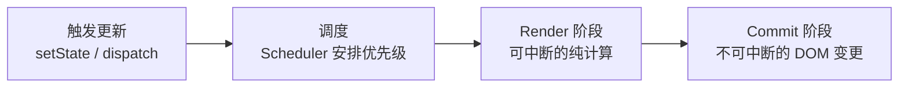
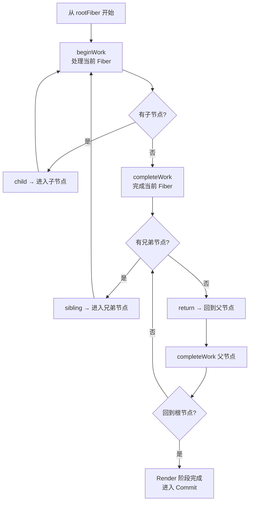
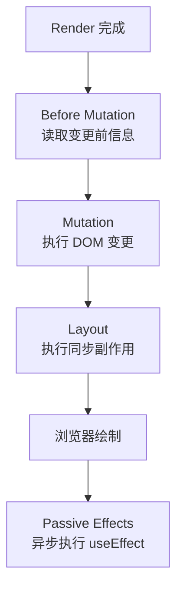
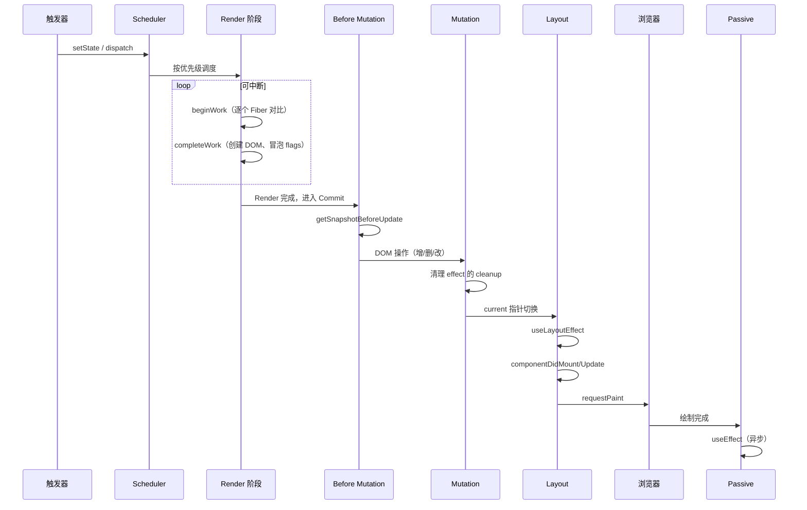

# Render 与 Commit 两阶段渲染

## 1. 概述：一次状态更新的完整流程

React 的每一次状态更新都可以概括为三个阶段：



| 阶段            | 是否可中断  | 作用                                   | 可见性               |
| --------------- | ----------- | -------------------------------------- | -------------------- |
| **触发 + 调度** | —           | 标记 Update，确定优先级，安排执行      | —                    |
| **Render**      | ✅ 可中断   | 构建 Fiber 树、diff 新旧树、标记副作用 | 不可见（内存中计算） |
| **Commit**      | ❌ 不可中断 | 将变更应用到 DOM、执行副作用           | 用户可见             |

关键认知：**"渲染"在 React 语境中指 Render 阶段（执行组件函数），而不是提交 DOM 更新。**不要将这两个阶段混为一谈。

## 2. Render 阶段

### 2.1 目标

Render 阶段的目标是**构建 work-in-progress Fiber 树并标记副作用**。它是纯计算过程，不产生任何用户可见的 DOM 变更，因此可以被中断、重试或丢弃。

### 2.2 beginWork

`beginWork` 是 Render 阶段的前半部分，负责**向下深度优先遍历**每个 Fiber 节点：

```javascript
// beginWork 的核心逻辑（简化）
function beginWork(current, workInProgress, renderLanes) {
  // 1. 检查是否可以跳过（Bailout）
  if (current !== null) {
    const oldProps = current.memoizedProps
    const newProps = workInProgress.pendingProps

    if (
      oldProps === newProps &&
      !hasContextChanged() &&
      !hasScheduledUpdate()
    ) {
      // props、state、context 均未变化 → bailout
      return bailoutOnAlreadyFinishedWork(current, workInProgress, renderLanes)
    }
  }

  // 2. 根据 fiber.tag 进入不同处理逻辑
  switch (workInProgress.tag) {
    case FunctionComponent:
      return updateFunctionComponent(current, workInProgress, renderLanes)
    case ClassComponent:
      return updateClassComponent(current, workInProgress, renderLanes)
    case HostComponent: // 原生 DOM 元素
      return updateHostComponent(current, workInProgress, renderLanes)
    case HostText: // 文本节点
      return updateHostText(current, workInProgress)
    // ... 其他类型
  }
}
```

`beginWork` 的主要工作：

1. 对比新旧 props/state/context，判断是否可以 **bailout**（跳过）。
2. 不可 bailout 时，执行组件函数或 `render()`，获取新的子 Element 列表。
3. 调用 `reconcileChildren` 对比新旧子 Element，为子 Fiber 标记 `flags`。

### 2.3 completeWork

`completeWork` 是 Render 阶段的后半部分，在**从子节点返回时向上**执行：

```javascript
// completeWork 的核心逻辑（简化）
function completeWork(current, workInProgress, renderLanes) {
  switch (workInProgress.tag) {
    case HostComponent:
      // 创建或更新 DOM 节点
      if (current === null) {
        // 首次渲染：创建真实 DOM
        const instance = createInstance(
          workInProgress.type,
          workInProgress.pendingProps,
        )
        workInProgress.stateNode = instance
      } else {
        // 更新：计算需要更新的属性
        updateHostComponent(current, workInProgress, renderLanes)
      }
      break
    case HostText:
      // 创建或更新文本节点
      break
    // ...
  }

  // 将子节点的副作用冒泡到当前节点
  bubbleProperties(workInProgress)
}
```

`completeWork` 的主要工作：

1. 为 HostComponent（原生元素）创建或更新对应的 DOM 节点。
2. 将子节点的 `flags` 和 `subtreeFlags` **向上冒泡**到父节点。
3. 这样在 Commit 阶段，根节点可以直接知道整棵树需要执行哪些操作。

### 2.4 Render 阶段的遍历过程



### 2.5 可中断性

```javascript
// 时间切片的工作循环
function workLoopConcurrent() {
  // shouldYield 检查剩余时间是否不足
  while (workInProgress !== null && !shouldYield()) {
    workInProgress = performUnitOfWork(workInProgress)
  }
  // 时间不够了 → 暂停，保存 workInProgress
  // 浏览器空闲时从上次中断点继续
}
```

如果高优先级更新（如用户输入）进入，当前低优先级的 Render 可以被**丢弃**——work-in-progress 树被废弃，重新基于 current 树处理高优先级更新。

## 3. Commit 阶段

当 Render 阶段完成（`workInProgress` 为 `null`），且没有更高优先级的更新打断时，进入 Commit 阶段。

### 3.1 三个子阶段



### 3.2 Before Mutation 阶段

```javascript
function commitBeforeMutationEffects(root, firstChild) {
  // 遍历 Fiber 树中标记了 flags 的节点
  let fiber = firstChild
  while (fiber !== null) {
    // 处理 Snapshot flag
    if (fiber.flags & Snapshot) {
      // 调用 Class 组件的 getSnapshotBeforeUpdate
      const instance = fiber.stateNode
      const snapshot = instance.getSnapshotBeforeUpdate(
        fiber.memoizedProps,
        fiber.alternate.memoizedState,
      )
      instance.__reactInternalSnapshotBeforeUpdate = snapshot
    }
    fiber = fiber.child // 向下遍历
  }
}
```

主要工作：在 DOM 变更前**读取旧状态**（如滚动位置）。

### 3.3 Mutation 阶段

```javascript
function commitMutationEffects(root, firstChild) {
  let fiber = firstChild
  while (fiber !== null) {
    const flags = fiber.flags

    if (flags & Placement) {
      // 插入新 DOM 节点
      commitPlacement(fiber)
    }

    if (flags & Update) {
      // 更新 DOM 属性
      commitUpdate(fiber.stateNode, fiber.updateQueue)
    }

    if (flags & Deletion) {
      // 删除 DOM 节点，并执行卸载组件的清理
      commitDeletion(fiber, root)
    }

    fiber = fiber.child
  }
}
```

这是唯一会产生**用户可见 DOM 变化**的阶段，**同步且不可中断**，保证 UI 状态一致。

### 3.4 Layout 阶段

```javascript
function commitLayoutEffects(root, committedLanes) {
  // 1. 切换 current 指针
  root.current = finishedWork

  // 2. 同步执行 useLayoutEffect 的 setup
  commitLayoutEffectOnFiber(root, committedLanes)

  // 3. 更新 ref
  commitAttachRef(fiber)
}
```

Layout 阶段在 DOM 变更完成后**同步**执行：

- `useLayoutEffect` 的 setup 函数。
- `componentDidMount` / `componentDidUpdate`。
- 更新所有 `ref`。

此时 DOM 已经更新但**浏览器尚未绘制**，所以可以安全地读取布局信息并做同步调整。

### 3.5 Passive 阶段

```javascript
// 通过 Scheduler 异步调度，不阻塞提交和绘制
function commitPassiveEffects(root) {
  // 1. 执行上一次 useEffect 的 cleanup
  flushPassiveUnmountEffects(root.current)

  // 2. 执行本次 useEffect 的 setup
  flushPassiveMountEffects(root.current)
}
```

Passive 阶段在浏览器绘制后**异步执行** `useEffect`，不阻塞用户看到新 UI。

## 4. 完整时序图



## 5. 与 React 15 的关键区别

|                | React 15（Stack）     | React 16+（Fiber）               |
| -------------- | --------------------- | -------------------------------- |
| **遍历方式**   | 递归、不可中断        | 循环 + 链表、可中断              |
| **Render**     | 同步执行完整个树      | 时间切片，可暂停和恢复           |
| **优先级**     | 无（先到先得）        | Scheduler + Lane 模型            |
| **中断行为**   | 必须一次性完成        | 可以丢弃低优先级渲染             |
| **副作用处理** | Render 中调用生命周期 | Render 纯净，Commit 中执行副作用 |

## 6. 总结

- **Render 阶段是"计算"**：纯函数、可中断、不产生可见效果。组件函数在这里执行。
- **Commit 阶段是"提交"**：不可中断、同步应用 DOM 变更、执行副作用。
- **beginWork 决定是否复用 Fiber**，`completeWork` 创建 DOM 并冒泡 `flags`。
- **Mutation 子阶段执行真正的 DOM 操作**，这之前所有计算都只存在内存中。
- **useLayoutEffect 在绘前同步执行**，`useEffect` 在绘后异步执行。
- **不要将"渲染组件函数"与"更新 DOM"混为同一个阶段**——它们在 Fiber 架构中被严格分离。
