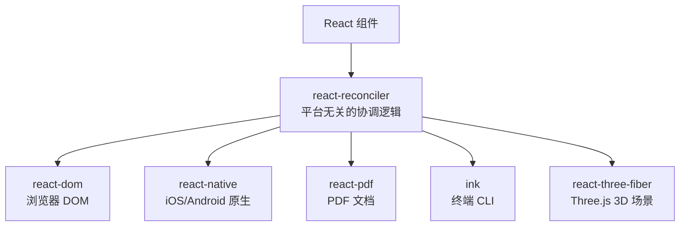
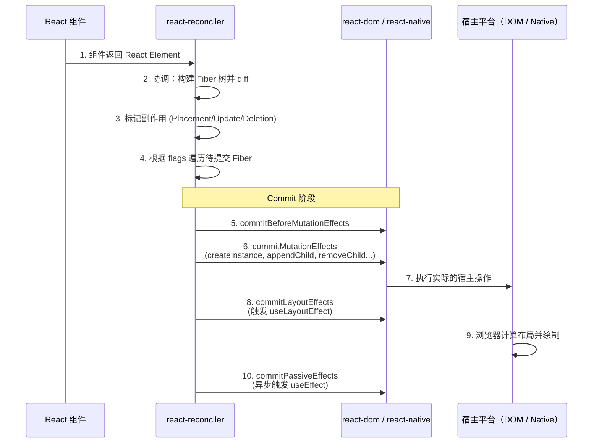

# 渲染器架构：从 Fiber 到宿主平台

## 1. 什么是渲染器？

渲染器（Renderer）是 React 架构中将**虚拟 DOM（React Element + Fiber）转换为目标平台 UI** 的模块。React 的核心协调逻辑（`react-reconciler`）是**平台无关的**，渲染器负责将协调器产出的变更落实到具体的宿主环境。



## 2. 渲染器的核心职责

| 职责              | 描述                                                        |
| ----------------- | ----------------------------------------------------------- |
| **节点创建**      | 根据 Fiber 类型创建对应的宿主节点（DOM 元素、原生控件等）   |
| **属性更新**      | 将 props 映射为宿主节点的属性、样式、事件等                 |
| **节点插入/删除** | 在宿主树中插入、移动、删除节点                              |
| **文本处理**      | 创建和更新文本节点                                          |
| **事件系统**      | 绑定和委托事件（如 React 的合成事件系统）                   |
| **组件实例管理**  | 触发组件的生命周期 Effect（`useEffect`、`useLayoutEffect`） |

## 3. React 渲染器的架构

### 3.1 react-reconciler：平台无关核心

`react-reconciler` 通过**可配置的宿主 API** 与渲染器交互：

```typescript
// react-reconciler 定义的宿主配置接口（简化）
interface HostConfig {
  // 节点创建
  createInstance(type, props, rootContainer, hostContext): Instance
  createTextInstance(text, rootContainer, hostContext): TextInstance

  // 树操作
  appendChild(parent, child): void
  appendChildToContainer(container, child): void
  insertBefore(parent, child, before): void
  removeChild(parent, child): void

  // 属性更新
  prepareUpdate(instance, type, oldProps, newProps): UpdatePayload
  commitUpdate(instance, updatePayload, type, oldProps, newProps): void

  // 事件
  addEventListener(target, eventType, listener): void
  removeEventListener(target, eventType, listener): void

  // 调度
  scheduleMicrotask(callback): void
}
```

### 3.2 react-dom：浏览器 DOM 渲染器

`react-dom` 是 React 在浏览器环境下的渲染器，实现了完整的 Web 平台宿主配置：

```
react-dom/
├── client/             # 浏览器端入口
│   ├── ReactDOMClient.js       # createRoot（React 18+）
│   └── ReactDOM.js             # render（兼容旧版）
├── server/             # 服务端渲染（SSR）
│   ├── ReactDOMServerNode.js   # Node.js 流式 SSR
│   └── ReactDOMServerBrowser.js # 浏览器端 SSR
├── events/             # 合成事件系统
│   ├── SyntheticEvent.js
│   └── EventPluginHub.js
└── shared/             # DOM 相关工具
    ├── CSSProperty.js
    ├── HTMLAttributes.js
    └── DOMProperty.js
```

`react-dom` 的核心实现：

```javascript
// react-dom 的宿主配置（简化）
const hostConfig = {
  createInstance(type, props) {
    const domElement = document.createElement(type)
    // 设置初始属性
    updateFiberProps(domElement, props)
    return domElement
  },

  createTextInstance(text) {
    return document.createTextNode(text)
  },

  appendChild(parent, child) {
    parent.appendChild(child)
  },

  insertBefore(parent, child, before) {
    parent.insertBefore(child, before)
  },

  removeChild(parent, child) {
    parent.removeChild(child)
  },

  commitUpdate(domElement, updatePayload, type, oldProps, newProps) {
    // 更新 DOM 属性
    updateProperties(domElement, updatePayload, type, oldProps, newProps)
  },
}
```

### 3.3 react-native：移动端渲染器

`react-native` 将 React 组件映射到 iOS/Android 的原生控件：

```javascript
// react-native 的宿主配置（简化）
const hostConfig = {
  createInstance(type, props) {
    // 通过 Native Bridge 创建原生 View
    return UIManager.createView(type, props)
  },

  appendChild(parent, child) {
    UIManager.appendChild(parent, child)
  },

  commitUpdate(instance, updatePayload, type, oldProps, newProps) {
    // 通过 Bridge 更新原生属性
    UIManager.updateView(instance, updatePayload)
  },
}
```

## 4. 渲染器如何处理不同类型的节点

### 4.1 宿主元素（HostComponent）

`<div>`、`<span>` 等浏览器原生元素，直接被渲染器转换为真实的 DOM 节点：

```jsx
// 源码
;<div id="root" className="container">
  <span>Hello</span>
</div>

// 渲染器执行（简化）
const div = document.createElement('div')
div.id = 'root'
div.className = 'container'
const span = document.createElement('span')
span.textContent = 'Hello'
div.appendChild(span)
```

### 4.2 文本节点（HostText）

文本内容可以是字符串或数字，渲染器将其创建为 `TextNode`：

```javascript
// React Element: { type: null, props: { children: 'Hello' } }
// ⬇️
// Fiber: { tag: HostText }
// ⬇️
// DOM: document.createTextNode('Hello')
```

### 4.3 Fragment

Fragment 不产生任何宿主节点，直接渲染其子元素：

```jsx
<>
  <li>A</li>
  <li>B</li>
</>

// 渲染器直接处理两个 <li>，不创建包裹节点
```

### 4.4 Portal

Portal 允许将子节点渲染到不同的 DOM 容器中：

```jsx
function Modal({ children }) {
  return createPortal(
    <div className="modal">{children}</div>,
    document.getElementById('modal-root'),
  )
}
// 渲染器将 modal div 挂载到 #modal-root 而非当前父节点下
```

## 5. React 合成事件系统（Synthetic Events）

`react-dom` 包含一个**合成事件系统**，它不直接将事件绑定到 DOM 元素上，而是使用**事件委托**：

```javascript
// React 17+ 将事件委托到 root 节点（React 17 之前是 document）
rootNode.addEventListener('click', e => {
  // 根据 e.target 找到对应的 Fiber 节点
  const fiber = getClosestInstanceFromNode(e.target)
  // 沿 Fiber 树向上收集事件处理函数
  const listeners = collectListeners(fiber, 'onClick')
  // 按捕获和冒泡顺序调用
  dispatchListeners(e, listeners)
})
```

**合成事件的特性：**

| 特性             | 说明                                                  |
| ---------------- | ----------------------------------------------------- |
| **事件委托**     | 所有同类型事件委托到 root 节点，减少 DOM 事件绑定数量 |
| **跨浏览器兼容** | 抹平不同浏览器的事件差异                              |
| **事件池化**     | React 17 之前复用事件对象（React 17+ 已移除）         |
| **自动清理**     | 组件卸载时自动解绑，防止内存泄漏                      |

## 6. 自定义渲染器

React 的架构设计使得开发者可以创建面向任意平台的渲染器：

```javascript
import Reconciler from 'react-reconciler'

// 为 Canvas 创建自定义渲染器
const CanvasRenderer = Reconciler({
  createInstance(type, props) {
    // 创建 Canvas 图元
  },
  createTextInstance(text) {
    // 创建 Canvas 文本
  },
  appendChild(parent, child) {
    // 将图元添加到父节点
  },
  // ... 其他宿主配置
})

function render(element, canvas) {
  const root = CanvasRenderer.createContainer(canvas)
  CanvasRenderer.updateContainer(element, root)
}
```

一些流行的自定义渲染器：

| 渲染器                | 目标平台         |
| --------------------- | ---------------- |
| `react-pdf`           | PDF 文档         |
| `ink`                 | 终端 CLI         |
| `react-three-fiber`   | Three.js 3D 场景 |
| `react-konva`         | Canvas 2D 图形   |
| `react-blessed`       | Curses 终端 UI   |
| `@react-email/render` | HTML 邮件        |
| `react-figma`         | Figma 插件       |

## 7. 渲染流程



## 8. 总结

- **渲染器是 React 跨平台能力的基石**：通过抽象宿主配置，同一套协调逻辑可以驱动完全不同的目标平台。
- **react-reconciler 是平台无关核心**：定义了组件调度、协调、副作用管理的逻辑。
- **react-dom 实现了 Web 平台适配**：包括 DOM 操作、属性更新、合成事件系统。
- **合成事件系统使用事件委托**：将事件绑定到 root 节点，提高性能并保证跨浏览器兼容。
- **自定义渲染器使 React 的应用场景远超 Web**：从 CLI 到 3D 渲染，React 的声明式编程模型在多个平台展现价值。
- **渲染器与协调器的分离是 React 最成功的架构设计之一**。
