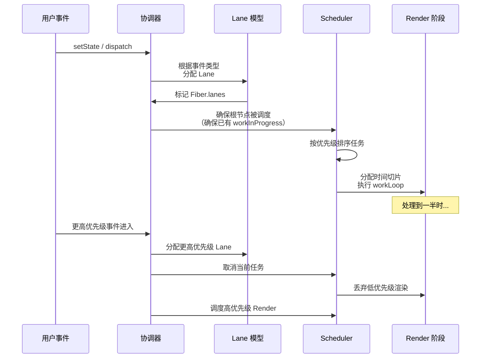

# 调度器（Scheduler）与 Lanes 优先级模型

## 1. 概述：两套优先级体系

React 的并发渲染**不是多线程**，而是将 Render 阶段拆分为可暂停的工作单元，并按优先级调度执行。为此，React 使用了两套相互协作的优先级体系：

| 体系                 | 作用                                                 | 所在模块           |
| -------------------- | ---------------------------------------------------- | ------------------ |
| **Lane 模型**        | 在协调器内部表示更新的优先级，可组合、可跳过、可重放 | `react-reconciler` |
| **Scheduler 优先级** | 调度 JavaScript 回调的紧急程度，控制何时执行         | `scheduler` 包     |

它们相关但不是同一个枚举。React 先通过 Lane 选择要处理的更新批次，再把对应工作映射为 Scheduler 任务。

## 2. Lane 模型详解

### 2.1 为什么需要 Lane？

React 16 的 expiration-time 模型使用时间戳判断优先级，存在局限性：

- 多个更新难以区分和分组。
- CPU 密集更新和 IO 密集更新无法有效分离。
- 难以描述"这个更新依赖于另一个更新"的关系。

React 18 引入的 **Lane 模型**使用二进制位掩码，从根本上解决了这些问题。

### 2.2 核心概念

```javascript
// Lane 使用 31 位二进制表示
// 不同的位代表不同类型的更新
const TotalLanes = 31

const NoLanes: Lane =    0b0000000000000000000000000000000
const SyncLane: Lane =   0b0000000000000000000000000000001   // 1
const InputLane: Lane =  0b0000000000000000000000000001000   // 8
const DefaultLane: Lane = 0b0000000000000000000000000100000  // 32
const IdleLane: Lane =   0b0100000000000000000000000000000   // 2^30
```

### 2.3 主要 Lane 类型

| Lane                  | 数值范围   | 触发场景                                   | 优先级         |
| --------------------- | ---------- | ------------------------------------------ | -------------- |
| `SyncLane`            | 1          | 同步更新（`flushSync`、`ReactDOM.render`） | 最高           |
| `InputContinuousLane` | ~8-64      | 用户连续输入（拖拽、滚动）                 | 高             |
| `DefaultLane`         | ~32-256    | 普通 setState（非 Transition）             | 中             |
| `TransitionLanes`     | ~512-2^20  | `startTransition` 标记的更新               | 低（可被打断） |
| `RetryLanes`          | ~2^22-2^25 | Suspense 重试                              | 低             |
| `IdleLane`            | 2^30       | 空闲时执行的更新                           | 最低           |
| `OffscreenLane`       | 2^31       | 离屏渲染                                   | 特殊           |

### 2.4 Lane 的位运算操作

```javascript
// 在 Fiber 上合并多个 Lane
fiber.lanes |= updateLane          // 添加一个更新
childLanes |= subtreeLane          // 合并子树的 Lane

// 判断和提取
if (lanes & SyncLane)              // 是否包含同步更新
const nextLane = getHighestPriorityLane(lanes)  // 取最高优先级的 Lane

// 删除和跳过
lanes &= ~completedLane            // 移除已完成的 Lane
const remaining = lanes & ~entangledLanes       // 跳过纠缠的 Lane

// 检查子节点是否有待处理工作
const includesSomeLane = (childLanes & renderLanes) !== NoLanes
```

位运算使得 Lane 的操作**极为高效**（单次 CPU 指令），这是时间戳模型无法做到的。

## 3. Scheduler 调度器

### 3.1 优先级映射

Scheduler 将 Lane 映射为自己的 5 级优先级：

```javascript
// Lane → Scheduler 优先级的映射
function lanesToSchedulerPriority(lanes) {
  const lane = getHighestPriorityLane(lanes)
  if (lane & SyncLane) return ImmediatePriority
  if (lane & InputContinuousLane) return UserBlockingPriority
  if (lane & DefaultLane) return NormalPriority
  // ... 依此类推
}
```

### 3.2 Scheduler 优先级级别

```javascript
// Scheduler 的优先级常量
const ImmediatePriority = 1 // 超时 -1ms（立即过期）
const UserBlockingPriority = 2 // 超时 250ms
const NormalPriority = 3 // 超时 5000ms
const LowPriority = 4 // 超时 10000ms
const IdlePriority = 5 // 超时 maxSigned31BitInt

// 每个优先级对应不同的 timeout
var IMMEDIATE_PRIORITY_TIMEOUT = -1
var USER_BLOCKING_PRIORITY_TIMEOUT = 250
var NORMAL_PRIORITY_TIMEOUT = 5000
var LOW_PRIORITY_TIMEOUT = 10000
var IDLE_PRIORITY_TIMEOUT = 1073741823 // never
```

### 3.3 时间切片（Time Slicing）

Scheduler 的核心工作是按时间切片分配 CPU 时间：

```javascript
// Scheduler 的工作循环（简化）
function workLoop(hasTimeRemaining, initialTime) {
  let currentTime = initialTime
  currentTask = peek(taskQueue) // 取最高优先级任务

  while (currentTask !== null) {
    // 任务未过期 且 时间用尽 → 暂停
    if (currentTask.expirationTime > currentTime && !hasTimeRemaining) {
      break
    }

    const callback = currentTask.callback
    if (callback !== null) {
      const didTimeout = currentTask.expirationTime <= currentTime
      // 执行任务并检查是否还有后续工作
      const continuationCallback = callback(didTimeout)
      if (continuationCallback !== null) {
        currentTask.callback = continuationCallback
      } else {
        pop(taskQueue) // 任务完成
      }
    }

    currentTask = peek(taskQueue)
  }

  // 返回 true 表示还有工作未完成
  return currentTask !== null
}
```

## 4. 更新类型的 Lane 分配

### 4.1 离散事件 vs 连续事件

```javascript
// 点击事件 → 高优先级（SyncLane 或 InputDiscreteLane）
<button onClick={() => setCount(c => c + 1)}>

// 输入事件 → 连续输入优先级（InputContinuousLane）
<input onChange={e => setText(e.target.value)}>
```

离散事件（点击、按键）比连续事件（拖拽、滚动）拥有更高的默认优先级。

### 4.2 Transition：可被打断的低优先级更新

```jsx
import { startTransition } from 'react'

function SearchPage() {
  const [query, setQuery] = useState('')
  const [results, setResults] = useState([])

  function handleChange(e) {
    // 高优先级：立即更新输入框
    setQuery(e.target.value)

    // 低优先级：可以被输入打断
    startTransition(() => {
      setResults(search(e.target.value))
    })
  }
}
// 如果用户在搜索完成前继续输入：
// → 旧的搜索渲染被丢弃
// → 以最新的 query 开始新的搜索渲染
```

Transition Lane 的核心特性：

- 优先级低于用户交互。
- 如果更高优先级的更新进入，**当前 Transition 渲染被丢弃**。
- 适合：路由切换、搜索过滤、tab 切换等非紧急 UI 更新。

### 4.3 useDeferredValue

```jsx
function SearchPage({ query }) {
  // deferredQuery 的更新优先级低于 query
  const deferredQuery = useDeferredValue(query)

  // query 立即更新输入框
  // deferredQuery 延迟更新搜索结果列表
  return (
    <>
      <input value={query} />
      <SearchResults query={deferredQuery} />
    </>
  )
}
```

`useDeferredValue` 本质上将值的更新标记为 Transition Lane，让 React 可以在后台准备新值的同时保持 UI 可交互。

## 5. Lane 的纠缠（Entanglement）与合并（Batching）

### 5.1 Lane 纠缠

当不同类型的更新相互依赖时，它们的 Lane 会被"纠缠"在一起：

```javascript
// 例如：Suspense 重试与 Transition 之间的纠缠
// 如果一个组件同时触发了 Transition 和 Suspense 重试，
// 这两个 Lane 会被纠缠，确保它们在同一批次中处理
function entangleTransitions(root, fiber, lane) {
  // 将相关 Lane 合并到一起处理
}
```

### 5.2 更新合并

```jsx
function handleClick() {
  setCount(c => c + 1) // 创建 Update A
  setCount(c => c + 1) // 创建 Update B
  setName('new') // 创建 Update C
}
// 三个 Update 在同一个事件处理中创建
// React 将它们合并到一次 Render/Commit 中
```

## 6. 完整调度流程



## 7. 总结

- **Lane 模型是 React 18 引入的更新优先级核心**：使用二进制位掩码，支持组合、跳过和重放。
- **Scheduler 是独立的通用任务调度包**：将 Lane 映射为调度优先级，按时间切片分配 CPU 时间。
- **两套优先级相互协作**：Lane 决定"处理哪批更新"，Scheduler 决定"何时执行"。
- **离散事件 > 连续事件 > Transition > Idle**：React 自动为不同来源的更新分配 Lane。
- **`startTransition` 产生可被打断的 Transition Lane**：适合非紧急 UI 更新。
- **时间切片让长任务不会长时间阻塞主线程**，保证用户交互始终流畅。
