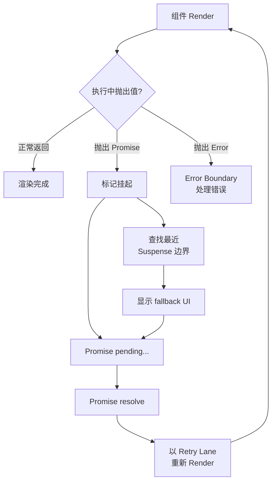
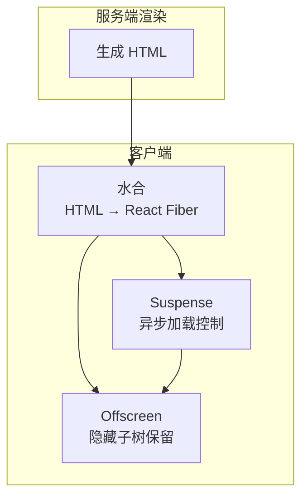

# Suspense、Offscreen 与 Hydration：并发特性

## 1. Suspense：声明式异步 UI

### 1.1 什么是 Suspense？

Suspense 是 React 提供的**声明式加载状态管理机制**。组件在渲染时可以"挂起"（suspend），告诉 React "我还没准备好"，React 则显示备用的 fallback UI，等数据就绪后再自动恢复。

```jsx
import { Suspense } from 'react'

function ProfilePage() {
  return (
    <Suspense fallback={<Loading />}>
      <ProfileDetails />
      <RecentPosts />
    </Suspense>
  )
}
// ProfileDetails 或 RecentPosts 中任意组件挂起 → 显示 <Loading />
// 两者都就绪 → 替换为完整内容
```

### 1.2 核心机制：Thenable 抛出

Suspense 的核心机制基于一个"反直觉"的模式——**在 Render 中抛出 Promise**：

```javascript
// Suspense 的内部工作流程（简化）
function renderWithSuspense(Component) {
  try {
    return Component() // 执行组件，可能抛出 thenable
  } catch (thrownValue) {
    if (thrownValue instanceof Promise) {
      // 1. 标记当前工作为"挂起"
      // 2. 沿 Fiber 树向上查找最近的 Suspense 边界
      const boundary = findNearestSuspenseBoundary()
      // 3. 显示 fallback
      showFallback(boundary)
      // 4. Promise resolve 后，以合适的 Lane 重试 Render
      thrownValue.then(() => {
        retryRender(boundary)
      })
    } else {
      // 真正的错误 → 交给 Error Boundary 处理
      throw thrownValue
    }
  }
}
```



### 1.3 Suspense 的数据源

Suspense 本身不规定数据的来源。任何能在 Render 中抛出 Promise 的机制都可以与 Suspense 集成：

| 数据源                       | 说明                                         |
| ---------------------------- | -------------------------------------------- |
| **React.lazy**               | 代码分割，动态 `import()` 的 Promise         |
| **React Server Components**  | 服务端组件流式传输                           |
| **支持 Suspense 的数据框架** | Relay、Next.js App Router、TanStack Query 等 |
| **自定义实现**               | 手动 throw Promise（不推荐，需要理解缓存）   |

```jsx
// React.lazy：最常用的 Suspend 触发方式
const LazyComponent = lazy(() => import('./HeavyComponent'))

function App() {
  return (
    <Suspense fallback={<Spinner />}>
      <LazyComponent />
    </Suspense>
  )
}
```

### 1.4 嵌套 Suspense 边界

多个 Suspense 边界可以嵌套，各自独立处理：

```jsx
<Suspense fallback={<PageSpinner />}>
  <Header /> {/* 很快加载 */}
  <Suspense fallback={<SidebarSkeleton />}>
    <Sidebar /> {/* 较慢加载 —— 只会替换 SidebarSkeleton */}
  </Suspense>
  <Suspense fallback={<ContentSkeleton />}>
    <Content /> {/* 最慢加载 —— 独立显示自己的 fallback */}
  </Suspense>
</Suspense>
// Header 立即可见
// Sidebar 和 Content 各自独立加载
// PageSpinner 只在 Header 也挂起时才显示
```

### 1.5 Transition 与 Suspense

```jsx
function App() {
  const [tab, setTab] = useState('home')

  function switchTab(nextTab) {
    startTransition(() => {
      setTab(nextTab)
    })
  }

  return (
    <Suspense fallback={<Spinner />}>
      <TabContent tab={tab} />
    </Suspense>
  )
}
// 使用 startTransition 切换 tab：
// → 旧 tab 内容保持可见
// → 新 tab 在后台加载
// → 加载完成后才替换
// → 避免了"切换 → 闪现 Spinner → 出现新内容"的糟糕体验
```

不使用 Transition 时，切换 tab 会导致 Suspense 立即显示 fallback，覆盖掉当前内容，造成布局跳动。

## 2. Offscreen：保留隐藏的子树

### 2.1 概念

Offscreen 允许 React 保留一棵暂时**隐藏但不卸载**的组件树，其状态和部分资源在隐藏期间继续保持：

```jsx
// 概念性 API（React 18+ 实验性，未来将稳定）
<Offscreen mode="visible">
  <TabPanel>Tab 1 Content</TabPanel>
</Offscreen>
<Offscreen mode="hidden">
  <TabPanel>Tab 2 Content</TabPanel>
</Offscreen>
```

### 2.2 与卸载的区别

|                | 卸载（Unmount）      | Offscreen（隐藏）      |
| -------------- | -------------------- | ---------------------- |
| **组件实例**   | 销毁                 | 保留                   |
| **Hooks 状态** | 丢失                 | 保留                   |
| **DOM 节点**   | 移除                 | 保留（隐藏）           |
| **Effect**     | 执行 cleanup         | 可选保留或清理         |
| **恢复速度**   | 慢（需重建全部状态） | 快（状态完整）         |
| **内存占用**   | 低                   | 高（保留状态占用内存） |

### 2.3 后台渲染

Offscreen 允许隐藏的 UI 在后台以**低优先级**准备：

```text
可见区域的 Tab 1  → 高优先级渲染
隐藏区域的 Tab 2  → Offscreen Lane（低优先级），后台准备
                   当用户切换到 Tab 2 时，内容可能已经就绪
```

这与 `keep-alive`（Vue 中的缓存机制）理念类似，但 React 的 Offscreen 更侧重于**调度优先级**而非纯粹的内存缓存。

### 2.4 与 `display: none` 的区别

CSS `display: none` 只是视觉上隐藏，组件仍然挂载并占用渲染资源。Offscreen 在底层将隐藏的子树标记为低优先级，让 React 可以更积极地跳过它们的渲染。

## 3. Hydration：服务端渲染的水合

### 3.1 SSR 与水合的基本流程

服务端渲染（SSR）产出的 HTML 是静态的，需要客户端 React "激活"以添加交互性——这个过程称为**水合（Hydration）**：

```text
1. 服务端：渲染 HTML → 发送到浏览器
2. 浏览器：解析 HTML，显示页面（此时不可交互）
3. 客户端：下载 JS 包 → React.hydrateRoot()
4. 水合过程：React 遍历整个 Fiber 树，为现有 DOM 绑定事件和状态
5. 水合完成：页面变为可交互
```

```javascript
// 客户端入口
import { hydrateRoot } from 'react-dom/client'

const root = hydrateRoot(document.getElementById('root'), <App />)
// hydrateRoot 将 React Element/Fiber 树与已有 DOM 对齐
// 尽量复用服务端生成的 HTML，而非重新创建
```

### 3.2 选择性水合（Selective Hydration）

React 18+ 的并发模式支持**按边界和优先级**推进水合：

```jsx
function App() {
  return (
    <Suspense fallback={<Loading />}>
      <Header /> {/* 交互优先级高 → 先水合 */}
      <Suspense fallback={<Spinner />}>
        <Sidebar /> {/* 被 Suspense 包裹 → 可延迟水合 */}
      </Suspense>
      <Suspense fallback={<Spinner />}>
        <Comments /> {/* 被 Suspense 包裹 → 可延迟水合 */}
      </Suspense>
    </Suspense>
  )
}
```

**选择性水合的工作方式**：

1. React 开始水合整个页面。
2. 用户点击了 `Sidebar` 区域 → React **暂停**当前水合。
3. 优先水合 `Sidebar`（因为用户与之交互了）。
4. Sidebar 水合完成 → 回到之前暂停的位置继续水合。

### 3.3 水合不匹配（Hydration Mismatch）

当服务端 HTML 与客户端渲染输出不一致时，React 会报错或产生非预期行为：

```jsx
// ❌ 常见的不匹配原因
function Component() {
  // 服务端和客户端可能产生不同的随机数
  const id = Math.random()

  // 服务端没有 window 对象
  const width = window.innerWidth

  // 服务端不知道本地时间
  const now = new Date().toLocaleString()

  return (
    <div id={id}>
      {width}px - {now}
    </div>
  )
}
```

**原则**：服务端渲染和客户端渲染在首次渲染时应**产生完全相同的输出**。如果必须使用浏览器 API，应在 `useEffect` 中进行（Effect 不在服务端执行）。

```jsx
// ✅ 正确处理浏览器特有值
function Component() {
  const [width, setWidth] = useState(0)

  useEffect(() => {
    setWidth(window.innerWidth) // 仅在客户端执行
  }, [])

  return <div>{width}px</div>
}
```

### 3.4 React 19 的并发水合增强

React 19 对水合做了进一步改进：

- 更激进的选择性水合，减少交互等待时间。
- 改善水合出错时的恢复策略。
- 流式 SSR 与水合的更紧密配合。

## 4. 三者之间的关系



- **Suspense** 在客户端控制异步内容的加载和边界。
- **Offscreen** 在客户端管理隐藏 UI 的保留和后台准备。
- **Hydration** 是服务端到客户端的桥梁，Suspense 边界也是选择性水合的边界。

## 5. 总结

- **Suspense 是声明式异步 UI 管理**：组件挂起 → 显示 fallback → 数据就绪后恢复。
- **核心机制是 Render 中抛出 thenable**：React 捕获 Promise，找到最近 Suspense 边界，等待 resolve 后重试。
- **嵌套 Suspense 边界各自独立**：可以精细控制页面的加载体验。
- **配合 `startTransition` 避免"闪现 fallback"**：旧 UI 保持可见，新 UI 在后台准备。
- **Offscreen 保留而非销毁隐藏子树**：状态保持、快速恢复，适合 Tab 切换等场景。
- **Hydration 是 SSR 到客户端交互的桥梁**：复用服务端 HTML，绑定事件和状态。
- **选择性水合按用户交互优先级推进**：用户点击的区域优先水合，不阻塞交互。
- **水合不匹配需要优先修复**：确保客户端和服务器首次渲染输出一致。
