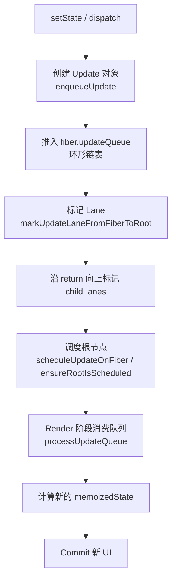

# 更新批处理（Batching）

## 1. 状态更新的生命周期

在 React 中，`setState` 或 `dispatch` 调用**不会直接修改当前渲染中的状态变量**。相反，它创建一个 Update 对象放入 Fiber 的更新队列，由协调器在下一次 Render 中处理：



### 1.1 useState 的更新入口

`useState` 返回的 `setState` 本质是 `dispatchSetState`，它负责创建 Update 并入队、触发调度：

```javascript
// useState 返回的 setState 本体（ReactFiberHooks.js，简化）
function dispatchSetState(fiber, queue, action) {
  // 1. 确定本次更新的优先级 lane
  const lane = requestUpdateLane(fiber)

  // 2. 创建 Update 对象（action 即调用时传入的新值或更新函数）
  const update = {
    lane,
    action,
    hasEagerState: false, // 是否已提前算出新 state（eagerState 优化）
    eagerState: null,
    next: null,
  }

  if (isRenderPhaseUpdate(fiber)) {
    // Render 阶段内触发（如渲染时直接 setState）→ 走 render phase 队列
    enqueueRenderPhaseUpdate(queue, update)
  } else {
    // 正常阶段：入队，拿到 root 后触发调度
    const root = enqueueConcurrentHookUpdate(fiber, queue, update, lane)
    if (root !== null) {
      scheduleUpdateOnFiber(root, fiber, lane) // 内部会调用 markUpdateLaneFromFiberToRoot
    }
  }
}
```

## 2. Update 对象

### 2.1 Update 的结构

```typescript
// Hook 的 Update 对象（useState / useReducer，React 最新源码简化）
type Update<S, A> = {
  lane: Lane // 优先级
  action: A // 新值 或 更新函数 ((prev) => next)
  hasEagerState: boolean // 是否已提前算出新 state（eagerState 优化）
  eagerState: S | null // 提前算好的结果
  next: Update<S, A> | null // 环形链表下一个节点
}
```

> [!NOTE]
> Hooks 用 `action` 字段承载更新；Class 组件的 Update 则用 `tag`（区分 UpdateState/ReplaceState/ForceUpdate）+ `payload` + `callback` 字段。二者是两套不同的 Update 结构。

### 2.2 两种更新方式

```jsx
// 方式 1：直接传值
setCount(5)
// → action: 5

// 方式 2：函数式更新
setCount(prev => prev + 1)
// → action: (prev) => prev + 1
```

**函数式更新的优势**：基于前一个 Update 的结果计算，适合连续更新：

```jsx
function handleClick() {
  setCount(c => c + 1) // prev = 0 → 结果为 1
  setCount(c => c + 1) // prev = 1 → 结果为 2
  setCount(c => c + 1) // prev = 2 → 结果为 3
}
// 三次函数式更新：最终 count = 3 ✅

function handleClick() {
  setCount(count + 1) // 0 + 1 = 1
  setCount(count + 1) // 0 + 1 = 1（基于闭包中捕获的值）
  setCount(count + 1) // 0 + 1 = 1
}
// 三次直接传值：最终 count = 1 ❌
```

## 3. 更新队列（Update Queue）

### 3.1 队列结构

```typescript
// Hook 的更新队列（挂载在 hook.queue 上）
type UpdateQueue<S, A> = {
  pending: Update<S, A> | null           // 待处理更新的环形链表（尾节点）
  lanes: Lanes                           // 待处理更新的 Lane 合集
  dispatch: (A => mixed) | null          // 触发更新的函数（setState 本体）
  lastRenderedReducer: ((S, A) => S) | null // 上次渲染使用的 reducer
  lastRenderedState: S                   // 上次渲染的 state
}
```

> [!NOTE]
> 队列里只有 `pending` 持有待处理链表；被跳过的低优先级 Update 沉淀到 **Hook 对象**的 `baseState` / `baseQueue` 上。Class 组件用另一套 `shared.pending` + `firstBaseUpdate`/`lastBaseUpdate` 结构。

### 3.2 环形链表设计

Update 使用**环形单向链表**存储，`pending` 指向最后一个加入的节点,这样做的好处是：

- 可以从任意位置开始遍历。
- 插入到尾部是 O(1)。
- 不需要额外的头尾指针。

```markdown
// 空队列
pending = null

// 添加 Update A
// A → A（自环）
// pending → A

// 添加 Update B
// A → B → A
// pending → B

// 添加 Update C
// A → B → C → A
// pending → C
```

这个环形链表的插入由 `enqueueConcurrentHookUpdate` 完成，是一个**巧妙的 O(1) 头插法**：

```javascript
function enqueueConcurrentHookUpdate(fiber, queue, update, lane) {
  const pending = queue.pending
  if (pending === null) {
    // 空队列：新节点自环
    update.next = update
  } else {
    // 非空：新节点插入到 pending 之后（即链表头部）
    // pending.next 原本是头节点，现在成为新节点的后继
    update.next = pending.next
    pending.next = update
  }
  // queue.pending 始终指向最后加入的节点（尾部），遍历时 pending.next 即最旧更新
  queue.pending = update
}
```

### 3.3 队列消费

在 Render 阶段，React 遍历 Update 链表，按优先级处理：

```javascript
// React 源码 updateReducer 的核心（useState / useReducer 共用，简化）
function updateReducer(hook, current, reducer, renderLanes) {
  const queue = hook.queue
  queue.lastRenderedReducer = reducer

  // 1. 把 queue.pending（环形）并入 baseQueue
  let baseQueue = hook.baseQueue
  const pendingQueue = queue.pending
  if (pendingQueue !== null) {
    if (baseQueue !== null) {
      // 两个环形链表首尾相接
      const baseFirst = baseQueue.next
      const pendingFirst = pendingQueue.next
      baseQueue.next = pendingFirst
      pendingQueue.next = baseFirst
    }
    hook.baseQueue = baseQueue = pendingQueue
    queue.pending = null
  }

  if (baseQueue !== null) {
    const first = baseQueue.next
    let newState = hook.baseState
    let newBaseState = null
    let newBaseQueueFirst = null
    let newBaseQueueLast = null
    let update = first

    do {
      if (!isSubsetOfLanes(renderLanes, update.lane)) {
        // 优先级不足 → 克隆进新 baseQueue，等待低优先级渲染重放
        const clone = { lane: update.lane, action: update.action, next: null }
        if (newBaseQueueLast === null) {
          newBaseQueueFirst = newBaseQueueLast = clone
          newBaseState = newState
        } else {
          newBaseQueueLast = newBaseQueueLast.next = clone
        }
      } else {
        // 优先级足够 → 用 reducer 计算新 state（useState 即 basicStateReducer）
        newState = reducer(newState, update.action)
      }
      update = update.next
    } while (update !== null && update !== first)

    // 2. 回写：未消费的 update 沉淀为新的 baseQueue
    hook.baseState = newBaseQueueLast === null ? newState : newBaseState
    hook.baseQueue = newBaseQueueLast
    if (newBaseQueueLast !== null) {
      newBaseQueueLast.next = newBaseQueueFirst
    }
    hook.memoizedState = newState
    queue.lastRenderedState = newState
  }

  return hook.memoizedState
}
```

`useState` 内部使用的 reducer 是 `basicStateReducer`，它**直接替换** state、不做浅合并（这正是 `useState` 与 Class `setState` 的核心差异）：

```javascript
function basicStateReducer(state, action) {
  return typeof action === 'function' ? action(state) : action
}
```

关键点：

- **高优先级 Lane 先处理**，低优先级 Update 被跳过。
- 被跳过的 Update **保留在队列中**，不会丢失。
- 这就是为什么低优先级更新（如 Transition）可以在被打断后正确恢复。

> [!NOTE]
> 跳过的低优先级 Update 并非简单丢弃，而是被 React 沉淀进 `hook.baseState` / `hook.baseQueue`（即 baseQueue 链表）：后续低优先级渲染到来时，从 `baseState` 出发**重放**整个 baseQueue，再叠加新 Update。这保证了被打断的更新最终仍按正确的顺序生效，且不会被高优先级更新的结果污染。

## 4. 批量更新（Batching）

### 4.1 什么是批量更新

批量更新是指 React 将**同一上下文中的多个 `setState` 调用合并为一次 Render 和 Commit**：

```jsx
function handleClick() {
  setCount(c => c + 1) // Update A
  setName('Alice') // Update B
  setAge(25) // Update C
}
// React 不会执行三次 Render
// 而是将 A、B、C 合并 → 一次 Render + 一次 Commit
```

### 4.2 React 18 的自动批量更新

React 18 之前（React 17），批量更新只在 React 事件处理函数中生效。Promise、`setTimeout`、原生事件监听器中的更新**不会自动批量处理**：

```jsx
// React 17 行为
function handleClick() {
  setTimeout(() => {
    setCount(c => c + 1) // → 触发 Render
    setName('Alice') // → 触发另一个 Render
    // 两次 Render，而非一次！
  }, 0)
}
```

**React 18 统一了批量更新行为**——无论在什么上下文中，多次 `setState` 都会被自动合并：

```jsx
// React 18 行为（使用 createRoot）
function handleClick() {
  setTimeout(() => {
    setCount(c => c + 1) // }
    setName('Alice') // } → 一次 Render
    // Promise、setTimeout、原生事件中都自动批量
  }, 0)
}
```

### 4.3 flushSync：退出批量更新

有时需要**立即同步应用更新**并读取更新后的 DOM：

```jsx
import { flushSync } from 'react-dom'

function handleClick() {
  flushSync(() => {
    setCount(c => c + 1)
  })
  // 此时 count 已经更新，DOM 已经同步变更

  console.log(ref.current.textContent) // 可以读到最新值

  // 注意：flushSync 会破坏批量更新的优化
  // 应尽量避免使用，仅在迫不得已时（如需要同步读取 DOM）
}
```

|              | 正常批量更新       | `flushSync`                |
| ------------ | ------------------ | -------------------------- |
| **执行方式** | 异步调度，合并更新 | 同步执行，立即渲染         |
| **性能**     | 高（合并 Render）  | 低（每次都单独 Render）    |
| **调度能力** | 支持优先级和中断   | 绕过调度器                 |
| **适用场景** | 99% 的场景         | 同步读取 DOM、第三方库集成 |

### 4.4 批量更新的实现原理

**React 17：显式批量上下文。** 靠一个全局 `isBatchingUpdates` 标志，事件处理器执行前打开、执行后关闭，期间所有 `setState` 只入队不调度：

```javascript
// React 17 的批量更新（简化）
let isBatchingUpdates = false
let batchUpdates = []

function batchedUpdates(fn) {
  isBatchingUpdates = true
  fn() // 执行事件处理函数
  isBatchingUpdates = false

  // 收集完毕，一次性开始 Render
  flushBatchUpdates()
}

function scheduleUpdate(fiber) {
  if (isBatchingUpdates) {
    // 批量上下文：只收集不执行
    batchUpdates.push(fiber)
  } else {
    // 非批量上下文（如 setTimeout）：直接调度 → 每次 setState 各自 Render
    scheduleWork(fiber)
  }
}
```

**React 18：调度器统一收集，无需显式上下文。** 移除 `isBatchingUpdates`，改由 `scheduleUpdateOnFiber → ensureRootIsScheduled` 判断是否已有排定的任务：

```javascript
// React 18 的核心：更新只“合并 lane”，不重复排任务
function scheduleUpdateOnFiber(root, fiber, lane) {
  // 1. 把本次更新的 lane 合并到 fiber 及其祖先的 lanes / childLanes 上
  markUpdateLaneFromFiberToRoot(fiber, lane)

  // 2. 交给调度器：若同一 root 已有排定的任务，只合并 lane，不新建任务
  ensureRootIsScheduled(root)
}

function ensureRootIsScheduled(root) {
  const existingCallbackNode = root.callbackNode
  if (existingCallbackNode !== null) {
    // 已有排定任务：新 lane 已在 markUpdateLaneFromFiberToRoot 中并入 root.pendingLanes
    // 复用该任务即可（若新更新优先级更高，React 会取消旧任务改排更高优先级，此处略）
    return
  }
  // 首次：根据 root.pendingLanes 取最高优先级，排定一个 Scheduler 任务
  const newCallbackNode = scheduleCallback(
    returnNextLanesPriority(),
    performConcurrentWorkOnRoot.bind(null, root),
  )
  root.callbackNode = newCallbackNode
}
```

同一个事件循环（tick）内的多次 `setState` 只会排定**一个** Scheduler 任务，任务真正执行时一次性消费队列里所有已收集的 Update——这就是 React 18 在 `setTimeout`、Promise 中也能自动批量、且不丢失优先级的根本原因。优先级调度细节见 [调度与优先级](./schedulingAndLanes.md)。

## 5. 不同更新来源的批量行为

| 更新来源                     | React 17  | React 18（createRoot） |
| ---------------------------- | --------- | ---------------------- |
| React 事件处理（onClick）    | ✅ 批量   | ✅ 批量                |
| `setTimeout` / `setInterval` | ❌ 不批量 | ✅ 批量                |
| Promise `.then()`            | ❌ 不批量 | ✅ 批量                |
| 原生事件监听                 | ❌ 不批量 | ✅ 批量                |
| `async/await`                | ❌ 不批量 | ✅ 批量                |
| `flushSync`                  | —         | ❌ 显式退出批量        |

## 6. Class 组件的 setState 与 Hooks 的对比

|                | Class `setState`              | Hooks `useState`           |
| -------------- | ----------------------------- | -------------------------- |
| **合并策略**   | 自动浅合并对象                | 替换整个值（不合并）       |
| **回调**       | `setState(partial, callback)` | 无回调（用 `useEffect`）   |
| **函数式更新** | ✅ `setState(prev => ...)`    | ✅ `setState(prev => ...)` |
| **批量更新**   | ✅ React 事件中自动           | ✅ React 18 所有上下文自动 |

```jsx
// Class setState：自动浅合并
this.setState({ name: 'Alice' }) // 合并到现有 state 对象
// state = { ...oldState, name: 'Alice' }

// Hooks useState：替换整个值
const [state, setState] = useState({ name: '', age: 0 })
setState({ name: 'Alice' }) // { name: 'Alice' } —— age 丢失了！
setState(prev => ({ ...prev, name: 'Alice' })) // ✅ 正确
```

## 7. 总结

- **更新即入队**：`setState` 只创建一个 `Update` 推入 `queue.pending` 环形链表（O(1) 插入），由下一轮 Render 消费，不直接改状态。
- **按 Lane 消费、不丢失**：`updateReducer` 只处理命中本次 `renderLanes` 的更新，低优先级更新沉淀到 `hook.baseState`/`baseQueue`，等待重放。
- **函数式更新**（`prev => prev + 1`）基于前一个结果，适合连续更新。
- **React 18 全局自动批量**：同一 tick 内多次 `setState` 合并为一次 Render；`flushSync` 是唯一的显式退出手段。
- **`useState` 直接替换值（`basicStateReducer`），Class `setState` 自动浅合并**——这是两者最核心的 API 差异。
