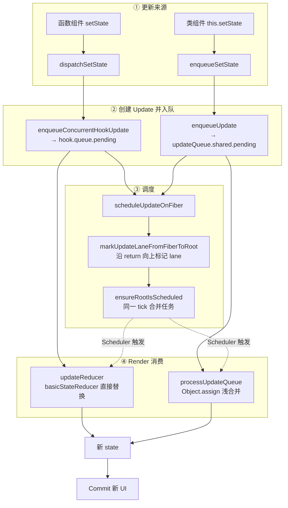
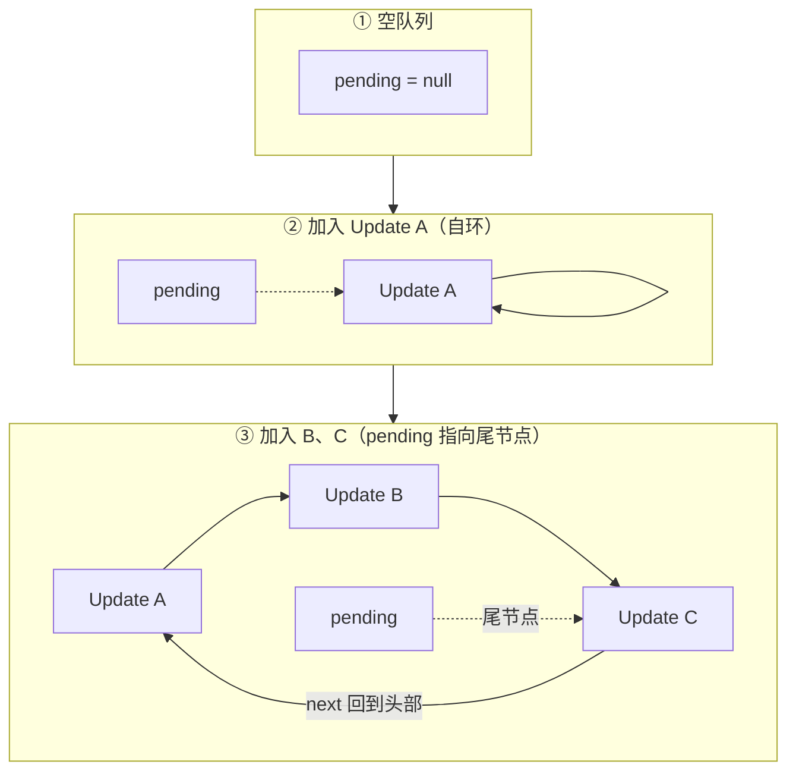

# 更新批处理（Batching）

## 1. 全景图：更新从入队到渲染

在 React 中，`setState`（Hook）或 `this.setState`（Class）调用**不会直接修改当前渲染中的状态变量**。相反，它创建一个 Update 对象放入 Fiber 的更新队列，由协调器在下一轮 Render 中消费。

函数组件（Hook）和类组件（Class）走的是**两套数据结构、一套调度**：



- **两套 Update、两套队列**：Hook 用 `action` 承载更新、挂 `hook.queue.pending`；Class 用 `tag + payload + callback`、挂 `queue.shared.pending`。
- **入队与调度统一**：无论哪种组件，最终都汇入 `scheduleUpdateOnFiber → markUpdateLaneFromFiberToRoot → ensureRootIsScheduled`，这是 React 18 自动批量 + 优先级的基础。
- **消费策略不同**：Hook 用 `basicStateReducer` **直接替换**，Class 用 `Object.assign` **浅合并**——这是两者 API 差异的根源。

## 2. Update 对象

### 2.1 Hook 的 Update 对象

`useState` 返回的 `setState` 创建的 Update，用 `action` 字段承载"**新值或更新函数**"：

:::code-group

```typescript [react-reconciler/src/ReactFiberHooks.js]
// Hook 的 Update 对象（useState / useReducer 共用）
type Update<S, A> = {
  lane: Lane // 优先级
  action: A // 新值 或 更新函数 ((prev) => next)
  hasEagerState: boolean // 是否已提前算出新 state（eagerState 优化）
  eagerState: S | null // 提前算好的结果
  next: Update<S, A> | null // 环形链表下一节点
}
```

:::

### 2.2 Class 的 Update 对象

`this.setState` 创建的 Update 用 `tag` 区分更新类型，`payload` 是部分 state，还支持更新后回调：

:::code-group

```typescript [react-reconciler/src/ReactUpdateQueue.js]
// Class 组件的 Update 对象（this.setState / forceUpdate 共用）
type Update<State> = {
  eventTime: number // 更新发生的时间
  lane: Lane // 优先级
  tag: 0 | 1 | 2 | 3 // UpdateState | ReplaceState | ForceUpdate | CaptureUpdate
  payload: any // partialState 对象 或 updater 函数
  callback: (() => mixed) | null // setState 的第二个参数（更新后回调）
  next: Update<State> | null // 环形链表下一节点
}
```

```typescript [react-reconciler/src/ReactUpdateQueue.js]
// Class Update 的 tag 取值（ReactUpdateQueue.js 中定义）
export const UpdateState = 0 // 默认：浅合并 payload
export const ReplaceState = 1 // 用 payload 整体替换（很少用）
export const ForceUpdate = 2 // forceUpdate：不比较、强制重渲染
export const CaptureUpdate = 3 // 错误边界捕获阶段使用
```

:::

> [!NOTE]
> 两套 Update 的核心差异：Hook 用 `action` 承载"**值或函数**"，靠 `typeof action === 'function'` 判断是哪种；Class 用 `tag` 显式区分四种更新类型，`payload` 是部分 state，`callback` 是更新后回调。这也是为什么 Class `setState` 有第二个回调参数，而 Hook 没有。

### 2.3 两种更新方式（直接传值 vs 函数式）

无论 Hook 还是 Class，都支持两种更新方式：

```jsx
// 方式 1：直接传值
setCount(5) // Hook  → action: 5
this.setState({ a: 1 }) // Class → payload: { a: 1 }

// 方式 2：函数式更新
setCount(prev => prev + 1) // Hook  → action: (prev) => prev + 1
this.setState(prevState => ({ a: 1 })) // Class → payload: (prevState) => ({ a: 1 })
```

**函数式更新的优势**：基于前一个 Update 的结果计算，适合连续更新：

```jsx
function handleClick() {
  setCount(c => c + 1) // prev = 0 → 结果为 1
  setCount(c => c + 1) // prev = 1 → 结果为 2
  setCount(c => c + 1) // prev = 2 → 结果为 3
}
// 三次函数式更新：最终 count = 3 ✅

function handleClick() {
  setCount(count + 1) // 0 + 1 = 1
  setCount(count + 1) // 0 + 1 = 1（基于闭包中捕获的值）
  setCount(count + 1) // 0 + 1 = 1
}
// 三次直接传值：最终 count = 1 ❌
```

## 3. 更新队列：两套结构

### 3.1 Hook 的 UpdateQueue

Hook 的更新队列挂在 `hook.queue` 上，`pending` 是待处理更新的环形链表：

:::code-group

```typescript [react-reconciler/src/ReactFiberHooks.js]
// Hook 的更新队列（挂载在 hook.queue 上）
type UpdateQueue<S, A> = {
  pending: Update<S, A> | null // 待处理更新的环形链表（尾节点）
  lanes: Lanes // 待处理更新的 Lane 合集
  dispatch: (A => mixed) | null // 触发更新的函数（setState 本体）
  lastRenderedReducer: ((S, A) => S) | null // 上次渲染使用的 reducer
  lastRenderedState: S // 上次渲染的 state
}
```

:::

### 3.2 Class 的 UpdateQueue

Class 的更新队列挂在 `fiber.updateQueue` 上，结构更复杂：用 `base*` 指针沉淀被跳过的低优先级更新，用 `shared.pending` 接收新更新，`effects` 存放回调：

:::code-group

```typescript [react-reconciler/src/ReactUpdateQueue.js]
// Class 组件的更新队列（挂载在 fiber.updateQueue 上）
type UpdateQueue<State> = {
  baseState: State // 低优先级更新被跳过前的状态快照
  firstBaseUpdate: Update<State> | null // 沉淀的低优先级更新链表头
  lastBaseUpdate: Update<State> | null // 沉淀的低优先级更新链表尾
  shared: SharedQueue<State> // 与 current 树共享的"待处理"区
  effects: Array<Update<State>> | null // 带 callback 的 Update（Commit 后触发）
}

type SharedQueue<State> = {
  pending: Update<State> | null // 待处理更新的环形链表（尾节点）
  lanes: Lanes // 待处理更新的 Lane 合集
  hiddenCallbacks: Array<() => mixed> | null // 离屏子树延迟的回调
}
```

:::

> [!NOTE]
> 两类队列的**共性**：都有 `pending` 环形链表承载新更新，都支持把低优先级更新"**沉淀**"下来等待重放。**差异**：Hook 的沉淀区在 **Hook 对象**的 `baseState`/`baseQueue` 上，Class 的沉淀区在**队列自身**的 `baseState`/`firstBaseUpdate`/`lastBaseUpdate` 上。

### 3.3 环形链表设计

两类 Update 都用**环形单向链表**存储，`pending` 指向最后加入的节点：



## 4. 入队：dispatchSetState 与 enqueueSetState

### 4.1 Hook 入队

`useState` 返回的 `setState` 本质是 `dispatchSetState`，它创建 Update、入队、触发调度：

:::code-group

```javascript [react-reconciler/src/ReactFiberHooks.js]
// useState 返回的 setState 本体（极简）
function dispatchSetState(fiber, queue, action) {
  const lane = requestUpdateLane(fiber) // 1. 确定本次更新优先级

  const update = {
    lane,
    action,
    hasEagerState: false,
    eagerState: null,
    next: null,
  }

  if (isRenderPhaseUpdate(fiber)) {
    enqueueRenderPhaseUpdate(queue, update) // Render 内触发 → 走 render phase 队列
  } else {
    const root = enqueueConcurrentHookUpdate(fiber, queue, update, lane) // 2. 入队
    if (root !== null) {
      scheduleUpdateOnFiber(root, fiber, lane) // 3. 触发调度
    }
  }
}
```

```javascript [react-reconciler/src/ReactFiberHooks.js]
// 环形链表 O(1) 尾插法（极简）
function enqueueConcurrentHookUpdate(fiber, queue, update, lane) {
  const pending = queue.pending
  if (pending === null) {
    update.next = update // 空队列：自环
  } else {
    update.next = pending.next // 新节点插入到 pending 之后（即链表头部）
    pending.next = update
  }
  queue.pending = update // pending 始终指向最后加入的节点（尾）
  return getRootForUpdatedFiber(fiber)
}
```

:::

### 4.2 Class 入队

`this.setState` 最终调用 `classComponentUpdater.enqueueSetState`，与 Hook 对称：

:::code-group

```javascript [react-reconciler/src/ReactFiberClassComponent.js]
// this.setState 的入口（极简）
const classComponentUpdater = {
  enqueueSetState(inst, payload, callback) {
    const fiber = getInstance(inst)
    const lane = requestUpdateLane(fiber) // 1. 确定优先级

    const update = createUpdate(lane) // 2. 创建 Class Update
    update.payload = payload
    if (callback !== undefined && callback !== null) {
      update.callback = callback // setState 的第二参数
    }

    const root = enqueueUpdate(fiber, update, lane) // 3. 入队
    if (root !== null) {
      scheduleUpdateOnFiber(root, fiber, lane) // 4. 触发调度
      entangleTransitions(root, fiber, lane)
    }
  },
  // enqueueReplaceState / enqueueForceUpdate 结构类似，仅 tag 不同
}
```

```javascript [react-reconciler/src/ReactUpdateQueue.js]
// createUpdate：构造一个 Class Update（极简）
function createUpdate(lane) {
  return {
    eventTime: requestEventTime(),
    lane,
    tag: UpdateState, // 默认 UpdateState，forceUpdate 等会改
    payload: null,
    callback: null,
    next: null,
  }
}
```

```javascript [react-reconciler/src/ReactFiberClassComponent.js]
// Class 环形链表 O(1) 尾插法（极简，与 Hook 版对称）
function enqueueUpdate(fiber, update, lane) {
  const sharedQueue = fiber.updateQueue.shared
  const pending = sharedQueue.pending
  if (pending === null) {
    update.next = update // 空队列：自环
  } else {
    update.next = pending.next // 新节点插入到 pending 之后
    pending.next = update
  }
  sharedQueue.pending = update // pending 指向尾节点
  return markUpdateLaneFromFiberToRoot(fiber, lane)
}
```

:::

> [!NOTE]
> 两条入队路径**几乎对称**：Hook 的 `enqueueConcurrentHookUpdate` 与 Class 的 `enqueueUpdate` 都是"**环形链表尾插 + 标记 lane**"，最后都返回 root 交给 `scheduleUpdateOnFiber`。唯一区别是 Update 对象的字段不同（`action` vs `tag + payload + callback`）。

## 5. 调度：统一的 lane 标记与任务合并

入队完成后，无论 Hook 还是 Class 都汇入同一条调度路径：

:::code-group

```javascript [react-reconciler/src/ReactFiberWorkLoop.js]
// 统一的调度入口（极简）
function scheduleUpdateOnFiber(root, fiber, lane) {
  // 1. 把本次更新的 lane 合并到 fiber 及其祖先的 lanes / childLanes 上
  markUpdateLaneFromFiberToRoot(fiber, lane)

  // 2. 交给调度器：若同一 root 已有排定的任务，只合并 lane，不新建任务
  ensureRootIsScheduled(root)
}
```

```javascript [react-reconciler/src/ReactFiberWorkLoop.js]
// 沿 return 链向上标记 lane（极简）
function markUpdateLaneFromFiberToRoot(sourceFiber, lane) {
  let node = sourceFiber
  let parent = sourceFiber.return
  while (parent !== null) {
    parent.childLanes = mergeLanes(parent.childLanes, lane)
    node = parent
    parent = parent.return
  }
  if (node.tag === HostRoot) {
    return node.stateNode // 返回根节点
  }
  return null
}
```

```javascript [react-reconciler/src/ReactFiberWorkLoop.js]
// 同一 tick 内合并任务（极简）
function ensureRootIsScheduled(root) {
  const existingCallbackNode = root.callbackNode
  if (existingCallbackNode !== null) {
    // 已有排定任务：新 lane 已在 markUpdateLaneFromFiberToRoot 中并入 root.pendingLanes
    // 复用该任务即可（若新更新优先级更高，React 会取消旧任务改排更高优先级，此处略）
    return
  }
  // 首次：根据 root.pendingLanes 取最高优先级，排定一个 Scheduler 任务
  const newCallbackNode = scheduleCallback(
    returnNextLanesPriority(),
    performConcurrentWorkOnRoot.bind(null, root),
  )
  root.callbackNode = newCallbackNode
}
```

:::

同一个事件循环（tick）内的多次 `setState` 只会排定**一个** Scheduler 任务，任务真正执行时一次性消费队列里所有已收集的 Update——这就是 React 18 在 `setTimeout`、Promise 中也能自动批量、且不丢失优先级的根本原因。优先级调度细节见 [调度与优先级](./schedulingAndLanes.md)。

## 6. 消费：updateReducer 与 processUpdateQueue

### 6.1 Hook 消费：直接替换

Render 阶段，`updateReducer` 按 Lane 消费 `queue.pending`，把低优先级 Update 沉淀到 `baseState`/`baseQueue`：

:::code-group

```javascript [react-reconciler/src/ReactFiberHooks.js]
// updateReducer 的核心（useState / useReducer 共用，简化）
function updateReducer(hook, current, reducer, renderLanes) {
  const queue = hook.queue
  queue.lastRenderedReducer = reducer

  // 1. 把 queue.pending（环形）并入 baseQueue
  let baseQueue = hook.baseQueue
  const pendingQueue = queue.pending
  if (pendingQueue !== null) {
    if (baseQueue !== null) {
      const baseFirst = baseQueue.next
      const pendingFirst = pendingQueue.next
      baseQueue.next = pendingFirst
      pendingQueue.next = baseFirst
    }
    hook.baseQueue = baseQueue = pendingQueue
    queue.pending = null
  }

  if (baseQueue !== null) {
    const first = baseQueue.next
    let newState = hook.baseState
    let newBaseState = null
    let newBaseQueueFirst = null
    let newBaseQueueLast = null
    let update = first

    do {
      if (!isSubsetOfLanes(renderLanes, update.lane)) {
        // 优先级不足 → 克隆进新 baseQueue，等待低优先级渲染重放
        const clone = { lane: update.lane, action: update.action, next: null }
        if (newBaseQueueLast === null) {
          newBaseQueueFirst = newBaseQueueLast = clone
          newBaseState = newState
        } else {
          newBaseQueueLast = newBaseQueueLast.next = clone
        }
      } else {
        // 优先级足够 → 用 reducer 计算新 state
        newState = reducer(newState, update.action)
      }
      update = update.next
    } while (update !== null && update !== first)

    hook.baseState = newBaseQueueLast === null ? newState : newBaseState
    hook.baseQueue = newBaseQueueLast
    if (newBaseQueueLast !== null) {
      newBaseQueueLast.next = newBaseQueueFirst
    }
    hook.memoizedState = newState
    queue.lastRenderedState = newState
  }

  return hook.memoizedState
}
```

```javascript [react-reconciler/src/ReactFiberHooks.js]
// useState 的 reducer：直接替换，不做浅合并
function basicStateReducer(state, action) {
  return typeof action === 'function' ? action(state) : action
}
```

:::

### 6.2 Class 消费：浅合并

Class 组件走 `processUpdateQueue`，结构对称但**消费策略不同**——通过 `getStateFromUpdate` 用 `Object.assign` 浅合并：

:::code-group

```javascript [react-reconciler/src/ReactUpdateQueue.js]
// Class 队列消费（极简，保留主干）
function processUpdateQueue(workInProgress, props, instance, renderLanes) {
  const queue = workInProgress.updateQueue

  // 1. 把 shared.pending（环形）拼接到 base 链表尾
  let firstBaseUpdate = queue.firstBaseUpdate
  let lastBaseUpdate = queue.lastBaseUpdate
  let pendingQueue = queue.shared.pending
  if (pendingQueue !== null) {
    queue.shared.pending = null
    const lastPending = pendingQueue
    const firstPending = lastPending.next
    lastPending.next = null // 断环
    if (lastBaseUpdate === null) {
      firstBaseUpdate = firstPending
    } else {
      lastBaseUpdate.next = firstPending
    }
    lastBaseUpdate = lastPending
  }

  if (firstBaseUpdate !== null) {
    let newState = queue.baseState
    let newBaseState = null
    let newFirstBaseUpdate = null
    let newLastBaseUpdate = null
    let update = firstBaseUpdate

    do {
      if (!isSubsetOfLanes(renderLanes, update.lane)) {
        // 优先级不足 → 克隆沉淀，等待重放
        const clone = {
          eventTime: update.eventTime,
          lane: update.lane,
          tag: update.tag,
          payload: update.payload,
          callback: update.callback,
          next: null,
        }
        if (newLastBaseUpdate === null) {
          newFirstBaseUpdate = newLastBaseUpdate = clone
          newBaseState = newState
        } else {
          newLastBaseUpdate = newLastBaseUpdate.next = clone
        }
      } else {
        // 优先级足够 → 应用 Update（浅合并）
        newState = getStateFromUpdate(
          workInProgress,
          queue,
          update,
          newState,
          props,
          instance,
        )
        if (update.callback !== null) {
          workInProgress.flags |= Callback // 标记：Commit 后触发回调
          const effects = queue.effects
          if (effects === null) queue.effects = [update]
          else effects.push(update)
        }
      }
      update = update.next
    } while (update !== null)

    // 2. 回写
    queue.baseState = newLastBaseUpdate === null ? newState : newBaseState
    queue.firstBaseUpdate = newFirstBaseUpdate
    queue.lastBaseUpdate = newLastBaseUpdate
    workInProgress.memoizedState = newState
  }

  return workInProgress.memoizedState
}
```

```javascript [react-reconciler/src/ReactUpdateQueue.js]
// Class 的 state 计算：按 tag 分派，UpdateState 走浅合并
function getStateFromUpdate(
  workInProgress,
  queue,
  update,
  prevState,
  nextProps,
  instance,
) {
  switch (update.tag) {
    case ReplaceState: {
      const payload = update.payload
      return typeof payload === 'function'
        ? payload.call(instance, prevState, nextProps)
        : payload
    }
    case UpdateState: {
      const payload = update.payload
      const partialState =
        typeof payload === 'function'
          ? payload.call(instance, prevState, nextProps)
          : payload
      if (partialState === null || partialState === undefined) {
        return prevState // 传入 null/undefined → 保持原 state
      }
      return Object.assign({}, prevState, partialState) // 浅合并
    }
    case ForceUpdate: {
      hasForceUpdate = true
      return prevState // 不改变 state，只强制重渲染
    }
  }
  return prevState
}
```

:::

关键点（两类消费共通）：

- **高优先级 Lane 先处理**，低优先级 Update 被跳过。
- 被跳过的 Update **保留在队列中**，不会丢失。
- 这就是低优先级更新（如 Transition）被打断后仍能正确恢复的原因。

> [!NOTE]
> 消费策略的差异直接决定了 API 行为：Hook 的 `basicStateReducer` **整体替换**，所以 `useState` 存对象时必须手动展开（`setState(prev => ({ ...prev, x }))`）；Class 的 `getStateFromUpdate` **自动浅合并**，所以 `this.setState({ name: 'Alice' })` 只覆盖 `name` 字段。

## 7. 批量更新（Batching）

### 7.1 什么是批量更新

批量更新是指 React 将**同一上下文中的多个 `setState` 调用合并为一次 Render 和 Commit**：

```jsx
function handleClick() {
  setCount(c => c + 1) // Update A
  setName('Alice') // Update B
  setAge(25) // Update C
}
// React 不会执行三次 Render
// 而是将 A、B、C 合并 → 一次 Render + 一次 Commit
```

### 7.2 React 17 vs React 18 的自动批量

React 18 之前（React 17），批量更新只在 React 事件处理函数中生效。Promise、`setTimeout`、原生事件监听器中的更新**不会自动批量处理**：

```jsx
// React 17 行为
function handleClick() {
  setTimeout(() => {
    setCount(c => c + 1) // → 触发 Render
    setName('Alice') // → 触发另一个 Render
    // 两次 Render，而非一次！
  }, 0)
}
```

**React 18 统一了批量更新行为**——无论在什么上下文中，多次 `setState` 都会被自动合并：

```jsx
// React 18 行为（使用 createRoot）
function handleClick() {
  setTimeout(() => {
    setCount(c => c + 1) // }
    setName('Alice') // } → 一次 Render
    // Promise、setTimeout、原生事件中都自动批量
  }, 0)
}
```

### 7.3 flushSync：退出批量更新

有时需要**立即同步应用更新**并读取更新后的 DOM：

```jsx
import { flushSync } from 'react-dom'

function handleClick() {
  flushSync(() => {
    setCount(c => c + 1)
  })
  // 此时 count 已经更新，DOM 已经同步变更

  console.log(ref.current.textContent) // 可以读到最新值

  // 注意：flushSync 会破坏批量更新的优化
  // 应尽量避免使用，仅在迫不得已时（如需要同步读取 DOM）
}
```

|              | 正常批量更新       | `flushSync`                |
| ------------ | ------------------ | -------------------------- |
| **执行方式** | 异步调度，合并更新 | 同步执行，立即渲染         |
| **性能**     | 高（合并 Render）  | 低（每次都单独 Render）    |
| **调度能力** | 支持优先级和中断   | 绕过调度器                 |
| **适用场景** | 99% 的场景         | 同步读取 DOM、第三方库集成 |

### 7.4 批量更新的实现原理

**React 17：显式批量上下文。** 靠一个全局 `isBatchingUpdates` 标志，事件处理器执行前打开、执行后关闭，期间所有 `setState` 只入队不调度：

```javascript
// React 17 的批量更新（简化）
let isBatchingUpdates = false
let batchUpdates = []

function batchedUpdates(fn) {
  isBatchingUpdates = true
  fn() // 执行事件处理函数
  isBatchingUpdates = false

  flushBatchUpdates() // 收集完毕，一次性开始 Render
}

function scheduleUpdate(fiber) {
  if (isBatchingUpdates) {
    batchUpdates.push(fiber) // 批量上下文：只收集不执行
  } else {
    scheduleWork(fiber) // 非批量上下文（如 setTimeout）：直接调度
  }
}
```

**React 18：调度器统一收集，无需显式上下文。** 移除 `isBatchingUpdates`，改由 `ensureRootIsScheduled` 判断是否已有排定的任务：

```javascript
// React 18 的批量更新（极简）：无需全局批量标志
function scheduleUpdateOnFiber(root, fiber, lane) {
  markUpdateLaneFromFiberToRoot(fiber, lane) // 合并 lane
  ensureRootIsScheduled(root) // 关键：已有任务则复用
}

function ensureRootIsScheduled(root) {
  if (root.callbackNode !== null) {
    return // 同一 tick 已有任务 → 复用，不新建（批量合并的根源）
  }
  root.callbackNode = scheduleCallback(
    performConcurrentWorkOnRoot.bind(null, root),
  ) // 首次才排定
}
```

因为对同一 root 只排一个任务，所以无论更新来自事件、`setTimeout` 还是 Promise，都天然合并。

## 8. 不同更新来源的批量行为

| 更新来源                     | React 17  | React 18（createRoot） |
| ---------------------------- | --------- | ---------------------- |
| React 事件处理（onClick）    | ✅ 批量   | ✅ 批量                |
| `setTimeout` / `setInterval` | ❌ 不批量 | ✅ 批量                |
| Promise `.then()`            | ❌ 不批量 | ✅ 批量                |
| 原生事件监听                 | ❌ 不批量 | ✅ 批量                |
| `async/await`                | ❌ 不批量 | ✅ 批量                |
| `flushSync`                  | —         | ❌ 显式退出批量        |

## 9. Class 与 Hooks 的对比

|                 | Class `setState`                  | Hooks `useState`                  |
| --------------- | --------------------------------- | --------------------------------- |
| **Update 结构** | `tag + payload + callback`        | `action`                          |
| **队列位置**    | `fiber.updateQueue`               | `hook.queue`                      |
| **合并策略**    | 自动浅合并对象（`Object.assign`） | 替换整个值（`basicStateReducer`） |
| **回调**        | `setState(partial, callback)`     | 无回调（用 `useEffect`）          |
| **函数式更新**  | ✅ `setState(prev => ...)`        | ✅ `setState(prev => ...)`        |
| **批量更新**    | ✅ React 事件中自动               | ✅ React 18 所有上下文自动        |

```jsx
// Class setState：自动浅合并
this.setState({ name: 'Alice' }) // 合并到现有 state 对象
// state = { ...oldState, name: 'Alice' }

// Hooks useState：替换整个值
const [state, setState] = useState({ name: '', age: 0 })
setState({ name: 'Alice' }) // { name: 'Alice' } —— age 丢失了！
setState(prev => ({ ...prev, name: 'Alice' })) // ✅ 正确
```

## 10. 总结

- **更新即入队**：`setState` 只创建 Update 推入环形队列，下一轮 Render 才消费。
- **两套结构、一套调度**：Hook 用 `action`、Class 用 `tag + payload + callback`，但都汇入 `scheduleUpdateOnFiber → ensureRootIsScheduled`。
- **消费策略不同**：Hook `basicStateReducer` 直接替换，Class `getStateFromUpdate` 浅合并。
- **按 Lane 消费、不丢失**：低优先级 Update 沉淀到 `baseState`/`baseQueue`（Hook）或 `firstBaseUpdate`/`lastBaseUpdate`（Class），等待重放。
- **React 18 全局自动批量**：同一 tick 只排一个任务，`flushSync` 是唯一显式退出手段。
