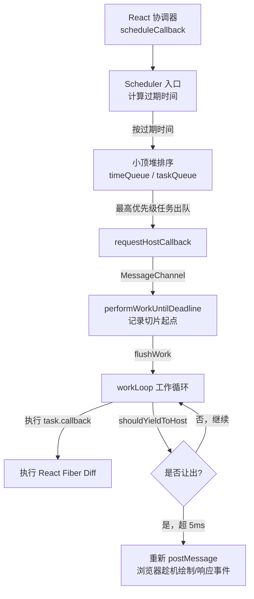
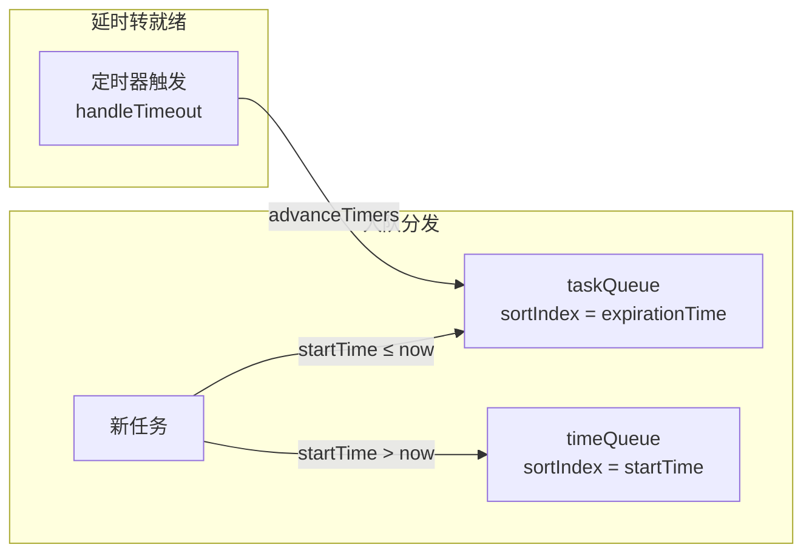
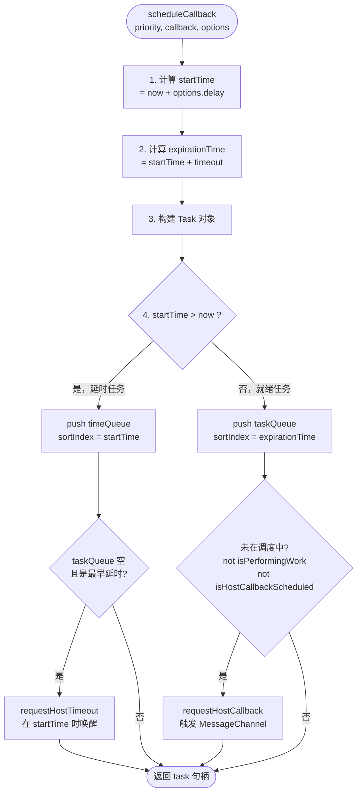
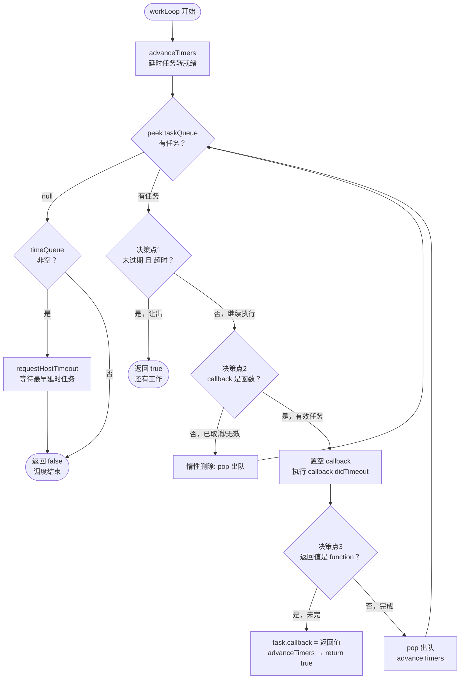
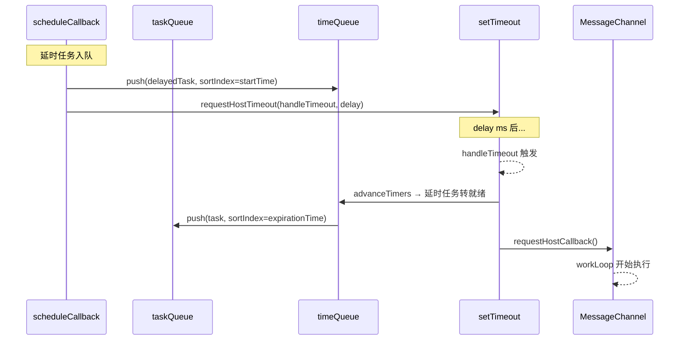
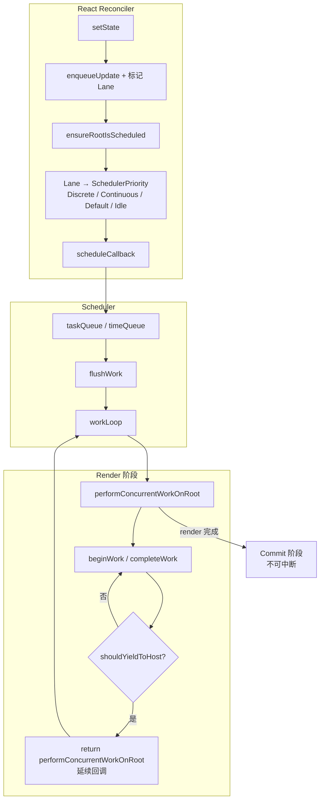
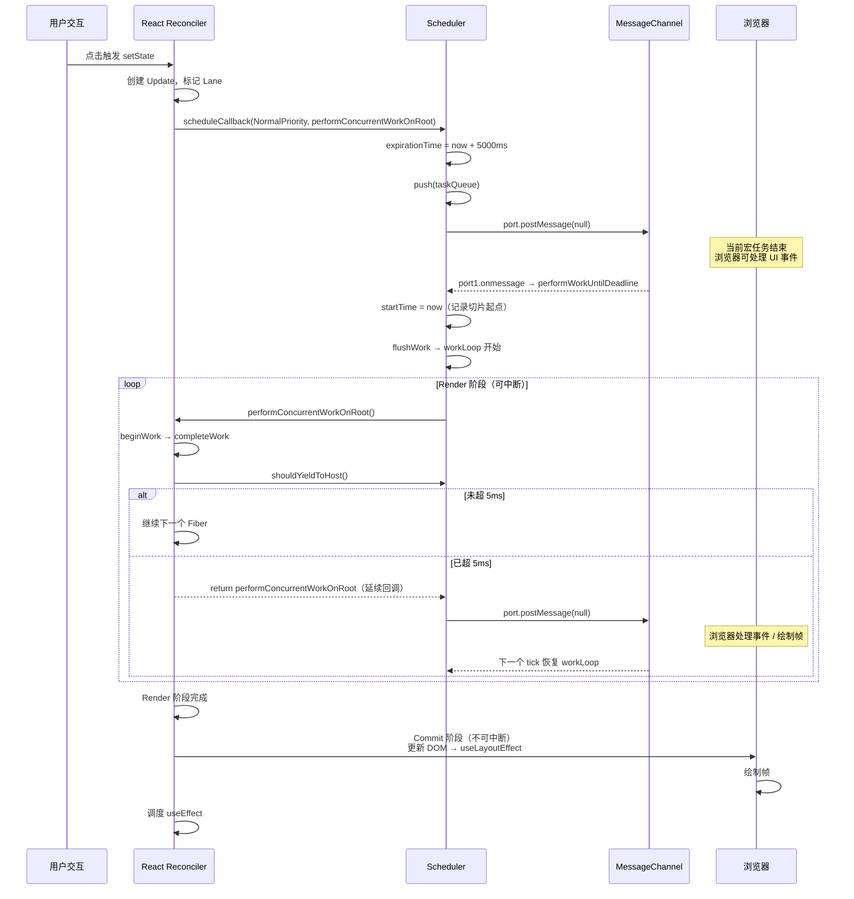

# React 任务调度器

React 的 `scheduler` 包是一个**独立于 React 的通用任务调度库**，负责按照优先级调度任务并在适当时机让出主线程。它是 React Concurrent Mode（并发模式）能够"**可中断渲染**"的基石。

## 1. React 调度器是什么？

在 JavaScript 单线程模型下，如果 React 渲染一棵庞大的组件树（全量 Diff），主线程会被长时间独占，导致浏览器无法响应用户的输入和动画绘制，页面产生严重卡顿（掉帧）。为了实现"**可中断渲染（Concurrent Mode）**"，React 必须具备**时间切片（Time-Slicing）**和**优先级调度**的能力。

**为什么不用浏览器原生的调度 API？**

| 原生 API                | 废弃/不采用的原因                                                                                                                                                                                   |
| ----------------------- | --------------------------------------------------------------------------------------------------------------------------------------------------------------------------------------------------- |
| `requestIdleCallback`   | React 早期曾**短暂**使用。但它的触发频率不稳定（由浏览器决定），且在 Safari 等浏览器上长期缺乏支持。更致命的是，它的空闲时间片长达 50ms，远大于 React 期望的 5ms 高频调度，会导致 UI 响应不够细腻。 |
| `setTimeout(fn, 0)`     | 按照 HTML 规范，嵌套超过 5 层后，最小延迟会被强制设定为 `4ms`。这会导致极大的 CPU 时间浪费。                                                                                                        |
| `requestAnimationFrame` | 它与显示器的刷新率严格绑定（通常 16.6ms 一次），主要用于动画。将所有的渲染计算都塞在 rAF 中执行，不仅频率太低，而且会抢占真实的动画绘制时间。                                                       |
| `setImmediate`          | 延迟极低，但只有 IE 和 Node.js 支持，不具备跨浏览器普适性。                                                                                                                                         |

**最终解法：** React 团队基于 `MessageChannel` 自己实现了一个**运行在用户态的"微型操作系统调度器"**，它完全接管了任务的排队、中断与恢复，这就是 `scheduler` 包。

## 2. 整体工作流概览

`scheduler` 的核心职责只有两个：**按优先级排队** 和 **在适当时机让出主线程**。下面这张图贯穿全文：



## 3. 核心数据结构

### 3.1 优先级常量

:::code-group

```ts [scheduler/src/SchedulerPriorities.ts]
export type PriorityLevel = 0 | 1 | 2 | 3 | 4 | 5

// 任务优先级
// 优先级越高，值越小
export const NoPriority = 0 // 无优先级
export const ImmediatePriority = 1 // 立即执行（如：输入框打字）
export const UserBlockingPriority = 2 // 用户阻塞（如：点击按钮、滚动）
export const NormalPriority = 3 // 正常（如：网络请求返回的数据渲染）
export const LowPriority = 4 // 低优（如：悬浮提示、分析埋点）
export const IdlePriority = 5 // 空闲（如：屏幕外的预渲染）
```

:::

React 在协调器中通过 `Lane` 模型计算出优先级后，会映射到这里的五级调度优先级，从而决定任务在 Scheduler 中的排队顺序。

### 3.2 超时时间

每个优先级对应一个 `timeout`（相对超时时间），任务的 **过期时间 = 开始时间 + timeout**：

:::code-group

```ts [scheduler/src/SchedulerFeatureFlags.ts]
// 对应的超时宽容时间 (单位：毫秒)
const IMMEDIATE_PRIORITY_TIMEOUT = -1 // 立即过期
const USER_BLOCKING_PRIORITY_TIMEOUT = 250 // 250ms
const NORMAL_PRIORITY_TIMEOUT = 5000 // 5s
const LOW_PRIORITY_TIMEOUT = 10000 // 10s
const IDLE_PRIORITY_TIMEOUT = 1073741823 // 最大 32 位整数，永不过期
```

:::

> [!IMPORTANT]
> **防止饿死机制 (Anti-Starvation)**
>
> 例如一个 `NormalPriority` 任务的 `timeout` 是 5000ms，意味着它最多被延迟 5 秒。**无论初始优先级多低，一旦当前时间超过了它的 `expirationTime`，在 `workLoop` 中会被强制视为已过期任务立即执行**（即使时间片已耗尽也不会让出），从而防止被"**饿死**"。

### 3.3 任务对象 (`Task`)

每个被调度的任务都被封装为一个 `Task` 对象：

:::code-group

```ts [scheduler/src/Scheduler.ts]
// 任务回调：入参 didTimeout 表示是否已超时
// 返回函数 → 任务未执行完，返回的函数即为 continuation
// 返回 null/undefined → 任务执行完毕
type Callback = (didTimeout: boolean) => Callback | null | undefined

type Task = {
  id: number // 递增 ID，同优先级任务排序兜底
  callback: Callback | null // 任务回调；cancel 后置 null
  priorityLevel: PriorityLevel // 优先级
  startTime: number // 任务生效时间 (performance.now() + delay)
  expirationTime: number // 过期时间 = startTime + timeout
  sortIndex: number // 最小堆排序依据：timeQueue 用 startTime，taskQueue 用 expirationTime
}
```

:::

| 字段             | 作用                                                                                                               |
| ---------------- | ------------------------------------------------------------------------------------------------------------------ |
| `id`             | 自增唯一 ID。当两个任务的 `sortIndex` 相同时，通过 `id` 作为次级排序键，保证堆排序的稳定性。                       |
| `startTime`      | 延迟任务的核心。若 `startTime > currentTime`，任务放入 `timeQueue` 等待；否则放入 `taskQueue` 就绪。               |
| `expirationTime` | 任务的最晚执行期限。`taskQueue` 中小顶堆的排序键，越紧迫的任务越靠前。                                             |
| `callback`       | 任务执行体。若返回一个函数，表示"**尚未完成**"，Scheduler 会在下一轮 `workLoop` 继续执行该返回的函数（延续回调）。 |
| `sortIndex`      | 动态切换：在 `timeQueue` 中按 `startTime` 排序；在 `taskQueue` 中按 `expirationTime` 排序。                        |

### 3.4 小顶堆（高效的任务排序）

Scheduler 使用**小顶堆 (Min-Heap)** 而非数组排序来管理任务队列。堆的插入 (`push`) 和弹出 (`pop`) 都是 $O(\log n)$，取堆顶 (`peek`) 只需 $O(1)$，远比每次排序的 $O(n \log n)$ 高效。

:::code-group

```ts [scheduler/src/SchedulerMinHeap.ts]
export type Heap<T extends Node> = Array<T>

export type Node = {
  id: number // 唯一标识
  sortIndex: number // 排序依据
}

// 取出堆顶元素 → O(1)
export function peek<T extends Node>(heap: Heap<T>): T | null {
  return heap.length === 0 ? null : heap[0]
}

// 给堆添加元素 → O(log n)
export function push<T extends Node>(heap: Heap<T>, node: T): void {
  // 1. 把 node 节点放在最后面
  const index = heap.length
  heap.push(node)
  // 2. 调整最小堆，从下往上堆化
  shiftUp(heap, node, index)
}

// 从下往上堆化
function shiftUp<T extends Node>(heap: Heap<T>, node: T, index: number): void {
  while (index > 0) {
    // 获取父节点的下标
    const parentIndex = (index - 1) >>> 1
    const parent = heap[parentIndex]
    // 如果父节点比当前节点大，交换位置
    if (compare(parent, node) > 0) {
      heap[parentIndex] = node
      heap[index] = parent
      index = parentIndex
    } else {
      return
    }
  }
}

// 删除堆顶元素 → O(log n)
export function pop<T extends Node>(heap: Heap<T>): T | null {
  if (heap.length === 0) {
    return null
  }
  const first = heap[0]
  const last = heap.pop()!
  // 说明有两个以上的节点
  if (first !== last) {
    // 把堆顶元素换成最后一个元素，然后从上到下堆化
    heap[0] = last
    shiftDown(heap, last, 0)
  }
  return first
}

function shiftDown<T extends Node>(
  heap: Heap<T>,
  node: T,
  index: number,
): void {
  const length = heap.length
  // 取到左边堆的长度（堆是完全二叉树，只需遍历前半部分）
  const halfLength = length >>> 1
  while (index < halfLength) {
    // 获取左子节点索引和节点
    const leftIndex = (index + 1) * 2 - 1
    const left = heap[leftIndex]
    const rightIndex = leftIndex + 1
    const right = heap[rightIndex] // right 不一定存在

    // 如果左节点比当前节点小，就替换当前节点
    if (compare(left, node) < 0) {
      // right 存在，并且比左节点小就交换位置
      if (rightIndex < length && compare(right, left) < 0) {
        heap[index] = right
        heap[rightIndex] = node
        index = rightIndex
      } else {
        // left 最小，或者 right 不存在
        heap[index] = left
        heap[leftIndex] = node
        index = leftIndex
      }
    } else if (rightIndex < length && compare(right, node) < 0) {
      heap[index] = right
      heap[rightIndex] = node
      index = rightIndex
    } else {
      return
    }
  }
}

// 比较函数：先按 sortIndex 排序，sortIndex 相同时按 id 排序（打破平局）
function compare(a: Node, b: Node) {
  const diff = a.sortIndex - b.sortIndex
  return diff !== 0 ? diff : a.id - b.id
}
```

:::

> [!NOTE]
> 小顶堆的不变量：**每个节点的 `sortIndex` ≤ 其子节点的 `sortIndex`**。因此 `heap[0]` 始终是全局最小值。`compare` 函数在 `sortIndex` 相同时回退到 `id` 比较，保证了堆排序的**稳定性**（同优先级任务严格按插入顺序执行）。

### 3.5 双队列设计

:::code-group

```ts [scheduler/src/Scheduler.ts]
// 就绪任务队列（最小堆，按 expirationTime 排序）
const taskQueue: Array<Task> = []
// 延迟任务队列（最小堆，按 startTime 排序）
const timeQueue: Array<Task> = []
```

:::



**双队列的解法是**：延时任务放入 `timeQueue`（按 `startTime` 排序），只需一个定时器关注堆顶（最早到期的那个）。当定时器触发时，通过 `advanceTimers` 批量把到期的延时任务转入 `taskQueue`。

### 3.6 任务队列的转换

:::code-group

```ts [scheduler/src/Scheduler.ts]
import { peek, pop, push } from './SchedulerMinHeap'

/** 将 timeQueue 中所有延迟已到期的任务转入 taskQueue */
function advanceTimers(currentTime: number) {
  let timer = peek(timeQueue)
  while (timer !== null) {
    if (timer.callback === null) {
      // 任务已被取消 → 直接丢弃
      pop(timeQueue)
    } else if (timer.startTime <= currentTime) {
      // 延时已到 → 从 timeQueue 出队，切换排序键后进入 taskQueue
      pop(timeQueue)
      timer.sortIndex = timer.expirationTime // ★ 排序键从 startTime 变为 expirationTime
      push(taskQueue, timer)
    } else {
      // 堆顶任务还没到时间，后面的更不可能到 → 提前退出
      return
    }
    timer = peek(timeQueue)
  }
}
```

```ts [scheduler/src/SchedulerMinHeap.ts]
export type Heap<T extends Node> = Array<T>

export type Node = {
  id: number // 唯一标识
  sortIndex: number // 排序依据
}

// 取出堆顶元素 → O(1)
export function peek<T extends Node>(heap: Heap<T>): T | null {
  return heap.length === 0 ? null : heap[0]
}

// 给堆添加元素 → O(log n)
export function push<T extends Node>(heap: Heap<T>, node: T): void {
  // 1. 把 node 节点放在最后面
  const index = heap.length
  heap.push(node)
  // 2. 调整最小堆，从下往上堆化
  shiftUp(heap, node, index)
}

// 从下往上堆化
function shiftUp<T extends Node>(heap: Heap<T>, node: T, index: number): void {
  while (index > 0) {
    // 获取父节点的下标
    const parentIndex = (index - 1) >>> 1
    const parent = heap[parentIndex]
    // 如果父节点比当前节点大，交换位置
    if (compare(parent, node) > 0) {
      heap[parentIndex] = node
      heap[index] = parent
      index = parentIndex
    } else {
      return
    }
  }
}

// 删除堆顶元素 → O(log n)
export function pop<T extends Node>(heap: Heap<T>): T | null {
  if (heap.length === 0) {
    return null
  }
  const first = heap[0]
  const last = heap.pop()!
  // 说明有两个以上的节点
  if (first !== last) {
    // 把堆顶元素换成最后一个元素，然后从上到下堆化
    heap[0] = last
    shiftDown(heap, last, 0)
  }
  return first
}

function shiftDown<T extends Node>(
  heap: Heap<T>,
  node: T,
  index: number,
): void {
  const length = heap.length
  // 取到左边堆的长度（堆是完全二叉树，只需遍历前半部分）
  const halfLength = length >>> 1
  while (index < halfLength) {
    // 获取左子节点索引和节点
    const leftIndex = (index + 1) * 2 - 1
    const left = heap[leftIndex]
    const rightIndex = leftIndex + 1
    const right = heap[rightIndex] // right 不一定存在

    // 如果左节点比当前节点小，就替换当前节点
    if (compare(left, node) < 0) {
      // right 存在，并且比左节点小就交换位置
      if (rightIndex < length && compare(right, left) < 0) {
        heap[index] = right
        heap[rightIndex] = node
        index = rightIndex
      } else {
        // left 最小，或者 right 不存在
        heap[index] = left
        heap[leftIndex] = node
        index = leftIndex
      }
    } else if (rightIndex < length && compare(right, node) < 0) {
      heap[index] = right
      heap[rightIndex] = node
      index = rightIndex
    } else {
      return
    }
  }
}

// 比较函数：先按 sortIndex 排序，sortIndex 相同时按 id 排序（打破平局）
function compare(a: Node, b: Node) {
  const diff = a.sortIndex - b.sortIndex
  return diff !== 0 ? diff : a.id - b.id
}
```

:::

## 4. 调度入口：`scheduleCallback`

### 4.1 完整调度逻辑

:::code-group

```ts [scheduler/src/Scheduler.ts]
import { getCurrentTime } from 'shared/utils'
import { peek, pop, push } from './SchedulerMinHeap'
import {
  ImmediatePriority,
  UserBlockingPriority,
  IdlePriority,
  LowPriority,
  NormalPriority,
} from './SchedulerPriorities'
import type { PriorityLevel } from './SchedulerPriorities'
import {
  IMMEDIATE_PRIORITY_TIMEOUT,
  USER_BLOCKING_PRIORITY_TIMEOUT,
  NORMAL_PRIORITY_TIMEOUT,
  LOW_PRIORITY_TIMEOUT,
  IDLE_PRIORITY_TIMEOUT,
} from './SchedulerFeatureFlags'

// ─── 全局状态 ───────────────────────────
let taskIdCounter = 1 // 递增 ID 生成器
let isPerformingWork = false // 是否正在执行任务（防重入）
let isHostCallbackScheduled = false // 是否已发起主线程回调
let isHostTimeoutScheduled = false // 是否正在等待延迟任务倒计时

/**
 * 向调度器注册一个任务
 * 1. 计算 startTime（有 delay 则延后）和 expirationTime
 * 2. 有延迟 → 推入 timeQueue，启动/刷新倒计时
 * 3. 无延迟 → 推入 taskQueue，必要时启动主线程回调
 */
export function scheduleCallback(
  priorityLevel: PriorityLevel,
  callback: Callback,
  options?: { delay: number },
) {
  const currentTime = getCurrentTime()
  let startTime: number

  // ① 计算 startTime（处理 delay 选项）
  if (typeof options === 'object' && options !== null) {
    let delay = options.delay
    if (typeof delay === 'number' && delay > 0) {
      startTime = currentTime + delay // 有效延迟
    } else {
      startTime = currentTime // 无效延迟
    }
  } else {
    startTime = currentTime
  }

  // ② 根据优先级查表得到 timeout，计算过期时间
  let timeout: number
  switch (priorityLevel) {
    case ImmediatePriority:
      timeout = IMMEDIATE_PRIORITY_TIMEOUT // -1
      break
    case UserBlockingPriority:
      timeout = USER_BLOCKING_PRIORITY_TIMEOUT // 250
      break
    case IdlePriority:
      timeout = IDLE_PRIORITY_TIMEOUT // max int
      break
    case LowPriority:
      timeout = LOW_PRIORITY_TIMEOUT // 10000
      break
    case NormalPriority:
    default:
      timeout = NORMAL_PRIORITY_TIMEOUT // 5000
      break
  }
  const expirationTime = startTime + timeout

  // ③ 构建任务对象
  const newTask: Task = {
    id: taskIdCounter++,
    callback,
    priorityLevel,
    startTime,
    expirationTime,
    sortIndex: -1, // 待分配
  }

  // ④ 根据 startTime 分流到不同队列
  if (startTime > currentTime) {
    // ── 延时任务 → timeQueue ──
    newTask.sortIndex = startTime
    push(timeQueue, newTask)

    // 如果 taskQueue 为空且新任务恰好是 timeQueue 的堆顶（最早到期），
    // 需要（重新）设置定时器，在 startTime 到达时唤醒
    if (peek(taskQueue) == null && newTask === peek(timeQueue)) {
      // isHostTimeoutScheduled：是否正在等待延迟任务倒计时
      if (isHostTimeoutScheduled) {
        cancelHostTimeout() // 取消旧的定时器
      } else {
        isHostTimeoutScheduled = true
      }
      requestHostTimeout(handleTimeout, startTime - currentTime)
    }
  } else {
    // ── 就绪任务 → taskQueue ──
    newTask.sortIndex = expirationTime
    push(taskQueue, newTask)

    // 如果当前没有正在调度的回调且没有正在执行的工作，启动调度
    // isHostCallbackScheduled：是否已发起主线程回调
    // isPerformingWork：是否正在执行任务（防重入）
    if (!isPerformingWork && !isHostCallbackScheduled) {
      isHostCallbackScheduled = true
      requestHostCallback() // ★ 触发 MessageChannel
    }
  }

  return newTask // 返回任务句柄，调用方可用于后续取消
}
```

```ts [shared/utils.ts]
// 当前时间获取 —— 底层依赖 performance.now()
export const getCurrentTime = (): number => performance.now()
```

```ts [scheduler/src/SchedulerMinHeap.ts]
export type Heap<T extends Node> = Array<T>

export type Node = {
  id: number // 唯一标识
  sortIndex: number // 排序依据
}

// 取出堆顶元素 → O(1)
export function peek<T extends Node>(heap: Heap<T>): T | null {
  return heap.length === 0 ? null : heap[0]
}

// 给堆添加元素 → O(log n)
export function push<T extends Node>(heap: Heap<T>, node: T): void {
  // 1. 把 node 节点放在最后面
  const index = heap.length
  heap.push(node)
  // 2. 调整最小堆，从下往上堆化
  shiftUp(heap, node, index)
}

// 从下往上堆化
function shiftUp<T extends Node>(heap: Heap<T>, node: T, index: number): void {
  while (index > 0) {
    // 获取父节点的下标
    const parentIndex = (index - 1) >>> 1
    const parent = heap[parentIndex]
    // 如果父节点比当前节点大，交换位置
    if (compare(parent, node) > 0) {
      heap[parentIndex] = node
      heap[index] = parent
      index = parentIndex
    } else {
      return
    }
  }
}

// 删除堆顶元素 → O(log n)
export function pop<T extends Node>(heap: Heap<T>): T | null {
  if (heap.length === 0) {
    return null
  }
  const first = heap[0]
  const last = heap.pop()!
  // 说明有两个以上的节点
  if (first !== last) {
    // 把堆顶元素换成最后一个元素，然后从上到下堆化
    heap[0] = last
    shiftDown(heap, last, 0)
  }
  return first
}

function shiftDown<T extends Node>(
  heap: Heap<T>,
  node: T,
  index: number,
): void {
  const length = heap.length
  // 取到左边堆的长度（堆是完全二叉树，只需遍历前半部分）
  const halfLength = length >>> 1
  while (index < halfLength) {
    // 获取左子节点索引和节点
    const leftIndex = (index + 1) * 2 - 1
    const left = heap[leftIndex]
    const rightIndex = leftIndex + 1
    const right = heap[rightIndex] // right 不一定存在

    // 如果左节点比当前节点小，就替换当前节点
    if (compare(left, node) < 0) {
      // right 存在，并且比左节点小就交换位置
      if (rightIndex < length && compare(right, left) < 0) {
        heap[index] = right
        heap[rightIndex] = node
        index = rightIndex
      } else {
        // left 最小，或者 right 不存在
        heap[index] = left
        heap[leftIndex] = node
        index = leftIndex
      }
    } else if (rightIndex < length && compare(right, node) < 0) {
      heap[index] = right
      heap[rightIndex] = node
      index = rightIndex
    } else {
      return
    }
  }
}

// 比较函数：先按 sortIndex 排序，sortIndex 相同时按 id 排序（打破平局）
function compare(a: Node, b: Node) {
  const diff = a.sortIndex - b.sortIndex
  return diff !== 0 ? diff : a.id - b.id
}
```

:::

> 注意 `ImmediatePriority` 的 timeout 为 `-1`，意味着 `expirationTime = startTime - 1` —— **永远小于当前时间**，在 `workLoop` 中会立即被识别为"**已过期**"并同步执行，即使时间片已耗尽也不会让出。

### 4.2 入队决策流程图



## 5. `MessageChannel` + 时间切片

### 5.1 `MessageChannel`是什么？

调度器需要一个**宏任务 (MacroTask)** 来承载工作循环。微任务（Promise）会在当前事件循环末尾清空队列，**无法让出主线程给浏览器进行 UI 绘制**。因此必须使用宏任务。

| 方案                    | 延迟  | 问题                          |
| ----------------------- | ----- | ----------------------------- |
| `setTimeout(fn, 0)`     | ≥ 4ms | HTML 规范强制的最小嵌套延迟   |
| `requestAnimationFrame` | ~16ms | 频率太低，且优先级模型不对    |
| `setImmediate`          | ~1ms  | 仅 Node.js/IE 支持            |
| **`MessageChannel`**    | ~0ms  | 无最小延迟，跨浏览器支持好 ✅ |

:::code-group

```ts [scheduler/src/Scheduler.ts]
// 核心调度通道 —— 全局单例
const channel = new MessageChannel()
const port = channel.port2

// port1 收到消息 → 在下一个宏任务中执行 performWorkUntilDeadline
channel.port1.onmessage = performWorkUntilDeadline
```

:::

### 5.2 启动消息循环

:::code-group

```ts [scheduler/src/Scheduler.ts]
// 宏任务消息循环是否已启动
let isMessageLoopRunning = false

/** 启动主线程回调（若消息循环未启动） */
function requestHostCallback() {
  if (!isMessageLoopRunning) {
    isMessageLoopRunning = true
    schedulePerformWorkUntilDeadline()
  }
}

/** 向 port2 发送消息，触发下一个宏任务 */
function schedulePerformWorkUntilDeadline() {
  port.postMessage(null)
}
```

:::

> 这里有个精妙之处：`postMessage(null)` 发送的是空消息，消息内容完全无用，只利用它的**副作用**——在下一个宏任务 tick 中触发 `port1.onmessage`。`isMessageLoopRunning` 标志保证了消息循环不会被重复启动。

### 5.3 分配时间片并执行

:::code-group

```ts [scheduler/src/Scheduler.ts]
import { getCurrentTime } from 'shared/utils'

// 当前时间切片的起始时间戳
let startTime = -1
// 时间切片长度（ms）
let frameInterval = 5

/** 每个宏任务的入口：记录切片起点 → flushWork → 有剩余则继续调度 */
function performWorkUntilDeadline() {
  if (isMessageLoopRunning) {
    const currentTime = getCurrentTime()
    // ★ 记录本次切片起始时间
    startTime = currentTime
    let hasMoreWork = true
    try {
      hasMoreWork = flushWork(currentTime)
    } finally {
      if (hasMoreWork) {
        // 还有任务，再发起一个宏任务继续执行
        schedulePerformWorkUntilDeadline()
      } else {
        // 队列清空，停止消息循环
        isMessageLoopRunning = false
      }
    }
  }
}
```

```ts [shared/utils.ts]
export const getCurrentTime = (): number => performance.now()
```

:::

### 5.4 并发模式的"心跳开关"

:::code-group

```ts [scheduler/src/Scheduler.ts]
import { getCurrentTime } from 'shared/utils'

// 当前时间切片的起始时间戳
let startTime = -1
// 时间切片长度（ms）
let frameInterval = 5

/**
 * 判断是否应让出主线程
 * 条件：从本时间切片开始起算，已耗时 >= frameInterval（默认 5ms）
 * @returns true → 让出主线程，false → 继续执行
 */
export function shouldYieldToHost(): boolean {
  const timeElapsed = getCurrentTime() - startTime
  return timeElapsed >= frameInterval
}
```

```ts [shared/utils.ts]
export const getCurrentTime = (): number => performance.now()
```

:::

### 5.5 工作循环的入口包装

:::code-group

```ts [scheduler/src/Scheduler.ts]
import { NormalPriority } from './SchedulerPriorities'
import type { PriorityLevel } from './SchedulerPriorities'

// 当前正在执行的任务
let currentTask: Task | null = null
// 当前优先级
let currentPriorityLevel: PriorityLevel = NormalPriority

/**
 * 启动一轮工作循环：
 * - 置锁 isPerformingWork（防重入）
 * - 保存上一轮优先级
 * - 在 finally 中恢复状态，确保异常安全
 * @returns workLoop 返回值：是否还有剩余任务
 */
function flushWork(initialTime: number) {
  isHostCallbackScheduled = false
  isPerformingWork = true
  const previousPriorityLevel = currentPriorityLevel
  try {
    return workLoop(initialTime)
  } finally {
    // 无论正常/异常退出，都恢复状态
    currentTask = null
    currentPriorityLevel = previousPriorityLevel
    isPerformingWork = false
  }
}
```

```ts [scheduler/src/SchedulerPriorities.ts]
export type PriorityLevel = 0 | 1 | 2 | 3 | 4 | 5
export const NormalPriority = 3
```

:::

## 6. 核心执行回路：`workLoop`

这是整个 Scheduler 最核心的函数。它在 `flushWork` 中被调用，循环从 `taskQueue` 堆顶取任务执行，每次执行完检查是否需要让出。

### 6.1 完整代码

:::code-group

```ts [scheduler/src/Scheduler.ts]
import { getCurrentTime } from 'shared/utils'
import { peek, pop } from './SchedulerMinHeap'
import { NormalPriority } from './SchedulerPriorities'
import type { PriorityLevel } from './SchedulerPriorities'

// 当前正在执行的任务
let currentTask: Task | null = null
// 当前优先级
let currentPriorityLevel: PriorityLevel = NormalPriority
// 时间切片起始时间 & 长度
let startTime = -1
let frameInterval = 5

/**
 * 核心工作循环 —— 在时间切片内持续消费 taskQueue
 *
 * 流程：
 * while 堆顶有任务：
 *   1. 未过期 且 时间切片用尽 → break 让出主线程
 *   2. callback 为 null（已取消）→ pop 丢弃
 *   3. callback 有效 → 置空原 callback 后执行
 *   4. 返回 continuation → 挂回 callback，下次继续
 *   5. 返回 null/undefined → 任务完成，pop 出堆
 *
 * @returns true: 还有任务未完成  false: 队列清空
 */
function workLoop(initialTime: number): boolean {
  let currentTime = initialTime

  // ── 阶段 A：将刚到期/到期的延时任务转入 taskQueue ──
  advanceTimers(currentTime)

  // ── 阶段 B：取堆顶任务（expirationTime 最小 = 最紧迫） ──
  currentTask = peek(taskQueue)

  // ── 阶段 C：主循环 ──
  while (currentTask !== null) {
    // ★ 决策点 1：是否应该暂停（让出主线程）？
    //    条件：任务未过期 AND 已用完 5ms 时间片
    if (currentTask.expirationTime > currentTime && shouldYieldToHost()) {
      break // 让出 → 返回 true，等待下一轮 postMessage
    }

    const callback = currentTask.callback

    // ★ 决策点 2：callback 是否有效？
    if (typeof callback === 'function') {
      // 有效任务：置空原 callback，正式执行
      currentTask.callback = null
      currentPriorityLevel = currentTask.priorityLevel

      // 传入 didTimeout 参数：告诉回调"你是否已经过期"
      const didTimeout = currentTask.expirationTime <= currentTime
      const continuationCallback = callback(didTimeout)

      // 执行后刷新当前时间
      currentTime = getCurrentTime()

      // ★ 决策点 3：任务是否完成？
      if (typeof continuationCallback === 'function') {
        // 返回了一个函数 → 任务"未完待续"
        currentTask.callback = continuationCallback
        advanceTimers(currentTime)
        return true
      } else {
        // 返回 undefined/null → 任务完成，出队
        if (currentTask === peek(taskQueue)) {
          pop(taskQueue)
        }
        advanceTimers(currentTime)
      }
    } else {
      // 无效任务（已取消或 callback 非法），惰性删除：直接 pop 丢弃
      pop(taskQueue)
    }

    // 取下一个堆顶任务
    currentTask = peek(taskQueue)
  }

  // ── 阶段 D：返回调度状态 ──
  if (currentTask !== null) {
    return true // 还有任务未完成 → performWorkUntilDeadline 会再次 postMessage
  } else {
    // taskQueue 已空，但 timeQueue 可能还有延时任务
    const firstTimer = peek(timeQueue)
    if (firstTimer) {
      // 设置定时器，在最早延时任务到期时唤醒
      requestHostTimeout(handleTimeout, firstTimer.startTime - currentTime)
    }
    return false // 全部完成 → 停止消息循环
  }
}
```

```ts [shared/utils.ts]
export const getCurrentTime = (): number => performance.now()
```

:::

### 6.2 决策点汇总



### 6.3 关键标志位

| 标志位                    | 作用                                           | 管理位置                                                                           |
| ------------------------- | ---------------------------------------------- | ---------------------------------------------------------------------------------- |
| `isPerformingWork`        | 防止在任务执行过程中重复启动新调度（重入保护） | `flushWork` 中设为 `true`，`finally` 中恢复为 `false`                              |
| `isHostCallbackScheduled` | 标记是否已向 MessageChannel 发起了回调请求     | `scheduleCallback` 中设为 `true`，`flushWork` 入口处重置为 `false`                 |
| `isMessageLoopRunning`    | 标记 MessageChannel 消息循环是否正在运行       | `requestHostCallback` 中设为 `true`，`performWorkUntilDeadline` 完成时设为 `false` |
| `isHostTimeoutScheduled`  | 标记是否正在等待 `setTimeout` 倒计时           | 延时任务入队时设为 `true`，`handleTimeout` 触发时重置为 `false`                    |

## 7. 定时器处理

当 `taskQueue` 为空但 `timeQueue` 中还有未到期的延时任务时，需要设置一个 `setTimeout` 在最早任务到期时唤醒 Scheduler。

### 7.1 设置与取消定时器

:::code-group

```ts [scheduler/src/Scheduler.ts]
import { getCurrentTime } from 'shared/utils'

// setTimeout 返回的 ID，用于取消
let taskTimeoutID = -1

/** 取消当前延迟倒计时 */
function cancelHostTimeout() {
  clearTimeout(taskTimeoutID)
  taskTimeoutID = -1
}

/** 启动延迟倒计时，到期后执行 callback（传入当前时间） */
function requestHostTimeout(callback: Callback, ms: number) {
  taskTimeoutID = setTimeout(() => {
    callback(getCurrentTime())
  }, ms)
}
```

```ts [shared/utils.ts]
export const getCurrentTime = (): number => performance.now()
```

:::

### 7.2 定时器触发后的处理

:::code-group

```ts [scheduler/src/Scheduler.ts]
import { peek } from './SchedulerMinHeap'

// 是否已发起主线程回调
let isHostCallbackScheduled = false
// 是否正在等待延迟任务倒计时
let isHostTimeoutScheduled = false

/** 延迟倒计时到期回调：将到期任务从 timeQueue 转入 taskQueue，视情况启动工作循环 */
function handleTimeout(currentTime: number) {
  isHostTimeoutScheduled = false

  // ① 将已到期的延时任务批量转入 taskQueue
  advanceTimers(currentTime)

  if (!isHostCallbackScheduled) {
    if (peek(taskQueue) !== null) {
      // ② 有就绪任务了 → 启动工作循环
      isHostCallbackScheduled = true
      requestHostCallback()
    } else {
      // ③ 还没有任务到期 → 重新计算最早的延时任务，设置新的定时器
      const firstTimer = peek(timeQueue)
      if (firstTimer !== null) {
        requestHostTimeout(handleTimeout, firstTimer.startTime - currentTime)
      }
    }
  }
}
```

```ts [scheduler/src/SchedulerMinHeap.ts]
export type Heap<T extends Node> = Array<T>

export type Node = {
  id: number // 唯一标识
  sortIndex: number // 排序依据
}

// 取出堆顶元素 → O(1)
export function peek<T extends Node>(heap: Heap<T>): T | null {
  return heap.length === 0 ? null : heap[0]
}

// 给堆添加元素 → O(log n)
export function push<T extends Node>(heap: Heap<T>, node: T): void {
  // 1. 把 node 节点放在最后面
  const index = heap.length
  heap.push(node)
  // 2. 调整最小堆，从下往上堆化
  shiftUp(heap, node, index)
}

// 从下往上堆化
function shiftUp<T extends Node>(heap: Heap<T>, node: T, index: number): void {
  while (index > 0) {
    // 获取父节点的下标
    const parentIndex = (index - 1) >>> 1
    const parent = heap[parentIndex]
    // 如果父节点比当前节点大，交换位置
    if (compare(parent, node) > 0) {
      heap[parentIndex] = node
      heap[index] = parent
      index = parentIndex
    } else {
      return
    }
  }
}

// 删除堆顶元素 → O(log n)
export function pop<T extends Node>(heap: Heap<T>): T | null {
  if (heap.length === 0) {
    return null
  }
  const first = heap[0]
  const last = heap.pop()!
  // 说明有两个以上的节点
  if (first !== last) {
    // 把堆顶元素换成最后一个元素，然后从上到下堆化
    heap[0] = last
    shiftDown(heap, last, 0)
  }
  return first
}

function shiftDown<T extends Node>(
  heap: Heap<T>,
  node: T,
  index: number,
): void {
  const length = heap.length
  // 取到左边堆的长度（堆是完全二叉树，只需遍历前半部分）
  const halfLength = length >>> 1
  while (index < halfLength) {
    // 获取左子节点索引和节点
    const leftIndex = (index + 1) * 2 - 1
    const left = heap[leftIndex]
    const rightIndex = leftIndex + 1
    const right = heap[rightIndex] // right 不一定存在

    // 如果左节点比当前节点小，就替换当前节点
    if (compare(left, node) < 0) {
      // right 存在，并且比左节点小就交换位置
      if (rightIndex < length && compare(right, left) < 0) {
        heap[index] = right
        heap[rightIndex] = node
        index = rightIndex
      } else {
        // left 最小，或者 right 不存在
        heap[index] = left
        heap[leftIndex] = node
        index = leftIndex
      }
    } else if (rightIndex < length && compare(right, node) < 0) {
      heap[index] = right
      heap[rightIndex] = node
      index = rightIndex
    } else {
      return
    }
  }
}

// 比较函数：先按 sortIndex 排序，sortIndex 相同时按 id 排序（打破平局）
function compare(a: Node, b: Node) {
  const diff = a.sortIndex - b.sortIndex
  return diff !== 0 ? diff : a.id - b.id
}
```

:::

> 这是一个**递归 `setTimeout`** 模式。每一步只关注 `timeQueue` 堆顶的最早到期任务，避免了为每个延时任务各开一个定时器。在任何时刻，系统中最多只有一个活跃的 `setTimeout`。

### 7.3 双队列协作全景



## 8. 任务取消

:::code-group

```ts [scheduler/src/Scheduler.ts]
// 当前正在执行的任务
let currentTask: Task | null = null

/**
 * 取消当前任务：将 callback 置 null
 * 最小堆不支持随机删除，workLoop 在消费时发现 null 则自动丢弃
 */
export function cancelCallback(): void {
  currentTask!.callback = null
}
```

:::

## 9. React 与 Scheduler 的集成

### 9.1 Lane(优先级映射)

React Reconciler 使用 31 位二进制的 **Lane 模型** 管理更新优先级。在 `ensureRootIsScheduled` 中，Lane 被映射到 Scheduler 的五级优先级：

:::code-group

```ts [react-reconciler/src/ReactFiberWorkLoop.ts]
import { scheduleCallback } from 'scheduler'
import {
  ImmediatePriority,
  UserBlockingPriority,
  NormalPriority,
  IdlePriority,
} from 'scheduler'

// Lane → EventPriority → SchedulerPriority 映射（简化）
function ensureRootIsScheduled(root) {
  const nextLanes = getNextLanes(root, NoLanes)

  let schedulerPriority
  switch (lanesToEventPriority(nextLanes)) {
    case DiscreteEventPriority: // 点击、按键
      schedulerPriority = ImmediatePriority
      break
    case ContinuousEventPriority: // 拖拽、滚动
      schedulerPriority = UserBlockingPriority
      break
    case DefaultEventPriority: // 常规 setState
      schedulerPriority = NormalPriority
      break
    case IdleEventPriority: // 离屏、预加载
      schedulerPriority = IdlePriority
      break
  }

  newCallbackNode = scheduleCallback(
    schedulerPriority,
    performConcurrentWorkOnRoot.bind(null, root),
  )
}
```

```ts [scheduler/index.ts]
// React 侧实际引用的入口 —— 所有导出汇总
export * from './src/SchedulerPriorities'
export * from './src/Scheduler'
export {
  ImmediatePriority as ImmediateSchedulerPriority,
  UserBlockingPriority as UserBlockingSchedulerPriority,
  NormalPriority as NormalSchedulerPriority,
  LowPriority as LowSchedulerPriority,
  IdlePriority as IdleSchedulerPriority,
} from './src/SchedulerPriorities'
export { getCurrentPriorityLevel as getCurrentSchedulerPriorityLevel } from './src/Scheduler'
```

:::

### 9.2 调度闭环



## 10. 完整执行时序

从用户交互到 DOM 更新的全链路：



## 11. 设计要点总结

| 设计点         | 实现方式                                                                                                      | 设计意图                                                                                   |
| -------------- | ------------------------------------------------------------------------------------------------------------- | ------------------------------------------------------------------------------------------ |
| **防止饿死**   | 优先级 × timeout → expirationTime                                                                             | 低优先级任务到期自动提升，已过期任务即使超过时间片也强制执行                               |
| **优先级排队** | 小顶堆 (`SchedulerMinHeap`)                                                                                   | 插入/弹出 $O(\log n)$，取堆顶 $O(1)$，同 sortIndex 时以 id 打破平局                        |
| **双队列分离** | `taskQueue` + `timeQueue`                                                                                     | 延时任务不阻塞就绪任务，按需批量转换                                                       |
| **时间切片**   | `MessageChannel` + `startTime` + `frameInterval = 5ms`                                                        | 用"当前时间 - 切片起点"判断是否超时，宏任务间隙让浏览器插入渲染帧                          |
| **可中断恢复** | 延续回调 (`callback` 返回 `function`)                                                                         | 长任务分片执行，天然支持 Concurrent Mode                                                   |
| **最小定时器** | `handleTimeout` — 只关注堆顶                                                                                  | 无论多少延时任务，始终只有一个 `setTimeout`                                                |
| **惰性取消**   | `task.callback = null`                                                                                        | 取消 $O(1)$，删除平摊到遍历 (`advanceTimers` 和 `workLoop` 中自动丢弃)                     |
| **防重入保护** | `isPerformingWork` / `isHostCallbackScheduled` / `isMessageLoopRunning` / `isHostTimeoutScheduled` 四层标志位 | 确保 MessageChannel 循环、setTimeout 倒计时、任务执行三者互不冲突                          |
| **异常安全**   | `flushWork` 的 `try...finally` 包裹 `workLoop`                                                                | 无论任务执行是否抛异常，全局状态 (`isPerformingWork`, `currentPriorityLevel`) 都能正确恢复 |
| **框架无关**   | 独立 `scheduler` 包，依赖仅为 `performance.now()`                                                             | 可脱离 React 用于任何需要协作式调度的场景                                                  |
