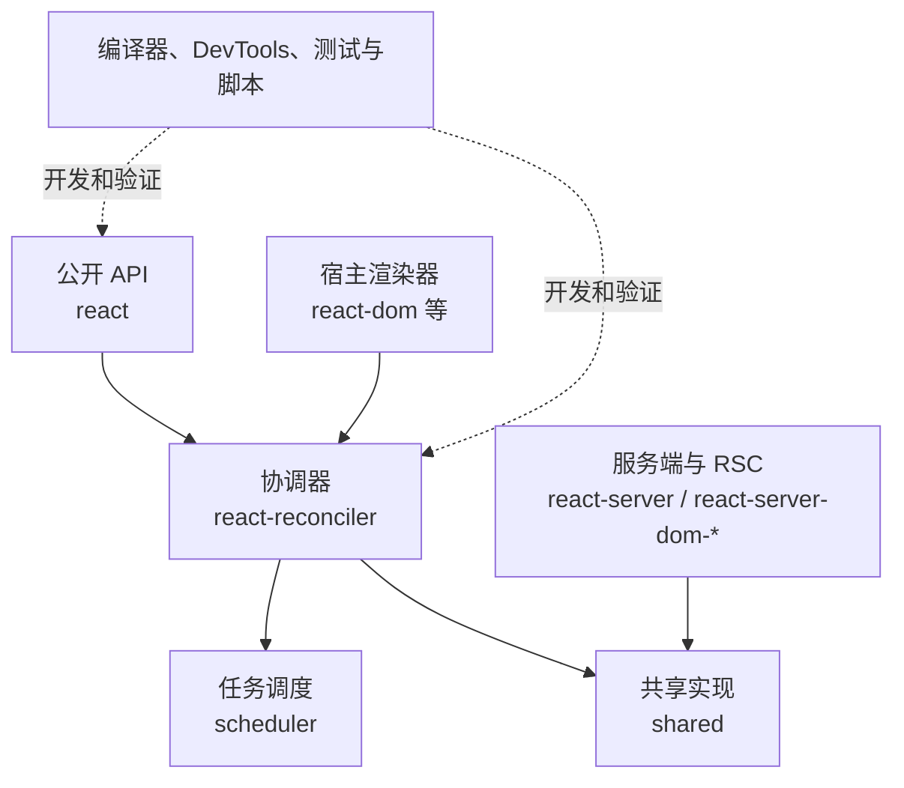
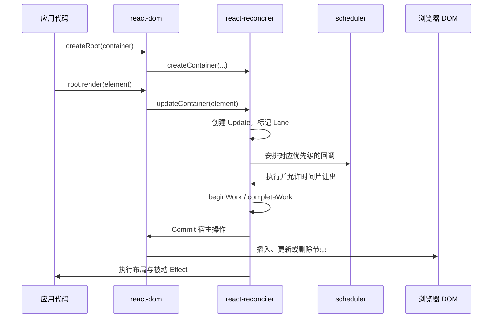

# React 源码目录结构解读

React 官方源码仓库 [`facebook/react`](https://github.com/facebook/react) 使用 monorepo 管理 React 核心、不同宿主环境的渲染器、调度器、服务端组件、开发者工具和测试设施，目标不是罗列每一个文件，而是建立一张能用于源码阅读的模块地图。

## 1. 宏观架构：五层模型

从架构职责看，React 仓库可以分为五层：



- `react`：定义组件、Element、Context、Hooks 等面向开发者的 API。
- `react-reconciler`：实现 Fiber、更新队列、优先级、Render 阶段与 Commit 阶段，是 React 运行时的核心。
- `react-dom` 等渲染器：把协调器计算出的变更落实到 DOM 或其他宿主环境。
- `scheduler`：根据优先级安排可让出主线程的任务。
- `react-server`、`react-server-dom-*`：承载流式 SSR、Server Components 和 Flight 协议相关实现。

## 2. 根目录结构概览

```markdown
react/
├── compiler/ # React Compiler 源码、运行时与相关工具
├── fixtures/ # 示例应用、性能场景和回归问题复现
├── packages/ # 可发布包与内部核心模块
├── scripts/ # 构建、测试、发布和 CI 脚本
├── .github/ # GitHub Actions、Issue 与 PR 配置
├── babel.config.js # Babel 配置
├── jest.config.js # Jest 入口配置
├── package.json # 仓库脚本与开发依赖
├── yarn.lock # 依赖锁文件
└── README.md # 项目说明与贡献入口
```

| 目录/包名       | 核心职责                                                                                                         | 阅读建议                                     |
| --------------- | ---------------------------------------------------------------------------------------------------------------- | -------------------------------------------- |
| **`compiler/`** | **React 19 新星 (React Forget)**。基于 Rust/JS 实现的编译期优化器，通过 SSA 转换实现自动记忆化，消除 `useMemo`。 | 独立于运行时，可作为编译原理进阶阅读。       |
| **`scripts/`**  | 包含 Rollup 打包脚本。React 并非原样发布源码，而是通过这里的脚本抹平错误码、按环境打包。                         | 探究 npm 产物为何与源码长得不一样时必看。    |
| **`fixtures/`** | 官方提供的最小复现 Demo 和测试沙箱。                                                                             | 调试源码时，直接在 fixtures 中打断点最稳定。 |

## 3. 核心源码版图 (`packages/`)

`packages/` 是 React 的心脏。不要被几十个文件夹吓到，主线只有以下几个核心包：

### 3.1 描述层：`react` (公共 API)

```markdown
packages/react/
├── index.js # 稳定客户端入口
├── jsx-runtime.js # 新 JSX transform 运行时入口
├── jsx-dev-runtime.js # 开发环境 JSX 运行时入口
├── src/
│ ├── ReactClient.js # 客户端公开 API 汇总
│ ├── ReactElement.js # Element 创建、clone 与校验
│ ├── ReactHooks.js # Hooks API 到 Dispatcher 的转发层
│ ├── ReactContext.js # Context 对象创建
│ ├── ReactChildren.js # Children 工具方法
│ ├── ReactMemo.js # memo 元素类型
│ ├── ReactLazy.js # lazy 状态与加载逻辑
│ └── jsx/ # JSX Element 创建实现
└── package.json # exports 与发布信息
```

这个包只负责**定义 UI 和数据模型**，不包含任何真实的渲染逻辑。

- **`src/jsx/`**: JSX 被编译后的执行入口 (`jsx-runtime`)。
- **`src/ReactElement.js`**: `React.createElement` 的底层实现，产出纯 JS 对象。
- **`src/ReactHooks.js`**: Hooks 的“空壳”。调用 `useState` 实际上是调用 `Dispatcher`，具体的实现在 `react-reconciler` 中按挂载/更新阶段动态注入。

### 3.2 协调层：`react-reconciler` (运行时大脑)

整个 React 最复杂、最核心的目录，负责 **Fiber 架构、Diff 算法与生命周期**。

```markdown
packages/react-reconciler/src/
├── ReactFiber.js # Fiber 节点创建与复用
├── ReactFiberRoot.js # FiberRoot 创建
├── ReactFiberWorkLoop.js # 根调度、Render 与 Commit 主循环
├── ReactFiberBeginWork.js # “向下”计算当前 Fiber 的子节点
├── ReactFiberCompleteWork.js # “向上”完成宿主节点与副作用标记
├── ReactChildFiber.js # 子节点协调与 key diff
├── ReactFiberHooks.js # 函数组件 Hooks 实现
├── ReactFiberClassComponent.js # Class 组件更新逻辑
├── ReactFiberLane.js # Lane 优先级模型
├── ReactFiberConcurrentUpdates.js # 并发更新入队
├── ReactFiberCommitWork.js # DOM 变更、生命周期与 Effect 提交
├── ReactFiberCommitEffects.js # Commit 副作用遍历
├── ReactFiberNewContext.js # Context 依赖传播
├── ReactFiberSuspenseComponent.js # Suspense 相关逻辑
├── ReactFiberOffscreenComponent.js # 隐藏树与离屏树处理
├── ReactFiberHydrationContext.js # 水合状态管理
├── ReactEventPriorities.js # 事件优先级映射
├── ReactWorkTags.js # Fiber 类型标记
└── ReactFiberConfig.js # 渲染器宿主能力接口
```

- **基石数据**：
  - `ReactFiber.js`: Fiber 节点的创建与双缓存（`alternate`）复用。
  - `ReactFiberLane.js`: 车道优先级模型（取代了旧的 ExpirationTime）。

- **工作循环 (WorkLoop)**：
  - `ReactFiberWorkLoop.js`: 引擎的心跳。控制 Render 阶段（可中断）与 Commit 阶段（不可中断）。

- **Render 阶段 (找不同)**：
  - `ReactFiberBeginWork.js`: “**递**”阶段，比对状态，生成下级 Fiber。
  - `ReactChildFiber.js`: 核心 Diff 算法（单向链表遍历）。
  - `ReactFiberCompleteWork.js`: “**归**”阶段，收集副作用 (Flags)。

- **Commit 阶段 (操刀修改)**：
  - `ReactFiberCommitWork.js` / `ReactFiberCommitEffects.js`: 执行 DOM 突变，触发 `useEffect` 等。

- **Hooks 核心实现**：
  - `ReactFiberHooks.js`: Hooks 链表的构建与状态更新队列 (`UpdateQueue`)。

### 3.3 宿主渲染层：`react-dom`

为 `react-reconciler` 提供操作浏览器 DOM 的“**武器库**”（Host Config）。

```markdown
packages/react-dom/
├── client.js # react-dom/client 入口
├── server.js # 通用服务端入口
├── server.browser.js # 浏览器流式 SSR 入口
├── server.node.js # Node.js 流式 SSR 入口
├── test-utils.js # 测试工具入口
├── src/client/
│ ├── ReactDOMRoot.js # createRoot、hydrateRoot
│ ├── ReactDOMComponent.js # DOM 属性创建与更新
│ ├── ReactDOMComponentTree.js # DOM 节点与 Fiber 的关联
│ ├── ReactDOMHostConfig.js # reconciler 所需的 DOM 宿主接口
│ └── ReactFiberConfigDOM.js # DOM 渲染器配置汇总
├── src/events/ # 合成事件系统
├── src/server/ # DOM 服务端渲染适配
└── package.json # 子路径 exports
```

- **`src/client/ReactDOMRoot.js`**: 现代客户端入口 (`createRoot`)。
- **`src/client/ReactDOMHostConfig.js`**: 桥接文件。向协调器暴露 `appendChild`、`removeChild` 等纯净 API。
- **`src/events/`**: 独立于浏览器的**合成事件系统 (SyntheticEvent)**。

### 3.4 调度层：`scheduler`

一个独立的任务调度器（甚至可以脱离 React 使用）。

```markdown
packages/scheduler/src/
├── forks/ # 不同目标环境的实现分支
├── Scheduler.js # 任务队列、时间片与回调调度
├── SchedulerFeatureFlags.js # 调度器特性开关
├── SchedulerMinHeap.js # 小顶堆任务队列
└── SchedulerPriorities.js # 调度优先级常量
```

- **`Scheduler.js`**: 通过 `MessageChannel` 实现宏任务调度，配合 `shouldYieldToHost` 达成 5ms 的时间切片 (Time Slicing)。
- **`SchedulerMinHeap.js`**: 最小堆算法，用于高效管理任务的过期时间排序。

### 3.5 通用层：`shared`

`shared` 通常包含 React Symbols、特性开关、环境检测、浅比较、组件名解析、错误处理以及内部类型等。常见文件包括：

- `ReactSymbols.js`：Element、Fragment、Context、Memo、Lazy 等内部类型标识。
- `ReactFeatureFlags.js`：根据构建目标选择特性开关实现。
- `ReactTypes.js`：跨包复用的 Flow 类型。
- `shallowEqual.js`、`objectIs.js`：相等性判断工具。
- `getComponentNameFromType.js`：从组件类型推导调试名称。

### 3.6 服务端渲染与 Server Components

承载 React Server Components (RSC) 与 Server Actions 的底层协议。

| 目录                         | 主要职责                                              |
| ---------------------------- | ----------------------------------------------------- |
| `react-server`               | 服务端组件与流式渲染的共享核心能力                    |
| `react-server-dom-webpack`   | 面向 webpack 的 React Server Components / Flight 集成 |
| `react-server-dom-parcel`    | 面向 Parcel 的 RSC 集成                               |
| `react-server-dom-turbopack` | 面向 Turbopack 的 RSC 集成                            |
| `react-markup`               | 将 React 树渲染为静态 HTML 的相关能力                 |

> [!NOTE]
> Server Components 不是“**组件在服务器生成 HTML**”这么简单。传统 SSR 主要传输 HTML，RSC 传输的是可被客户端继续组合、恢复引用的组件数据流；两者可以协同工作。

## 4. 完整流程图



## 5. 源码阅读“防坑”指南

### 5.1 `.new.js`、`.old.js` 和 forks

某些版本或历史 tag 会同时保留新旧实现，或通过 `forks/` 为不同构建目标选择文件。不要只凭文件名推断最终产物，应结合构建脚本、特性开关与目标发布通道确认实际加载的实现。

### 5.2 Flow 类型

React 核心源码长期使用 Flow，而不是 TypeScript。源码里的 `import type`、精确对象类型和类型转换语法可能无法直接交给普通 Babel/TypeScript 项目执行。npm 发布产物会经过构建流程移除这些类型。

### 5.3 Feature Flags 与发布通道

稳定版、实验版、不同渲染器可能使用不同特性开关。同一段代码在源码中存在，不代表它会进入稳定构建，更不代表已成为公共 API。判断功能状态时需要同时检查：

- `ReactFeatureFlags` 及其 forks。
- Rollup 构建入口和 bundle 类型。
- stable、experimental 或 canary 发布通道。
- 官方文档是否将其列为可用 API。

### 5.4 `__tests__` 与内联测试

React 大量测试与源码同目录放置在 `__tests__` 中。测试通常比注释更准确地描述并发更新、Effect 顺序、水合恢复和错误边界等边缘行为。阅读一个模块时，建议同步检索同名测试。

## 6. 渐进式阅读路线

### 6.1 基石与数据模型 (Virtual DOM 骨架)

**核心目标：** 摒弃“**DOM 节点**”的心智，理解 React 如何在内存中描述一段 UI，以及安全机制的底层实现。

- **`react/src/jsx/ReactJSXElement.js` (JSX 运行时)**
  - **核心逻辑**：探究 React 17 引入的 Automatic Runtime（自动运行时）。观察编译器如何将 `<div />` 转换为 `jsx()` 或 `jsxs()` 函数调用，以及它如何提前分离 `key` 和静态子节点以减少运行时的对象规范化开销。

- **`react/src/ReactElement.js` (元素工厂)**
  - **核心逻辑**：理解 `ReactElement` 只是一个极其轻量级的 Plain JavaScript Object。剖析其内部结构：`type`（元素类型）、`props`（属性）、`key`、`ref` 以及最核心的 `$$typeof`。

- **`shared/ReactSymbols.js` (安全与类型标识)**
  - **核心逻辑**：精读 `REACT_ELEMENT_TYPE` 的定义。理解 React 为什么强制要求 `$$typeof: Symbol.for('react.element')` —— 这一设计利用了 JSON 无法序列化 `Symbol` 的特性，从根本上杜绝了服务端注入未经转义的 JSON 字符串所导致的 XSS 攻击。

### 6.2 应用初始化与首次挂载 (Mount 阶段)

**核心目标：** 追踪 `createRoot` 的完整生命周期，理解双缓存机制的建立，以及 Fiber 树的“**递**”与“**归**”。

- **`react-dom/src/client/ReactDOMRoot.js` (应用入口)**
  - **核心逻辑**：观察 `createRoot` 如何在底层创建出双重数据结构：`FiberRootNode`（全局根管理器，维护调度优先级与时间信息）与 `HostRootFiber`（当前渲染树的根节点）。

- **`react-reconciler/src/ReactFiberBeginWork.js` (自顶向下的“**递**”)**
  - **核心逻辑**：探究组件的挂载过程。观察 React 如何根据不同的 `WorkTag`（如 `FunctionComponent`、`HostComponent`）进入不同的处理分支，调用组件函数计算新的 React Element，并生成对应的下级 Fiber 节点。

- **`react-reconciler/src/ReactFiberCompleteWork.js` (自底向上的“**归**”)**
  - **核心逻辑**：这是连接纯逻辑与宿主环境的关键。观察在首次挂载时，React 如何调用 `createInstance` 在内存中悄无声息地创建出真实的 DOM 节点，并通过 `appendAllChildren` 将子 DOM 节点组装成一棵离线 DOM 树，同时收集所有需要突变的副作用标记（Flags）。

### 6.3 状态管理与闭包引擎 (Hooks 与 Update 机制)

**核心目标：** 揭开 Hooks 的魔法面纱，理解函数组件的状态是如何跨越渲染周期持久化存活的。

- **`react-reconciler/src/ReactFiberHooks.js` (Hooks 核心实现)**
  - **核心逻辑**：精读 `memoizedState` 属性。理解为什么 Hooks 绝对不能写在条件分支里：每一个 Hook 调用（`useState`、`useEffect`）在首次挂载时都会被构建成一个单向链表。后续渲染严重依赖这个链表的绝对顺序来读取上下文。
  - **动态分发**：观察全局 `ReactCurrentDispatcher` 的切换机制，理解为什么在 Mount 阶段调用的是 `mountState`，而在 Update 阶段自动切换为 `updateState`。

- **`react-reconciler/src/ReactFiberClassUpdateQueue.js` (状态更新队列)**
  - **核心逻辑**：剖析 React 如何处理高频状态更新。深入理解 `UpdateQueue` 巧妙的**环状单向链表**设计（通过 `tail.next = head` 实现 $O(1)$ 的队尾插入），以及 `BaseState` 与 `PendingState` 分离是如何保证低优先级任务被高优先级打断后，状态依然能正确计算的。

### 6.4 调度器与并发渲染 (Time Slicing & Lanes)

**核心目标：** 跨越前端常规视界，理解 React 如何模拟操作系统级别的任务调度与中断恢复。

- **`scheduler/src/forks/Scheduler.js` (宏任务时间切片)**
  - **核心逻辑**：理解 React 为什么放弃 `setTimeout` 和 `requestAnimationFrame`，转而使用 `MessageChannel` 来生成 5ms 的时间切片。剖析内部的小顶堆（Min-Heap）算法，观察调度器如何高效地管理 `timerQueue`（延时任务）和 `taskQueue`（就绪任务）。

- **`react-reconciler/src/ReactFiberLane.js` (车道优先级模型)**
  - **核心逻辑**：解析 React 18+ 的核心调度数学模型。理解为什么弃用 `ExpirationTime`，转而使用 31 位的二进制位运算来表示优先级（Lanes）。掌握 `按位或 (|)` 合并任务、`按位与 (&)` 判断交集、`补码 (& -lane)` 提取最高优先级的极速算法原理。

- **`react-reconciler/src/ReactFiberWorkLoop.js` (并发引擎心跳)**
  - **核心逻辑**：对比 `workLoopSync` 与 `workLoopConcurrent`。精读并发循环中的 `shouldYieldToHost()` 函数，观察引擎如何在每个 Fiber 工作单元执行完毕后，检查是否超过了 5ms 阈值，并在超时后主动让出（Yield）主线程控制权给浏览器以保障页面流畅。

### 6.5 突变与副作用 (Commit 阶段)

**核心目标：** 理解内存计算结果是如何最终体现在用户屏幕上的，以及生命周期钩子的执行时机。

- **`react-reconciler/src/ReactFiberCommitWork.js` (DOM 操刀者)**
  - **核心逻辑**：理解 Commit 阶段的不可中断性。观察三幕剧的执行：
    - **BeforeMutation**：调用 `getSnapshotBeforeUpdate` 获取 DOM 变更前的快照。
    - **Mutation**：执行真实的宿主突变（如 `appendChild`、`insertBefore`、`textContent` 赋值），以及组件卸载的清理工作。
    - **Layout**：同步执行 `useLayoutEffect`。此时 DOM 已更新，但浏览器尚未绘制，这是读取布局信息并进行同步修正的最后时机。

- **`react-reconciler/src/ReactFiberCommitEffects.js` (异步副作用)**
  - **核心逻辑**：追踪 `useEffect` 的调度。观察 React 如何利用 `postMessage` 或 `setTimeout` 将普通 Effect 的执行推迟到浏览器绘制（Paint）完成之后，从而防止复杂的副作用逻辑阻塞用户的视觉呈现。
