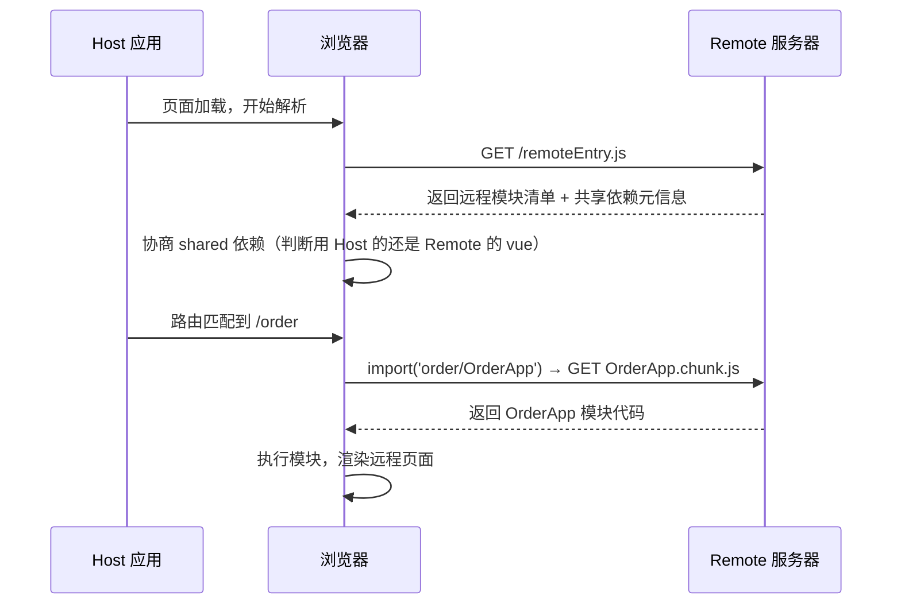

# Module Federation 模块联邦

Module Federation（模块联邦）是近年来前端工程化领域**最具颠覆性的架构创新**，其核心思想是：让多个**独立构建、独立部署**的前端应用，在浏览器运行时**动态加载**对方的模块，共享公共依赖，并组合成一个完整的页面。它并不是传统意义上的"微前端沙箱框架"，而是**运行时模块化的基础设施**。

## 1. 核心定位与底层原理

### 1.1 从"构建时依赖"到"运行时依赖"

传统打包工具（Webpack、Rollup 等）在构建阶段就把所有依赖关系确定下来，产出闭合的静态 Bundle。Module Federation 打破了这一范式：**它将一部分模块依赖推迟到运行时动态解析**，让不同构建产物之间可以互相"**import**"。

```markdown
传统打包模型（构建时闭合）:
App A → node_modules/vue → [Bundle A] (vue 被打进 A)
App B → node_modules/vue → [Bundle B] (vue 被打进 B)
→ 两份 Vue 代码，两份内存占用

模块联邦模型（运行时共享）:
App A (Host) ──→ 加载 remoteEntry.js ──→ App B (Remote)
↓
import('order/App')
↓
vue、pinia 等共享依赖只加载一次
```

> **关键洞察：** Module Federation 不是"**微前端框架**"，它是一个**分布式模块系统**。它解决的核心问题是"**如何让不同构建产物在运行时高效共享代码**"，而非"**如何隔离应用**"。

### 1.2 运行时加载流程

当 Host 应用启动并请求一个远程模块时，底层经历了以下步骤：

- **加载远程入口**：Host 通过 `<script>` 标签或动态 `import()` 拉取 Remote 的 `remoteEntry.js`。
- **解析模块清单**：`remoteEntry.js` 内部包含 Remote 对外暴露的模块映射表（`exposes`）和共享依赖的版本信息（`shared`）。
- **协商共享依赖**：Host 和 Remote 各自声明自己的共享依赖（如 `vue`、`react`），运行时根据 `singleton`、`requiredVersion` 等策略协商使用哪一份实例。
- **按需加载远程 Chunk**：当 Host 真正 `import('order/OrderApp')` 时，才通过网络请求加载 OrderApp 对应的 JS chunk。
- **执行模块**：拿到模块代码后在当前 JavaScript 上下文中执行，Host 获得远程模块的导出值。



## 2. 核心概念

| 概念                 | 说明                                                                                          |
| -------------------- | --------------------------------------------------------------------------------------------- |
| **Host**             | 消费者 / 主应用，负责加载远程模块并组合页面                                                   |
| **Remote**           | 生产者 / 远程应用，暴露模块供其他应用消费。一个应用可以同时是 Host 和 Remote（Bidirectional） |
| **`remoteEntry.js`** | Remote 构建产出的模块清单文件，包含所有 exposes 的异步加载入口和 shared 元信息                |
| **`exposes`**        | Remote 声明"**我对外暴露哪些模块**"，每个模块会独立拆分为一个异步 chunk                       |
| **`remotes`**        | Host 声明"**我要消费哪些远程应用**"，指定名称到 `remoteEntry.js` URL 的映射                   |
| **`shared`**         | 声明多应用间共享的依赖（如 Vue、React、组件库），运行时协商只保留一份实例                     |

## 3. Webpack 5 模块联邦

Webpack 5 通过内置的 `container` 模块原生支持 Module Federation，无需额外安装插件。它是模块联邦的**参考实现和事实标准**。

### 3.1 Remote 完整配置

:::code-group

```js [webpack.config.js]
// Remote 应用
const { ModuleFederationPlugin } = require('webpack').container
const packageJson = require('./package.json')

module.exports = {
  output: {
    publicPath: 'https://cdn.example.com/order/', // 远程资源的 CDN 基础路径
  },
  plugins: [
    new ModuleFederationPlugin({
      // ① 远程应用的唯一标识，必须与 Host 侧 remotes 的 key 对应
      name: 'order',

      // ② 远程入口文件名，部署后 Host 通过此文件发现远程模块
      filename: 'remoteEntry.js',

      // ③ 对外暴露的模块（每个模块独立拆分为异步 chunk）
      exposes: {
        './OrderApp': './src/OrderApp.vue',
        './OrderDetail': './src/views/OrderDetail.vue',
        './routes': './src/router/routes.ts',
        './store': './src/store/orderStore.ts',
        './utils': './src/utils/formatOrder.ts',
      },

      // ④ 共享依赖：运行时协商，避免重复加载
      shared: {
        vue: {
          singleton: true, // 全局只保留一个 Vue 实例
          requiredVersion: '^3.5.0', // 声明兼容的版本范围
          eager: false, // 不随 remoteEntry 立即加载，延迟到使用时
          strictVersion: false, // true 时版本不匹配直接报错
        },
        pinia: {
          singleton: true,
          requiredVersion: '^2.1.0',
        },
        'element-plus': {
          singleton: true,
          // 大型 UI 库可以设置 eager: false 来减小 remoteEntry 体积
        },
        // 业务工具库不需要 singleton，各应用可用各自版本
        'lodash-es': {
          singleton: false,
        },
      },
    }),
  ],
}
```

:::

### 3.2 Host 完整配置

:::code-group

```js [webpack.config.js]
// Host 应用
const { ModuleFederationPlugin } = require('webpack').container

module.exports = {
  plugins: [
    new ModuleFederationPlugin({
      name: 'container',

      // 声明远程应用：key 用于 import('key/module')，value 为 name@remoteEntryURL
      remotes: {
        order: 'order@https://cdn.example.com/order/remoteEntry.js',
        user: 'user@https://cdn.example.com/user/remoteEntry.js',
        // 本地开发联调时可以用 localhost
        // order: 'order@http://localhost:3002/remoteEntry.js',
      },

      // Host 也需要声明 shared，确保与 Remote 协商一致
      shared: {
        vue: {
          singleton: true,
          requiredVersion: '^3.5.0',
        },
        pinia: {
          singleton: true,
          requiredVersion: '^2.1.0',
        },
        'element-plus': {
          singleton: true,
        },
      },
    }),
  ],
}
```

:::

### 3.3 Host 消费远程模块

```ts
// 方式一：Vue 异步组件动态加载
import { defineAsyncComponent } from 'vue'

const OrderApp = defineAsyncComponent(() => import('order/OrderApp'))
const OrderDetail = defineAsyncComponent(() => import('order/OrderDetail'))

// 方式二：路由级懒加载
const routes = [
  {
    path: '/order',
    component: () => import('order/OrderApp'),
    children: [
      {
        path: 'detail/:id',
        component: () => import('order/OrderDetail'),
      },
    ],
  },
]

// 方式三：动态注入远程路由配置
async function registerRemoteRoutes(router) {
  try {
    const { default: remoteRoutes } = await import('order/routes')
    router.addRoute({
      path: '/order',
      component: () => import('@/layouts/AppLayout.vue'),
      children: remoteRoutes,
    })
  } catch (err) {
    console.error('远程路由加载失败，使用降级页面', err)
    showErrorFallback()
  }
}
```

### 3.4 动态 Remote

对于需要动态切换环境（开发/测试/生产）或需要灰度的场景，不应把 remote URL 硬编码在 `webpack.config.js` 中：

:::code-group

```ts [utils/loadRemote.ts]
type RemoteScope = 'order' | 'user' | 'product'

interface RemoteConfig {
  name: string
  url: string
}

// 从配置中心或环境变量获取远程地址映射
async function getRemoteConfig(scope: RemoteScope): Promise<RemoteConfig> {
  // 生产环境可从配置中心 API 获取，支持灰度
  const env = import.meta.env.MODE
  const configs: Record<string, Record<string, string>> = {
    development: {
      order: 'http://localhost:3002/remoteEntry.js',
      user: 'http://localhost:3003/remoteEntry.js',
    },
    production: {
      order: 'https://cdn.example.com/order/remoteEntry.js',
      user: 'https://cdn.example.com/user/remoteEntry.js',
    },
  }
  return { name: scope, url: configs[env][scope] }
}

// 运行时动态加载 remoteEntry
async function loadRemote<T = any>(
  scope: RemoteScope,
  module: string,
): Promise<T> {
  const { name, url } = await getRemoteConfig(scope)

  // 检查是否已加载
  if (!(await isRemoteLoaded(name))) {
    await new Promise<void>((resolve, reject) => {
      const script = document.createElement('script')
      script.src = url
      script.onload = () => resolve()
      script.onerror = () => reject(new Error(`加载远程应用 ${name} 失败`))
      document.head.appendChild(script)
    })
  }

  // 从 Webpack 全局容器中获取模块
  const container = window[name] as any
  await container.init(__webpack_share_scopes__.default)
  const factory = await container.get(module)
  return factory()
}

// Vue 中使用
const OrderApp = defineAsyncComponent(() => loadRemote('order', './OrderApp'))
```

:::

### 3.5 双向共享

一个应用可以同时是 Host 和 Remote — 既能消费别人的模块，也能暴露自己的模块：

:::code-group

```js[应用A/webpack.config.js]
new ModuleFederationPlugin({
  name: 'appA',
  filename: 'remoteEntry.js',
  // 暴露给其他应用
  exposes: {
    './SharedHeader': './src/components/Header.vue',
    './AuthService': './src/services/auth.ts',
  },
  // 消费其他应用
  remotes: {
    appB: 'appB@https://cdn.example.com/appB/remoteEntry.js',
  },
  shared: {
    vue: { singleton: true },
    pinia: { singleton: true },
  },
})
```

:::

## 4. Vite 模块联邦

Vite 本身没有内置 Module Federation，但社区有成熟的插件方案。**`@originjs/vite-plugin-federation`** 是目前最主流、维护最活跃的 Vite 模块联邦实现，它模拟了 Webpack 5 的 `ModuleFederationPlugin` 接口。

### 4.1 安装与配置

```bash
pnpm add -D @originjs/vite-plugin-federation
```

### 4.2 Remote 配置

:::code-group

```ts[vite.config.ts]
//Remote 应用
import { defineConfig } from 'vite'
import vue from '@vitejs/plugin-vue'
import federation from '@originjs/vite-plugin-federation'

export default defineConfig({
  plugins: [
    vue(),
    federation({
      name: 'order',
      filename: 'remoteEntry.js',
      // 暴露模块：与 Webpack 语法兼容
      exposes: {
        './OrderApp': './src/OrderApp.vue',
        './OrderDetail': './src/views/OrderDetail.vue',
        './routes': './src/router/routes.ts',
      },
      // 共享依赖
      shared: {
        vue: {
          singleton: true,
          requiredVersion: '^3.5.0',
        },
        pinia: {
          singleton: true,
        },
        'vue-router': {
          singleton: true,
        },
      },
    }),
  ],
  build: {
    target: 'esnext', // 模块联邦要求产物为 ESM 格式
    minify: false,     // 建议关闭，方便调试远程模块问题
    cssCodeSplit: false, // CSS 独立文件，避免样式注入冲突
  },
})
```

:::

### 4.3 Host 配置

:::code-group

```ts [vite.config.ts]
//Host 应用
import { defineConfig } from 'vite'
import vue from '@vitejs/plugin-vue'
import federation from '@originjs/vite-plugin-federation'

export default defineConfig({
  plugins: [
    vue(),
    federation({
      name: 'container',
      // 声明远程应用
      remotes: {
        order: 'http://localhost:3002/assets/remoteEntry.js',
        user: 'http://localhost:3003/assets/remoteEntry.js',
      },
      shared: {
        vue: { singleton: true, requiredVersion: '^3.5.0' },
        pinia: { singleton: true },
        'vue-router': { singleton: true },
      },
    }),
  ],
  build: {
    target: 'esnext',
    minify: false,
    cssCodeSplit: false,
  },
})
```

:::

### 4.4 Vite 模块联邦的注意事项

Vite 的模块联邦实现与 Webpack 5 存在一些关键差异，落地时必须关注：

| 差异点                  | Webpack 5                            | Vite (`vite-plugin-federation`)                                             |
| ----------------------- | ------------------------------------ | --------------------------------------------------------------------------- |
| **底层包格式**          | 支持多种格式，默认产出 Webpack chunk | **强制要求 ESM 格式**（`build.target: 'esnext'`），否则模块无法动态导入     |
| **remoteEntry 路径**    | 直接在配置中指定完整 URL             | 路径需要精确匹配 Vite 构建产物的目录结构（通常是 `/assets/remoteEntry.js`） |
| **CSS 处理**            | 成熟的 CSS chunk 分离                | 需要设置 `cssCodeSplit: false`，CSS 样式需要额外约定隔离方案                |
| **开发环境 HMR**        | Webpack Dev Server 原生支持          | 开发模式下模块联邦支持有限，通常只在**生产构建联动**时使用                  |
| **TypeScript 类型**     | 可通过 `@types/webpack`              | 需要手动声明远程模块类型                                                    |
| **`shared` 的 `eager`** | 支持，可精细控制                     | 行为与 Webpack 不完全一致，建议显式测试                                     |

> **关键建议：** Vite 模块联邦目前更适合**线上生产环境的多应用组合**。本地开发时，建议 Remote 应用独立启动，Host 通过代理或直接加载 Remote 构建产物来联调，而非依赖开发模式下的 HMR 联动。

## 5. Webpack 5 vs Vite 模块联邦

### 5.1 架构层面的本质差异

| 维度               | Webpack 5 Module Federation                                                                   | Vite `vite-plugin-federation`                                                                   |
| ------------------ | --------------------------------------------------------------------------------------------- | ----------------------------------------------------------------------------------------------- |
| **实现层级**       | **构建工具内置**。Webpack 5 的 `container` 插件是核心模块，有完整的 API、生命周期和运行时支持 | **第三方插件模拟**。通过 Vite 插件机制在 Rollup 构建阶段注入 Module Federation 的运行时包装代码 |
| **运行时基础设施** | 内置 `__webpack_share_scopes__` 全局共享作用域，协商逻辑成熟                                  | 通过插件在构建产物中注入简化的共享作用域逻辑，行为接近但非 100% 对齐 Webpack                    |
| **生态成熟度**     | 生产验证 5 年+，SAP、Adobe、AWS 等大型企业已落地                                              | 社区维护，适合统一技术栈的中型项目，落地案例相对较少                                            |
| **开发体验**       | `webpack-dev-server` 支持 Host 和 Remote 同时在开发模式下联动，HMR 可直接跨应用生效           | 开发模式联动能力有限，联调时通常需要 Remote 先构建，Host 引用产物，开发体验偏"构建后集成"       |
| **产物兼容性**     | 可配置 `library.type` 支持多种模块格式（`var`、`module`、`commonjs` 等）                      | 强制 ESM 格式（`build.target: 'esnext'`），对旧浏览器兼容需要额外处理                           |
| **CSS 模块联邦**   | 成熟的 CSS chunk 分离和异步加载                                                               | CSS 隔离方案需要手动约定（CSS Modules / 构建时前缀），CSS 相关共享配置不如 Webpack 完善         |
| **Rspack 兼容**    | **Rspack 原生兼容** Webpack 5 的 Module Federation API，可近乎零成本迁移                      | 不兼容（Rspack 的 API 对 Webpack 而非对 Vite）                                                  |

### 5.2 技术选型

```markdown
你的技术栈是 Webpack / Rspack？
├── 是 → 直接用 Webpack 5 / Rspack 内置 ModuleFederationPlugin
│ 成熟稳定，生态完善，生产验证充分
│
你的技术栈是 Vite？
├── 项目规模大、对稳定性要求极高？
│ └── 考虑两种路径：
│ ① 使用 @originjs/vite-plugin-federation（做好充分的联调测试）
│ ② 不追求模块联邦，转用 Wujie / Micro-app 等成熟微前端方案
│
├── 中小型项目，团队有较强工程化能力？
│ └── 使用 @originjs/vite-plugin-federation，配合 version.json 等版本治理
│
└── 只需简单的应用级组合，不需要组件级共享？
└── 优先考虑 qiankun / Wujie / Micro-app，降低工程化成本
```

## 6. 依赖共享深度解析

`shared` 是 Module Federation 的核心收益所在，也是最容易踩坑的部分。理解它的协商机制，是用好模块联邦的前提。

### 6.1 共享依赖的运行时协商机制

当 Host 和 Remote 都声明了 `shared: { vue: { singleton: true } }` 时，运行时的协商流程如下：

- **Host 先加载**，将 `vue` 放入共享作用域（Share Scope）。
- **Remote 加载时**，检查共享作用域中是否已存在 `vue`。
- 如果存在且版本兼容，Remote **复用 Host 的 vue 实例**。
- 如果不存在，Remote 使用自己打包的 vue 版本，并将其放入共享作用域。
- 如果 `singleton: true` 且版本不兼容，默认会打印警告；若设置了 `strictVersion: true` 则直接报错。

```js
// 最佳实践：显式声明所有关键共享依赖
shared: {
  // 框架运行时 — 必须 singleton
  vue: {
    singleton: true,
    requiredVersion: '^3.5.0',
    eager: false,       // 延迟加载，减小 remoteEntry 体积
  },
  'vue-router': {
    singleton: true,
    requiredVersion: '^4.3.0',
  },

  // 状态管理 — 必须 singleton（保证跨应用共享 store 实例）
  pinia: {
    singleton: true,
    requiredVersion: '^2.1.0',
  },

  // 大型 UI 组件库 — singleton + eager: false（显著减小入口体积）
  'element-plus': {
    singleton: true,
    eager: false,
  },

  // 工具库 — 通常不需要 singleton（各应用可使用各自版本）
  'lodash-es': {
    singleton: false,   // 允许各应用携带自己的 lodash 版本
  },
}
```

### 6.2 shared 配置项详解

| 配置项            | 类型      | 默认值  | 作用与注意事项                                                                                                      |
| ----------------- | --------- | ------- | ------------------------------------------------------------------------------------------------------------------- |
| `singleton`       | `boolean` | `false` | **只允许全局存在一个实例**。Vue、React、状态管理库、路由库、设计系统包通常必须设为 `true`，否则会出现"多实例地狱"。 |
| `requiredVersion` | `string`  | —       | 声明期望的 semver 范围（如 `^3.5.0`）。Host 和 Remote 的版本必须在这个范围内兼容，否则运行时会警告。                |
| `strictVersion`   | `boolean` | `false` | 版本不匹配时直接抛出错误而非警告。**不建议在开发阶段使用，可在 CI / 预发环境开启严格检查。**                        |
| `eager`           | `boolean` | `false` | 是否随 `remoteEntry.js` 同步加载。`false`（推荐）延迟到首次 import 该模块时才加载，显著减小入口 JS 体积。           |
| `version`         | `string`  | —       | 明确声明当前应用所使用的确切版本。不同于 `requiredVersion`（期望范围），`version` 是"**我实际打包的版本**"。        |

### 6.3 常见 shared 问题

| 问题现象                                   | 根因分析                                                          | 解决方案                                                                  |
| ------------------------------------------ | ----------------------------------------------------------------- | ------------------------------------------------------------------------- |
| 页面同时出现两套 Vue 实例，`ref()` 不共享  | `singleton: true` 未设置或设置不一致                              | 全部应用统一设置 `singleton: true` + `requiredVersion`                    |
| Remote 加载后 Host 的 UI 组件库样式丢失    | 大型 UI 库的 CSS 被 Remote 重复注入，覆盖了 Host 的样式变量       | CSS Modules / CSS 变量命名空间前缀 / 构建时 `additionalData` 注入前缀     |
| `remoteEntry.js` 体积过大                  | 大量 `eager: true` 的共享依赖被打进了入口文件                     | 将非必需同步加载的库设为 `eager: false`                                   |
| 开发环境正常，生产环境报"**版本不兼容**"   | 开发时用了 `*` 或宽泛的版本范围，生产环境 `package.json` 版本收紧 | 统一使用 `pnpm overrides` 锁定版本，CI 中加 `pnpm ls --json` 做版本审计   |
| Remote 的 Pinia store 在 Host 中 undefined | Pinia 实例在 Remote 初始化时机早于 Host 的共享注入                | 确保 Host 先初始化共享依赖，或 Remote 延迟创建 store 直到 Host 完成初始化 |

## 7. 路由与组合模式

### 7.1 模块组合粒度

Module Federation 的灵活性体现在组合粒度可以从粗到细：

| 粒度       | 示例                                          | 适用场景                       | 工程化复杂度 |
| ---------- | --------------------------------------------- | ------------------------------ | ------------ |
| **页面级** | `import('order/OrderList')` — 加载整页        | 标准微前端拆分                 | ★★☆☆☆        |
| **路由级** | `import('order/routes')` — 注入路由配置       | Host 统一路由表，Remote 自治   | ★★★☆☆        |
| **组件级** | `import('shared/Header')` — 共享单个组件      | 跨应用设计系统、公共 Header 等 | ★★★★☆        |
| **逻辑级** | `import('shared/authService')` — 共享业务逻辑 | 统一认证、日志、埋点等横切关注 | ★★★★★        |

### 7.2 路由级组合的工程约定

当 Remote 暴露路由配置给 Host 时，必须约定统一的路由元信息规范：

:::code-group

```ts [Remote]
// 暴露的路由配置（order/routes.ts）
import type { RouteRecordRaw } from 'vue-router'

const routes: RouteRecordRaw[] = [
  {
    path: '/order/list',
    name: 'OrderList',
    component: () => import('../views/OrderList.vue'),
    meta: {
      title: '订单列表',
      icon: 'icon-order',
      permission: 'order:list', // 权限码
      keepAlive: true,
      breadcrumb: ['首页', '订单管理', '订单列表'],
    },
  },
  {
    path: '/order/detail/:id',
    name: 'OrderDetail',
    component: () => import('../views/OrderDetail.vue'),
    meta: {
      title: '订单详情',
      permission: 'order:detail',
      hidden: true, // 不显示在菜单中
    },
  },
]

export default routes
```

```ts [Host]
//  统一消费远程路由
async function registerRemoteRoutes(router: Router) {
  const remoteApps = [
    { name: 'order', scope: 'order', module: './routes' },
    { name: 'user', scope: 'user', module: './routes' },
  ]

  for (const app of remoteApps) {
    try {
      const { default: routes } = await import(
        /* webpackChunkName: "remote-[request]" */
        `${app.scope}/${app.module}`
      )
      router.addRoute({
        path: `/${app.name}`,
        component: () => import('@/layouts/AppLayout.vue'),
        children: routes,
        meta: { remoteApp: app.name },
      })
    } catch {
      console.warn(`远程应用 ${app.name} 不可用，跳过路由注册`)
    }
  }
}
```

:::

### 7.3 跨应用组件共享

当多应用共享同一个 Header、Footer 或全局 Sidebar 时，可以用一个专门的 "**Shared" Remote**：

:::code-group

```js [Remote]
// webpack.config.js
new ModuleFederationPlugin({
  name: 'shared',
  filename: 'remoteEntry.js',
  exposes: {
    './GlobalHeader': './src/components/GlobalHeader.vue',
    './GlobalFooter': './src/components/GlobalFooter.vue',
    './Sidebar': './src/components/Sidebar.vue',
    './AuthButton': './src/components/AuthButton.vue',
    './theme': './src/theme/index.ts',
  },
  shared: {
    vue: { singleton: true, requiredVersion: '^3.5.0' },
    'element-plus': { singleton: true },
  },
})
```

```vue [Host]
<!-- Host 中使用共享组件 -->
<template>
  <GlobalHeader :user-info="userInfo" @logout="handleLogout" />
  <router-view />
  <GlobalFooter />
</template>

<script setup lang="ts">
import { defineAsyncComponent } from 'vue'
import type { AsyncComponentLoader } from 'vue'

const GlobalHeader = defineAsyncComponent(() => import('shared/GlobalHeader'))
const GlobalFooter = defineAsyncComponent(() => import('shared/GlobalFooter'))
</script>
```

:::

## 8. 发布与版本治理

Module Federation 的最大工程风险是**运行时版本不一致**。Host 部署时消费的是某个 Remote 的 `remoteEntry.js` URL，而 Remote 可能随时发布新版本。如果没有良好的版本治理策略，就会出现"**Host 今天正常，明天突然挂掉**"的情况。

### 8.1 版本化远程入口 URL

```markdown
推荐方案：Remote 按版本部署，remoteEntry.js 的 URL 包含版本号。

❌ 错误做法：https://cdn.example.com/order/remoteEntry.js
→ Remote 发布后直接覆盖旧文件，所有在线 Host 立刻受到影响

✅ 正确做法：https://cdn.example.com/order/1.8.0/remoteEntry.js
→ 每个版本独立部署，Host 通过配置中心控制使用哪个版本
```

### 8.2 配置中心驱动的灰度发布

:::code-group

```ts [config-center.ts]
//生产环境从配置中心获取远程地址
interface RemoteMetadata {
  name: string
  url: string
  version: string
  active: boolean // 是否生效（可用于下线和灰度）
  grayPercent?: number // 灰度比例
}

async function fetchRemoteConfigs(): Promise<RemoteMetadata[]> {
  const env = import.meta.env.VITE_ENV || 'production'
  // 从配置中心 API 获取，支持按环境、租户、灰度策略下发
  const response = await fetch(`/api/config/remotes?env=${env}`)
  return response.json()
}

// 在应用初始化时动态加载所有 Remote
async function bootstrapRemotes() {
  const configs = await fetchRemoteConfigs()
  const loadPromises = configs
    .filter(c => c.active)
    .map(async config => {
      try {
        await loadRemoteScript(config.name, config.url)
      } catch (err) {
        console.error(`Remote ${config.name}@${config.version} 加载失败`, err)
        // 触发监控告警
        reportError('remote_load_failed', {
          remote: config.name,
          version: config.version,
        })
      }
    })
  await Promise.allSettled(loadPromises)
}
```

:::

### 8.3 构建产物缓存策略

| 文件类型            | 缓存策略            | 原因                                                                              |
| ------------------- | ------------------- | --------------------------------------------------------------------------------- |
| `remoteEntry.js`    | **短缓存 (5 分钟)** | 需要确保 Host 能尽快获取到最新的模块清单。服务器设置 `Cache-Control: max-age=300` |
| `*.chunk.{hash}.js` | **长缓存 (1 年)**   | 文件名包含 content hash，内容不变则 hash 不变，可放心强缓存                       |
| `*.{hash}.css`      | **长缓存 (1 年)**   | 同理                                                                              |
| `version.json`      | **短缓存或无缓存**  | 作为版本检测哨兵文件，Host 用它来判断 Remote 是否已升级                           |

### 8.4 版本兼容与依赖锁定

在多 Remote 的大型系统中，需要维护一份"**版本兼容矩阵**"，明确每个 Remote 版本与 Host 版本的兼容关系：

```json
// compat-matrix.json（由 CI 在构建时自动生成）
{
  "host": "container@3.2.0",
  "compatibleRemotes": {
    "order": ">=1.5.0 <2.0.0",
    "user": ">=4.1.0 <5.0.0",
    "product": ">=2.3.0 <3.0.0"
  },
  "sharedDependencies": {
    "vue": "3.5.13",
    "pinia": "2.1.7",
    "vue-router": "4.3.2",
    "element-plus": "2.8.0"
  }
}
```

```ts
// Host 启动时的版本校验
async function validateRemoteVersions() {
  const compatMatrix = await fetch('/compat-matrix.json').then(r => r.json())

  for (const [remoteName, versionRange] of Object.entries(
    compatMatrix.compatibleRemotes,
  )) {
    const remoteVersion = await getLoadedRemoteVersion(remoteName)
    if (!semver.satisfies(remoteVersion, versionRange)) {
      console.error(
        `Remote ${remoteName} 版本不兼容：当前 ${remoteVersion}，期望 ${versionRange}`,
      )
      // 降级处理：显示维护提示或回退到默认版本
    }
  }
}
```

## 9. 微前端方案的协同

Module Federation 不是"**替代**"其他微前端方案，它们可以**组合使用**：

| 场景                                       | 推荐组合                                                      |
| ------------------------------------------ | ------------------------------------------------------------- |
| 核心应用用 Module Federation + 遗留系统    | Wujie / iframe 嵌入遗留系统，MF 管核心应用的模块共享          |
| 需要一个总入口 + 按需加载 + 跨应用组件共享 | Module Federation 做路由编排和组件共享                        |
| 异构框架（React + Vue + Angular）共存的    | qiankun / Wujie 做应用级隔离，MF 在同类技术栈内部做模块级共享 |
| 需要强安全隔离的核心业务                   | Wujie（Web Component + iframe 物理隔离）                      |

## 10. 常见问题 (FAQ) 与排查手册

### 10.1 `Shared module is not available for eager consumption`

- **现象：** 控制台报错，Host 加载时提示共享模块不可用于急切消费。
- **原因：** 在 Host 的入口文件中同步 `import` 了一个声明在 `shared` 中的模块，但该共享模块尚未初始化完成。
- **解决：** ① 将对应的 shared 依赖设为 `eager: true`；② 或者将 Host 中对共享模块的引用改为异步加载（推荐）。推荐在 Host 入口使用动态 `import()` 来 bootstrap，而非同步引用。

```ts
// ❌ 错误写法 — main.ts 中同步 import
import { createApp } from 'vue' // vue 在 shared 中且 eager: false
import App from './App.vue'
createApp(App).mount('#app')

// ✅ 正确写法 — 异步 bootstrap
import('./bootstrap') // bootstrap.ts 中再 import vue 和 mount
```

### 10.2 Remote 组件类型缺失

- **问题：** `import('order/OrderApp')` 的返回值是 `any`，无法享受类型提示。
- **解决方案：**

:::code-group

```ts[types/remotes.d.ts]
declare module 'order/OrderApp' {
  import type { DefineComponent } from 'vue'
  const component: DefineComponent<{}, {}, any>
  export default component
}

declare module 'order/routes' {
  import type { RouteRecordRaw } from 'vue-router'
  const routes: RouteRecordRaw[]
  export default routes
}

declare module 'order/store' {
  import type { Store } from 'pinia'
  export const useOrderStore: () => Store
}
```

:::

更自动化的方案：让 Remote 在构建时产出 `.d.ts` 文件，通过 npm 私有包或 CI 同步到 Host 项目：

```bash
# Remote 构建后自动生成类型声明
pnpm build -- --declaration --emitDeclarationOnly
# 发布到私有 npm 或通过 CI artifact 传递给 Host
```

### 10.3 样式污染与隔离

Module Federation **不提供 CSS 隔离能力**。多个应用的样式加载到同一个页面后会产生全局污染。解决方案：

- **CSS Modules**（推荐）：每个组件的样式自动带上 hash 作用域。
- **构建时 CSS 前缀**：通过 PostCSS 插件为每个 Remote 的 class 自动添加应用前缀。
- **Shadow DOM**：仅在需要强隔离的局部区域使用（注意 UI 弹窗可能逃逸到 `document.body` 的问题）。
- **约定命名空间**：每个 Remote 的所有全局 class 以应用名为前缀（如 `.order-page-*`）。

### 10.4 远程模块加载失败的容错

:::code-group

```ts[utils/loadRemoteWithFallback.ts]
async function loadRemoteWithFallback<T>(
  remoteImport: () => Promise<T>,
  fallback: T,
  retries = 2
): Promise<T> {
  for (let attempt = 0; attempt <= retries; attempt++) {
    try {
      return await remoteImport()
    } catch (error) {
      if (attempt === retries) {
        console.error(`远程模块加载失败（已重试 ${retries} 次），使用降级方案`, error)
        return fallback
      }
      // 指数退避重试
      await new Promise(resolve =>
        setTimeout(resolve, Math.pow(2, attempt) * 1000)
      )
    }
  }
  return fallback
}

// 使用
const OrderApp = defineAsyncComponent({
  loader: () =>
    loadRemoteWithFallback(
      () => import('order/OrderApp'),
      () => import('@/components/ModuleUnavailable.vue') // 降级组件
    ),
  errorComponent: () => import('@/components/ModuleLoadError.vue'),
  delay: 200,           // 200ms 后显示 loading
  timeout: 10000,       // 10 秒超时
})
```

:::

### 10.5 本地联调时的跨域问题

:::code-group

```js [webpack.config.js]
//Remote 开发配置
devServer: {
  port: 3002,
  headers: {
    'Access-Control-Allow-Origin': '*', // 允许 Host 跨域访问
    'Access-Control-Allow-Methods': 'GET, POST, PUT, DELETE, OPTIONS',
  },
}
```

:::

## 11. 落地建议

```markdown
阶段 1：基础设施搭建（1-2 周）
├── 统一所有应用的 shared 依赖版本（pnpm overrides）
├── 搭建 Remote 应用的 CI/CD 流水线（版本化部署 + CDN 上传）
├── 建立配置中心或环境变量管理 remoteEntry 地址
└── 编写 loadRemote 工具函数（含重试、降级、监控）

阶段 2：试点接入（2-4 周）
├── 选择一个低风险的独立业务页面作为 Remote 试点
├── Host 接入该 Remote，验证加载链路和 shared 协商
├── 建立版本兼容矩阵和本地联调方案
└── 完善监控告警（远程模块加载失败率、版本不匹配告警）

阶段 3：规模化推广（持续）
├── 按业务域逐个拆分，每个域独立为 Remote
├── 抽象跨应用共享组件到 shared-app Remote
├── 实现配置中心驱动的灰度发布和版本切换
└── 沉淀最佳实践文档和脚手架工具
```

---

**核心原则：** Module Federation 是一个**强大的模块共享基础设施**，但它不是沙箱方案。如果你的首要目标是异构系统整合，优先考虑 Wujie、qiankun 或 Micro-app。如果你的核心诉求是统一技术栈下的模块复用、独立发版和运行时共享依赖，Module Federation 就是最强方案 — 无论是在 Webpack 5 还是 Vite 生态中。
