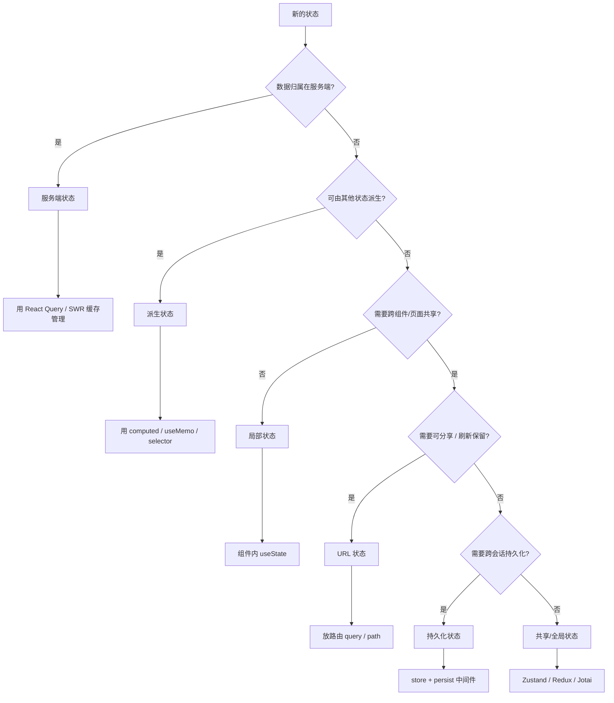

# 前端架构中的状态分类

状态管理是前端架构中最易失控的环节之一。缺乏清晰分类会导致状态散落各处、来源不清、互相覆盖，最终演变成难以维护的「全局状态垃圾场」。理解并**对状态分类**，是选择合适管理方案、设计可扩展架构的前提。

## 1. 为什么要对状态分类

| 痛点                | 根因                               |
| ------------------- | ---------------------------------- |
| 全局 store 无限膨胀 | 把本应局部的状态塞进全局           |
| 缓存不一致          | 服务端数据与本地副本没有边界       |
| 状态来源混乱        | 无法回答「这个数据从哪来、归谁管」 |
| 重渲染范围过大      | 高频局部状态放在全局，牵一发动全身 |

分类的意义在于：**不同的状态有不同的生命周期、更新频率与同步策略，应该用不同的工具和方式管理。**

## 2. 按「数据来源」分类

这是最经典、也最实用的一级分类维度。

### 2.1 服务端状态 (Server State)

**定义**：数据真实的所有权在服务端，前端只是其「缓存副本」。

- **特征**：异步获取、可能过期、需要与服务器同步、多端共享。
- **例子**：用户列表、订单详情、商品信息、分页数据。

```javascript
// ❌ 把服务端状态当本地状态塞进全局 store
const store = createStore({
  userList: [],
  loading: false,
  error: null,
  // 手动管理 loading / error / 缓存失效，繁琐且易错
})

// ✅ 用专门的服务器状态库（React Query / SWR）
const { data, isLoading, error } = useQuery({
  queryKey: ['users'],
  queryFn: fetchUsers,
  staleTime: 5 * 60 * 1000,
})
```

**推荐工具**：React Query (TanStack Query)、SWR、Apollo Client（GraphQL）。

### 2.2 客户端状态 (Client State)

**定义**：数据由前端产生，只存在于客户端，无需与服务器同步。

- **特征**：同步、生命周期短、通常是交互状态。
- **例子**：弹窗开关、当前选中项、表单草稿、UI 主题。

```javascript
// 客户端状态适合用轻量方案管理
const [isOpen, setIsOpen] = useState(false)
const theme = useAtom(themeAtom) // Jotai 原子
```

**推荐工具**：组件内 `useState` / `useReducer`、Zustand、Jotai、Redux Toolkit。

## 3. 按「作用域」分类

决定状态**应该存在哪里**，影响可维护性与重渲染范围。

| 类型         | 作用范围          | 存储位置                 | 示例                   |
| ------------ | ----------------- | ------------------------ | ---------------------- |
| **局部状态** | 单个组件          | 组件内 `useState`        | 输入框当前值、hover 态 |
| **共享状态** | 多个兄弟/父子组件 | 提升到公共父级，或 store | 表单组件的共享表单值   |
| **全局状态** | 跨页面/跨模块     | 全局 store               | 登录用户、主题、国际化 |
| **URL 状态** | 通过链接分享/刷新 | 路由 query / path        | 筛选条件、分页、tab    |

### 3.1 状态提升的边界

```javascript
// ❌ 过度提升：把仅两个组件用的状态放进全局
const globalModalOpen = useGlobalStore(s => s.modalOpen)

// ✅ 就近原则：优先放在最近的公共父级
function Parent() {
  const [open, setOpen] = useState(false)
  return (
    <>
      <Trigger onOpen={() => setOpen(true)} />
      <Dialog open={open} onClose={() => setOpen(false)} />
    </>
  )
}
```

## 4. 按「来源与派生关系」分类

### 4.1 派生状态 (Derived State)

**定义**：可以由其他状态**计算得出**的状态，不应单独存储。

- **反模式**：把派生值存成独立 state，导致需要手动同步。
- **正解**：用计算属性/选择器实时派生。

```javascript
// ❌ 把可派生值冗余存储，容易不一致
const [items, setItems] = useState([])
const [totalPrice, setTotalPrice] = useState(0)
// 每次 setItems 都要记得同步 setTotalPrice —— 极易出错

// ✅ 直接派生
const items = useAtom(itemsAtom)
const totalPrice = useMemo(
  () => items.reduce((sum, i) => sum + i.price, 0),
  [items],
)

// Vue 中直接用计算属性
const totalPrice = computed(() => items.value.reduce((s, i) => s + i.price, 0))
```

### 4.2 表单状态 (Form State)

表单状态特殊在于：**高频变化、多字段、需校验、需提交**，往往独立于全局 store 管理。

```javascript
import { useForm } from 'react-hook-form'

const {
  register,
  handleSubmit,
  formState: { errors },
} = useForm()

// 表单状态由 useForm 局部管理，只在提交时与服务器交互
```

**推荐工具**：React Hook Form、Formik（React）；VeeValidate（Vue）。

### 4.3 持久化状态 (Persisted State)

需要**跨会话保留**的状态（如登录态、偏好设置），涉及序列化与恢复。

```javascript
import { persist } from 'zustand/middleware'

const useStore = create(
  persist(
    set => ({
      theme: 'light',
      toggle: () =>
        set(s => ({ theme: s.theme === 'light' ? 'dark' : 'light' })),
    }),
    { name: 'app-preferences' }, // 自动同步到 localStorage
  ),
)
```

## 5. 分类决策框架

拿到一个新状态时，可按下图流程判断归类和归属：



## 6. 工具选型映射

| 状态类型   | 首选工具                                            | 备选                         |
| ---------- | --------------------------------------------------- | ---------------------------- |
| 服务端状态 | TanStack Query / SWR                                | Apollo（GraphQL）、RTK Query |
| 局部状态   | `useState` / `useReducer`                           | 组件内部状态                 |
| 全局状态   | Zustand / Jotai（轻量）、Redux Toolkit（重型团队）  | Pinia（Vue）、MobX           |
| URL 状态   | 路由库（React Router / Vue Router / Next.js）       | 手写 query 解析              |
| 表单状态   | React Hook Form / Formik                            | VeeValidate（Vue）           |
| 持久化状态 | 各 store 的 persist 中间件 + localStorage/IndexedDB | 手写序列化                   |

> **注意：** 不要「一个 Redux 管全部」。现代最佳实践是**按状态类型混合使用**——服务端数据交给 Query，交互状态用轻量 store，局部状态留在组件内。

## 7. 最佳实践总结

- **先分类再选型**：不要先选库再硬套，应根据状态来源与作用域决定工具。
- **服务端/客户端状态分离**：这是避免 store 腐化的第一原则。
- **能派生就不存储**：减少冗余状态，避免手动同步。
- **就近原则**：状态放在能覆盖其使用者的**最近**公共位置。
- **URL 状态优先于全局状态**：需要分享、刷新、前进后退的状态应放 URL。
- **表单状态局部化**：高频变化的表单值不要进全局 store。
- **谨慎持久化**：只持久化真正需要的偏好与登录态，注意版本迁移与敏感数据加密。

## 8. 使用示例：一个购物列表页的状态全景

用一个「商品列表 + 筛选 + 购物车 + 主题」页面，展示各类状态如何各归其位：

```javascript
// —— 服务端状态：商品列表，交给 React Query 缓存 ——
function ProductList() {
  const { data, isLoading } = useQuery({
    queryKey: ['products'],
    queryFn: fetchProducts,
  })
  // ...
}

// —— URL 状态：筛选条件放 query，可分享 / 刷新保留 ——
function useFilters() {
  const [searchParams, setSearchParams] = useSearchParams()
  const category = searchParams.get('category') ?? 'all'
  return { category, setCategory: c => setSearchParams({ category: c }) }
}

// —— 全局/共享状态：购物车，跨页面共享 ——
const useCartStore = create(set => ({
  items: [],
  add: item => set(s => ({ items: [...s.items, item] })),
}))

// —— 局部状态：弹窗开关，只此组件用 ——
function CartButton() {
  const [open, setOpen] = useState(false)
  const count = useCartStore(s => s.items.length)
  // ...
}

// —— 派生状态：购物车总价，由 items 计算，不单独存 ——
function CartTotal() {
  const items = useCartStore(s => s.items)
  const total = useMemo(
    () => items.reduce((sum, i) => sum + i.price, 0),
    [items],
  )
  // ...
}

// —— 持久化状态：主题偏好，跨会话保留 ——
const useThemeStore = create(
  persist(
    set => ({
      theme: 'light',
      toggle: () =>
        set(s => ({ theme: s.theme === 'light' ? 'dark' : 'light' })),
    }),
    { name: 'theme' },
  ),
)
```

**对照表：**

| 状态         | 分类          | 存放位置     | 工具                 |
| ------------ | ------------- | ------------ | -------------------- |
| 商品列表     | 服务端状态    | 缓存         | React Query          |
| 筛选条件     | URL 状态      | query 参数   | 路由库               |
| 购物车 items | 全局/共享状态 | 全局 store   | Zustand              |
| 弹窗开关     | 局部状态      | 组件内       | `useState`           |
| 购物车总价   | 派生状态      | 不存储       | `useMemo` / selector |
| 主题偏好     | 持久化状态    | localStorage | persist 中间件       |

## 9. 常见反模式速查

| 反模式                      | 危害                                       | 正解                              |
| --------------------------- | ------------------------------------------ | --------------------------------- |
| 把服务端数据塞进 Redux      | `loading`/`error`/缓存失效需手动管理，易错 | 交给 React Query / SWR            |
| 可派生的值单独存 state      | 需手动同步，极易不一致                     | `useMemo` / `computed` / selector |
| 局部状态全局化              | 牵一发动全身，重渲染范围过大               | 就近放组件或最近公共父级          |
| 该分享/刷新保留的状态放全局 | 链接不可分享、刷新丢失                     | 放 URL query / path               |
| 表单高频值进全局 store      | 每次输入触发全局更新，性能差               | 表单库局部管理                    |
| 一个 Redux 管全部           | store 膨胀、职责混乱                       | 按类型混合选型                    |
