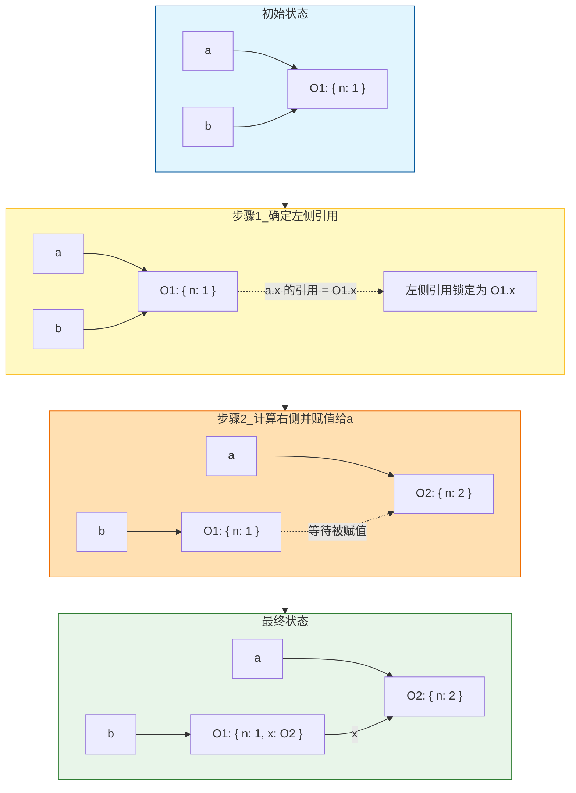

# 内存空间 (Memory Space)

在 JavaScript 中，内存主要分为两部分：**栈内存 (Stack)** 和 **堆内存 (Heap)**。理解数据在内存中的存储方式是掌握 [深浅拷贝](/js/basic/copy)、[作用域](/js/basic/lexicalScope) 与 [垃圾回收](/js/advanced/misc/gcMemoryLeak) 的根基。

## 1. 栈与堆对比

| 维度         | 栈内存 (Stack)                               | 堆内存 (Heap)                          |
| :----------- | :------------------------------------------- | :------------------------------------- |
| **存储内容** | 原始数据类型、函数调用上下文（栈帧）         | 引用数据类型（对象）                   |
| **特点**     | 大小固定、空间较小                           | 大小不固定、可动态调整                 |
| **访问方式** | 按值访问                                     | 按引用访问                             |
| **分配释放** | 系统自动分配释放，函数调用结束即销毁对应栈帧 | 动态分配，由垃圾回收器自动管理         |
| **效率**     | 高                                           | 相对较低（需先查栈中地址，再跳转到堆） |

## 2. 栈内存 (Stack)

栈内存是一种线性数据结构，遵循**后进先出 (LIFO)** 的原则，主要用于存储**原始数据类型**的值和**函数调用的上下文**。

- **存储类型**：存储原始数据类型（`Number`、`String`、`Boolean`、`Null`、`Undefined`、`Symbol`、`BigInt`），这些类型的数据大小固定、空间较小。
- **访问方式**：按值访问。
- **分配与释放**：由系统自动分配和释放，例如函数调用结束时，其对应的栈帧就会被销毁。
- **效率**：运行效率高。

## 3. 堆内存 (Heap)

堆内存用于存储**引用数据类型**，也就是对象。这些值的大小不固定，可以动态调整。

- **存储类型**：存储引用数据类型，如 `Object`、`Array`、`Function` 等。
- **访问方式**：按引用访问。访问引用类型变量时，先从栈中读取该对象的内存地址，再通过地址在堆中找到对应对象。
- **分配与释放**：动态分配内存，大小不固定，由垃圾回收器自动管理释放。
- **效率**：访问速度相对较慢。

## 4. 数据类型的存储方式

- **原始数据类型**：变量和值都存储在**栈内存**中。将一个原始类型变量赋给另一个变量时，实际上创建了该值的**副本**。
- **引用数据类型**：变量名（作为引用，即内存地址）存储在**栈内存**中，对象本身存储在**堆内存**中。将一个引用类型变量赋给另一个变量时，复制的是**内存地址**，两个变量指向堆中的同一个对象。

| 代码                            | 内存分配                                                                      |
| :------------------------------ | :---------------------------------------------------------------------------- |
| `let a = 10;`                   | 变量 `a` 和值 `10` 都存储在**栈**中。                                         |
| `let b = 'hello';`              | 变量 `b` 和值 `'hello'` 都存储在**栈**中。                                    |
| `let obj1 = { name: 'Alice' };` | 变量 `obj1`（内存地址）存在**栈**中，对象 `{ name: 'Alice' }` 存在**堆**中。  |
| `let obj2 = obj1;`              | `obj2` 存在**栈**中，复制了 `obj1` 的内存地址，二者指向**堆**中的同一个对象。 |

```js
var a = 20
var b = a
b = 30

// 这时 a 的值是多少？
// 20   // [!code highlight]
```

```js
var a = { name: '前端开发' }
var b = a
b.name = '进阶'

// 这时 a.name 的值是多少
// '进阶' // [!code highlight]
```

```js
var a = { name: '前端开发' }
var b = a
a = null

// 这时 b 的值是多少
// { name: '前端开发' }   // [!code highlight]
```

> [!TIP] 共同本质
> 原始类型赋值是**拷贝值**，引用类型赋值是**拷贝地址**。重新赋值只是改变变量持有的地址/值，不影响原来指向的对象——这三点是理解 [深浅拷贝](/js/basic/copy) 的全部基础。

## 5. 内存空间管理

JavaScript 的内存生命周期：

- **分配**你所需要的内存。
- **使用**分配到的内存（读、写）。
- 不需要时将其**释放、归还**。

JavaScript 有**自动垃圾收集机制**，最常用的是通过**标记清除**算法找到不再继续使用的对象。使用 `a = null` 其实仅仅做了一个释放引用的操作，让 `a` 原本对应的值失去引用、脱离执行环境，这个值会在下一次垃圾收集器执行时被找到并释放。

在**局部作用域**中，函数执行完毕，局部变量就没有存在的必要了，垃圾收集器很容易判断并回收。但全局变量什么时候需要自动释放内存空间则很难判断，因此开发中应尽量避免使用全局变量。

```js
var a = { n: 1 }
var b = a
a.x = a = { n: 2 }

a.x // 这时 a.x 的值是多少
b.x // 这时 b.x 的值是多少
//   undefined   // [!code highlight]
//   {n:2}      // [!code highlight]
```

> [!NOTE] 解析 a.x = a = { n: 2 }
> 连续赋值是**从右往左**计算，但`.`运算符优先级大于`=`运算符，先执行`a.x`：
>
> 1. 先定位 `a.x`,`a` 指向原对象`{ n: 1}`（记为 O1),此时`a` 和`b` 指向对象`{ n:1, x:undefined }`。
> 2. 执行 `a = { n: 2 }`，`a` 指向新对象 O2, 此时`a` 指向对象 `{ n:2 }`。
> 3. 把O2 赋给 O1 的 `x`，即 `O1.x = O2`,相当于 `b.x`=`{ n:2 }`。
>
> 最终 `a` = O2（`a.x` 为 `undefined`），`b` 仍指向 O1（`b.x` 为 O2）。



## 6. 内存回收机制

JavaScript 有自动垃圾收集机制，垃圾收集器会每隔一段时间执行一次释放操作，找出不再继续使用的值并释放其占用的内存。

### 6.1 局部变量和全局变量的销毁

- **局部变量**：在局部作用域中，函数执行完毕，局部变量就没有存在的必要了，垃圾收集器很容易判断并回收。
- **全局变量**：全局变量什么时候需要自动释放内存空间则很难判断，所以开发中应尽量**避免**使用全局变量。

### 6.2 V8 引擎与堆内存

以 Google 的 V8 引擎为例，V8 中所有的 JS 对象都是通过**堆**进行内存分配的。

- **初始分配**：声明变量并赋值时，V8 引擎在堆内存中为该变量分配空间。
- **继续申请**：当已申请的内存不足以存储该变量时，V8 会继续申请内存，直到堆的大小达到 V8 引擎的内存上限为止。

### 6.3 V8 引擎的分代管理

V8 引擎对堆内存中的 JS 对象进行**分代管理**：

- **新生代**：存放存活周期较短的 JS 对象，如临时变量、字符串等。
- **老生代**：存放经过多次垃圾回收仍然存活、存活周期较长的对象，如主控制器、服务器对象等。

## 7. 垃圾回收算法

垃圾回收算法的核心思想是判断内存是否已不再使用。

### 7.1 引用计数

引用计数算法定义“**内存不再使用**”的标准很简单：看一个对象是否有指向它的**引用**。如果没有其他对象指向它，说明该对象已不再需要。

```js
// 创建一个对象 person，它有指向属性 age 和 name 的引用
var person = {
  age: 12,
  name: 'aaaa',
}

person.name = null // 虽然 name 置为 null，但 person 仍有对 name 的引用，name 不会回收

var p = person
person = 1 // 原 person 对象被赋值为 1，但有新引用 p 指向原对象，不会被回收

p = null // 原 person 对象已无引用，很快会被回收
```

引用计数有一个致命的问题——**循环引用**。如果两个对象相互引用，尽管它们已不再使用，垃圾回收器也不会回收，最终可能导致内存泄漏。

```js
function cycle() {
  var o1 = {}
  var o2 = {}
  o1.a = o2
  o2.a = o1

  return 'cycle reference!'
}

cycle()
```

`cycle` 函数执行完成后，`o1` 和 `o2` 实际上已不再需要，但根据引用计数原则，它们之间的相互引用依然存在，因此这部分内存不会被回收。所以现代浏览器**不再使用**该算法。旧版 IE 依旧使用此算法：

```js
var div = document.createElement('div')
div.onclick = function () {
  console.log('click')
}
```

上面的写法很常见，但这是一个循环引用：变量 `div` 有事件处理函数的引用，同时事件处理函数也有 `div` 的引用（因为 `div` 变量可在函数内被访问），循环引用就出现了。

### 7.2 标记清除（常用）

标记清除算法将“**不再使用的对象**”定义为“**无法到达的对象**”。即从根部（JS 中就是全局对象）出发，定时扫描内存中的对象，凡是能从根部到达的对象都**保留**，无法触及的对象被标记为**不再使用**，稍后回收。

无法触及的对象包含了没有引用的对象这个概念，但反之未必成立。使用标记清除，上面循环引用的例子可以被正确回收。对主流浏览器来说，只需切断需要回收的对象与根部的联系即可。最常见的内存泄漏一般都与 DOM 元素绑定有关：

```js
email.message = document.createElement('div')
displayList.appendChild(email.message)

// 稍后从 displayList 中清除 DOM 元素
displayList.removeAllChildren()
```

上面代码中，`div` 元素已从 DOM 树中清除，但该 `div` 还绑定在 `email` 对象中。只要 `email` 对象存在，`div` 元素就会一直保存在内存中。

## 8. 常见的内存泄漏场景及处理

以下是最常见的内存泄漏场景，以及如何避免和修复。更完整的分析见 [垃圾回收与内存泄漏](/js/advanced/misc/gcMemoryLeak)。

### 8.1 意外的全局变量

**原因**：在函数内部忘记使用 `let`、`const` 或 `var` 声明变量时，该变量会被创建在全局对象上（浏览器中是 `window`）。全局变量的生命周期与页面相同，除非被显式移除，否则垃圾回收器无法回收它们。

```js
function createLeak() {
  // a 没有被声明，因此会被创建为 window.a
  a = new Array(1000000).join('*')
}
createLeak()
// 函数执行后，变量 a 依然存在于 window 上，占用大量内存。
```

**处理方法**：始终使用 `let`、`const` 或 `var` 声明变量，确保它们在正确的作用域内。启用 **严格模式（`'use strict'`）** 也是好习惯，它会在试图创建意外全局变量时抛出错误。

```js
'use strict'
function createLeakFixed() {
  let a = new Array(1000000).join('*')
  // 函数执行完毕后，变量 a 会被自动销毁。
}
createLeakFixed()
```

### 8.2 被遗忘的定时器或回调函数

**原因**：`setTimeout`、`setInterval`、`requestAnimationFrame` 等定时器，或事件监听器 `addEventListener`，如果内部引用了外部对象，又没有在适当时候清除，这些外部对象将永远不会被回收。

```js
function startTimer() {
  let largeObject = { data: new Array(1000000).join('x') }

  // setInterval 会一直持有对 largeObject 的引用
  setInterval(() => {
    console.log(largeObject.data.length)
  }, 1000)
}
startTimer()
```

**处理方法**：在定时器或回调完成任务后，或在组件销毁、页面卸载等生命周期结束时，务必手动清除它们。

```js
function startTimerFixed() {
  let largeObject = { data: new Array(1000000).join('x') }

  const intervalId = setInterval(() => {
    console.log(largeObject.data.length)
  }, 1000)

  // 假设未来某个时间点不再需要这个定时器
  setTimeout(() => {
    clearInterval(intervalId) // 清除定时器
    largeObject = null // 显式释放引用
    console.log('Timer cleared, memory released.')
  }, 5000)
}
startTimerFixed()
```

### 8.3 脱离 DOM 的元素引用 (Detached DOM)

**原因**：用 JavaScript 从 DOM 中移除了元素，但代码中仍保留对该元素的引用时，会发生内存泄漏。这个 DOM 元素在页面上看不到了，但它及其所有子节点都无法被垃圾回收器释放。

```html
<div id="container">
  <button id="leakyButton">Click Me</button>
</div>
```

```js
// 在一个变量中保存了对按钮的引用
const leakyButtonRef = document.getElementById('leakyButton')

// 从 DOM 中移除了按钮的父节点
document.getElementById('container').remove()

// 此时页面已看不到按钮，但 leakyButtonRef 依然持有引用，
// 按钮元素及其关联的事件监听器等都无法被回收。
console.log(leakyButtonRef) // 依然可以访问
```

**处理方法**：DOM 元素被移除后，确保代码中所有对它的引用也都被清除。

```js
let leakyButtonRef = document.getElementById('leakyButton')
// ... 添加事件监听等操作 ...

// 当不再需要时
document.getElementById('container').remove()
leakyButtonRef = null // 手动解除引用
```

### 8.4 闭包 (Closures)

**原因**：闭包能“**记住**”其创建时所在的作用域，但若不当地长期持有一个捕获了大对象的闭包（例如赋给全局变量或作为事件监听器），这个大对象也无法被回收。

```js
function createClosure() {
  // 一个大对象
  const largeData = new Array(1000000).join('y')

  // 返回一个闭包，隐式持有了对 largeData 的引用
  return function () {
    return largeData
  }
}

// globalClosure 持有了闭包，因此 largeData 无法被释放
const globalClosure = createClosure()
```

**处理方法**：审视闭包，确保它们没有无意中捕获不再需要的大对象。如果闭包只需要对象中的某个值，只传递那个值即可。

```js
function createClosureFixed() {
  const largeData = new Array(1000000).join('y')
  const specificValue = largeData.length // 只获取需要的值

  // 闭包现在只引用了一个小数字，而不是整个大字符串
  return function () {
    return specificValue
  }
}

const globalClosureFixed = createClosureFixed()
```
