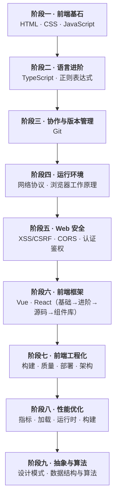

# 前端学习路线图

本路线图按「**知识体系完整覆盖**」排列，从基础概念出发，层层递进到框架源码、工程化、性能、算法与浏览器底层。九个阶段是**主线**，两套「实践副线」贯穿始终，帮助你既能建立完整知识版图，又能在真实项目中落地。

**一句话理解**：**「先会写页面，再懂语言；先懂浏览器，再上框架；最后用工程化、性能、算法与设计模式补齐抽象能力。」**

## 1. 全景路线图

> 两条**实践副线**贯穿始终：① [JS 手写实现](/js/hand-writing/promiseHandleWriting) ② [Vue 组件库实践](/frameworks/vue/components/quickStart)，边学边写，把知识内化成能力。

## 2. 分阶段详解

### 阶段一 · 前端基石（HTML / CSS / JavaScript）

打牢三座地基：语义化结构、布局与样式、语言核心机制。

| 方向      | 入口                                                                                                                                                                            | 核心内容                               |
| --------- | ------------------------------------------------------------------------------------------------------------------------------------------------------------------------------- | -------------------------------------- |
| HTML 基础 | [HTML 基本结构](/html/basic/htmlBasicStructure) → [DOM 事件](/html/basic/domEvents) → [语义化](/html/advanced/semanticHtml)                                                     | 结构、标签、DOM 操作、事件流、可访问性 |
| CSS 基础  | [盒模型](/css/basic/boxModel) → [文档流](/css/basic/documentFlow) → [定位](/css/basic/position)                                                                                 | 布局基石，理解普通流与脱离文档流       |
| CSS 进阶  | [Flex](/css/advanced/layout/flexibleBox) → [Grid](/css/advanced/layout/grid) → [移动端适配](/css/advanced/responsive/mobileAdaptation)                                          | 现代布局与响应式                       |
| JS 基础   | [八种数据类型](/js/basic/eightTypes) → [执行上下文](/js/basic/executionContextAndStack) → [作用域](/js/basic/lexicalScope) → [闭包](/js/basic/closure) → [this](/js/basic/this) | 语言核心，决定后续理解上限             |

### 阶段二 · 语言进阶（TypeScript / 正则表达式）

在 JS 之上叠加类型系统与文本处理能力。

- **TypeScript**：[类型基础](/typescript/basicTypes) → [泛型](/typescript/generics) → [高级类型](/typescript/advancedTypes) → [类型体操](/typescript/typeChallenges)。
- **正则表达式**：[核心概念](/regexp/regexp) + [语法速查表](/regexp/cheatsheet)，配合 [JS 正则对象](/js/advanced/data-types/regExp) 使用。

### 阶段三 · 协作与版本管理（Git）

从单兵作战走向团队协作，这是工程化的第一步。

- [Git 核心概念](/git/git) → [命令速查](/git/commands) → [应用场景](/git/scenarios) → [分支工作流](/git/branchWorkflow)。

### 阶段四 · 运行环境（网络协议 / 浏览器工作原理）

理解代码真正运行在哪、如何到达用户。这是面试与排障的硬通货。

- **网络**：[OSI 模型](/networkAndBrowsers/fundamentals/osi) → [TCP](/networkAndBrowsers/transport/tcp) → [HTTP](/networkAndBrowsers/http/http) → [HTTPS](/networkAndBrowsers/http/https)。
- **浏览器**：[进程与线程](/networkAndBrowsers/process-model/processAndThread) → [从 URL 到页面渲染](/networkAndBrowsers/browser/renderingProcess)。
- **缓存**：[浏览器缓存](/networkAndBrowsers/caching/browserCache) → [PWA 与 Service Worker](/networkAndBrowsers/caching/serviceWorkerPwa)。

### 阶段五 · Web 安全

在写代码前建立安全边界意识。

- [XSS 与 CSRF](/webSecurity/csrfAndXss) → [同源策略](/webSecurity/crossOrigin) → [CORS](/webSecurity/cors) → [认证存储取舍](/webSecurity/authStorageTradeoff) → [企业级鉴权安全](/webSecurity/enterpriseAuthSecurity)。

### 阶段六 · 前端框架（Vue / React）

选一条主线（Vue 或 React）深入，另一条做对标。两条都遵循「**基础 → 进阶 → 源码**」的同一路径。

| 阶段 | Vue 入口                                                                                                                                                                                                                                                                                 | React 入口                                                                                                                                                                                                                                                                                 |
| ---- | ---------------------------------------------------------------------------------------------------------------------------------------------------------------------------------------------------------------------------------------------------------------------------------------- | ------------------------------------------------------------------------------------------------------------------------------------------------------------------------------------------------------------------------------------------------------------------------------------------ |
| 基础 | [Vue 介绍](/frameworks/vue/basic/intro) → [响应式](/frameworks/vue/basic/reactivityFundamentals) → [组件通信](/frameworks/vue/basic/componentCommunication)                                                                                                                              | [React 介绍](/frameworks/react/basic/intro) → [组件与 Props](/frameworks/react/basic/componentAndProps) → [State](/frameworks/react/basic/stateAndLifecycle)                                                                                                                               |
| 进阶 | [组合式函数](/frameworks/vue/basic/customHooks) → [路由](/frameworks/vue/basic/vueRouter) → [Pinia](/frameworks/vue/basic/pinia)                                                                                                                                                         | [Hooks](/frameworks/react/basic/hooks/useState) → [路由](/frameworks/react/basic/reactRouter) → [Redux](/frameworks/react/basic/reactRedux)                                                                                                                                                |
| 源码 | [Vue 源码目录](/frameworks/vue/advanced/source-code/vueCatalog) → [响应式核心](/frameworks/vue/advanced/source-code/reactivity-core/reactive) → [渲染器](/frameworks/vue/advanced/source-code/renderer/createRenderer) → [Diff](/frameworks/vue/advanced/source-code/patchKeyedChildren) | [React 源码目录](/frameworks/react/advanced/source-code/sourceCodeCatalog) → [Fiber](/frameworks/react/advanced/core-design/fiberArchitecture) → [协调](/frameworks/react/advanced/core-design/reconciliation) → [调度与优先级](/frameworks/react/advanced/core-design/schedulingAndLanes) |

> 双框架对标可看 [React 与 Vue3 核心对比](/frameworks/react/advanced/comparisons/overview)；组件库实践从 [快速开始](/frameworks/vue/components/quickStart) 进入。

### 阶段七 · 前端工程化

让代码可维护、可交付、可规模化。

- **模块与包**：[模块化](/frontEngineering/module-component/modules) → [包管理器](/frontEngineering/package-management/packageManagers) → [package.json](/frontEngineering/package-management/packageJson)。
- **构建**：[Vite](/frontEngineering/build-tools/bundlers/vite) → [Webpack](/frontEngineering/build-tools/bundlers/webpack)。
- **质量**：[代码规范](/frontEngineering/quality/linters) → [Git Hooks](/frontEngineering/quality/gitHooks) → [测试](/frontEngineering/quality/testing)。
- **部署与架构**：[CI/CD](/frontEngineering/ci-cd/ciCd) → [多环境](/frontEngineering/ci-cd/deploymentEnvironments) → [Monorepo](/frontEngineering/architecture/monorepo) → [微前端](/frontEngineering/architecture/microFrontend)。

### 阶段八 · 性能优化

从「能用」到「好用」，建立性能闭环。

- [Core Web Vitals](/performanceOptimization/coreWebVitals) → [首屏优化](/performanceOptimization/firstScreen) → [资源加载](/performanceOptimization/resourceLoading) → [JS 优化](/performanceOptimization/jsExecution) → [虚拟列表](/performanceOptimization/virtualList) → [性能监控](/frontEngineering/quality/performanceMonitoring)。

### 阶段九 · 抽象与算法（设计模式 / 数据结构与算法）

补齐内功：用设计模式组织代码，用数据结构与算法解决复杂问题。

- **设计模式**：[总结与原则](/designPatterns/summary/patternPrinciple) → [创建型](/designPatterns/creational/factoryPattern) → [结构型](/designPatterns/structural/adapterPattern) → [行为型](/designPatterns/behavioral/observerPattern) → [MVVM](/designPatterns/architecture/MVVM)。
- **数据结构**：[数组](/dataStructuresAndAlgorithms/data-structures/array) → [链表](/dataStructuresAndAlgorithms/data-structures/linkedList) → [栈/队列](/dataStructuresAndAlgorithms/data-structures/stack) → [树](/dataStructuresAndAlgorithms/data-structures/tree) → [堆](/dataStructuresAndAlgorithms/data-structures/heap) → [图](/dataStructuresAndAlgorithms/data-structures/graph)。
- **算法**：[复杂度分析](/dataStructuresAndAlgorithms/algorithms/algorithmComplexity) → [排序](/dataStructuresAndAlgorithms/algorithms/sortAlgorithms) → [DFS/BFS](/dataStructuresAndAlgorithms/algorithms/DFS) → [双指针](/dataStructuresAndAlgorithms/algorithms/twoPointers) → [滑动窗口](/dataStructuresAndAlgorithms/algorithms/slideWindow) → [动态规划](/dataStructuresAndAlgorithms/algorithms/dynamicProgramming)。

## 3. 两条实践副线

主线的每一阶段，都可以配合副线「动手写」来巩固：

| 副线    | 入口                                                                                                                                                         | 说明                            |
| ------- | ------------------------------------------------------------------------------------------------------------------------------------------------------------ | ------------------------------- |
| JS 手写 | [Promise 手写](/js/hand-writing/promiseHandleWriting) / [数组方法手写](/js/hand-writing/arrayHandleWriting) / [高阶函数](/js/hand-writing/highLevelFunction) | 用「造轮子」吃透语言机制        |
| 组件库  | [快速开始](/frameworks/vue/components/quickStart)                                                                                                            | 从 Button 到 Form，理解组件设计 |

## 4. 如何高效使用

- **按阶段顺序推进**：阶段之间是依赖关系，跳过「运行环境」直接啃源码会事倍功半。
- **框架二选一为主线**：先用一套框架走完「基础→进阶→源码」，再用对比文档做对标。
- **每阶段配一个实践**：读完就写，用「手写」或「组件库」把知识点变成肌肉记忆。
- **进阶/源码可反复回看**：浏览器原理、闭包、响应式这些底层概念，会随着实践不断加深理解。
