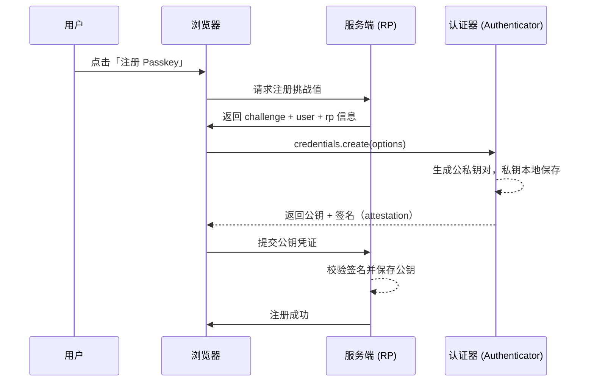
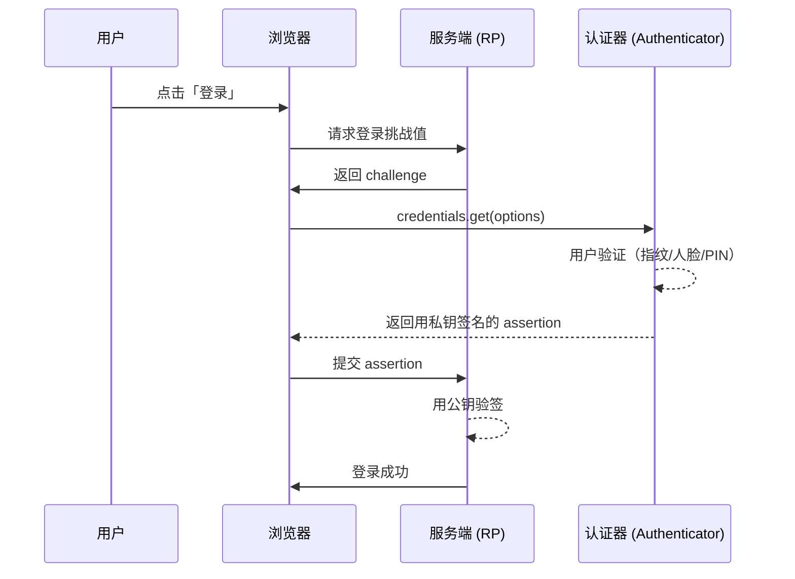

# WebAuthn 与 Passkey

WebAuthn（Web Authentication）是 W3C 与 FIDO 联盟制定的浏览器免密认证标准，基于**非对称密码学**与**硬件安全密钥**实现。Passkey（通行密钥）则是 WebAuthn 之上的产品形态，允许用户用设备（手机、电脑、硬件钥匙）上的生物识别或 PIN 完成登录，彻底告别密码泄露、钓鱼与撞库风险。

## 1. 背景：密码认证的困境

| 问题              | 说明                                 |
| ----------------- | ------------------------------------ |
| **密码泄露/撞库** | 用户复用密码，一处泄露处处沦陷       |
| **钓鱼攻击**      | 密码可被仿冒网站骗取                 |
| **用户体验差**    | 记忆复杂密码、定期修改、找回流程繁琐 |

WebAuthn 通过「**私钥不出设备** + **公钥注册到服务端**」的非对称方案，从根上规避了上述问题。

## 2. 核心概念

| 概念                       | 说明                                                    |
| -------------------------- | ------------------------------------------------------- |
| **Relying Party (RP)**     | 依赖方，即提供认证服务的网站/应用                       |
| **Authenticator**          | 认证器，持有私钥的设备（手机、电脑 TPM、硬件 U 盾）     |
| **Credential**             | 凭证，指注册后生成的公私钥对及其元数据                  |
| **Attestation**            | 证明：注册时认证器「自证身份」的凭证                    |
| **Assertion**              | 断言：登录时认证器用私钥签名的凭证                      |
| **Challenge**              | 一次性随机数，防重放攻击                                |
| **User Verification (UV)** | 用户验证：要求 PIN / 生物识别（区别于仅「存在性」验证） |

## 3. 运行流程

### 3.1 注册 (Registration / Attestation)



### 3.2 登录 (Authentication / Assertion)



> **关键：** 私钥永不出设备；每次登录的签名都绑定当次 `challenge` 与 RP 域名，无法被重放或用于钓鱼站。

## 4. 前端 API 使用

WebAuthn 通过 `navigator.credentials` 暴露两个核心方法。

**关键配置枚举：**

| 选项                      | 可选值                                        | 说明                                                                  |
| ------------------------- | --------------------------------------------- | --------------------------------------------------------------------- |
| `authenticatorAttachment` | `platform` / `cross-platform`                 | `platform` 内置认证器（指纹/人脸/TPM）；`cross-platform` 外接硬件钥匙 |
| `userVerification`        | `required` / `preferred` / `discouraged`      | 是否要求 PIN / 生物识别（区别于仅「存在性」验证）                     |
| `residentKey`             | `required` / `preferred` / `discouraged`      | 是否生成可发现的 Passkey（`required` 才能免密自动填充）               |
| `attestation`             | `none` / `indirect` / `direct`                | 注册时是否附带认证器身份证明                                          |
| `transports`              | `usb` / `nfc` / `ble` / `internal` / `hybrid` | 认证器支持的传输方式（用于过滤可用凭证）                              |

**常用 COSE 算法 `alg`：**

| `alg`  | 算法  | 说明                        |
| ------ | ----- | --------------------------- |
| `-7`   | ES256 | ECDSA + SHA-256（最常用）   |
| `-257` | RS256 | RSASSA-PKCS1-v1_5 + SHA-256 |
| `-8`   | EdDSA | Ed25519                     |
| `-37`  | PS256 | RSASSA-PSS + SHA-256        |

### 4.1 注册：`navigator.credentials.create()`

```javascript
// 参数来自服务端：challenge、user、rp 等信息
async function register() {
  const options = {
    publicKey: {
      challenge: base64urlToBuffer(serverChallenge), // 服务端生成的随机数
      rp: { name: 'Example Corp' }, // 依赖方信息
      user: {
        id: base64urlToBuffer(userId), // 用户唯一 ID
        name: 'user@example.com', // 用户名
        displayName: '张三',
      },
      pubKeyCredParams: [
        { type: 'public-key', alg: -7 }, // ES256
        { type: 'public-key', alg: -257 }, // RS256
      ],
      authenticatorSelection: {
        authenticatorAttachment: 'platform', // 或 'cross-platform'（硬件钥匙）
        userVerification: 'required', // 要求生物识别/PIN
        residentKey: 'required', // 生成可发现的 Passkey
      },
      attestation: 'none',
    },
  }

  const credential = await navigator.credentials.create(options)
  // 将 credential 序列化后提交给服务端保存公钥
  return encodeCredential(credential)
}
```

### 4.2 登录：`navigator.credentials.get()`

```javascript
async function login() {
  const options = {
    publicKey: {
      challenge: base64urlToBuffer(serverChallenge),
      rpId: 'example.com', // 必须与注册时一致
      allowCredentials: [
        { id: credentialId, type: 'public-key' }, // 可选，限定可用凭证
      ],
      userVerification: 'required',
    },
  }

  const assertion = await navigator.credentials.get(options)
  // 将 assertion 提交给服务端验签
  return encodeAssertion(assertion)
}
```

### 4.3 序列化处理

WebAuthn 返回的 `ArrayBuffer` 无法直接 JSON 序列化，需 Base64URL 转换：

```javascript
function base64urlToBuffer(str) {
  const base64 = str.replace(/-/g, '+').replace(/_/g, '/')
  const padding = '='.repeat((4 - (base64.length % 4)) % 4)
  return Uint8Array.from(atob(base64 + padding), c => c.charCodeAt(0)).buffer
}

function bufferToBase64url(buffer) {
  const bytes = new Uint8Array(buffer)
  let str = ''
  bytes.forEach(b => (str += String.fromCharCode(b)))
  return btoa(str).replace(/\+/g, '-').replace(/\//g, '_').replace(/=+$/, '')
}
```

> **提示：** 生产环境建议使用 `@simplewebauthn/browser` 等成熟库，避免手写编解码与兼容性处理。

### 4.4 能力检测

```javascript
const supported =
  window.isSecureContext &&
  'credentials' in navigator &&
  window.PublicKeyCredential !== undefined

if (window.PublicKeyCredential?.isConditionalMediationAvailable) {
  // 支持「条件 UI」（自动填充式无感登录）
  const available = await PublicKeyCredential.isConditionalMediationAvailable()
}
```

### 4.5 返回的凭证结构

`create()` 与 `get()` 返回的都是 `PublicKeyCredential`：

| 字段       | 说明                                                                                  |
| ---------- | ------------------------------------------------------------------------------------- |
| `id`       | 凭证 ID（服务端据此关联公钥）                                                         |
| `rawId`    | 凭证 ID 的原始 `ArrayBuffer`                                                          |
| `response` | `AuthenticatorAttestationResponse`（注册）或 `AuthenticatorAssertionResponse`（登录） |
| `type`     | 固定为 `'public-key'`                                                                 |

**登录 `response`（assertion）关键字段：**

| 字段                | 说明                                                           |
| ------------------- | -------------------------------------------------------------- |
| `clientDataJSON`    | 客户端上下文（含 `challenge`、`origin`、`type`），服务端需校验 |
| `authenticatorData` | 认证器数据（含 `rpIdHash`、`signCount`、flags）                |
| `signature`         | 认证器用私钥对上述数据的签名                                   |
| `userHandle`        | 用户 ID（可发现凭证时返回）                                    |

> 这些二进制字段都不能直接 JSON 序列化，必须经 Base64URL 编码后提交（见 §4.3）。

## 5. Passkey 与条件 UI (Conditional UI)

Passkey 的关键体验是**免密自动填充**：页面加载时自动调起浏览器原生的通行密钥选择器，用户无需点「登录」按钮。

```javascript
// 页面加载即发起条件 UI 请求（无 allowCredentials）
const options = {
  publicKey: {
    challenge: base64urlToBuffer(serverChallenge),
    rpId: 'example.com',
    userVerification: 'required',
  },
  mediation: 'conditional', // 关键：启用条件 UI
}

// 将 Promise 挂起，等用户选择后 resolve
const assertion = await navigator.credentials.get(options)
```

配合 `autocomplete="webauthn"` 的表单输入框，浏览器会在此处展示 Passkey 选择器。

## 6. 服务端校验要点

前端只负责「获取签名」，真正的安全验证在服务端：

- **注册**：校验 `attestation` 签名，提取并保存 `credentialPublicKey`、`credentialId`、`signCount`。
- **登录**：用对应公钥验证 `assertion` 的 `authenticatorData` 与 `clientDataJSON` 签名。
- **防重放**：校验 `challenge` 与 `origin` / `rpIdHash` 一致性。
- **计数器**：比较 `signCount` 递增，检测凭证被克隆。

```javascript
// Node.js 侧伪代码（依赖 @simplewebauthn/server）
import {
  verifyRegistrationResponse,
  verifyAuthenticationResponse,
} from '@simplewebauthn/server'

const verification = await verifyRegistrationResponse({
  response: body,
  expectedChallenge: savedChallenge,
  expectedOrigin: 'https://example.com',
  expectedRPID: 'example.com',
})

if (verification.verified) {
  // 保存 verification.registrationInfo.credentialPublicKey
}
```

## 7. 安全性评估

| 优势            | 说明                                |
| --------------- | ----------------------------------- |
| **抗钓鱼**      | 绑定域名，仿冒站无法复用凭证        |
| **抗撞库/泄露** | 服务端无密码，只有公钥，泄露也无用  |
| **强用户验证**  | 依赖生物识别/PIN/硬件，强度远超密码 |

**需注意：**

- **备份与恢复**：Passkey 需云端同步（如 iCloud Keychain、Google Password Manager），否则换设备将无法登录。
- **恢复通道**：仍需提供账号恢复机制（如恢复码、备用邮箱）。
- **设备安全**：设备本身被解锁后，Passkey 即等同于已认证。

## 8. 最佳实践总结

- **渐进接入**：Passkey 作为登录方式之一，保留密码/短信等降级路径。
- **使用成熟库**：前端 `@simplewebauthn/browser`，服务端 `@simplewebauthn/server`。
- **支持条件 UI**：优先接入 `mediation: 'conditional'` 的免密体验。
- **做好序列化**：所有二进制字段需 Base64URL 编解码。
- **统一 `rpId`**：注册与登录的 `rpId`、`origin` 必须严格一致。
- **提供恢复方案**：Passkey 丢失/换机时用户能够找回账号。

## 9. 使用示例：完整的免密登录流程

```javascript
// 场景：一个页面同时支持「注册 Passkey」与「登录」，登录走条件 UI 无感自动填充
import { startRegistration, startAuthentication } from '@simplewebauthn/browser'

// —— 注册：服务端先返回 options（含 challenge）——
async function registerPasskey() {
  const optionsResp = await fetch('/api/webauthn/register/options').then(r =>
    r.json(),
  )
  const attResp = await startRegistration(optionsResp) // 内部调 credentials.create + 序列化
  const verified = await fetch('/api/webauthn/register/verify', {
    method: 'POST',
    headers: { 'Content-Type': 'application/json' },
    body: JSON.stringify(attResp),
  }).then(r => r.json())
  return verified.ok
}

// —— 登录：条件 UI，页面加载即挂起，等用户选择 Passkey ——
async function loginWithPasskey() {
  const optionsResp = await fetch('/api/webauthn/login/options').then(r =>
    r.json(),
  )
  const assertion = await startAuthentication(optionsResp, true) // true = 启用条件 UI
  const verified = await fetch('/api/webauthn/login/verify', {
    method: 'POST',
    headers: { 'Content-Type': 'application/json' },
    body: JSON.stringify(assertion),
  }).then(r => r.json())
  return verified.ok
}

// 按钮触发注册
document.querySelector('#register').onclick = registerPasskey

// 条件 UI：不依赖按钮，浏览器在 <input autocomplete="webauthn"> 处弹出选择器
loginWithPasskey()
```

> 手写编解码容易出错，`@simplewebauthn/browser` 的 `startRegistration` / `startAuthentication` 已封装好 `ArrayBuffer` ↔ Base64URL 转换与条件 UI 细节。
