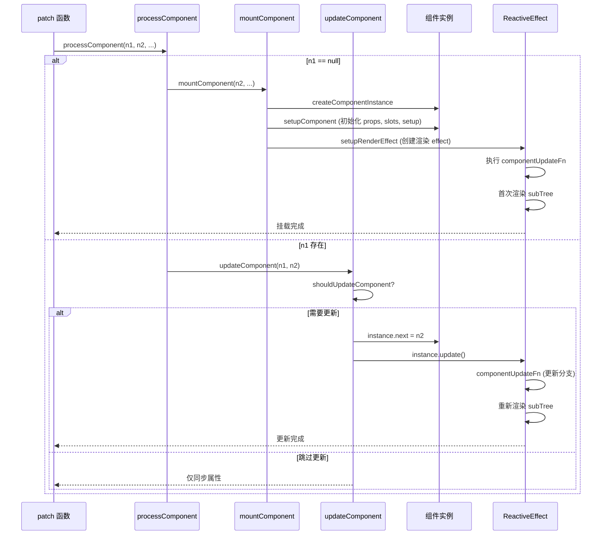

# `processComponent` 源码级解析

`processComponent` 是 Vue 3 渲染器（`renderer`）中专门用于处理**组件节点**的核心函数。组件是 Vue 应用的基本构建块，`processComponent` 负责组件的挂载、更新和卸载。与普通元素不同，组件节点并不直接对应真实 DOM，而是通过组件实例管理其内部的渲染子树。本文将从源码层面，深度剖析 `processComponent` 的实现机制、组件实例的生命周期以及在渲染流程中的关键位置。

## 1. 设计动机与作用

### 1.1 为什么需要独立的 `processComponent`？

- **类型分发**：在 `patch` 过程中，组件类型的 VNode 需要特殊的处理逻辑（创建组件实例、初始化 props、管理生命周期等），独立分支使渲染器保持清晰。
- **封装性**：组件内部的状态和渲染逻辑与外部隔离，通过 `processComponent` 实现黑盒更新。
- **性能优化**：通过 `shouldUpdateComponent` 判断是否需要更新组件，避免不必要的递归 render。

### 1.2 与普通元素的对比

| 特征               | `processComponent`                     | `processElement`                       |
| ------------------ | -------------------------------------- | -------------------------------------- |
| 对应真实 DOM       | 间接（通过内部 render 生成的子树）     | 直接创建真实元素                       |
| 更新触发条件       | 组件实例的响应式数据变化或 props/插槽变化 | 父组件重新渲染导致 VNode 对比          |
| 更新核心函数       | `updateComponent` / `shouldUpdateComponent` | `patchElement` / `patchChildren`       |
| 属性处理           | 需处理 props 和 attrs 的区别           | 直接设置 DOM 属性                      |
| 生命周期钩子       | 有（`beforeMount`、`mounted` 等）      | 无                                     |
| 子节点             | 由组件内部 render 产生，不直接传递     | 直接作为 children 传递                 |

## 2. 函数签名与位置

源码位于 `packages/runtime-core/src/renderer.ts`（在 `baseCreateRenderer` 内部定义）。

```typescript
const processComponent = (
  n1: VNode | null,
  n2: VNode,
  container: RendererElement,
  anchor: RendererNode | null,
  parentComponent: ComponentInternalInstance | null,
  parentSuspense: SuspenseBoundary | null,
  isSVG: boolean,
  optimized: boolean
) => {
  if (n1 == null) {
    // 首次挂载
    if (n2.shapeFlag & ShapeFlags.COMPONENT_KEPT_ALIVE) {
      // 已被 keep-alive 缓存的组件，直接激活
      ;(parentComponent!.ctx as KeepAliveContext).activate(n2, container, anchor, isSVG, optimized)
    } else {
      mountComponent(n2, container, anchor, parentComponent, parentSuspense, isSVG, optimized)
    }
  } else {
    // 更新
    updateComponent(n1, n2, optimized)
  }
}
```

**参数说明**：

| 参数               | 说明                           |
| ------------------ | ------------------------------ |
| `n1`               | 旧组件 VNode（首次为 `null`）  |
| `n2`               | 新组件 VNode                   |
| `container`        | 父容器                         |
| `anchor`           | 锚点节点                       |
| `parentComponent`  | 父组件实例                     |
| `parentSuspense`   | 父级 Suspense 边界             |
| `isSVG`            | 是否在 SVG 上下文中            |
| `optimized`        | 是否使用编译优化               |

## 3. 挂载分支：`mountComponent`

`mountComponent` 负责创建组件实例、初始化 Props 和 Slots、执行 `setup`、建立渲染副作用等。

```typescript
const mountComponent = (
  initialVNode: VNode,
  container: RendererElement,
  anchor: RendererNode | null,
  parentComponent: ComponentInternalInstance | null,
  parentSuspense: SuspenseBoundary | null,
  isSVG: boolean,
  optimized: boolean
) => {
  // 1. 创建组件实例
  const instance = (initialVNode.component = createComponentInstance(
    initialVNode,
    parentComponent,
    parentSuspense
  ))

  // 2. 初始化组件（处理 props, slots, 执行 setup 等）
  setupComponent(instance, false, optimized)

  // 3. 设置渲染副作用（effect）
  setupRenderEffect(
    instance,
    initialVNode,
    container,
    anchor,
    parentSuspense,
    isSVG,
    optimized
  )
}
```

### 3.1 `createComponentInstance`

创建组件实例对象，存储组件状态、上下文、生命周期等：

```typescript
export function createComponentInstance(
  vnode: VNode,
  parent: ComponentInternalInstance | null,
  suspense: SuspenseBoundary | null
) {
  const instance: ComponentInternalInstance = {
    uid: uid++,
    vnode,
    type: vnode.type,
    parent,
    appContext: parent ? parent.appContext : vnode.appContext!,
    root: null!,
    next: null,
    subTree: null!,
    update: null!,
    render: null,
    // ... 省略大量属性
  }
  return instance
}
```

### 3.2 `setupComponent`

标准化 props、slots，并执行用户提供的 `setup` 函数（如果是组合式 API）或初始化选项式 API：

```typescript
export function setupComponent(
  instance: ComponentInternalInstance,
  isSSR = false,
  optimized = false
) {
  const { props, children } = instance.vnode
  // 标准化 props（将驼峰式转为 kebab-case 等）
  initProps(instance, props, isSSR, optimized)
  // 标准化插槽
  initSlots(instance, children, optimized)
  // 执行 setup （若用户提供了 setup 函数）
  setupStatefulComponent(instance, isSSR)
}
```

### 3.3 `setupRenderEffect`

创建组件的渲染 `effect`，它会在依赖的响应式数据变化时重新执行，触发组件的更新。该 `effect` 的 scheduler 被设置为 `queueJob(instance.update)`，实现异步批量更新。

```typescript
const setupRenderEffect = (
  instance: ComponentInternalInstance,
  initialVNode: VNode,
  container: RendererElement,
  anchor: RendererNode | null,
  parentSuspense: SuspenseBoundary | null,
  isSVG: boolean,
  optimized: boolean
) => {
  const componentUpdateFn = () => {
    if (!instance.isMounted) {
      // 挂载流程
      const subTree = (instance.subTree = renderComponentRoot(instance))
      patch(null, subTree, container, anchor, instance, parentSuspense, isSVG)
      initialVNode.el = subTree.el
      instance.isMounted = true
    } else {
      // 更新流程
      let { next, vnode } = instance
      if (next) {
        // 更新 VNode（例如父组件传递新 props）
        updateComponentPreRender(instance, next, optimized)
      } else {
        next = vnode
      }
      const nextTree = renderComponentRoot(instance)
      const prevTree = instance.subTree
      instance.subTree = nextTree
      patch(prevTree, nextTree, container, anchor, instance, parentSuspense, isSVG)
      next.el = nextTree.el
    }
  }
  const effect = new ReactiveEffect(componentUpdateFn, () => queueJob(instance.update))
  instance.update = effect.run.bind(effect)
  instance.update()
}
```

## 4. 更新分支：`updateComponent`

当组件需要更新时，`updateComponent` 决定是否真的需要更新，并执行更新流程。

```typescript
const updateComponent = (n1: VNode, n2: VNode, optimized: boolean) => {
  const instance = (n2.component = n1.component)!
  if (shouldUpdateComponent(n1, n2, optimized)) {
    // 如果需要更新，将新 VNode 赋给 instance.next，并触发 effect
    instance.next = n2
    instance.update()
  } else {
    // 不需要更新，仅传递部分属性
    n2.component = n1.component
    n2.el = n1.el
    instance.vnode = n2
  }
}
```

- **`shouldUpdateComponent`**：比较新旧 VNode 的 props、children、dirs 等，决定是否需要更新组件。内部会检查 `props` 是否变化、`slots` 内容是否变化等，并考虑 `compilerOptions` 中的 `onVnodeBeforeUpdate` 等钩子。
- **`instance.update`** 实际调用的是上述 `setupRenderEffect` 中的 `componentUpdateFn`，其中会对 `instance.next` 进行处理，重新执行 `renderComponentRoot` 并 `patch` 子树。

## 5. 与 `keep-alive` 的集成

在 `processComponent` 中，如果组件的 `shapeFlag` 包含 `COMPONENT_KEPT_ALIVE`（表示组件被 `<KeepAlive>` 缓存），则会调用 `activate` 函数激活缓存组件，而不是重新挂载。这实现了 `keep-alive` 的核心能力。

## 6. 卸载组件

组件的卸载发生在父组件或自身被销毁时。渲染器的 `unmount` 函数会调用组件实例的 `unmount` 方法，触发 `beforeUnmount` 和 `unmounted` 生命周期钩子，并递归卸载子树。

```typescript
const unmount = (vnode: VNode, ...) => {
  const { shapeFlag, component } = vnode
  if (shapeFlag & ShapeFlags.COMPONENT) {
    unmountComponent(component!)
  }
}

const unmountComponent = (instance: ComponentInternalInstance) => {
  const { bum, scope, update, subTree, um } = instance
  // 调用 beforeUnmount 钩子
  invokeArrayFns(bum)
  // 停止渲染 effect
  scope.stop()
  // 卸载子树
  unmount(subTree, ...)
  // 调用 unmounted 钩子
  invokeArrayFns(um)
}
```

## 7. 完整流程图



## 8. 性能优化关键点

- **惰性更新**：通过 `shouldUpdateComponent` 跳过不必要的组件递归，减少无效 render。
- **异步队列**：渲染 effect 的 scheduler 使用 `queueJob`，保证批量更新。
- **`KeepAlive`** 专用分支避免重新创建组件实例，缓存子树。
- **Props 浅比较**：在 `shouldUpdateComponent` 中，props 变化只做浅层比较，避免深度遍历。

## 9. 与 `processElement` 的对比

| 方面               | `processComponent`                                | `processElement`                           |
| ------------------ | ------------------------------------------------- | ------------------------------------------ |
| 是否创建真实 DOM   | 否（通过其内部生成的 `subTree` 间接创建）         | 是，调用 `hostCreateElement`               |
| 更新逻辑           | 比较 props 和 slots，决定是否重新执行 `render`    | 比较 props、children，直接更新 DOM 属性    |
| 生命周期钩子       | 有（`beforeMount`、`mounted`、`beforeUpdate` 等） | 无                                         |
| 依赖收集           | 组件的渲染 effect 自动追踪响应式数据              | 无（由父组件负责 diff）                    |
| 核心数据结构       | `ComponentInternalInstance`                       | VNode 及真实元素 `el`                      |

## 10. 源码位置速查

| 文件路径                                           | 核心内容                                          |
| -------------------------------------------------- | ------------------------------------------------- |
| `packages/runtime-core/src/renderer.ts`            | `processComponent`, `mountComponent`, `updateComponent` |
| `packages/runtime-core/src/component.ts`           | `createComponentInstance`, `setupComponent`, `setupRenderEffect` |
| `packages/runtime-core/src/componentProps.ts`      | `initProps`, `updateProps`                        |
| `packages/runtime-core/src/componentSlots.ts`      | `initSlots`, `updateSlots`                        |
| `packages/runtime-core/src/componentUpdateUtils.ts` | `shouldUpdateComponent`                           |
| `packages/runtime-core/src/hydration.ts`           | 组件的 hydration 逻辑（SSR 相关）                 |

## 11. 总结

| 模块/函数            | 职责                                             | 关键设计                   |
| -------------------- | ------------------------------------------------ | -------------------------- |
| `processComponent`   | 根据是否有旧 VNode 分流挂载或更新组件            | 支持 `KeepAlive` 激活分支  |
| `mountComponent`     | 创建组件实例，初始化 props/slots，建立渲染 effect | 创建实例并执行首次渲染     |
| `setupComponent`     | 标准化 props/slots，执行用户 `setup`             | 统一处理组合式/选项式 API  |
| `setupRenderEffect`  | 创建组件的渲染副作用，管理挂载和更新             | 通过 `effect` 实现响应式重 |
| `updateComponent`    | 判断是否需要更新，触发渲染 effect                | 使用 `shouldUpdateComponent` 优化 |
| `unmountComponent`   | 卸载组件，调用生命周期钩子                       | 递归清理子树并停止 effect  |

`processComponent` 是 Vue 3 组件系统的核心接入点，它将组件实例化、渲染和更新流程完整嵌入到虚拟 DOM 的 `patch` 体系中。理解 `processComponent` 的源码有助于掌握 Vue 组件的生命周期、响应式更新原理以及性能优化手段。