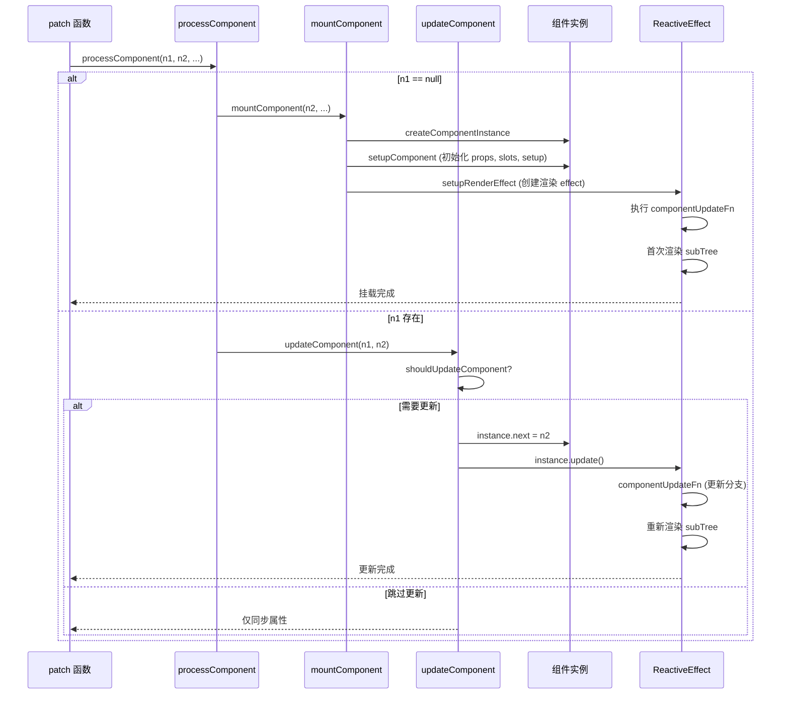

# `processComponent`

`processComponent` 是 Vue 3 渲染器（`renderer`）中专门用于处理**组件节点**的核心函数。组件是 Vue 应用的基本构建块，`processComponent` 负责组件的挂载、更新和卸载。与普通元素不同，组件节点并不直接对应真实 DOM，而是通过组件实例管理其内部的渲染子树。

## 1. 设计动机与作用

### 1.1 为什么需要独立的 `processComponent`？

组件（`Component`）与普通元素（`Element`）在物理形态和逻辑复杂度上有天壤之别：

* **逻辑封装体**：普通元素只是静态的 DOM 描述，而组件拥有自己的内部状态（`data` / `setup` 中的 `ref` / `reactive`）、生命周期（`mounted`、`updated`）、计算属性（`computed`）以及监听器（`watch`）。
* **渲染的间接性**：组件本身并不会直接映射为某一个特定的真实 DOM 节点。它是一个黑盒，其最终长什么样，取决于它的 `render` 函数（或 `<template>` 编译出的渲染函数）执行后返回的次级 VNode 树（`SubTree`）。
* **响应式边界**：在 Vue 3 中，组件是响应式更新的最小粒度（即依赖收集和触发更新的最小单位）。当一个组件的状态发生变化时，理想情况下应该只重新渲染该组件的 `SubTree`，而不应波及父组件或兄弟组件。


### 1.2 与普通元素的对比

| 特征               | `processComponent`                     | `processElement`                       |
| ------------------ | -------------------------------------- | -------------------------------------- |
| 对应真实 DOM       | 间接（通过内部 render 生成的子树）     | 直接创建真实元素                       |
| 更新触发条件       | 组件实例的响应式数据变化或 `props`/插槽变化 | 父组件重新渲染导致 `VNode` 对比          |
| 更新核心函数       | `updateComponent` / `shouldUpdateComponent` | `patchElement` / `patchChildren`       |
| 属性处理           | 需处理 `props` 和 `attrs` 的区别           | 直接设置 `DOM` 属性                      |
| 生命周期钩子       | 有（`beforeMount`、`mounted` 等）      | 无                                     |
| 子节点             | 由组件内部 `render` 产生，不直接传递     | 直接作为 `children` 传递                 |

## 2. `processComponent`函数入口

:::code-group
```typescript [renderer.ts]
const processComponent = (
    n1: VNode | null,
    n2: VNode,
    container: RendererElement,
    anchor: RendererNode | null,
    parentComponent: ComponentInternalInstance | null,
) => {
    // 阶段一：初次挂载 (n1 为空)
    if (n1 == null) {
        // 处理 KeepAlive 组件的激活逻辑 (缓存复用)
        if (n2.shapeFlag & ShapeFlags.COMPONENT_KEPT_ALIVE) {
            ;(parentComponent!.ctx as KeepAliveContext).activate(n2, container, anchor,)
        } else {
            // 常规组件的全新挂载流程
            mountComponent(n2, container, anchor, parentComponent)
        }
    } else {
        // 阶段二：组件更新 (n1 存在，表示组件状态或 Props 发生变化)
        updateComponent(n1, n2)
    }
}
```
:::

## 3. 挂载分支：`mountComponent`

`mountComponent` 负责创建组件实例、初始化 `Props` 和 `Slots`、执行 `setup`、建立渲染副作用等。

:::code-group
```typescript [renderer.ts]
import { createComponentInstance, setupComponent } from './component.ts'
const mountComponent: MountComponentFn = (
    initialVNode,     // 当前组件的新 VNode
    container,        // 挂载的父容器
    anchor,           // 挂载锚点
    parentComponent,  // 父组件实例
) => {
    // 步骤 1：创建组件内部实例 (ComponentInternalInstance)
    // 这是组件在 Vue 内部的数据模型，用于存储状态、生命周期、SubTree 等元信息。
    const instance: ComponentInternalInstance =
        compatMountInstance || // 兼容 Vue 2 构建的特殊处理
        (initialVNode.component = createComponentInstance(
            initialVNode,
            parentComponent,
            parentSuspense
        ))
    // ... (处理 <KeepAlive> 的缓存注入等边缘逻辑)

    // 步骤 2：初始化组件 (Setup Component)
    // 解析 Props, Slots，执行 setup 函数 (如果存在)，并处理 Vue 2 风格的 Options API
    setupComponent(instance)

    // 步骤 3：建立响应式渲染副作用 (Setup Render Effect)
    // 这是 Vue 数据驱动视图的魔法核心！将 render 函数包裹在一个 effect 中。
    setupRenderEffect(
        instance,
        initialVNode,
        container,
        anchor,
    )
}
```
:::

### 3.1 `createComponentInstance`

创建组件实例对象，存储组件状态、上下文、生命周期等：

:::code-group
```typescript [component.ts]
import { emit } from './componentEmits.ts'
let uid = 0
// 简化版组件实例创建工厂
export function createComponentInstance(vnode, parent) {
    // 1. 获取组件的原始配置对象 (例如我们写的 { setup(), render(), name: 'MyComp' })
    const type = vnode.type

    // 2. 继承应用级上下文 (appContext包含了 app.use 注册的全局组件/插件)
    // 如果有父组件就继承父级的，否则从根节点拿
    const appContext = (parent ? parent.appContext : vnode.appContext) || emptyAppContext

    // 3. 构建组件内部实例对象 (核心骨架)
    const instance = {
        uid: uid++,          // 组件唯一标识
        vnode,               // 当前关联的 VNode 外壳
        type,                // 组件的原始配置对象
        parent,              // 父组件实例的引用
        appContext,          // 关联的应用上下文
        root: null,          // 根组件实例的引用

        // ================= 渲染与响应式核心 =================
        next: null,          // 待更新的全新 VNode (父组件传了新 props 时用到)
        subTree: null,       // 组件 render() 函数执行后生成的【次级虚拟DOM树】
        effect: null,        // 组件专属的响应式副作用 (ReactiveEffect)
        update: null,        // 触发组件重新渲染的函数 (包裹了 effect.run)
        render: null,        // 最终要执行的渲染函数 (无论是手写还是模板编译来的)

        // ================= 状态与数据源 =================
        data: {},            // Options API 里的 data 状态
        props: {},           // 组件接收到的 props
        attrs: {},           // 透传的 attributes (没有在 props 中声明的属性)
        slots: {},           // 插槽内容
        refs: {},            // 模板引用
        setupState: {},      // Composition API 中 setup() 返回的响应式状态

        // ================= 上下文与代理 =================
        ctx: {},             // 内部渲染上下文
        proxy: null,         // 暴露给模板和 this 的响应式代理对象 (非常核心！)
        exposed: null,       // 通过 defineExpose 暴露给父组件的属性

        // ================= 依赖注入 (Provide/Inject) =================
        provides: parent
            ? parent.provides
            : Object.create(appContext.provides), // 优雅的原型链继承

        // ================= 生命周期钩子 (内部采用数组存储) =================
        isMounted: false,    // 挂载状态标记
        isUnmounted: false,  // 卸载状态标记
        m: null,             // mounted 钩子队列
        bm: null,            // beforeMount 钩子队列
        u: null,             // updated 钩子队列
        // ... 其他钩子省略
    }

    // 4. 根实例引用修正
    instance.ctx = { _: instance }
    instance.root = parent ? parent.root : instance

    // 5. 绑定 emit 函数 (利用闭包锁定当前实例)
    instance.emit = emit.bind(null, instance)

    return instance
}
```

```typescript [componentEmits.ts]
// 工具函数：首字母大写 (如: 'myClick' -> 'MyClick')
const capitalize = (str: string) => str.charAt(0).toUpperCase() + str.slice(1)
// 工具函数：拼接 on 前缀 (如: 'MyClick' -> 'onMyClick')
const toHandlerKey = (str: string) => (str ? `on${capitalize(str)}` : ``)
// 工具函数：连字符转小驼峰 (如: 'my-click' -> 'myClick')
const camelize = (str: string) => str.replace(/-(\w)/g, (_, c) => c.toUpperCase())
const EMPTY_OBJ={}

export function emit(
    instance: ComponentInternalInstance,
    event: string,          // 触发的事件名，比如 'my-click'
) {
    // 如果组件已经被卸载，静默退出
    if (instance.isUnmounted) return

    // 1. 获取父组件挂载到当前组件 VNode 上的 props
    const props = instance.vnode.props || EMPTY_OBJ

    // 2. 将传入的事件名进行规范化转换！
    // 比如将 'my-click' 转换为 'onMyClick'
    let handlerName = toHandlerKey(camelize(event))

    // 3. 去 props 里寻找对应的事件处理函数
    let handler = props[handlerName]

    // 4. 如果找到了对应的处理函数，准备执行！
    if (handler) {
        handler()
    }
}

```
:::

### 3.2 `setupComponent`

初始化 `props`、`slots`，并执行用户提供的 `setup` 函数（如果是组合式 API）或初始化选项式 API：

:::code-group
```typescript [component.ts]
import {initProps} from './componentProps.ts'
import {initSlots} from './componentSlots.ts'

export function setupComponent(
    instance: ComponentInternalInstance,
) {
    const {props, children} = instance.vnode
    // 初始化 props（将驼峰式转为 kebab-case 等）
    initProps(instance, props)
    //初始化插槽
    initSlots(instance, children)
    //初始化有状态的组件 并为render赋值
    //如果使用的是async setup()异步函数会返回promise，则这里的返回值是为了支撑 <Suspense> 异步组件和服务端渲染 (SSR)。
    const setupResult = setupStatefulComponent(instance)
    return setupResult
}

```
:::

#### 3.2.1 `initProps`

初始化 `Props`

```typescript [componentProps.ts]
// 1. 
export function initProps(instance, rawProps) {
  const props = {}
  const attrs = {}
  // 内部逻辑简化：遍历 rawProps，如果在组件的 props 选项中声明了，就放到 props 里
  // 如果没有声明，就放到 attrs 里（透传属性）

  // 将 props 转化为浅层响应式对象，挂载到实例上
  instance.props = shallowReactive(props)
  instance.attrs = attrs
}
```

#### 3.2.2 `initSlots`

初始化 `Slots`

```typescript [componentSlots.ts]
export function initSlots(instance, children) {
    if (instance.vnode.shapeFlag & ShapeFlags.SLOTS_CHILDREN) {
        // 内部逻辑简化：将传入的 VNode 节点标准化为返回 VNode 数组的函数
        // 比如：{ default: () => [VNode], header: () => [VNode] }
        instance.slots = normalizeObjectSlots(children, instance.slots)
    } else {
        instance.slots = {}
    }
}
//转换类型为object插槽
function normalizeObjectSlots(children: any, slots: any) {
    //保证slots返回的是一个数组 方便渲染
    for (const key in children) {
        const value = children[key]
        slots[key] = (props: any) => normalizeSlotValue(value(props))
    }
}
//转换插槽内容为数组
function normalizeSlotValue(value: any) {
    return Array.isArray(value) ? value : [value]
}
```

#### 3.2.3  `setupStatefulComponent`

核心环节！创建代理上下文，并调用开发者的 `setup()` 函数。

:::code-group
```typescript [component.ts]
import { PublicInstanceProxyHandlers } from './componentPublicInstance.ts'
import {ref} from '../../reactivity/src/ref.ts'
let currentInstance: any = null

//将当前实例设为全局的 currentInstance，可追溯赋值过程,方便维护
export function setCurrentInstance(instance: any) {
    currentInstance = instance
}
function setupStatefulComponent(instance) {
    //拿到组件
    const Component = instance.type
    // 创建渲染代理拦截器,核心应用点：解决“去哪找数据”的问题，统一模板的上下文和 this 指针。
    // PublicInstanceProxyHandlers 会按优先级去 setupState -> data -> props -> ctx 中寻找数据
    // 这就是我们在模板里可以直接写 {{ msg }}，或者在 Options API 里用 this.msg 访问变量的原因
    // 找到变量以后，通过proxyRefs代理，只要发现是ref，立刻脱壳提取 .value。
    instance.proxy = new Proxy(instance.ctx, PublicInstanceProxyHandlers)
    // 2. 拿到开发者写的 setup 函数
    const { setup } = Component
    if (setup) {
        // 3. 极其关键的上下文切换：将当前实例设为全局的 currentInstance
        setCurrentInstance(instance)
        // 4.执行 setup 函数,获取setup函数的返回值,setup方法有function和object两种返回值：
        // function: 直接作为render函数渲染组件,
        // object: 则直接充当组件实例中的属性 
        const setupResult = setup(shallowReadonly(instance.props), {
            emit: instance.emit,
        })
        // 5. 重置状态
        setCurrentInstance(null)
        // 6. 处理 setup 的返回值
        if (isPromise(setupResult)) {
            // 如果返回了 Promise，说明这是一个异步组件，配合 <Suspense> 使用
            instance.asyncDep = setupResult
        } else {
            // 常规同步返回
            handleSetupResult(instance, setupResult)
        }
    } else {
        // 获取组件实例
        finishComponentSetup(instance)
    }
}
//处理setup函数返回值
export function handleSetupResult(
    instance: ComponentInternalInstance,
    setupResult: unknown,
) {
    // 场景 A：如果 setup 返回了一个函数
    if (typeof setupResult === 'function') {
        // 那么这个函数就是该组件的 render (渲染函数)！
        instance.render = setupResult as InternalRenderFunction
    }
    // 场景 B：如果 setup 返回了一个对象
    else if (isObject(setupResult)) {
        // proxyRefs:自动解包 ref！ 仅仅作用于 setup() 函数返回的那个普通对象,解决“如何无感访问 ref”的问题，抹平 ref.value 的心智负担。
        // 这就是为什么在 setup 里定义了 const count = ref(0)，返回后在模板里可以直接写 {{ count }} 而不需要写 {{ count.value }} 的原因。
        instance.setupState = proxyRefs(setupResult)
    }
    // 无论返回什么，最后都进入收尾阶段
    finishComponentSetup(instance)
}
//组件收尾
export function finishComponentSetup(
    instance: ComponentInternalInstance,
) {
    const Component = instance.type as ComponentOptions
    // 1. 处理模板编译
    if (!instance.render) {
        // 如果既没有手写 render，setup 也没有返回 render 函数
        if (compile && !Component.render) {
            // 如果存在 template 字符串，并且引入了带编译器的 Vue 版本，则在运行时编译！
            const template = Component.template
            if (template) {
                Component.render = compile(template, /* 编译选项 */)
            }
        }
        // 最终将 render 函数挂载到实例上
        instance.render = (Component.render || NOOP) as InternalRenderFunction
    }
}
```

```typescript [componentPublicInstance.ts]
//便于处理其他属性 全局映射表
const publicPropertiesMap = {
    $el: i => i.vnode.el,
    $data: i => i.data,
    $props: i => i.props,
    $attrs: i => i.attrs,
    $slots: i => i.slots,
    $refs: i => i.refs,
    $emit: i => i.emit
}

// 内部工具：检查对象自身是否拥有某属性
const hasOwn = (val, key) => Object.prototype.hasOwnProperty.call(val, key)
// 代理拦截器 (核心魔法所在)
export const PublicInstanceProxyHandlers = {
    // 拦截读取操作： target.xxx 或 this.xxx
    get({ _: instance }, key) {
        const { ctx, setupState, data, props, appContext } = instance
        // 1. 拦截 Vue 内部特殊属性 (如 __isVue)
        if (key === '__isVue') return true
        // 2. 核心状态查找优先级：setupState > data > props > ctx
        // 判断该 key 是否在组件自身的状态对象中

        // 优先级 1：setup() 返回的响应式状态
        if (hasOwn(setupState, key)) {
            return setupState[key]
        }
        // 优先级 2：Options API 的 data() 返回的状态
        else if (hasOwn(data, key)) {
            return data[key]
        }
        // 优先级 3：父组件传递的 Props
        else if (hasOwn(props, key)) {
            return props[key]
        }
        // 优先级 4：组件内部上下文 ctx (包含 methods 等)
        else if (hasOwn(ctx, key)) {
            return ctx[key]
        }
        // 3. 拦截以 $ 开头的内置公共 API (如 $el, $emit, $slots, $router)
        // publicPropertiesMap 是一个字典，里面预先注册了所有的 $ API
        const publicGetter = publicPropertiesMap[key]
        if (publicGetter) {
            return publicGetter(instance)
        }
    },
    // 拦截赋值操作： target.xxx = value 或 this.xxx = value
    set({ _: instance }, key, value) {
        const { data, setupState, ctx } = instance
        // 优先级 1：更新 setup() 的状态
        if (hasOwn(setupState, key)) {
            setupState[key] = value
            return true
        }
        // 优先级 2：更新 data() 的状态
        else if (hasOwn(data, key)) {
            data[key] = value
            return true
        }
        // 优先级 3：尝试更新 props (这是不允许的！)
        else if (hasOwn(instance.props, key)) {
            console.warn(`Attempting to mutate prop "${key}". Props are readonly.`)
            return false
        }
        // 如果是以 $ 开头的内置属性，禁止用户覆写
        if (key[0] === '$' && key.slice(1) in instance) {
            console.warn(`Attempting to mutate public property "${key}".`)
            return false
        }
        // 最后，将值更新到 ctx (比如动态添加的方法)
        ctx[key] = value
        return true
    },
    //拦截 in 操作符： 'xxx' in this
    has({ _: instance }, key) {
        const { data, setupState, props, ctx, appContext } = instance
        return (
            hasOwn(setupState, key) ||
            hasOwn(data, key) ||
            hasOwn(props, key) ||
            hasOwn(ctx, key) ||
            key in publicPropertiesMap ||
            hasOwn(appContext.config.globalProperties, key)
        )
    }
}
```

```typescript [ref.ts]
// 核心入口
export function proxyRefs(objectWithRefs) {
  // 1. 如果传入的对象已经是 reactive 响应式对象了，直接返回，没必要再包一层
  if (isReactive(objectWithRefs)) {
    return objectWithRefs
  }
  // 2. 否则，为这个对象创建一个 Proxy 代理
  return new Proxy(objectWithRefs, shallowUnwrapHandlers)
}
// 代理拦截器 (核心魔法所在)
const shallowUnwrapHandlers = {
  // 拦截读取操作 (get)
  get: (target, key, receiver) => {
    // 调用 unref 进行自动解包
    return unref(Reflect.get(target, key, receiver))
  },

  // 拦截赋值操作 (set)
  set: (target, key, value, receiver) => {
    const oldValue = target[key]
    
    // 关键分支：如果旧值是一个 ref，而赋的新值【不是】一个 ref
    if (isRef(oldValue) && !isRef(value)) {
      // 直接修改旧 ref 的 .value 属性！
      oldValue.value = value
      return true
    } else {
      // 其他情况（旧值不是 ref，或者新旧值都是 ref），直接正常赋值覆盖
      return Reflect.set(target, key, value, receiver)
    }
  }
}
// 补充：unref 的极简实现
export function unref(ref) {
  // 如果是 ref，返回其 .value；否则原样返回
  return isRef(ref) ? ref.value : ref
}
```
:::

### 3.3 `setupRenderEffect`

创建组件的渲染 `effect`，它会在依赖的响应式数据变化时重新执行，触发组件的更新。该 `effect` 的 `scheduler` 被设置为 `queueJob(instance.update)`，实现异步批量更新。

:::code-group 
```typescript [renderer.ts]
import {
    renderComponentRoot
} from './componentRenderUtils'
import {updateProps} from './componentProps.ts'
import {updateSlots} from './componentSlots.ts'
const setupRenderEffect = (
    instance: ComponentInternalInstance,
    initialVNode: VNode,
    container: RendererElement,
    anchor: RendererNode | null,
) => {
    // 1. 定义组件的更新逻辑 (核心工作函数)
    const componentUpdateFn = () => {
        // 【分支 A：初次挂载 Mount】
        if (!instance.isMounted) {
            // 获取 hook
            const { bm, m } = instance

            // beforeMount hook
            if (bm) {
                bm()
            }
            
            // 1. 执行 render 函数，生成初始的次级 VNode 树 (subTree)
            // 注意：执行这里的过程中，会触发响应式数据的 getter，完成依赖收集！
            const subTree = (instance.subTree = renderComponentRoot(instance))

            // 2. 递归调用全局的 patch，把虚拟 DOM 变成真实 DOM
            patch(null, subTree, container, anchor)

            // mounted hook
            if (m) {
                m()
            }
            
            // 3. 把组件根节点的 el，作为组件的 el
            initialVNode.el = subTree.el
            instance.isMounted = true
        }
        // 【分支 B：响应式更新 Update】
        else {
            // 如果是由父组件触发的被动更新，会在此处更新当前组件的 props 和 slots
            let { next, vnode } = instance
            //有新节点
            if (next) {
                //将老节点的dom赋值给新节点
                next.el = vnode.el
                //更新组件实例属性
                updateComponentPreRender(instance, next)
            } else {
                //没有新节点 直接赋值老节点
                next = vnode
            }
            // 1. 再次执行 render 函数，生成【全新】的次级 VNode 树 (nextTree)
            const nextTree = renderComponentRoot(instance)
            // 2. 拿到旧的 VNode 树 (prevTree)
            const prevTree = instance.subTree
            // 3. 将当前树替换为新树
            instance.subTree = nextTree

            // 4. 递归调用 patch，启动核心 Diff 算法！
            patch(
                prevTree,
                nextTree,
                container,
                anchor
            )
            // 5. 更新 DOM 引用
            next.el = nextTree.el
        }
    }
    // 2. 创建响应式副作用 (ReactiveEffect)
    // 使用 ReactiveEffect 包装 componentUpdateFn
    const effect = (instance.effect = new ReactiveEffect(
        componentUpdateFn,
        // 【极其关键的调度器】：当依赖数据改变时，不立即同步执行更新，
        // 而是把更新任务丢进微任务队列 (queueJob) 里，实现批处理防抖
        () => queueJob(update),
        instance.scope // 绑定组件的副作用作用域，组件卸载时一键清理
    ))
    // 3. 触发首次执行
    const update: SchedulerJob = (instance.update = () => effect.run())
    update.id = instance.uid // 给任务打上 ID，保证更新时的父子顺序
    // 手动调用一次，启动初次挂载流程
    update()
}

//更新组件实例属性
export const updateComponentPreRender = (
    instance: ComponentInternalInstance,
    nextVNode: VNode,
) => {
    // 1. 物理引用的双向绑定与清理
    // 让新 VNode 指向当前的组件实例
    nextVNode.component = instance
    // 保存旧的 Props，等下比对要用
    const prevProps = instance.vnode.props
    // 让组件实例的 vnode 指针指向最新的 VNode
    instance.vnode = nextVNode
    // 清空 next 标记，表示“待更新的节点”已经开始处理了
    instance.next = null

    // 2. 更新组件的 Props (极其核心)
    updateProps(instance, nextVNode.props, prevProps)

    // 3. 更新组件的 Slots (插槽)
    updateSlots(instance, nextVNode.children)

    // 4. 清理由于 Props 改变而可能触发的同步 Watcher 
    // (确保在 render 执行前，所有的状态都已落定)
}
```

```typescript [componentRenderUtils.ts]
import { ShapeFlags } from 'packages/shared/src/shapeFlags'
import { createVNode,Comment,Fragment,Text } from './vnode'
//解析 render 函数的返回值
export function renderComponentRoot(instance) {
	const { vnode, render, data = {} } = instance

	let result
	try {
		// 解析到状态组件
		if (vnode.shapeFlag & ShapeFlags.STATEFUL_COMPONENT) {
			// 获取到 result 返回值，如果 render 中使用了 this，则需要修改 this 指向 输入Vnode
			result = normalizeVNode(render!.call(data, data))
		}
	} catch (err) {
		console.error(err)
	}

	return result
}

//标准化 VNode
export function normalizeVNode(child: any): VNode {
    // 1. 如果子节点是 null 或者布尔值 (比如 render 里写了 v-if="false" 返回的 false)
    if (child == null || typeof child === 'boolean') {
        // 包装成一个空的注释节点 ()
        return createVNode(Comment)
    }
    // 2. 如果子节点是一个数组 (比如手写 render 返回了多个并列的元素)
    else if (isArray(child)) {
        // 包装成一个 Fragment (片段) 节点
        return createVNode(
            Fragment,
            null,
            // 递归标准化数组里的每一个子节点
            child.slice()
        )
    }
    // 3. 如果子节点是普通对象 (最正常的情况)
    else if (typeof child === 'object') {
        // 3.1 检查它是不是已经是一个 VNode 了 (通过 __v_isVNode 内部标记)
        // cloneIfMounted 会检查这个 VNode 是否已经被挂载过了。如果挂载过，必须克隆一个全新的拷贝！
        return cloneIfMounted(child)
    }
    // 4. 兜底逻辑：如果子节点是字符串或数字 (比如 {{ count }})
    else {
        // 包装成一个纯文本节点 (Text VNode)
        return createVNode(Text, null, String(child))
    }
}

//clone VNode
export function cloneIfMounted(child) {
	return child
}
```

```typescript [componentProps.ts]
export function updateProps(
    instance: ComponentInternalInstance,
    rawProps: Data | null,
    rawPrevProps: Data | null,
) {
    // 1. 获取组件当前已存在的 props 和 attrs (透传属性)
    const {
        props,
        attrs,
        vnode: { patchFlag }
    } = instance

    // 获取组件声明的 props 选项 (如 props: { msg: String })
    const [options] = instance.propsOptions
    let hasAttrsChanged = false

    // 分支 A：极速路径 (Fast Path) - 基于编译期生成的 patchFlag
    // 如果模板是静态编译的，Vue 会精确知道只有哪些 props 是动态的
    if (
        (optimized || patchFlag > 0) &&
        !(patchFlag & PatchFlags.FULL_PROPS) // 排除包含动态 key 的情况 (如 v-bind="object")
    ) {
        if (patchFlag & PatchFlags.PROPS) {
            // dynamicProps 是一个数组，包含了所有动态绑定的属性名 (如 ['msg', 'count'])
            const propsToUpdate = instance.vnode.dynamicProps!
            for (let i = 0; i < propsToUpdate.length; i++) {
                let key = propsToUpdate[i]
                // 提取新值
                const value = rawProps![key]

                if (options) {
                    // 如果是声明过的 prop，直接更新到响应式的 instance.props 上
                    if (hasOwn(attrs, key)) {
                        // 处理特殊情况：原本是 attr，现在变成了 prop
                        attrs[key] = value
                    }
                    // 解析新值并赋值
                    props[key] = value
                } else {
                    // 如果没有声明，说明这是个透传属性 (attr)，更新到 attrs 上
                    if (attrs[key] !== value) {
                        attrs[key] = value
                        hasAttrsChanged = true
                    }
                }
            }
        }
    }
    // 分支 B：慢速路径 (Slow Path) - 手写渲染函数或含有动态绑定的全量更新
    else {
        // 步骤 B1：遍历所有【新】属性，做更新或新增
        if (rawProps) {
            for (const key in rawProps) {
                const value = rawProps[key]
                // 判断这个 key 是否在 props 选项中声明过
                if (options && hasOwn(options, key)) {
                    props[key] = value
                } else if (value !== attrs[key]) {
                    // 透传属性
                    attrs[key] = value
                    hasAttrsChanged = true
                }
            }
        }
        // 步骤 B2：遍历所有【旧】属性，做删除清理
        if (rawPrevProps) {
            for (const key in rawPrevProps) {
                if (!rawProps || !(key in rawProps)) {
                    if (options && hasOwn(options, key)) {
                        // 如果新 props 里没有这个声明过的 key，就将其删掉 (或恢复默认值)
                        delete props[key]
                    } else {
                        // 如果是 attrs，也删掉
                        delete attrs[key]
                        hasAttrsChanged = true
                    }
                }
            }
        }
    }
    // 收尾：如果透传属性 attrs 发生了改变，手动触发它的响应式更新
    // (因为 attrs 本身不是 Proxy，只是个普通对象，所以需要手动 trigger)
    if (hasAttrsChanged) {
        trigger(instance, TriggerOpTypes.SET, '$attrs')
    }
}
```

```typescript [componentSlots.ts]
export const updateSlots = (
  instance: ComponentInternalInstance,
  children: any, // 父组件传来的新插槽内容
) => {
  const { vnode, slots } = instance
  
  // 是否需要进行“删除检查”的标记 (极其重要的性能优化)
  let needDeletionCheck = true
  let deletionComparisonTarget = EMPTY_OBJ

  // -------------------------------------------------------------------
  // 场景 A：新传入的是标准的插槽对象
  // -------------------------------------------------------------------
  if (vnode.shapeFlag & ShapeFlags.SLOTS_CHILDREN) {
    const type = children._ // 获取编译器打上的魔法标记

    if (type) {
      // type === 1 代表 STABLE (稳定的插槽，即插槽的结构和名称不会变)
      if (optimized && type === 1) {
        // 【极速路径】：既然结构稳定，绝对不会有插槽被突然删除，跳过删除检查！
        needDeletionCheck = false
      }
      
      // 核心动作：直接把新的插槽函数对象，覆盖合并到老的 slots 对象上！
      Object.assign(slots, children)
      
    } else {
      // 慢速路径：如果不是编译器生成的 (比如手写 h 函数)，需要进行规范化处理
      needDeletionCheck = !children.$stable
      normalizeObjectSlots(children, slots)
    }
    
    // 把新插槽记录下来，等下做差异比对用
    deletionComparisonTarget = children
  } 
  
  // -------------------------------------------------------------------
  // 场景 B：新传入的是纯数组或文本 (非命名插槽的简写)
  // 比如：<Child>纯文本内容</Child>
  // -------------------------------------------------------------------
  else if (children !== null) {
    // 强制包装成 default 插槽函数
    slots.default = () => normalizeSlotValue(children)
    // 目标里只有 default
    deletionComparisonTarget = { default: 1 }
  }

  // -------------------------------------------------------------------
  // 收尾：旧插槽清理 (Garbage Collection)
  // -------------------------------------------------------------------
  if (needDeletionCheck) {
    // 遍历当前组件身上所有的旧插槽
    for (const key in slots) {
      // 如果这个旧插槽在新的 deletionComparisonTarget 里找不到了
      if (!isInternalKey(key) && !(key in deletionComparisonTarget)) {
        // 说明父组件这次没传这个插槽，果断删除！
        delete slots[key]
      }
    }
  }
}
```
:::

## 4. 更新分支：`updateComponent`

当组件需要更新时，`updateComponent` 决定是否真的需要更新，并执行更新流程。

```typescript
const updateComponent = (n1: VNode, n2: VNode, optimized: boolean) => {
  const instance = (n2.component = n1.component)!
  if (shouldUpdateComponent(n1, n2, optimized)) {
    // 如果需要更新，将新 VNode 赋给 instance.next，并触发 effect
    instance.next = n2
    instance.update()
  } else {
    // 不需要更新，仅传递部分属性
    n2.component = n1.component
    n2.el = n1.el
    instance.vnode = n2
  }
}
```

- **`shouldUpdateComponent`**：比较新旧 VNode 的 props、children、dirs 等，决定是否需要更新组件。内部会检查 `props` 是否变化、`slots` 内容是否变化等，并考虑 `compilerOptions` 中的 `onVnodeBeforeUpdate` 等钩子。
- **`instance.update`** 实际调用的是上述 `setupRenderEffect` 中的 `componentUpdateFn`，其中会对 `instance.next` 进行处理，重新执行 `renderComponentRoot` 并 `patch` 子树。

## 5. 与 `keep-alive` 的集成

在 `processComponent` 中，如果组件的 `shapeFlag` 包含 `COMPONENT_KEPT_ALIVE`（表示组件被 `<KeepAlive>` 缓存），则会调用 `activate` 函数激活缓存组件，而不是重新挂载。这实现了 `keep-alive` 的核心能力。

## 6. 卸载组件

组件的卸载发生在父组件或自身被销毁时。渲染器的 `unmount` 函数会调用组件实例的 `unmount` 方法，触发 `beforeUnmount` 和 `unmounted` 生命周期钩子，并递归卸载子树。

```typescript
const unmount = (vnode: VNode, ...) => {
  const { shapeFlag, component } = vnode
  if (shapeFlag & ShapeFlags.COMPONENT) {
    unmountComponent(component!)
  }
}

const unmountComponent = (instance: ComponentInternalInstance) => {
  const { bum, scope, update, subTree, um } = instance
  // 调用 beforeUnmount 钩子
  invokeArrayFns(bum)
  // 停止渲染 effect
  scope.stop()
  // 卸载子树
  unmount(subTree, ...)
  // 调用 unmounted 钩子
  invokeArrayFns(um)
}
```

## 7. 完整流程图



## 8. 性能优化关键点

- **惰性更新**：通过 `shouldUpdateComponent` 跳过不必要的组件递归，减少无效 render。
- **异步队列**：渲染 effect 的 scheduler 使用 `queueJob`，保证批量更新。
- **`KeepAlive`** 专用分支避免重新创建组件实例，缓存子树。
- **Props 浅比较**：在 `shouldUpdateComponent` 中，props 变化只做浅层比较，避免深度遍历。

## 9. 与 `processElement` 的对比

| 方面               | `processComponent`                                | `processElement`                           |
| ------------------ | ------------------------------------------------- | ------------------------------------------ |
| 是否创建真实 DOM   | 否（通过其内部生成的 `subTree` 间接创建）         | 是，调用 `hostCreateElement`               |
| 更新逻辑           | 比较 props 和 slots，决定是否重新执行 `render`    | 比较 props、children，直接更新 DOM 属性    |
| 生命周期钩子       | 有（`beforeMount`、`mounted`、`beforeUpdate` 等） | 无                                         |
| 依赖收集           | 组件的渲染 effect 自动追踪响应式数据              | 无（由父组件负责 diff）                    |
| 核心数据结构       | `ComponentInternalInstance`                       | VNode 及真实元素 `el`                      |

## 10. 源码位置速查

| 文件路径                                           | 核心内容                                          |
| -------------------------------------------------- | ------------------------------------------------- |
| `packages/runtime-core/src/renderer.ts`            | `processComponent`, `mountComponent`, `updateComponent` |
| `packages/runtime-core/src/component.ts`           | `createComponentInstance`, `setupComponent`, `setupRenderEffect` |
| `packages/runtime-core/src/componentProps.ts`      | `initProps`, `updateProps`                        |
| `packages/runtime-core/src/componentSlots.ts`      | `initSlots`, `updateSlots`                        |
| `packages/runtime-core/src/componentUpdateUtils.ts` | `shouldUpdateComponent`                           |
| `packages/runtime-core/src/hydration.ts`           | 组件的 hydration 逻辑（SSR 相关）                 |

## 11. 总结

| 模块/函数            | 职责                                             | 关键设计                   |
| -------------------- | ------------------------------------------------ | -------------------------- |
| `processComponent`   | 根据是否有旧 VNode 分流挂载或更新组件            | 支持 `KeepAlive` 激活分支  |
| `mountComponent`     | 创建组件实例，初始化 props/slots，建立渲染 effect | 创建实例并执行首次渲染     |
| `setupComponent`     | 标准化 props/slots，执行用户 `setup`             | 统一处理组合式/选项式 API  |
| `setupRenderEffect`  | 创建组件的渲染副作用，管理挂载和更新             | 通过 `effect` 实现响应式重 |
| `updateComponent`    | 判断是否需要更新，触发渲染 effect                | 使用 `shouldUpdateComponent` 优化 |
| `unmountComponent`   | 卸载组件，调用生命周期钩子                       | 递归清理子树并停止 effect  |

`processComponent` 是 Vue 3 组件系统的核心接入点，它将组件实例化、渲染和更新流程完整嵌入到虚拟 DOM 的 `patch` 体系中。理解 `processComponent` 的源码有助于掌握 Vue 组件的生命周期、响应式更新原理以及性能优化手段。