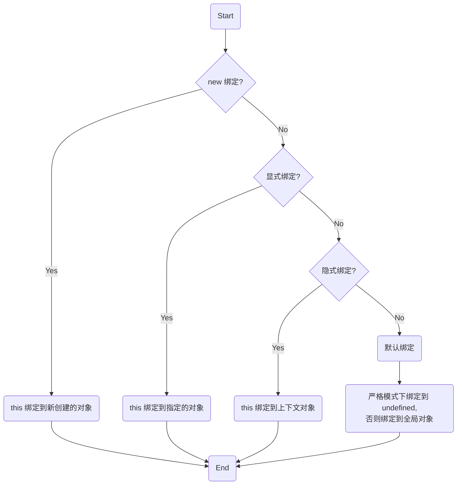

# this全面解析

`this` 不是编写时绑定，而是运行时绑定。它依赖于函数调用的上下文条件。`this` 绑定与函数声明的位置没有任何关系，而与函数被调用的方式紧密相连。

## **1. 调用位置**

调用位置就是函数在代码中被调用的位置（而不是声明的位置）。

**查找方法：**

*   **分析调用栈**：调用位置就是当前正在执行的函数在调用栈中的**前一个调用点**。

    ```js
    function baz() {
        // 当前调用栈是：baz
        // 因此，baz 的调用位置是全局作用域
        console.log("baz");
        bar(); // <-- bar 的调用位置
    }
    
    function bar() {
        // 当前调用栈是：baz --> bar
        // 因此，bar 的调用位置在 baz 中
        console.log("bar");
        foo(); // <-- foo 的调用位置
    }
    
    function foo() {
        // 当前调用栈是：baz --> bar --> foo
        // 因此，foo 的调用位置在 bar 中
        console.log("foo");
    }
    
    baz(); // <-- baz 的调用位置
    ```

*   **使用开发者工具**：
    在代码中设置断点或插入 `debugger;` 语句。当代码执行到该位置暂停时，开发者工具会展示当前的**调用栈 (Call Stack)**。调用栈列表中的**第二个元素**，就是当前函数真正的调用位置。

## **2. 绑定规则**

### **2.1 默认绑定 (Default Binding)**
* **独立函数调用**，可以把默认绑定看作是无法应用其他规则时的默认规则，this指向**全局对象**。
* **严格模式**下，不能将全局对象用于默认绑定，this会绑定到undefined。只有函数**运行**在非严格模式下，默认绑定才能绑定到全局对象。在严格模式下**调用**函数则不影响默认绑定。

**示例 1：函数体在严格模式下**

```js
function foo() { // 函数体运行在严格模式下
    "use strict";
    console.log(this.a);
}

var a = 2;

foo(); // TypeError: Cannot read property 'a' of undefined
```

**示例 2：调用方在严格模式下**
```js
function foo() { // 函数体运行在非严格模式下
    console.log(this.a);
}

var a = 2;

(function() {
    "use strict";
    foo(); // 2 (foo 的默认绑定不受影响，this 仍然指向全局对象)
})();
```

### **2.2 隐式绑定 (Implicit Binding)**

*   **条件**：当函数的调用位置有**上下文对象**时（即通过 `.` 符号调用）。
*   **`this` 指向**：`this` 会被绑定到这个上下文对象。在对象属性引用链中，只有**最后一层**在调用中起作用。

```js
function foo() {
    console.log(this.a);
}

var obj = {
    a: 2,
    foo: foo
};

obj.foo(); // 2 (this 指向 obj)
```

**隐式丢失 (Implicitly Lost)**

在某些情况下，被隐式绑定的函数会丢失其上下文对象，从而退回到**默认绑定**。

*   **场景 1：函数别名**
    当将一个对象方法赋值给一个新变量时，实际上只是引用了函数本身。后续通过新变量调用时，就是一个不带任何修饰的独立函数调用。

    ```js
    function foo() {
        console.log(this.a);
    }

    var obj = {
        a: 2,
        foo: foo
    };
    var a = "oops, global";

    var bar = obj.foo; // bar 只是 foo 函数的另一个引用
    bar(); // "oops, global" (应用默认绑定，this 指向全局对象)
    ```

*   **场景 2：作为参数传递**
    将一个对象方法作为参数传递给另一个函数（如回调函数），同样会发生隐式赋值，丢失 `this` 绑定。

    ```js
    function foo() {
        console.log(this.a);
    }

    function doFoo(fn) {
        // fn 只是 foo 函数的引用
        fn(); // <-- 调用位置在这里！
    }

    var obj = {
        a: 2,
        foo: foo
    };
    var a = "oops, global";

    doFoo(obj.foo); // "oops, global"
    ```

    `setTimeout` 的回调也是一个极常见的例子：
    ```js
    function setTimeout(fn, delay) {
        // ...等待
        fn(); // <-- 调用位置在这里！应用默认绑定。
    }
    ```

### **2.3 显式绑定 (Explicit Binding)**

通过 `call()` 或 `apply()` 方法，可以直接指定函数调用时的 `this` 值。

```js
function foo() {
    console.log(this.a);
}

var obj = {
    a: 2
};

foo.call(obj); // 2 (调用 foo 时，强制将 this 绑定到 obj)
```

**解决方案：解决 `this` 丢失问题**

*   **1. 硬绑定 (Hard Binding)**
    创建一个包裹函数，在内部使用 `call` 或 `apply` 强制将 `this` 绑定到指定的对象。

    ```js
    function foo() {
        console.log(this.a);
    }
    var obj = { a: 2 };

    var bar = function() {
        foo.call(obj);
    };

    bar(); // 2
    setTimeout(bar, 100); // 2

    // 硬绑定的 bar 不可能再修改它的 this
    bar.call(window); // 2
    ```

    **通用辅助函数：**
    ```js
    function bind(fn, obj) {
        return function() {
            return fn.apply(obj, arguments);
        };
    }

    var bar = bind(foo, obj);
    bar(3);
    ```

    **ES5 内置 `Function.prototype.bind`：**
    `bind()` 会返回一个硬绑定的新函数。
    ```js
    var bar = foo.bind(obj);
    var b = bar(3); // 2 3
    ```

*   **2. API 调用的“上下文”参数**
    许多 JavaScript 内置函数（如数组方法）提供了一个可选的“上下文”(context) 参数，其作用与 `bind()` 相同，确保回调函数使用指定的 `this`。

    ```js
    function foo(el) {
        console.log(el, this.id);
    }
    var obj = { id: "awesome" };
    var myArray = [1, 2, 3];

    myArray.forEach(foo, obj);
    // 输出:
    // 1 awesome
    // 2 awesome
    // 3 awesome
    ```

### **2.4 `new` 绑定**

在 JavaScript 中，并不存在所谓的“构造函数”，只有对于函数的“**构造调用**”。任何普通函数都可以通过 `new` 操作符来调用。

当使用 `new` 调用函数时，会自动执行以下操作：
1.  **创建**一个全新的空对象。
2.  这个新对象会被执行 `[[Prototype]]` **连接**（即新对象的 `__proto__` 指向构造函数的 `prototype`）。
3.  这个新对象会**绑定**到函数调用的 `this`。
4.  如果函数没有返回其他**对象**，那么 `new` 表达式中的函数调用会**自动返回**这个新对象。

```js
function foo(a) {
    this.a = a;
}

var bar = new foo(2); // bar 被绑定到 foo() 调用中的 this
console.log(bar.a); // 2
```

#### **手写 `new` 实现**
```js
function create() {
    // 1. 创建一个空对象
    var obj = new Object();
    
    // 2. 获得构造函数
    var Con = [].shift.call(arguments);
    
    // 3. 链接到原型
    obj.__proto__ = Con.prototype;
    
    // 4. 绑定 this 并执行构造函数
    var ret = Con.apply(obj, arguments);
    
    // 5. 优先返回构造函数返回的对象，否则返回新创建的对象
    return ret instanceof Object ? ret : obj;
}
```

---

## **3. 优先级**

`this` 绑定的四条规则的优先级如下：
`new` 绑定 > 显式绑定 (`call`/`apply`/`bind`) > 隐式绑定 (`obj.method()`) > 默认绑定



> 在 `new` 中使用硬绑定函数（`bind`）的目的是为了**柯里化**，即预先设置函数的一些参数。
> ```js
> function foo(p1, p2) {
>     this.val = p1 + p2;
> }
> 
> // 使用 null 是因为 new 绑定会覆盖 bind 的 this，我们不关心它
> var bar = foo.bind(null, "p1");
> var baz = new bar("p2");
> console.log(baz.val); // "p1p2"
> ```

---

## **4. 绑定例外**

### **4.1 被忽略的 `this`**

如果把 `null` 或者 `undefined` 作为 `this` 的绑定对象传入 `call`、`apply` 或者 `bind`，这些值在调用时会被忽略，实际应用的是**默认绑定**规则。

```js
function foo(a, b) {
    console.log("a:" + a + "，b:" + b);
}

// 使用 apply "展开"数组
foo.apply(null, [2, 3]); // a:2，b:3

// 使用 bind 进行柯里化
var bar = foo.bind(null, 2);
bar(3); // a:2，b:3
```

**更安全的 `this`**：
为了避免 `this` 意外地绑定到全局对象，可以传入一个**空对象**作为占位符。创建一个“更空”的对象的方法是 `Object.create(null)`，它没有 `Object.prototype` 委托。

```js
var ø = Object.create(null);
foo.apply(ø, [2, 3]);
```

### **4.2 间接引用**

间接引用会导致函数调用应用**默认绑定**规则，最容易在**赋值**时发生。

```js
function foo() {
    console.log(this.a);
}

var a = 2;
var o = { a: 3, foo: foo };
var p = { a: 4 };

o.foo(); // 3 (隐式绑定)
(p.foo = o.foo)(); // 2 (赋值表达式的返回值是函数本身，应用默认绑定)
```

### **4.3 软绑定 (Soft Binding)**

硬绑定会降低函数的灵活性。软绑定可以在保留隐式或显式绑定能力的同时，为默认绑定提供一个指定的 `this` 值。

```js
if (!Function.prototype.softBind) {
    Function.prototype.softBind = function(obj) {
        var fn = this;
        var curried = [].slice.call(arguments, 1);
        var bound = function() {
            return fn.apply(
                (!this || this === (window || global)) ? obj : this,
                curried.concat.apply(curried, arguments)
            );
        };
        bound.prototype = Object.create(fn.prototype);
        return bound;
    };
}
```

**使用示例**：
```js
function foo() {
    console.log("name:" + this.name);
}

var obj = { name: "obj" },
    obj2 = { name: "obj2" },
    obj3 = { name: "obj3" };

var fooOBJ = foo.softBind(obj);

// 默认绑定，应用软绑定
fooOBJ(); // name: obj

// 隐式绑定，正常工作
obj2.foo = foo.softBind(obj);
obj2.foo(); // name: obj2

// 显式绑定，正常工作
fooOBJ.call(obj3); // name: obj3

// 绑定丢失，退回软绑定
setTimeout(obj2.foo, 10); // name: obj
```

---

## **5. `this` 词法 (Lexical `this`)**

ES6 新增的**箭头函数 (`=>`)** 不使用上述四条规则。它的 `this` 是根据其外层（函数或全局）的**词法作用域**来决定的。

*   箭头函数内部的 `this` 会**捕获**其定义时所在作用域的 `this`。
*   箭头函数的 `this` 绑定**无法被修改**（`new` 也不行）。

```js
function foo() {
    // 返回一个箭头函数
    return (a) => {
        // this 继承自 foo()
        console.log(this.a);
    };
}

var obj1 = { a: 2 };
var obj2 = { a: 3 };

var bar = foo.call(obj1); // foo 的 this 绑定到 obj1
bar.call(obj2); // 2 (bar 的 this 仍然是 obj1，而不是 obj2)
```

**ES6 之前的类似模式：**
```js
function foo() {
    var self = this; // 词法捕获 this
    setTimeout(function() {
        console.log(self.a); // self 继承了 foo() 的 this 绑定
    }, 100);
}

var obj = { a: 2 };
foo.call(obj); // 2
```      